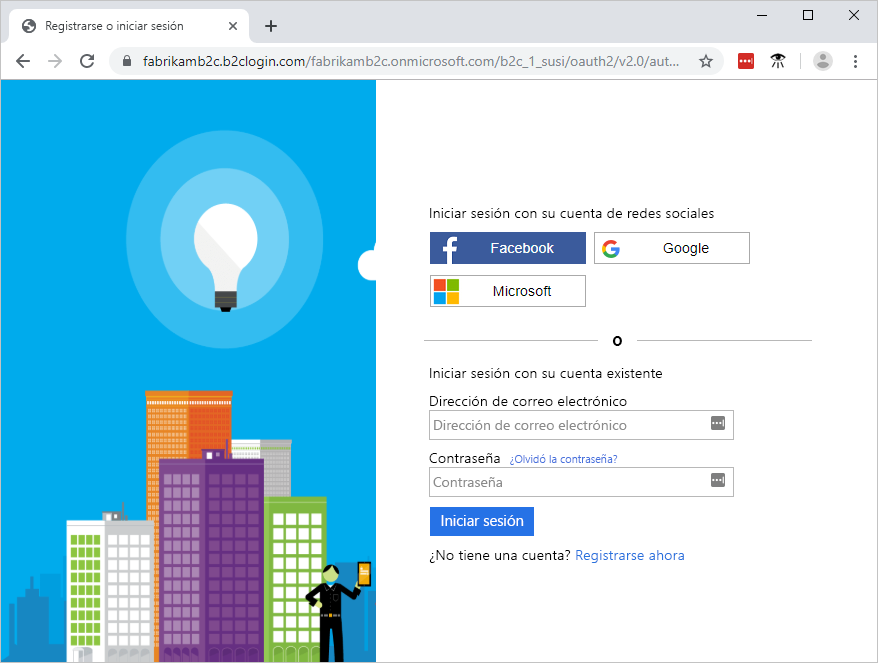
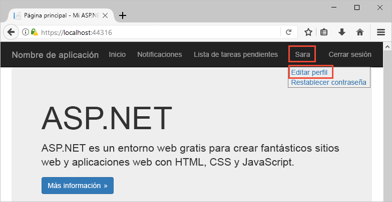
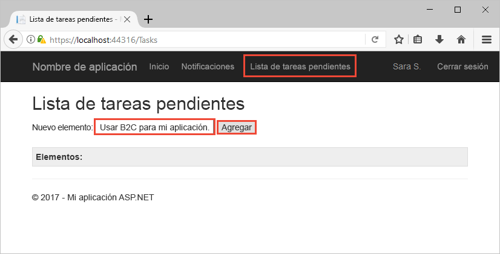

# <a name="quickstart-set-up-sign-in-for-an-aspnet-application-using-azure-active-directory-b2c"></a>Inicio rápido: Configuración del inicio de sesión en una aplicación ASP.NET con Azure Active Directory B2C

Azure Active Directory (Azure AD) B2C proporciona administración de identidades en la nube para mantener la protección de su aplicación, empresa y clientes. Azure AD B2C permite que las aplicaciones puedan autenticarse con cuentas de redes sociales y cuentas de empresa mediante protocolos estándar abiertos. En esta guía de inicio rápido, se utiliza una aplicación de ASP.NET para iniciar sesión mediante un proveedor de identidades de redes sociales y llamar a una API web protegida por Azure AD B2C.

[!INCLUDE [quickstarts-free-trial-note](../../includes/quickstarts-free-trial-note.md)]

## <a name="prerequisites"></a>Requisitos previos

- [Visual Studio 2017](https://www.visualstudio.com/downloads/) con la carga de trabajo de **ASP.NET y desarrollo web**. 
- Una cuenta de redes sociales de Facebook, Google, Microsoft o Twitter.
- [Descargue un archivo zip](https://github.com/Azure-Samples/active-directory-b2c-dotnet-webapp-and-webapi/archive/master.zip) o clone la aplicación web de ejemplo desde GitHub.

    ```
    git clone https://github.com/Azure-Samples/active-directory-b2c-dotnet-webapp-and-webapi.git
    ```

    Hay dos proyectos en la solución de ejemplo:

    - **TaskWebApp**: una aplicación web que crea y edita una lista de tareas. La aplicación web utiliza el flujo de usuario de **registro o de inicio de sesión** para el registro o el inicio de sesión.
    - **TaskService**: API web que admite la funcionalidad de creación, lectura, actualización y eliminación de la lista de tareas. Azure AD B2C protege la API web y la aplicación web la llama.

## <a name="run-the-application-in-visual-studio"></a>Ejecución de la aplicación en Visual Studio

1. En la carpeta de proyecto de la aplicación de ejemplo, abra la solución **B2C-WebAPI-DotNet.sln** en Visual Studio.
2. Para esta guía de inicio rápido, debe ejecutar los proyectos **TaskWebApp** y **TaskService** al mismo tiempo. Haga clic con el botón derecho en la solución **B2C-WebAPI-DotNet** del Explorador de soluciones y, a continuación, seleccione **Establecer proyectos de inicio**. 
3. Seleccione **Proyectos de inicio múltiples** y cambie la **Acción** de ambos proyectos a **Inicio**. 
4. Haga clic en **OK**.
5. Presione **F5** para depurar las dos aplicaciones. Cada aplicación se abre en su propia pestaña del explorador:

    - `https://localhost:44316/`: la aplicación web ASP.NET. Interactúe directamente con esta aplicación en la guía de inicio rápido.
    - `https://localhost:44332/`: la API web a la que llama la aplicación web ASP.NET.

## <a name="sign-in-using-your-account"></a>Inicio de sesión mediante su cuenta

1. Haga clic en **Registro o inicio de sesión** en la aplicación web ASP.NET para iniciar el flujo de trabajo.

    

    El ejemplo admite varias opciones de registro: usar un proveedor de identidades de redes sociales o crear una cuenta local con una dirección de correo electrónico. Para este tutorial rápido, use una cuenta de proveedor de identidades sociales de Facebook, Google, Microsoft o Twitter.

2. Azure AD B2C presenta una página de inicio de sesión personalizada para una marca ficticia llamada Wingtip Toys para la aplicación web de ejemplo. Para registrarse con un proveedor de identidades de redes sociales, haga clic en el botón del proveedor de identidades que desee usar.

    

    Debe autenticarse (iniciar sesión) con las credenciales de su cuenta de redes sociales y autorizar a la aplicación para que lea la información de su cuenta de redes sociales. Al conceder acceso, la aplicación puede recuperar la información del perfil de la cuenta de redes sociales como el nombre y la ciudad. 

3. Finalice el proceso de inicio de sesión para el proveedor de identidades.

## <a name="edit-your-profile"></a>Edición del perfil

Azure Active Directory B2C proporciona funcionalidad para permitir a los usuarios actualizar sus perfiles. La aplicación web de ejemplo usa un flujo de usuario del perfil de edición de Azure AD B2C para el flujo de trabajo. 

1. En la barra de menús de la aplicación, haga clic en el nombre de perfil y seleccione **Editar perfil** para editar el perfil que ha creado.

    

2. Cambie su **nombre para mostrar** o la **ciudad** y, a continuación, haga clic en **Continuar** para actualizar su perfil. 

    Los datos cambiados aparecen en la parte superior derecha de la página principal de la aplicación web.

## <a name="access-a-protected-api-resource"></a>Acceso a un recurso de API protegido

1. Haga clic en la **lista de tareas pendientes** para escribir y modificar los elementos de la lista de tareas pendientes. 

2. Especifique el texto en el cuadro de texto **Nuevo elemento**. Haga clic en **Agregar** para llamar a la API web protegida de Azure AD B2C que agrega un elemento de la lista de tareas pendientes.

    

    La aplicación web ASP.NET incluye un token de acceso de Azure AD en la solicitud al recurso de API web protegido para realizar operaciones en los elementos de la lista de tareas pendientes del usuario.

Ha utilizado correctamente su cuenta de usuario de Azure AD B2C para realizar una llamada autorizada a una API web de Azure AD B2C protegida.

## <a name="clean-up-resources"></a>Limpieza de recursos

Puede usar el inquilino de Azure AD B2C si tiene previsto leer otros tutoriales o guías de inicio rápido de Azure AD B2C. Cuando ya no sea necesario, puede [eliminar el inquilino de Azure AD B2C](active-directory-b2c-faqs.md#how-do-i-delete-my-azure-ad-b2c-tenant).

## <a name="next-steps"></a>Pasos siguientes

En esta guía de inicio rápido, ha utilizado una aplicación de ASP.NET para iniciar sesión con una página de inicio de sesión personalizada, iniciar sesión con un proveedor de identidades de redes sociales, crear una cuenta de Azure AD B2C y llamar a una API web protegida por Azure AD B2C. 

Empiece a crear su propio inquilino de Azure AD B2C.

> [!div class="nextstepaction"]
> [Creación de un inquilino de Azure Active Directory B2C en Azure Portal](tutorial-create-tenant.md)
