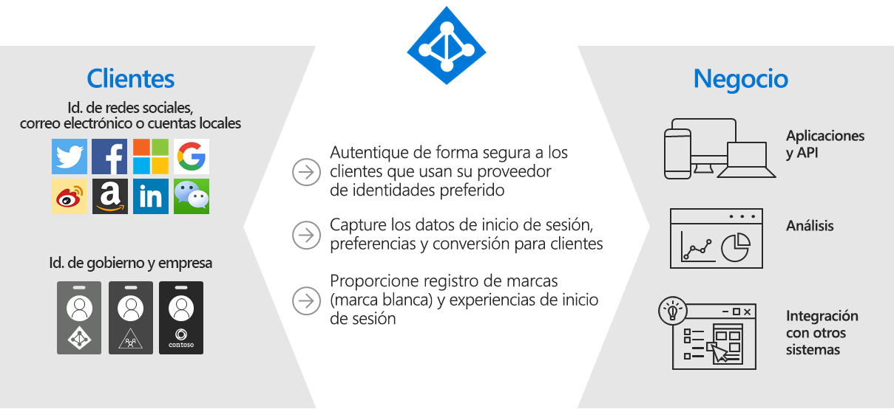
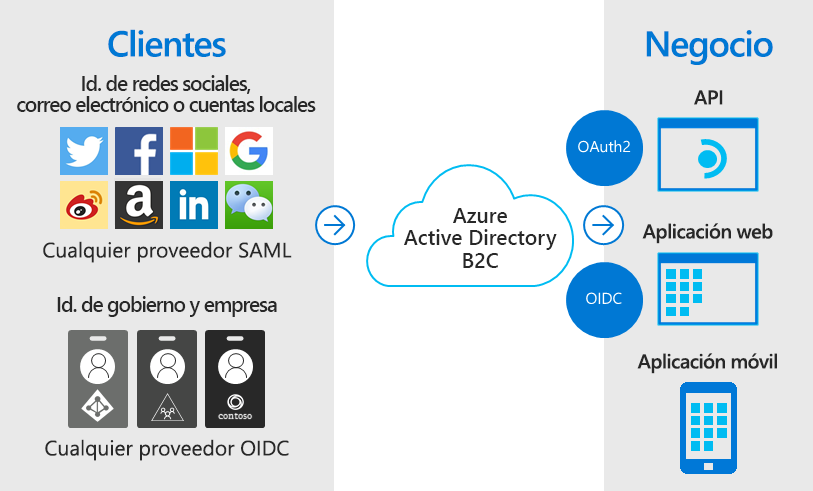
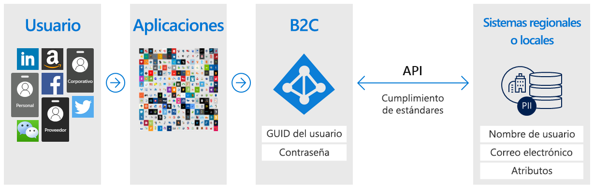
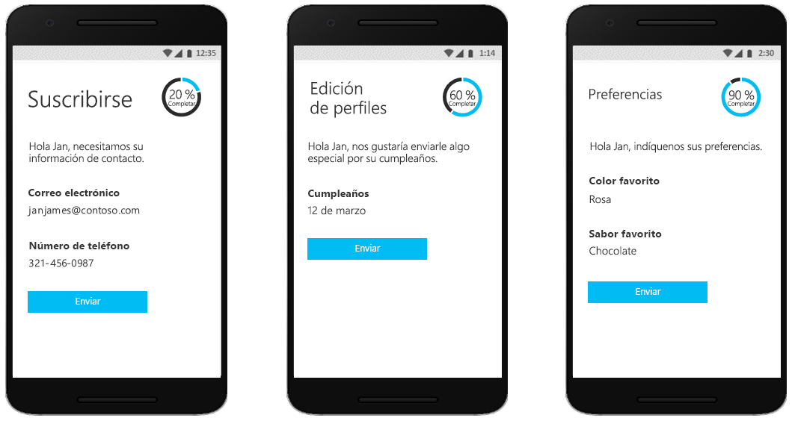
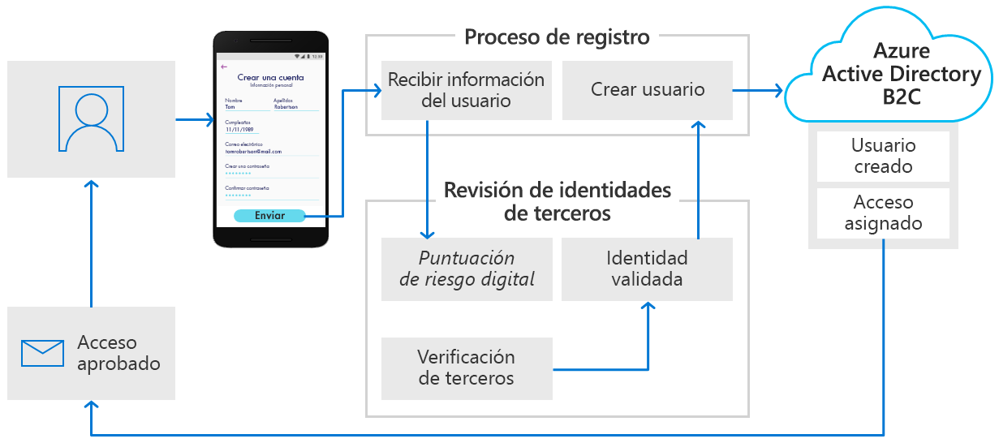
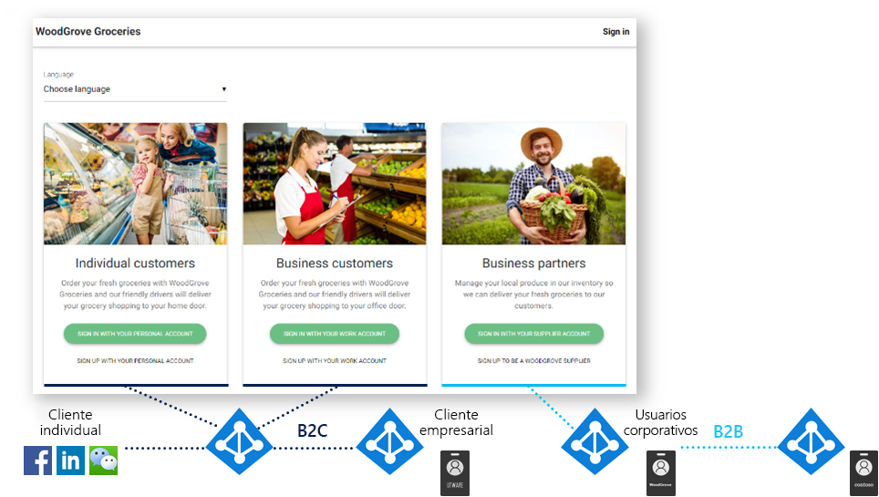
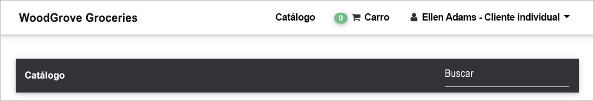

# ¿Qué es Azure Active Directory B2C?

Azure Active Directory B2C proporciona la identidad de negocio a cliente como servicio. Los clientes usan las identidades de la cuenta de redes sociales, corporativa o local preferidas para acceder al inicio de sesión único para sus aplicaciones y API.

Azure Active Directory B2C (Azure AD B2C) es una solución de administración de acceso de identidades de clientes (CIAM) capaz de admitir millones de usuarios y miles de millones de autenticaciones al día. Se encarga del escalado y la seguridad de la plataforma de autenticación, de la supervisión y del control automático de amenazas, como la denegación de servicio, la difusión de contraseñas o los ataques por fuerza bruta.

## Solución de identidad de marca personalizada

Azure AD B2C es una solución de autenticación de marca blanca. Puede personalizar toda la experiencia del usuario con su marca para que se fusione sin problemas con las aplicaciones web y móviles.

Personalice todas las páginas mostradas por Azure AD B2C cuando los usuarios se registren, inicien sesión y modifiquen su información de perfil. Personalice el HTML, CSS y JavaScript en los recorridos del usuario para que la experiencia de Azure AD B2C tenga la apariencia de una parte nativa de la aplicación.

## Acceso de inicio de sesión único con una identidad proporcionada por el usuario

Azure AD B2C utiliza protocolos de autenticación basados en estándares, como OpenID Connect, OAuth 2.0 y SAML. Se integra con la mayoría de las aplicaciones modernas y el software comercial.

Al actuar como la entidad de autenticación central de las aplicaciones web, las aplicaciones móviles y las API, Azure AD B2C le permite crear una solución de inicio de sesión único (SSO) para todas ellas. Centralice la recopilación de información de perfiles de usuario y preferencias, y capture el análisis detallado sobre el comportamiento de inicio de sesión y la conversión de registros.

## Integración con almacenes de usuarios externos

Azure AD B2C proporciona un directorio que puede contener 100 atributos personalizados por usuario. Sin embargo, también puede integrarse con sistemas externos. Por ejemplo, use Azure AD B2C para la autenticación, pero delegue en una base de datos externa de administración de relaciones con el cliente (CRM) o de fidelización de clientes como el origen de veracidad para los datos de los clientes.

Otro escenario de almacenamiento de usuarios externo consiste en que Azure AD B2C se encargue de la autenticación de la aplicación, pero se integre con un sistema externo que almacena el perfil de usuario o los datos personales. Por ejemplo, para satisfacer los requisitos de residencia de datos, como las directivas de almacenamiento de datos regionales o locales.

Azure AD B2C puede facilitar la recopilación de la información del usuario durante el registro o la edición de perfiles y, a continuación, colocar los datos en el sistema externo. Después, durante las autenticaciones futuras, Azure AD B2C puede recuperar los datos del sistema externo y, si es necesario, incluirlos como parte de la respuesta del token de autenticación que envía a la aplicación.

## Generación de perfiles progresiva

Otra opción de recorrido del usuario incluye la generación de perfiles progresiva. La generación de perfiles progresiva permite a los clientes completar rápidamente la primera transacción mediante la recopilación de una cantidad mínima de información. Posteriormente, se recopilarán gradualmente más datos de perfil del cliente en los inicios de sesión futuros.

## Comprobación y prueba de identidades de terceros

Use Azure AD B2C para facilitar la comprobación de identidades y su prueba mediante la recopilación de datos de usuario y, después, pasarlos a un sistema de terceros para realizar la validación, la puntuación de confianza y la aprobación para la creación de cuentas de usuario.

Estas son solo algunas de las cosas que puede hacer con Azure AD B2C como plataforma de identidad de negocio a cliente. Las siguientes secciones de esta información general le guiarán por una aplicación de demostración que usa Azure AD B2C. También va a pasar directamente a una [introducción general técnica más detallada de Azure AD B2C](technical-overview.md).

## Ejemplo: WoodGrove Groceries

[WoodGrove Groceries][woodgrove] es una aplicación web activa creada por Microsoft para mostrar varias características de Azure AD B2C. En las siguientes secciones se van a revisar algunas de las opciones de autenticación proporcionadas por Azure AD B2C al sitio web de WoodGrove.

### Información general empresarial

WoodGrove es una tienda de comestibles en línea que vende comestibles tanto a clientes individuales como a clientes empresariales. Los clientes empresariales compran los comestibles en nombre de la empresa u organizaciones que administran.

### Opciones de inicio de sesión

WoodGrove Groceries ofrece varias opciones de inicio de sesión basadas en la relación que tienen sus clientes con la tienda:

* Los clientes **individuales** pueden registrarse o iniciar sesión con cuentas individuales, como un proveedor de identidades de redes sociales o una dirección de correo electrónico y una contraseña.
* Los clientes **empresariales** pueden registrarse o iniciar sesión con las credenciales de empresa.
* Los **asociados** y proveedores son usuarios que suministran a la tienda de comestibles productos para su venta. La identidad del asociado la proporciona [Azure Active Directory B2B](../active-directory/b2b/what-is-b2b.md).

### Autenticación de clientes individuales

Cuando un cliente selecciona **Inicie sesión con su cuenta personal**, se le redirige a una página de inicio de sesión personalizada hospedada por Azure AD B2C. Puede ver en la siguiente imagen que hemos personalizado la interfaz de usuario para que se parezca al sitio web de WoodGrove Groceries. Los clientes de WoodGrove no deberían notar que la experiencia de autenticación está hospedada y protegida por Azure AD B2C.

WoodGrove permite a sus clientes registrarse e iniciar sesión con sus cuentas de Google, Facebook o Microsoft como proveedor de identidades. O bien, pueden registrarse con su dirección de correo electrónico y una contraseña para crear lo que se denomina una *cuenta local*.

Cuando un cliente selecciona **Regístrese con su cuenta personal** y, después, **Registrarse ahora**, se le presenta una página de registro personalizada.

Después de escribir una dirección de correo electrónico y seleccionar **Enviar código de verificación**, Azure AD B2C le envía el código. Cuando escriba el código, seleccione **Verificar código** y, después, escriba la otra información en el formulario, que también debe aceptar los términos de servicio.

Al hacer clic en el botón **Crear**, Azure AD B2C redirige al usuario al sitio web de WoodGrove Groceries. Cuando se redirige, Azure AD B2C pasa un token de autenticación de OpenID Connect a la aplicación web de WoodGrove. El usuario ya ha iniciado sesión y está preparado, y su nombre para mostrar aparece en la esquina superior derecha para indicar que está conectado.

### Autenticación de los clientes empresariales

Cuando un cliente selecciona una de las opciones en **Business customers** (Clientes empresariales), el sitio web de WoodGrove Groceries invoca una directiva de Azure AD B2C diferente a la de los clientes individuales.

Esta directiva presenta al usuario una opción para usar sus credenciales corporativas para el registro y el inicio de sesión. En el ejemplo de WoodGrove, se pide a los usuarios que inicien sesión con cualquier cuenta de Office 365 o Azure AD. Esta directiva usa una [aplicación de Azure AD multiinquilino](../active-directory/develop/howto-convert-app-to-be-multi-tenant.md) y el punto de conexión de Azure AD `/common` para federar Azure AD B2C con cualquier cliente de Office 365 del mundo.

### Autenticación de asociados

El vínculo **Sign in with your supplier account** (Inicie sesión con su cuenta de proveedor) usa la funcionalidad de colaboración de Azure Active Directory B2B. Azure AD B2B es una familia de características de Azure Active Directory para administrar las identidades de los asociados. Esas identidades se pueden federar desde Azure Active Directory para el acceso a aplicaciones protegidas mediante Azure AD B2C.

Para más información sobre Azure AD B2B, consulte [¿Qué es el acceso de usuarios invitados en Azure Active Directory B2B?](../active-directory/b2b/what-is-b2b.md).

<!-- UNCOMMENT WHEN REPO IS UPDATED WITH LATEST DEMO CODE
### Sample code

If you'd like to jump right into the code to see how the WoodGrove Groceries application is built, you can find the repository on GitHub:

[Azure-Samples/active-directory-external-identities-woodgrove-demo][woodgrove-repo] (GitHub)
-->

## Pasos siguientes

Ahora que tiene una idea de lo que es Azure AD B2C y algunos de los escenarios en los que puede ayudar, profundice un poco más en sus características y aspectos técnicos.

> [!div class="nextstepaction"]
> [Información general técnica de Azure AD B2C >](technical-overview.md)

<!-- LINKS - External -->
[woodgrove]: https://aka.ms/ciamdemo
[woodgrove-repo]: https://github.com/Azure-Samples/active-directory-external-identities-woodgrove-demo
