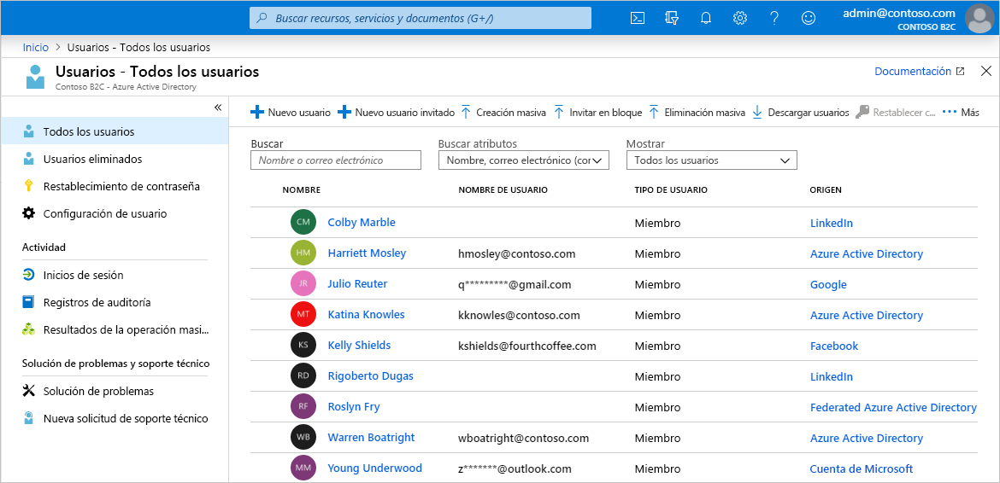
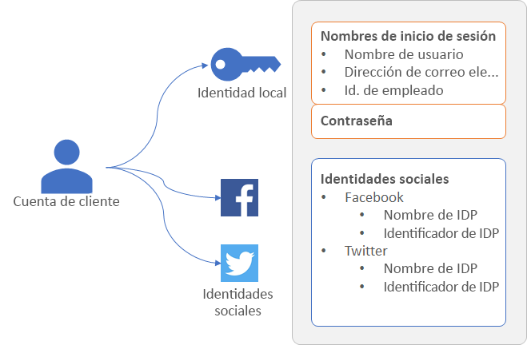
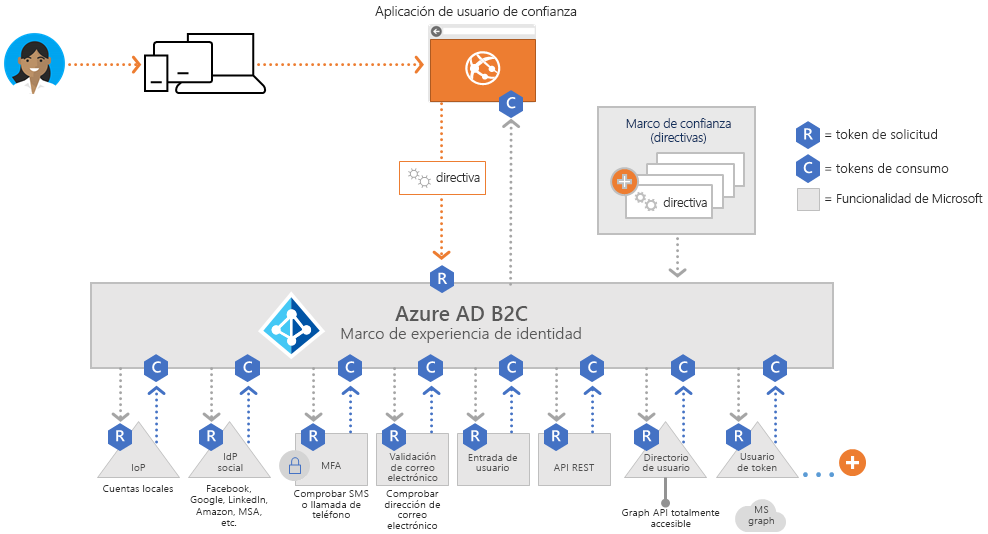
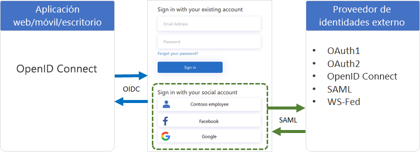
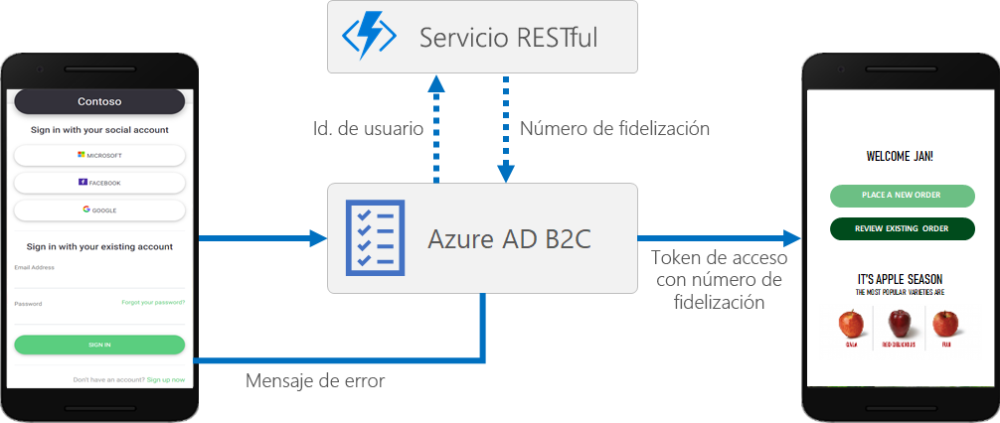
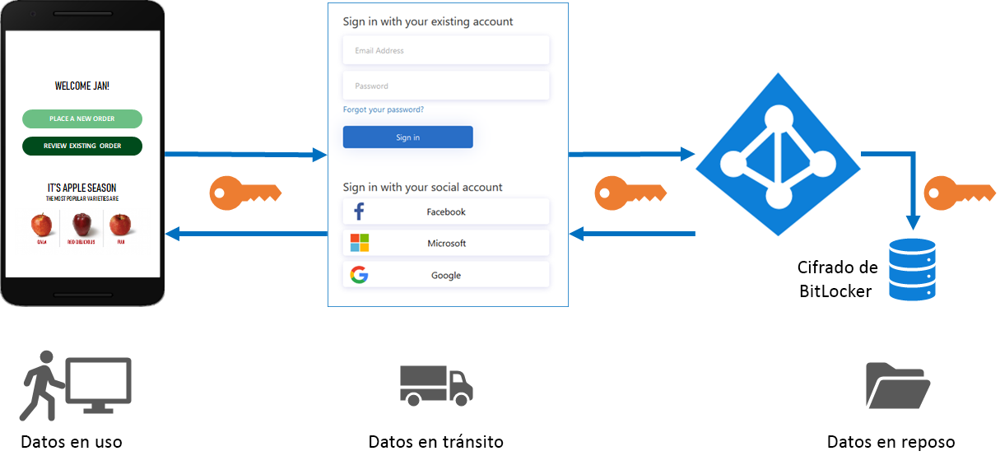
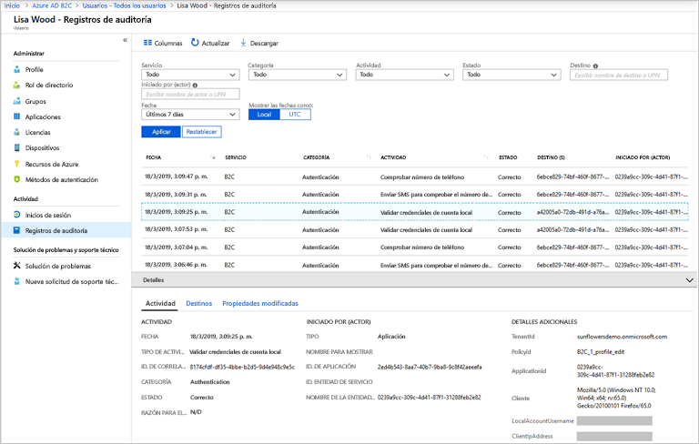

# Introducción a los aspectos técnicos y las características de Azure Active Directory B2C

Como complemento al artículo [Acerca de Azure Active Directory B2C](overview.md), en este artículo se proporciona una introducción en profundidad al servicio. Se describen los recursos principales con los que trabaja en el servicio, sus características, y cómo le permiten proporcionar una experiencia de identidad totalmente personalizada a los clientes en sus aplicaciones.

## Inquilino de Azure AD B2C

En Azure Active Directory B2C (Azure AD B2C), un *inquilino* representa la organización y es un directorio de usuarios. Cada inquilino de Azure AD B2C es distinto e independiente del resto de inquilinos de Azure AD B2C. Un inquilino de Azure AD B2C es diferente de un inquilino de Azure Active Directory, que es posible que ya tenga.

Los recursos principales con los que trabaja en un inquilino de Azure AD B2C son:

* **Directorio**: el *directorio* es donde Azure AD B2C almacena las credenciales y los datos del perfil de los usuarios, así como los registros de aplicación.
* **Registros de aplicación**: se registran las aplicaciones web, móviles y nativas en Azure AD B2C para permitir la administración de identidades. También se registran las API que quiera proteger con Azure AD B2C.
* **Flujos de usuario** y **directivas personalizadas**: las experiencias de identidad integradas (flujos de usuario) y completamente personalizables (directivas personalizadas) de sus aplicaciones.
  * Use *flujos de usuario* para la configuración rápida y la habilitación de tareas comunes de identidad como registro, inicio de sesión y edición de perfiles.
  * Use *directivas personalizadas* para permitir experiencias de usuario no solo para las tareas comunes de identidad, sino también para crear compatibilidad con flujos de trabajo de identidad complejos exclusivos de su organización, clientes, empleados, asociados y ciudadanos.
* **Proveedores de identidades**: configuración de federación para:
  * Proveedores de identidades de *redes sociales*, como Facebook, LinkedIn o Twitter que quiera admitir en sus aplicaciones.
  * Proveedores de identidades *externos* que admiten protocolos de identidad estándar, como OAuth 2.0, OpenID Connect, etc.
  * Cuentas *locales* que permiten a los usuarios registrarse e iniciar sesión con un nombre de usuario (o una dirección de correo electrónico u otro identificador) y una contraseña.
* **Claves**: agregue y administre claves de cifrado para la firma y la validación de los tokens.

El primer recurso que debe crear para empezar a trabajar con este servicio es un inquilino de Azure AD B2C. Aprenda cómo en el [Tutorial: Creación de un inquilino de Azure Active Directory B2C](tutorial-create-tenant.md).

## Cuentas en Azure AD B2C

Azure AD B2C define varios tipos de cuentas de usuario. Azure Active Directory, Azure Active Directory B2B y Azure Active Directory B2C comparten estos tipos de cuentas.

* **Cuenta profesional**: los usuarios con una cuenta profesional pueden administrar los recursos de un inquilino y, si además tienen un rol de administrador, también pueden administrar inquilinos. Asimismo, estos usuarios pueden crear cuentas de consumidor, restablecer contraseñas, bloquear o desbloquear cuentas y establecer permisos o asignar una cuenta a un grupo de seguridad.
* **Cuenta de invitado**: usuarios externos a los que invita en su inquilino. Un escenario típico para invitar a un usuario invitado al inquilino de Azure AD B2C es compartir las responsabilidades de administración.
* **Cuenta de consumidor**: las cuentas de consumidor son las cuentas creadas en el directorio de Azure AD B2C cuando los usuarios completan el recorrido de inicio de sesión en una aplicación que se ha registrado en el inquilino.

 *Ilustración: Directorio de usuario dentro de un inquilino de Azure AD B2C en Azure Portal*

### Cuentas de consumidor

Con una cuenta de *consumidor*, los usuarios pueden iniciar sesión en las aplicaciones que ha protegido con Azure AD B2C. Sin embargo, no pueden acceder a los recursos de Azure, por ejemplo, a Azure Portal.

Una cuenta de consumidor se puede asociar con estos tipos de identidad:

* Identidad **local**, con el nombre de usuario y la contraseña almacenados localmente en el directorio de Azure AD B2C. A menudo se hace referencia a estas identidades como "cuentas locales".
* Las identidades de **redes sociales** o de **empresa**, donde la identidad del usuario se administra mediante un proveedor de identidades federado, como Facebook, Microsoft, ADFS o Salesforce.

Un usuario con una cuenta de consumidor puede iniciar sesión con varias identidades, por ejemplo, nombre de usuario, correo electrónico, identificador gubernamental y otros. Una sola cuenta puede tener varias identidades, tanto locales como de redes sociales.

 *Ilustración: Una sola cuenta de consumidor con varias identidades en Azure AD B2C*

Azure AD B2C permite administrar atributos comunes de los perfiles de la cuenta de consumidor, como el nombre para mostrar, el apellido, el nombre dado, la ciudad y otros. También se puede ampliar el esquema de Azure AD para almacenar información adicional sobre los usuarios. Por ejemplo, su país o residencia, el idioma preferido y las preferencias, por ejemplo, si quieren suscribirse a un boletín o habilitar la autenticación multifactor.

Más información sobre los tipos de cuentas de usuario en Azure AD B2C en [Introducción a las cuentas de usuario en Azure Active Directory B2C](user-overview.md).

## Proveedores de identidades externos

Puede configurar Azure AD B2C para permitir que los usuarios inicien sesión en su aplicación con las credenciales de proveedores de identidades (IdP) externos de redes sociales o de empresa. Azure AD B2C admite proveedores de identidades externos, como Facebook, cuenta Microsoft, Google, Twitter y cualquier otro que tenga compatibilidad con los protocolos OAuth 1.0, OAuth 2.0, OpenID Connect, SAML o WS-Federation.

Con la federación de proveedores de identidades externos, puede ofrecer a sus consumidores la posibilidad de iniciar sesión con sus cuentas de redes sociales o de empresa existentes, sin tener que crear una cuenta solo para la aplicación.

En la página de registro o inicio de sesión, Azure AD B2C presenta una lista de proveedores de identidades externos que el usuario puede elegir para iniciar sesión. Después de seleccionar uno de los proveedores de identidades externos, se le redirige al sitio web del proveedor seleccionado para completar el proceso de inicio de sesión. Una vez que el usuario inicia sesión correctamente, vuelve a Azure AD B2C para autenticar la cuenta en la aplicación.

Para ver cómo agregar proveedores de identidades en Azure AD B2C, consulte el [Tutorial: Incorporación de proveedores de identidades a las aplicaciones en Azure Active Directory B2C](tutorial-add-identity-providers.md).

## Experiencias de identidad: flujos de usuario o directivas personalizadas

La fuerza principal de Azure AD B2C radica en su marco de directivas extensible. Las directivas describen las experiencias de identidad de los usuarios, como el registro, el inicio de sesión y la edición de perfiles.

En Azure AD B2C, hay dos rutas de acceso principales que puede tomar para proporcionar estas experiencias de identidad: flujos de usuario y directivas personalizadas.

* Los **flujos de usuario** son directivas configurables, predefinidas e integradas que se proporcionan para que pueda crear experiencias de registro, inicio de sesión y edición de directivas en cuestión de minutos.

* Las **directivas personalizadas** le permiten crear sus propios recorridos de usuario para escenarios complejos de experiencia de identidad.

Tanto los flujos de usuario como las directivas personalizadas se basan en *Identity Experience Framework*, el motor de orquestación de directivas de Azure AD B2C.

### Flujo de usuario

Para ayudarle a configurar rápidamente las tareas más comunes de identidad, Azure Portal incluye varias directivas predefinidas y configurables denominadas *flujos de usuario*.

Puede configurar valores de flujo de usuario como estos para controlar los comportamientos de la experiencia de identidad en las aplicaciones:

* Los tipos de cuenta usados para el inicio de sesión, como cuentas de redes sociales (por ejemplo, Facebook), o cuentas locales que usan una dirección de correo electrónico y una contraseña para el inicio de sesión.
* Los atributos que se recopilan del consumidor, como el nombre, el código postal o el país de residencia.
* Azure Multi-Factor Authentication (MFA)
* Personalización de la interfaz de usuario
* El conjunto de notificaciones en un token que recibe la aplicación después de que el usuario completa el flujo de usuario.
* Administración de sesiones
* ...y muchos más.

Los escenarios de identidad más comunes de la mayoría de aplicaciones móviles, web y de una sola página se pueden definir e implementar de forma eficaz con los flujos de usuario. Se recomienda usar los flujos de usuario integrados a menos que tenga escenarios de recorrido de usuario complejos que requieran toda la flexibilidad de las directivas personalizadas.

Más información sobre los flujos de usuario en [Flujos de usuario de Azure Active Directory B2C](user-flow-overview.md).

### Directiva personalizada

Las directivas personalizadas desbloquean el acceso a toda la funcionalidad del motor de orquestación Identity Experience Framework (IEF). Con ellas, puede aprovechar IEF para crear prácticamente cualquier experiencia de autenticación, registro de usuario o edición de perfiles que pueda imaginar.

Identity Experience Framework le ofrece la posibilidad de crear recorridos de usuario con cualquier combinación de pasos. Por ejemplo:

* Federación con otros proveedores de identidades
* Desafíos de autenticación multifactor (MFA) propios y de terceros
* Recopilación de cualquier dato proporcionado por el usuario
* Integración con sistemas externos mediante la comunicación de la API REST

Cada uno de estos recorridos de usuario se define mediante una directiva, y puede crear tantas directivas como sea necesario para permitir la mejor experiencia de usuario en su organización.

Una directiva personalizada se define mediante varios archivos XML que se hacen referencia entre sí en una cadena jerárquica. Los elementos XML definen el esquema de notificaciones, las transformaciones de notificaciones, las definiciones de contenido, los proveedores de notificaciones, los perfiles técnicos, los pasos de orquestación del recorrido del usuario y otros aspectos de la experiencia de identidad.

La gran flexibilidad de las directivas personalizadas es principalmente adecuada cuando es necesario crear escenarios de identidad complejos. Los desarrolladores que configuran las directivas personalizadas deben definir las relaciones de confianza con mucho detalle para incluir puntos de conexión de metadatos, definiciones exactas de intercambio de notificaciones, además de configurar secretos, claves y certificados según lo necesite cada proveedor de identidades.

Más información sobre las directivas personalizadas en [Directivas personalizadas de Azure Active Directory B2C](custom-policy-overview.md).

## Protocolos y tokens

Azure AD B2C admite los protocolos [OpenID Connect y OAuth 2.0](protocols-overview.md) para los recorridos del usuario. En la implementación de OpenID Connect de Azure AD B2C, su aplicación inicia este recorrido del usuario mediante la emisión de solicitudes de autenticación a Azure AD B2C.

El resultado de una solicitud a Azure AD B2C es un token de seguridad como, por ejemplo, un [token de identificador o un token de acceso](tokens-overview.md). Este token de seguridad define la identidad del usuario. Los tokens se reciben desde los puntos de conexión de Azure AD B2C, como un punto de conexión `/token` o `/authorize`. Con estos tokens, puede acceder a notificaciones que se pueden usar para validar una identidad y permitir el acceso a recursos seguros.

En el caso de identidades externas, Azure AD B2C admite la federación con cualquier proveedor de identidades de OAuth 1.0, OAuth 2.0, OpenID Connect, SAML y WS-FED.

En el diagrama anterior se muestra cómo Azure AD B2C puede comunicarse mediante diversos protocolos dentro del mismo flujo de autenticación:

1. La aplicación de usuario de confianza inicia una solicitud de autorización a Azure AD B2C mediante OpenID Connect.
1. Cuando un usuario de la aplicación elige iniciar sesión con un proveedor de identidades externo que usa el protocolo SAML, Azure AD B2C invoca el protocolo SAML para comunicarse con el proveedor de identidades.
1. Una vez que el usuario completa la operación de inicio de sesión con el proveedor de identidades externo, Azure AD B2C devuelve el token a la aplicación de usuario de confianza mediante OpenID Connect.

## Integración de aplicaciones

Cuando un usuario quiere iniciar sesión en su aplicación, ya sea una aplicación web, móvil, de escritorio o de una sola página (SPA), la aplicación inicia una solicitud de autorización a un punto de conexión proporcionado por el flujo de usuario o la directiva personalizada. El flujo de usuario o la directiva personalizada definen y controlan la experiencia del usuario. Al completar un flujo de usuario, por ejemplo, el flujo de *registro o inicio de sesión*, Azure AD B2C genera un token y, luego, redirige al usuario de vuelta a la aplicación.

Varias aplicaciones pueden usar el mismo flujo de usuario o directiva personalizada. Una sola aplicación puede usar varios flujos de usuario o directivas personalizadas.

Por ejemplo, para iniciar sesión en una aplicación, la aplicación usa el flujo de usuario de *registro o inicio de sesión*. Cuando el usuario ha iniciado sesión, puede querer editar su perfil, así que la aplicación inicia otra solicitud de autorización, esta vez mediante el flujo de usuario de *edición del perfil*.

## Experiencias de usuario sin problemas.

En Azure AD B2C, puede crear las experiencias de identidad de sus usuarios para que las páginas que se muestran se mezclen sin problemas con la apariencia de su marca. Casi se consigue el control completo del contenido HTML y CSS que se presenta a los usuarios cuando prosiguen su recorrido de identidad de la aplicación. Gracias a esta flexibilidad, también puede mantener la coherencia visual y de la marca entre la aplicación y Azure AD B2C.

Para información sobre la personalización de la interfaz de usuario, consulte [Acerca de la personalización de la interfaz de usuario en Azure Active Directory B2C](customize-ui-overview.md).

## Localización

La personalización del idioma en Azure AD B2C permite albergar distintos idiomas a fin de satisfacer las necesidades de los clientes. Microsoft proporciona las traducciones de 36 idiomas, pero el usuario también puede proporcionar sus propias traducciones en cualquier idioma. Incluso si su experiencia se proporciona únicamente para un idioma, puede personalizar cualquier texto de las páginas.

Vea cómo funciona la localización en [Personalización de idioma en Azure Active Directory B2C](user-flow-language-customization.md).

## Agregar su propia lógica de negocios

Si decide usar directivas personalizadas, puede integrarlas con una API de RESTful en un recorrido de usuario para agregar su propia lógica de negocios al recorrido. Por ejemplo, Azure AD B2C puede intercambiar datos con un servicio RESTful con los siguientes fines:

* Mostrar mensajes de error intuitivos personalizados.
* Validar los datos proporcionados por el usuario para evitar que aquellos con un formato incorrecto permanezcan en el directorio de usuario. Por ejemplo, puede modificar los datos especificados por el usuario, como poner en mayúscula la primera letra del nombre si se escribe en minúscula.
* Enriquecer los datos de usuario mediante la integración adicional con la aplicación de línea de negocio corporativa.
* Con las llamadas de RESTful, puede enviar notificaciones push, actualizar las bases de datos corporativas, ejecutar un proceso de migración de usuarios, administrar permisos, auditar bases de datos y mucho más.

Los programas de fidelidad son otro escenario que posibilita la compatibilidad de Azure AD B2C con las llamadas a las API REST. Por ejemplo, el servicio RESTful puede recibir la dirección de correo electrónico del usuario, consultar la base de datos de clientes y devolver el número de fidelidad del usuario a Azure AD B2C. Los datos devueltos se pueden almacenar en la cuenta de directorio del usuario en Azure AD B2C y evaluarse mejor en los pasos posteriores de la directiva, o se pueden incluir en el token de acceso.

Puede agregar una llamada a la API REST en cualquier paso del recorrido del usuario definido por una directiva personalizada. Por ejemplo, puede llamar a una API REST:

* Durante el inicio de sesión, justo antes de que Azure AD B2C valide las credenciales
* Inmediatamente después del inicio de sesión
* Antes de que Azure AD B2C cree una cuenta en el directorio
* Después de que Azure AD B2C cree una cuenta en el directorio
* Antes de que Azure AD B2C emita un token de acceso

Para ver cómo se usan las directivas personalizadas para la integración de la API de RESTful en Azure AD B2C, consulte [Integración de intercambios de notificaciones de API REST en el recorrido del usuario de Azure AD B2C](rest-api-claims-exchange-dotnet.md).

## Protección de identidades de los clientes

Azure AD B2C cumple los compromisos de seguridad, privacidad y demás descritos en el [Centro de confianza de Microsoft Azure](https://www.microsoft.com/trustcenter/cloudservices/azure).

Las sesiones se modelan como datos cifrados, donde solo el servicio de token de seguridad de Azure AD B2C conoce la clave de cifrado. Se usa un algoritmo de cifrado seguro, AES-192. Todas las rutas de comunicación están protegidas con TLS para ofrecer confidencialidad e integridad. Nuestro servicio de token de seguridad emplea un certificado de validación extendida (EV) para TLS. En general, el servicio de token de seguridad mitiga los ataques de scripts de sitios (XSS) al no representar las entradas que no son de confianza.

### Acceso a los datos de usuario

Los inquilinos de Azure AD B2C comparten muchas características con los inquilinos de Azure Active Directory empresarial que se usan con empleados y asociados. Los aspectos compartidos incluyen mecanismos para ver roles administrativos, asignar roles y auditar actividades.

Puede asignar roles para controlar quién puede realizar determinadas acciones administrativas en Azure AD B2C, por ejemplo:

* Crear y administrar todos los aspectos de los flujos de usuario
* Crear y administrar el esquema de atributos disponible para todos los flujos de usuario
* Configurar proveedores de identidades para su uso en la federación directa
* Crear y administrar directivas del marco de confianza en Identity Experience Framework (directivas personalizadas)
* Administrar los secretos en la federación y el cifrado en Identity Experience Framework (directivas personalizadas)

Para más información sobre los roles de Azure AD, incluida la compatibilidad con los roles de administración de Azure AD B2C, consulte [Permisos de roles de administrador en Azure Active Directory](../active-directory/users-groups-roles/directory-assign-admin-roles.md).

### Multi-Factor Authentication (MFA)

La autenticación multifactor (MFA) de Azure AD B2C ayuda a proteger el acceso a los datos y las aplicaciones, al tiempo que mantiene la simplicidad para los usuarios. Ofrece seguridad adicional al exigir una segunda forma de autenticación y proporciona autenticación segura con una oferta de métodos de autenticación fáciles de usar. Puede que a los usuarios no se les muestre el desafío de MFA, ya que depende de las decisiones de configuración que pueda tomar como administrador.

Consulte cómo se habilita MFA en los flujos de usuario en [Habilitación de la autenticación multifactor en Azure Active Directory B2C](custom-policy-multi-factor-authentication.md).

### Bloqueo inteligente de la cuenta

Con el fin de evitar intentos de adivinación de contraseñas por fuerza bruta, Azure AD B2C usa una estrategia sofisticada para bloquear las cuentas en función de la dirección IP de la solicitud, las contraseñas especificadas y otros diversos factores. La duración del bloqueo aumenta automáticamente en función del riesgo y el número de intentos.

Para más información sobre la administración de configuraciones de protección con contraseña, consulte [Administración de amenazas en los recursos y los datos en Azure Active Directory B2C](threat-management.md).

### Complejidad de la contraseña

Durante el registro o el restablecimiento de la contraseña, los usuarios deben proporcionar una contraseña que cumpla las reglas de complejidad. De forma predeterminada, Azure AD B2C aplica una directiva de contraseñas seguras. Azure AD B2C también proporciona opciones de configuración para especificar los requisitos de complejidad de las contraseñas que usan los clientes.

Puede configurar los requisitos de complejidad de la contraseña en los [flujos de usuario](user-flow-password-complexity.md) y las [directivas personalizadas](custom-policy-password-complexity.md).

## Auditoría y registros

Azure AD B2C emite registros de auditoría que contienen información de actividad sobre sus recursos, los tokens emitidos y el acceso de administrador. Puede usar estos registros de auditoría para comprender la actividad de la plataforma y diagnosticar problemas. Las entradas del registro de auditoría están disponibles poco después de que se produzca la actividad que generó el evento.

En un registro de auditoría, que está disponible para el inquilino de Azure AD B2C o para un usuario determinado, puede encontrar información como esta:

* Actividades relacionadas con la autorización de un usuario para acceder a los recursos de B2C (por ejemplo, un administrador que accede a una lista de directivas de B2C)
* Actividades relacionadas con los atributos de directorio que se recuperan cuando un administrador inicia sesión con Azure Portal
* Operaciones de creación, lectura, actualización y eliminación (CRUD) en aplicaciones B2C
* Operaciones CRUD en claves almacenadas en un contenedor de claves B2C
* Operaciones CRUD en recursos de B2C (por ejemplo, directivas y proveedores de identidades)
* Validación de credenciales de usuario y emisión de tokens

Para más información sobre los registros de auditoría, consulte [Acceso a los registros de auditoría de Azure AD B2C](view-audit-logs.md).

### Conclusiones de uso

Azure AD B2C permite detectar cuándo los usuarios se registran o inician sesión en la aplicación web, dónde se encuentran los usuarios y qué exploradores y sistemas operativos usan. Al integrar Azure Application Insights en Azure AD B2C mediante directivas personalizadas, puede sacar conclusiones sobre cómo la gente se registra, inicia sesión, restablece su contraseña o edita su perfil. Con este conocimiento, puede tomar decisiones basadas en los datos de cara a los próximos ciclos de desarrollo.

Descubra más sobre el análisis de uso en [Seguimiento del comportamiento del usuario en Azure Active Directory B2C mediante Application Insights](analytics-with-application-insights.md).

## Pasos siguientes

Ahora que tiene una visión más profunda de las características y los aspectos técnicos de Azure Active Directory B2C, empiece a usar el servicio y cree un inquilino de B2C:

> [!div class="nextstepaction"]
> [Tutorial: Creación de un inquilino de Azure Active Directory B2C](tutorial-create-tenant.md)