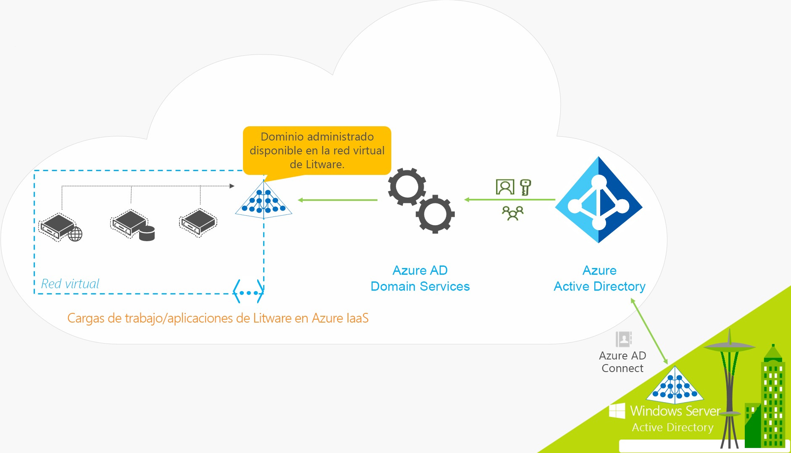
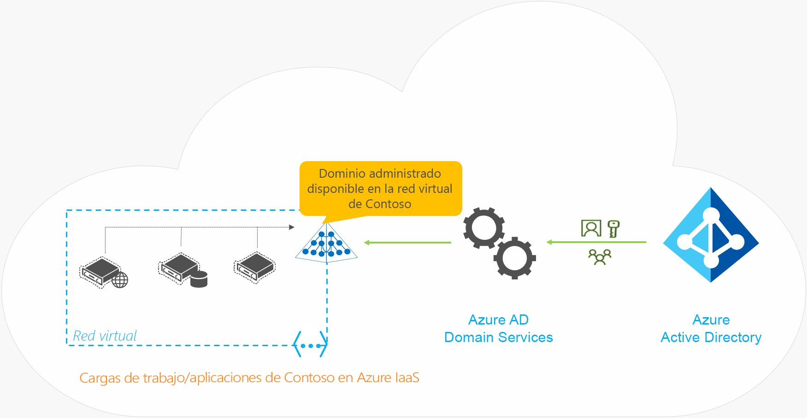

# ¿Qué es Azure Active Directory Domain Services?

Azure Active Directory Domain Services (Azure AD DS) proporciona servicios de dominio administrados como, por ejemplo, unión a un dominio, directiva de grupo, LDAP o autenticación Kerberos/NTLM, que son totalmente compatibles con Windows Server Active Directory. Puede usar estos servicios de dominio sin necesidad de implementar o administrar los controladores de dominio de la nube, ni de aplicarles revisiones. Azure AD DS se integra con el inquilino de Azure AD existente, lo que posibilita que los usuarios inicien sesión con sus credenciales existentes. También puede usar los grupos y las cuentas de usuario existentes para proteger el acceso a los recursos, lo que ofrece una mejor migración mediante lift-and-shift de los recursos en el entorno local a Azure.

Azure AD DS replica la información de identidad desde Azure AD, por lo que funciona con los inquilinos de Azure AD que solo están en la nube o se sincronizan con un entorno de Active Directory Domain Services (AD DS) local. Si tiene un entorno de AD DS local, puede sincronizar la información de las cuentas de usuario para proporcionar una identidad coherente para los usuarios. En el caso de los entornos solo en la nube, no se necesita un entorno de AD DS local tradicional para usar los servicios de identidad centralizados de Azure AD DS. El mismo conjunto de características de Azure AD DS existen para ambos entornos.

El vídeo siguiente proporciona información general sobre el modo en que Azure AD DS se integra con las aplicaciones y las cargas de trabajo para proporcionar servicios de identidad en la nube:

 

>[!VIDEO https://www.youtube.com/embed/T1Nd9APNceQ]

## Formas comunes de proporcionar soluciones de identidad en la nube

Al migrar las cargas de trabajo existentes a la nube, las aplicaciones que tienen en cuenta el directorio pueden usar LDAP para el acceso de lectura o escritura a un directorio de AD DS local. Las aplicaciones que se ejecutan en Windows Server suelen implementarse en máquinas unidas a un dominio, de modo que se pueden administrar de forma segura mediante directiva de grupo. Para autenticar a los usuarios finales, las aplicaciones también pueden confiar en la autenticación integrada de Windows, como la autenticación Kerberos o NTLM.

A menudo, los administradores de TI usan una de las siguientes soluciones para proporcionar un servicio de identidad a las aplicaciones que se ejecutan en Azure:

* Configure una conexión VPN de sitio a sitio entre las cargas de trabajo que se ejecuten en Azure y en el entorno de AD DS local.
* Cree controladores de dominio de réplica con máquinas virtuales (VM) de Azure para extender el dominio o bosque de AD DS.
* Implemente un entorno de AD DS independiente en Azure mediante controladores de dominio que se ejecuten en máquinas virtuales Azure.

Con estos métodos, las conexiones VPN con el directorio en el entorno local hacen que las aplicaciones sean vulnerables a interrupciones o problemas de red transitorios. Si implementa controladores de dominio mediante máquinas virtuales en Azure, las máquinas virtuales del equipo de TI deben ocuparse de las tareas de administración, protección, revisión, supervisión, copia de seguridad y solución de problemas.

Azure AD DS ofrece alternativas a la necesidad de volver a crear las conexiones VPN en un entorno de AD DS local o ejecutar y administrar máquinas virtuales en Azure para proporcionar servicios de identidad. Como servicio administrado, Azure AD DS reduce la complejidad de crear una solución de identidad integrada para entornos tanto híbridos como solo en la nube.

## Características y ventajas de Azure AD DS

Para proporcionar servicios de identidad a aplicaciones y máquinas virtuales en la nube, Azure AD DS es totalmente compatible con un entorno de AD DS tradicional para las operaciones como la unión a un dominio, LDAP seguro (LDAPS), la administración de DNS y directiva de grupo, y el enlace LDAP y la compatibilidad con la lectura. La compatibilidad con la escritura LDAP está disponible para los objetos creados en el dominio administrado con Azure AD DS, pero no los recursos sincronizados desde Azure AD. Las siguientes características de Azure AD DS simplifican las operaciones de implementación y administración:

* **Experiencia de implementación simplificada:** Azure AD DS está habilitado para el inquilino de Azure AD con un solo asistente en la Azure Portal.
* **Integración con Azure AD:** Estas cuentas de usuario, las pertenencias a grupos y las credenciales están disponibles automáticamente dentro del inquilino de Azure AD. Los nuevos usuarios, grupos o cambios de atributos que se producen en el inquilino o en el directorio en el entorno local de Azure AD se sincronizan automáticamente con Azure AD DS.
* **Utilizar las credenciales y contraseñas corporativas:** las contraseñas para usuarios del inquilino de Azure AD funcionan con Azure AD DS. Los usuarios pueden utilizar sus credenciales corporativas para las máquinas de unión al dominio, iniciar sesión de forma interactiva o a través de escritorio remoto y autenticarse en el dominio administrado de Azure AD DS.
* **Autenticación Kerberos y NTLM:** con compatibilidad para la autenticación Kerberos y NTLM, puede implementar las aplicaciones que dependen de la autenticación integrada de Windows.
* **Alta disponibilidad:** Azure AD DS incluye varios controladores de dominio, que proporcionan alta disponibilidad para el dominio administrado. Esta alta disponibilidad garantiza el tiempo de actividad del servicio y la resistencia a los errores.

Los siguientes son algunos aspectos clave de un dominio administrado de Azure AD DS:

* El dominio administrado de Azure AD DS es un dominio independiente. No es una extensión de un dominio local.
* El equipo de TI no necesita administrar ni supervisar controladores de dominio de este dominio administrado de Azure AD DS, ni tampoco aplicarles revisiones.

En entornos híbridos que se ejecutan AD DS de forma local, no es necesario administrar la replicación de AD en el dominio administrado de Azure AD DS. Las cuentas de usuario, las pertenencias a grupos y las credenciales del directorio local se sincronizan con Azure AD mediante Azure AD Connect. Estas cuentas de usuario, las pertenencias a grupos y las credenciales están disponibles automáticamente dentro del dominio administrado de Azure AD DS.

## ¿Cómo funciona Azure AD DS?

Para proporcionar servicios de identidad, Azure crea un dominio administrado AD DS disponible en la red virtual que prefiera. En segundo plano y sin necesidad de administrar, proteger o actualizar, se proporciona redundancia a través de un par de controladores de dominio de Windows Server. El dominio administrado de Azure AD DS está configurado para realizar una sincronización unidireccional desde Azure AD y proporcionar acceso a un conjunto central de usuarios, grupos y credenciales. Puede crear los recursos directamente en el dominio administrado de Azure AD DS, pero no se vuelven a sincronizar con Azure AD. Las aplicaciones, los servicios y las máquinas virtuales de Azure que se conectan a esta red virtual pueden usar las características de AD DS comunes, como la unión a un dominio, la directiva de grupo, LDAP y la autenticación Kerberos/NTLM. En un entorno híbrido con un entorno de AD DS local, [Azure AD Connect][azure-ad-connect] sincroniza la información de identidad con Azure AD.

Para ver Azure AD DS en acción, echemos un vistazo a un par de ejemplos:

* [Azure AD DS para organizaciones híbridas](#azure-ad-ds-for-hybrid-organizations)
* [Azure AD DS para organizaciones solo en la nube](#azure-ad-ds-for-cloud-only-organizations)

### Azure AD DS para organizaciones híbridas

Muchas organizaciones ejecutan una infraestructura híbrida que incluye cargas de trabajo de aplicaciones en el entorno local y en la nube. Las aplicaciones heredadas migradas a Azure como parte de una migración mediante lift-and-shift pueden seguir usando las conexiones LDAP tradicionales para proporcionar información de identidad. Para admitir esta infraestructura híbrida, la información de identidad de un entorno de Active Directory Domain Services local (AD DS) se puede sincronizar con un inquilino de Azure AD. A continuación, Azure AD DS puede proporcionar estas aplicaciones heredadas en Azure con un origen de identidad, sin necesidad de configurar y administrar la conectividad de la aplicación de nuevo en los servicios de directorio en el entorno local.

Echemos un vistazo a un ejemplo de Litware Corporation, una organización híbrida que ejecuta recursos locales y de Azure:

* Las aplicaciones y cargas de trabajo de servidor que requieren servicios de dominio se implementan en una red virtual en Azure.
    * Puede que se incluyan aplicaciones heredadas migradas a Azure como parte de una estrategia de migración mediante lift-and-shift.
* Para sincronizar la información de identidad desde el directorio en el entorno local a su inquilino de Azure AD, Litware Corporation implementa [Azure AD Connect][azure-ad-connect].
    * La información de identidad que se sincroniza incluye las cuentas de usuario y las pertenencias a grupos.
* El equipo de TI de Litware habilita Azure AD DS para su inquilino de Azure AD en esta red virtual o en una emparejada.
* Las aplicaciones y las máquinas virtuales implementadas en la red virtual pueden usar características de Azure AD DS como, por ejemplo, la unión a un dominio, la lectura LDAP, el enlace LDAP, la autenticación NTLM y Kerberos, y directiva de grupo.

### Azure AD DS para organizaciones solo en la nube

Un inquilino de Azure AD solo en la nube no tiene un origen de identidad en el entorno local. Las cuentas de usuario y las pertenencias a grupos, por ejemplo, se crean y administran en Azure AD.

Ahora veamos un ejemplo de Contoso, una organización solo en la nube que únicamente usa Azure AD para la identidad. Todas las identidades de usuario, sus credenciales y las pertenencias a grupos se crean y administran en Azure AD. No hay ninguna configuración adicional de Azure AD Connect para sincronizar cualquier información de identidad desde un directorio en el entorno local.

* Las aplicaciones y cargas de trabajo de servidor que requieren servicios de dominio se implementan en una red virtual en Azure.
* El equipo de TI de Litware Contoso habilita Azure AD DS para su inquilino de Azure AD en esta red virtual o en una emparejada.
* Las aplicaciones y las máquinas virtuales implementadas en la red virtual pueden usar características de Azure AD DS como, por ejemplo, la unión a un dominio, la lectura LDAP, el enlace LDAP, la autenticación NTLM y Kerberos, y directiva de grupo.

## Pasos siguientes

Para más información acerca de las comparaciones de Azure AD DS con otras soluciones de identidad y cómo funciona la sincronización, consulte los siguientes artículos:

* [Comparación de Azure AD DS con Azure AD, Active Directory Domain Services en máquinas virtuales de Azure y Active Directory Domain Services en entornos locales][compare]
* [Información sobre la sincronización de Azure AD Domain Services con el directorio Azure AD][synchronization]

Para empezar, [cree un dominio administrado de Azure AD DS con Azure Portal][tutorial-create].

<!-- INTERNAL LINKS -->
[compare]: compare-identity-solutions.md
[synchronization]: synchronization.md
[tutorial-create]: tutorial-create-instance.md
[azure-ad-connect]: ../active-directory/hybrid/whatis-hybrid-identity.md
[password-hash-sync]: ../active-directory/hybrid/how-to-connect-password-hash-synchronization.md
