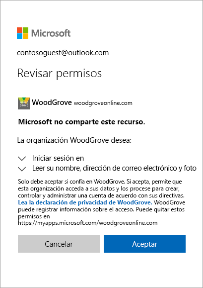

# Inicio rápido: Incorporación de usuarios invitados a su directorio en Azure Portal

Puede invitar a alguien para colaborar con su organización incorporándolo a su directorio como usuario invitado. A continuación, puede enviar una invitación por correo electrónico que contenga un vínculo de canje o enviar un vínculo directo a una aplicación que desea compartir. Los usuarios invitados inician sesión con su identidad profesional, educativa o social.

En este tutorial, agregará un nuevo usuario invitado a Azure AD, enviará una invitación y verá el aspecto del proceso de canje de invitación del usuario invitado.

Si no tiene una suscripción a Azure, cree una [cuenta gratuita](https://azure.microsoft.com/free/?WT.mc_id=A261C142F) antes de empezar.

## Prerequisites

Para completar el escenario de este tutorial, necesita:

 - Un rol que le permite crear usuarios en el directorio de inquilino, como el rol de administrador global o cualquiera de los roles de directorio de administrador limitado.
 - Una cuenta de correo electrónico válida que puede agregar a su directorio de inquilino y que puede usar para recibir el correo electrónico de invitación de prueba.

## Incorporación de un nuevo usuario invitado en Azure AD

1. Inicie sesión en [Azure Portal](https://portal.azure.com/) como administrador de Azure AD.
2. En el panel izquierdo, seleccione **Azure Active Directory**.
3.  En **Administrar**, seleccione **Usuarios**.

    

4.  Seleccione **Nuevo usuario invitado**.

    

5. En la página **Nuevo usuario**, seleccione **Invitar usuario** y, después, agregue la información del usuario invitado. 

   - **Nombre**. Nombre y apellidos del nuevo usuario.
   - **Dirección de correo (obligatorio)** . La dirección de correo del usuario invitado.
   - **Mensaje personal (opcional)** Incluye un mensaje de bienvenida personal al usuario invitado.
   - **Grupos**: Puede agregar al usuario invitado a uno o varios de los grupos existentes, o puede hacerlo después.
   - **Rol del directorio**. Si necesita permisos administrativos de Azure AD para el usuario, puede agregarlos a un rol de Azure AD. 

6. Seleccione **Invitar** para enviar automáticamente la invitación al usuario invitado. Aparece una notificación en la esquina superior derecha con el mensaje **Usuario invitado correctamente**. 
7.  Después de enviar la invitación, la cuenta de usuario se agrega automáticamente al directorio como invitado.

## Asignación de una aplicación al usuario invitado
Agregue la aplicación de Salesforce a su inquilino de prueba y asigne el usuario invitado de prueba a la aplicación.
1.  Inicie sesión en Azure Portal como administrador de Azure AD.
2.  En el panel izquierdo, seleccione **Aplicaciones empresariales**.
3.  Seleccione **Nueva aplicación**.
4. En **Agregar desde la galería**, busque **Salesforce** y después selecciónelo.

    
5. Seleccione **Agregar**.
6. En **Administrar**, seleccione **Inicio de sesión único** y, en **Modo de inicio de sesión único**, seleccione **Inicio de sesión con contraseña** y haga clic en **Guardar**.
7. En **Administrar**, seleccione **Usuarios y grupos** > **Agregar usuario** > **Usuarios y grupos**.
8. Utilice el cuadro de búsqueda para buscar el usuario de prueba (si es necesario) y seleccione el usuario de prueba en la lista. Después, haga clic en **Seleccionar**.
9. Seleccione **Asignar**. 

## Aceptar la invitación
Ahora inicie sesión como usuario invitado para ver la invitación.
1.  Inicie sesión en la cuenta de correo electrónico del usuario invitado de prueba.
2.  En su Bandeja de entrada, busque el correo electrónico "Está invitado".

    

3.  En el cuerpo del correo electrónico, seleccione **Comenzar**. Se abre una página **Revisar permisos** en el explorador. 

    

4. Seleccione **Aceptar**. Se abre el panel de acceso, donde se enumeran las aplicaciones a las que el usuario invitado puede acceder.

## Limpieza de recursos
Cuando ya no sea necesario, elimine el usuario invitado de prueba y la aplicación de prueba.
1.  Inicie sesión en Azure Portal como administrador de Azure AD.
2.  En el panel izquierdo, seleccione **Azure Active Directory**.
3.  En **Administrar**, seleccione **Aplicaciones empresariales**.
4.  Abra la aplicación **Salesforce** y luego seleccione **Eliminar**.
5.  En el panel izquierdo, seleccione **Azure Active Directory**.
6.  En **Administrar**, seleccione **Usuarios**.
7.  Seleccione el usuario de prueba y después **Eliminar usuario**.

## Pasos siguientes
En este tutorial, creó un usuario invitado en Azure Portal y envió una invitación para compartir aplicaciones. Después pudo ver el proceso de canje desde la perspectiva del usuario de prueba y verificó que la aplicación aparecía en el panel de acceso del usuario invitado. Para más información sobre cómo agregar usuarios invitados para la colaboración, vea [Incorporación de usuarios de colaboración B2B de Azure Active Directory en Azure Portal](add-users-administrator.md).
