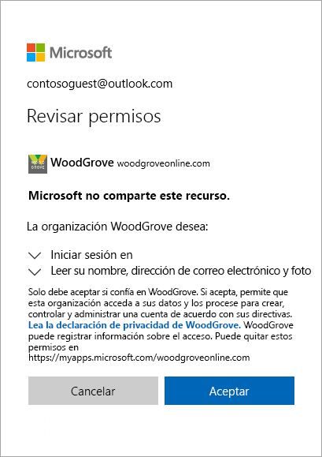
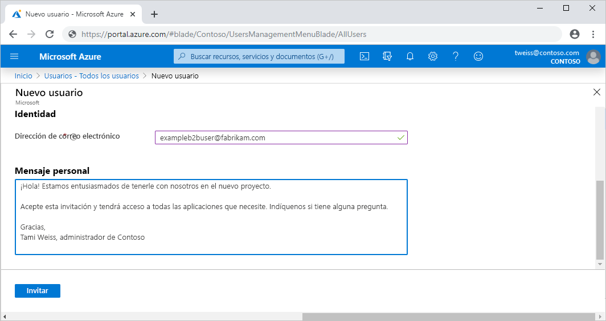

# ¿Qué es el acceso de usuarios invitados en Azure Active Directory B2B?

La colaboración de negocio a negocio (B2B) de Azure AD permite compartir de forma segura las aplicaciones y los servicios de la empresa con usuarios invitados de cualquier otra organización, mientras conserva el control sobre sus propios datos corporativos. Trabaje de forma segura con asociados externos, grandes o pequeños, incluso si no tienen Azure AD o un departamento de TI. Un proceso de invitación y canje sencillo permite a los asociados usar sus propias credenciales para acceder a los recursos de su empresa. Los desarrolladores pueden usar las API de negocio a negocio de Azure AD para personalizar el proceso de invitación o escribir aplicaciones como los portales de suscripción de autoservicio.

Vea el vídeo para saber cómo puede colaborar de forma segura con usuarios invitados invitándolos a iniciar sesión en las aplicaciones y los servicios de la empresa con el uso de sus propias identidades.

El vídeo siguiente proporciona una introducción práctica.

>[!VIDEO https://www.youtube.com/embed/AhwrweCBdsc]

## Colaboración con cualquier asociado mediante sus identidades

Con Azure AD B2B, el asociado utiliza su propia solución de administración de identidades, así que no hay ninguna sobrecarga administrativa externa para su organización.

- El socio utiliza sus propias identidades y credenciales; Azure AD no es necesario.
- No es necesario administrar las cuentas externas o las contraseñas.
- No es necesario sincronizar las cuentas o administrar los ciclos de vida de las cuentas.  

## Invitación a usuarios con un proceso de canje e invitación sencillo

Los usuarios invitados inician sesión en las aplicaciones y los servicios con sus propias identidades profesionales, educativas o sociales. Si el usuario invitado no tiene una cuenta de Microsoft o de Azure AD, se crea una en su nombre al canjear la invitación. 

- Invite a usuarios invitados mediante la identidad de correo electrónico de su elección.
- Envíe un vínculo directo a una aplicación o envíe una invitación al panel de acceso propio del usuario invitado.
- Los usuarios invitados siguen unos pasos de canje sencillos para iniciar sesión.

## Uso de directivas para compartir de forma segura sus aplicaciones y servicios

Puede usar las directivas de autorización para proteger el contenido corporativo. Las directivas de acceso condicional, como la autenticación multifactor, se pueden aplicar:

- En el nivel de inquilino.
- En el nivel de aplicación.
- A usuarios invitados específicos para proteger los datos y las aplicaciones empresariales.

## Incorporación sencilla de usuarios invitados en el portal de Azure AD

Como administrador, puede agregar fácilmente usuarios invitados a su organización en Azure Portal.

- Cree un usuario invitado en Azure AD, similar a cómo se agrega un nuevo usuario.
- El usuario invitado recibe inmediatamente una invitación personalizable que le permite iniciar sesión en su panel de acceso.
- Los usuarios invitados del directorio pueden asignarse a grupos o aplicaciones.  

## Permitir que los propietarios de aplicaciones y grupos administren sus propios usuarios invitados

Puede delegar la administración de usuarios invitados a los propietarios de aplicaciones para que puedan agregar usuarios invitados directamente a cualquier aplicación que deseen compartir, ya sea una aplicación de Microsoft o no.

- Los administradores configuran la administración de aplicaciones y grupos de autoservicio.
- Los usuarios no administradores usan su [panel de acceso](https://myapps.microsoft.com) para agregar usuarios invitados a aplicaciones o grupos.

## Personalización de la experiencia de incorporación de usuarios invitados de B2B

Incorpore a los asociados externos de manera personalizada según las necesidades de su organización.

- Use la [administración de derechos de Azure AD](https://docs.microsoft.com/azure/active-directory/governance/entitlement-management-overview) para configurar directivas que [administren el acceso para los usuarios externos](https://docs.microsoft.com/azure/active-directory/governance/entitlement-management-external-users#how-access-works-for-external-users).
- Use la [API de invitación de colaboración B2B](https://developer.microsoft.com/graph/docs/api-reference/v1.0/resources/invitation) para personalizar las experiencias de incorporación.

## Pasos siguientes

- [Guía sobre concesión de licencias de colaboración de Azure AD B2B](licensing-guidance.md)
- [Agregar usuarios invitados de colaboración B2B en el portal](add-users-administrator.md)
- [Información sobre el proceso de canje de invitaciones](redemption-experience.md)
- Y, como siempre, conéctese con el equipo del producto para obtener comentarios, conversaciones y sugerencias a través de nuestra [Comunidad tecnológica de Microsoft](https://techcommunity.microsoft.com/t5/Azure-Active-Directory-B2B/bd-p/AzureAD_B2b).
