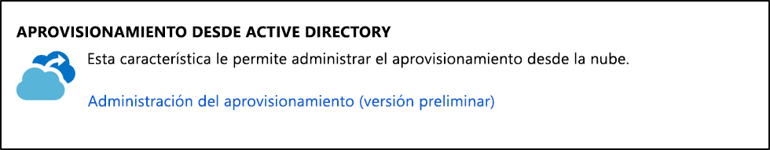
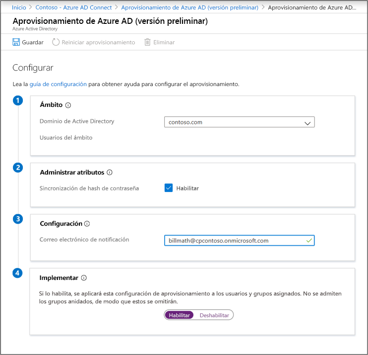
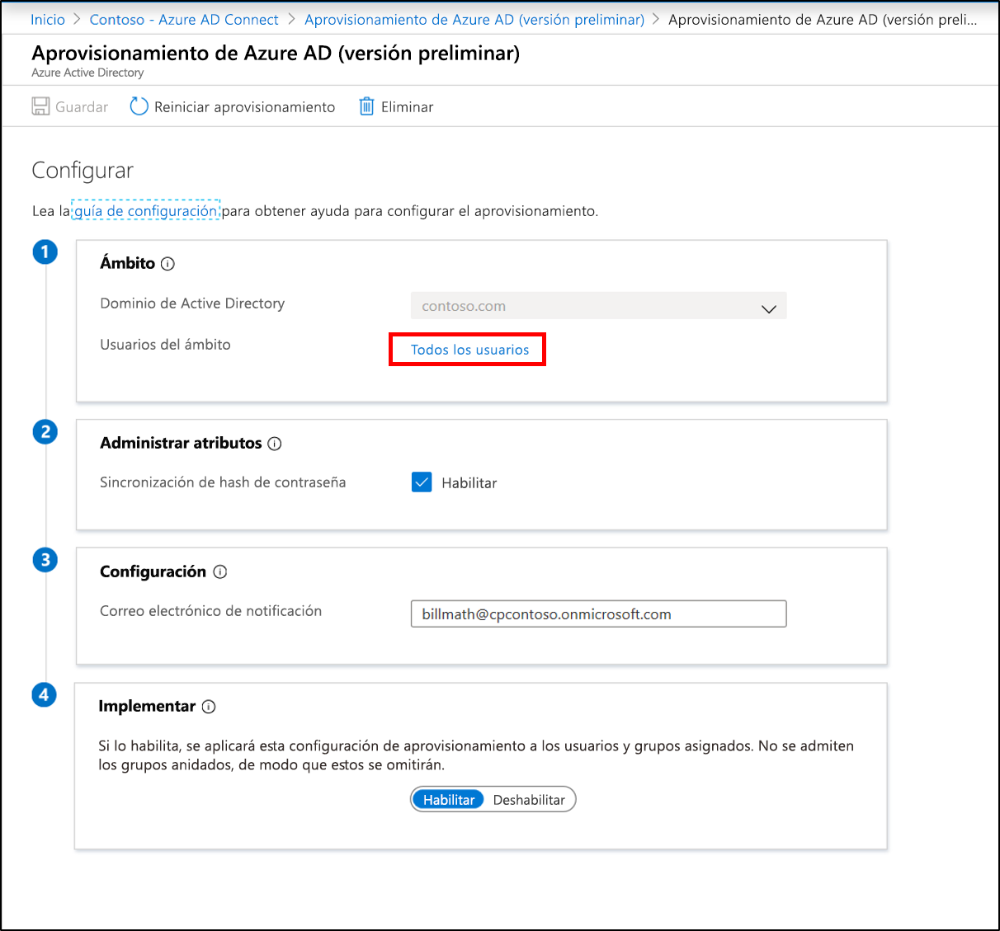

# Creación de una nueva configuración para el aprovisionamiento basado en la nube de Azure AD Connect

Una vez instalado el agente, debe iniciar sesión en Azure Portal y configurar el aprovisionamiento en la nube de Azure Active Directory (Azure AD) Connect. Siga los pasos que se indican a continuación para habilitar el agente.

## Configuración del aprovisionamiento
Para configurar el aprovisionamiento, siga estos pasos.

1.  En Azure Portal, seleccione **Azure Active Directory**.
1.  Seleccione **Azure AD Connect**.
1.  Seleccione **Administración del aprovisionamiento (versión preliminar)** .

    

1.  Seleccione **Nueva configuración**.
1.  En la pantalla de configuración, el dominio local se ha rellenado previamente.
1.  Escriba un **correo electrónico de notificación de alerta**. Este correo electrónico recibirá una notificación cuando el aprovisionamiento no sea correcto.
1.  Mueva el selector a **Habilitar** y seleccione **Guardar**.

    

## Especificación del ámbito de aprovisionamiento a usuarios y grupos específicos
Puede especificar el ámbito del agente para sincronizar usuarios y grupos específicos mediante el uso de grupos o unidades organizativas de Active Directory locales. No puede configurar grupos ni unidades organizativas dentro de una configuración. 

1.  En Azure Portal, seleccione **Azure Active Directory**.
1.  Seleccione **Azure AD Connect**.
1.  Seleccione **Administración del aprovisionamiento (versión preliminar)** .
1.  En **Configuración**, seleccione su configuración.

    

1.  En **Configurar**, seleccione **Todos los usuarios** para cambiar el ámbito de la regla de configuración.

    

1. A la derecha, puede cambiar el ámbito para incluir solo los grupos de seguridad. Escriba el nombre distintivo del grupo y seleccione **Agregar**.

    

1.  O bien, puede cambiar el ámbito para incluir solo unidades organizativas específicas. Seleccione **Listo** y **Guardar**.  
2.  Una vez cambiado el ámbito, debe [reiniciar el aprovisionamiento](#restart-provisioning) para iniciar una sincronización inmediata de los cambios.

    

## Reinicio del aprovisionamiento 
Si no desea esperar a la siguiente ejecución programada, desencadene la ejecución del aprovisionamiento mediante el botón **Reiniciar aprovisionamiento**. 
1.  En Azure Portal, seleccione **Azure Active Directory**.
1.  Seleccione **Azure AD Connect**.
1.  Seleccione **Administración del aprovisionamiento (versión preliminar)** .
1.  En **Configuración**, seleccione su configuración.

    

1.  En la parte superior, seleccione **Reiniciar aprovisionamiento**.

## Eliminación de una configuración
Para eliminar una configuración, siga estos pasos.

1.  En Azure Portal, seleccione **Azure Active Directory**.
1.  Seleccione **Azure AD Connect**.
1.  Seleccione **Administración del aprovisionamiento (versión preliminar)** .
1.  En **Configuración**, seleccione su configuración.

    

1.  En la parte superior de la pantalla de configuración, seleccione **Eliminar**.

    

>[!IMPORTANT]
>No se pide confirmación antes de eliminar una configuración. Asegúrese de que esta es la acción que desea realizar antes de seleccionar **Eliminar**.

## Pasos siguientes 

- [¿Qué es el aprovisionamiento?](what-is-provisioning.md)
- [¿Qué es el aprovisionamiento en la nube de Azure AD Connect?](what-is-cloud-provisioning.md)
