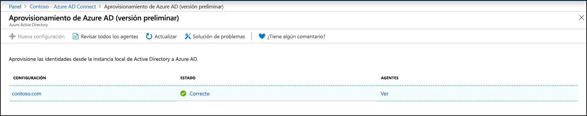
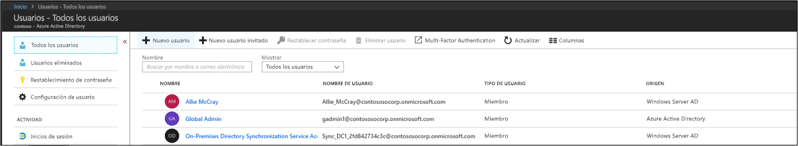
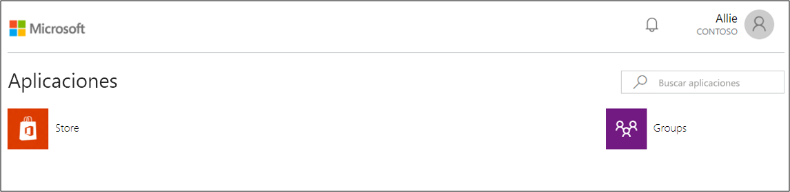

# Tutorial: Integración de un único bosque con un único inquilino de Azure AD

Este tutorial le guía en la creación de un entorno de identidad híbrida mediante el aprovisionamiento en la nube de Azure Active Directory (Azure AD) Connect.

El entorno que se crea en este tutorial se puede usar para realizar pruebas o para familiarizarse con el aprovisionamiento en la nube.

## Prerequisites
### En el Centro de administración de Azure Active Directory

1. Cree una cuenta de administrador global solo en la nube en el inquilino de Azure AD. De esta manera, puede administrar la configuración del inquilino en caso de que los servicios locales fallen o no estén disponibles. Información acerca de la [incorporación de una cuenta de administrador global que está solo en la nube](../active-directory-users-create-azure-portal.md). Realizar este paso es esencial para garantizar que no queda bloqueado fuera de su inquilino.
2. Agregue uno o varios [nombres de dominio personalizados](../active-directory-domains-add-azure-portal.md) al inquilino de Azure AD. Los usuarios pueden iniciar sesión con uno de estos nombres de dominio.

### En el entorno local

1. Identifique un servidor host unido a un dominio en el que se ejecuta Windows Server 2012 R2 o superior con un mínimo de 4 GB de RAM y un entorno de ejecución .NET 4.7.1 o posterior. 

2. Si hay un firewall entre los servidores y Azure AD, configure los elementos siguientes:
   - Asegúrese de que los agentes pueden realizar solicitudes *de salida* a Azure AD a través de los puertos siguientes:

     | Número de puerto | Cómo se usa |
     | --- | --- |
     | **80** | Descarga las listas de revocación de certificados (CRL) al validar el certificado SSL |
     | **443** | Controla toda la comunicación saliente con el servicio |
     | **8080** (opcional) | Si el puerto 443 no está disponible, los agentes notifican su estado cada 10 minutos en el puerto 8080. Este estado se muestra en el portal de Azure AD. |
     
     Si el firewall fuerza las reglas según los usuarios que las originan, abra estos puertos para el tráfico de servicios de Windows que se ejecutan como un servicio de red.
   - Si el firewall o proxy le permite especificar sufijos seguros, agregue conexiones a **\*.msappproxy.net** y **\*.servicebus.windows.net**. En caso contrario, permita el acceso a los [intervalos de direcciones IP del centro de datos de Azure](https://www.microsoft.com/download/details.aspx?id=41653), que se actualizan cada semana.
   - Los agentes necesitan acceder a **login.windows.net** y **login.microsoftonline.com** para el registro inicial. Abra el firewall también para esas direcciones URL.
   - Para la validación de certificados, desbloquee las siguientes direcciones URL: **mscrl.microsoft.com:80**, **crl.microsoft.com:80**, **ocsp.msocsp.com:80** y **www\.microsoft.com:80**. Como estas direcciones URL se utilizan para la validación de certificados con otros productos de Microsoft, es posible que estas direcciones URL ya estén desbloqueadas.

## Instalación del agente de aprovisionamiento de Azure AD Connect
1. Inicie sesión en el servidor unido al dominio.  Si usa el tutorial [Entorno básico de AD y Azure](tutorial-basic-ad-azure.md), sería DC1.
2. Inicie sesión en Azure Portal con credenciales de administrador global solo en la nube.
3. A la izquierda, seleccione **Azure Active Directory**, haga clic en **Azure AD Connect** y, en el centro, seleccione **Administrar aprovisionamiento (versión preliminar)** .

   

4. Haga clic en **Descargar agente**.
5. Ejecute el agente de aprovisionamiento de Azure AD Connect.
6. En la pantalla de presentación, **acepte** los términos de la licencia y haga clic en **Install** (Instalar).

   

7. Una vez que finalice esta operación, se iniciará el asistente para configuración.  Inicie sesión con su cuenta de administrador global de Azure AD.  Tenga en cuenta que si la seguridad de IE mejorada está habilitada, bloqueará el inicio de sesión.  En ese caso, cierre la instalación, deshabilite la seguridad mejorada de IE en Administrador del servidor y haga clic en el **AAD Connect Provisioning Agent Wizard** (Asistente para el agente de aprovisionamiento de AAD Connect) para reiniciar la instalación.
8. En la pantalla **Connect Active Directory** (Conectar Active Directory), haga clic en **Add directory** (Agregar directorio) e inicie sesión con su cuenta de administrador de dominio de Active Directory.  NOTA:  La cuenta de administrador de dominio no debe tener requisitos de cambio de contraseña. Si la contraseña expira o cambia, tendrá que volver a configurar el agente con las credenciales nuevas. Esta operación permitirá agregar su directorio local.  Haga clic en **Next**.

   

9. En la pantalla **Configuración completa**, haga clic en **Confirmar**.  Esta operación registrará el agente y lo reiniciará.

   

10. Una vez que se completa esta operación debería aparecer un aviso: **La configuración del agente se ha comprobado correctamente.**  Puede hacer clic en **Salir**. 
 
11. Si la pantalla de presentación inicial no desaparece, haga clic en **Cerrar**.

## Comprobación de la instalación del agente
La comprobación del agente se produce en Azure Portal y en el servidor local que ejecuta el agente.

### Comprobación del agente en Azure Portal
Para comprobar que Azure ve el agente, siga estos pasos:

1. Inicie sesión en Azure Portal.
2. A la izquierda, seleccione **Azure Active Directory**, haga clic en **Azure AD Connect** y, en el centro, seleccione **Administración del aprovisionamiento (versión preliminar)** . 
 

3.  En la pantalla **Aprovisionamiento de Azure AD (versión preliminar)** , haga clic en **Revisar todos los agentes**.
 
 
4. En la pantalla **On-premises provisioning agents** (Agentes de aprovisionamiento locales) verá los agentes que ha instalado.  Compruebe que el agente en cuestión está ahí y que se ha marcado como **Activo**.
 

### En el servidor local
Para comprobar que el agente se ejecuta, siga estos pasos:

1.  Inicie sesión en el servidor con una cuenta de administrador.
2.  Abra **Servicios**. Para ello, vaya ahí o a Inicio/Ejecutar/Services.msc.
3.  En **Servicios** asegúrese de que tanto el **Actualizador del Agente de Microsoft Azure AD Connect** como el **Agente de aprovisionamiento de Microsoft Azure AD Connect** están presentes y que su estado es **En ejecución**.

## Configuración del aprovisionamiento en la nube de Azure AD Connect
 Use los pasos siguientes para configurar el aprovisionamiento:

1.  Inicie sesión en Azure Portal.
2.  Haga clic en **Azure Active Directory**.
3.  Haga clic en **Azure AD Connect**.
4.  Seleccione **Administración del aprovisionamiento (versión preliminar)** 
.
5.  Haga clic en **Nueva configuración**
.
7.  En la pantalla de configuración, escriba un **correo electrónico de notificación**, mueva el selector a **Habilitar** y haga clic en **Guardar**.

1.  El estado de configuración ahora debería ser **Correcto**.

## Comprobación de la creación y sincronización de los usuarios
Ahora comprobaremos que los usuarios que tenía en el directorio local se han sincronizado y que ya existen en el inquilino de Azure AD.  Tenga en cuenta que esta acción puede tardar unas horas en completarse.  Para comprobar que los usuarios están sincronizados, haga lo siguiente:

1. Vaya a [Azure Portal](https://portal.azure.com) e inicie sesión con una cuenta que tenga una suscripción de Azure.
2. En la parte izquierda, seleccione **Azure Active Directory**.
3. En **Administrar**, seleccione **Usuarios**.
4. Compruebe que ve los usuarios nuevos en nuestro inquilino. 
 

## Prueba del inicio de sesión con uno de nuestros usuarios

1. Vaya a [https://myapps.microsoft.com](https://myapps.microsoft.com).
2. Inicie sesión con la cuenta de usuario que se creó en nuestro nuevo inquilino.  Deberá iniciar sesión mediante el formato siguiente: (user@domain.onmicrosoft.com). Use la misma contraseña que el usuario utiliza para iniciar sesión en el entorno local. 
    

Ahora tiene configurado correctamente un entorno de identidad híbrida que puede usar para probar y familiarizarse con lo que le ofrece Azure.

## Pasos siguientes 

- [¿Qué es el aprovisionamiento?](what-is-provisioning.md)
- [¿Qué es el aprovisionamiento en la nube de Azure AD Connect?](what-is-cloud-provisioning.md)
