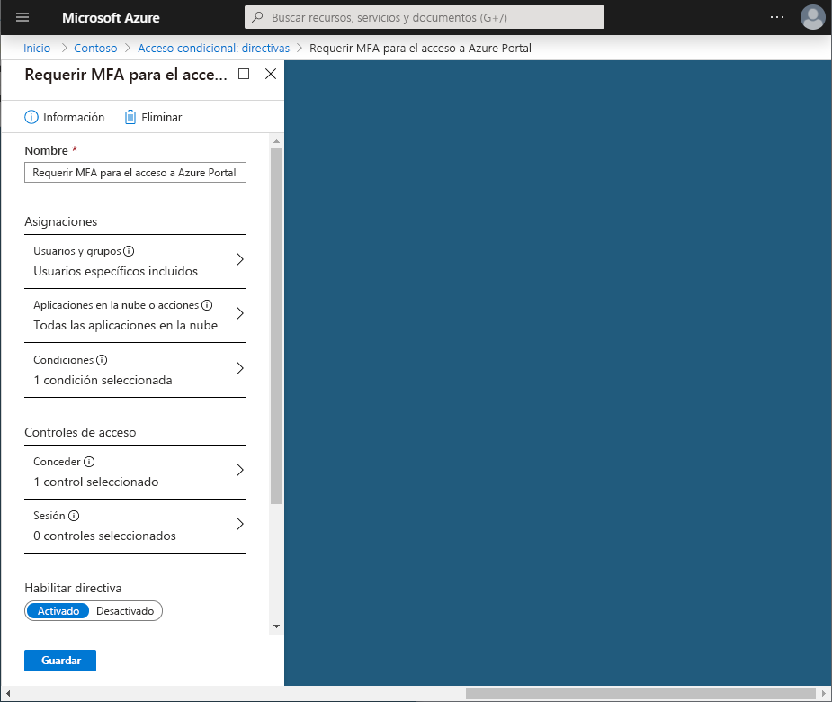
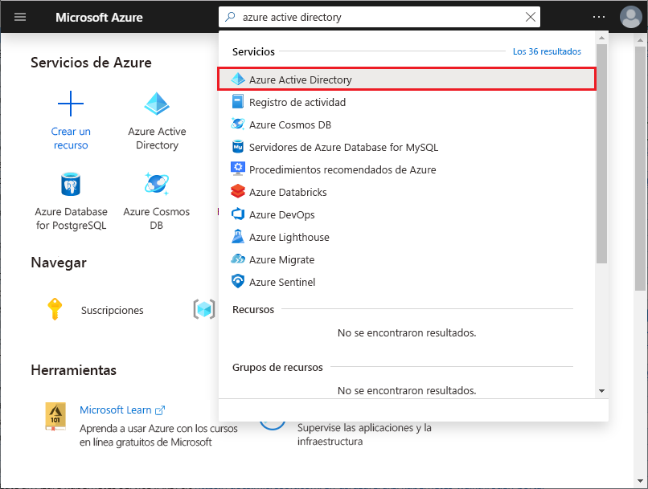

# Inicio rápido: Exigir MFA para aplicaciones específicas con acceso condicional de Azure Active Directory

Para simplificar la experiencia de inicio de sesión de los usuarios, puede permitirles iniciar sesión en sus aplicaciones en la nube mediante un nombre de usuario y una contraseña. Sin embargo, muchos entornos tienen al menos algunas aplicaciones para las que es preferible requerir una forma más segura para verificar la cuenta, como la autenticación multifactor (MFA). Esta directiva podría aplicarse para el acceso a las aplicaciones de recursos humanos o al sistema de correo electrónico de su organización. En Azure Active Directory (Azure AD), puede lograr este objetivo con una directiva de acceso condicional.

En este inicio rápido se muestra cómo configurar una [directiva de acceso condicional de Azure AD](../active-directory-conditional-access-azure-portal.md) que exija la autenticación multifactor para una aplicación en la nube específica de su entorno.

Si no tiene una suscripción a Azure, cree una [cuenta gratuita](https://azure.microsoft.com/free/?WT.mc_id=A261C142F) antes de empezar.

## Requisitos previos

Para completar el escenario en este inicio rápido, necesita:

- **Acceso a una edición de Azure AD Premium**: el acceso condicional de Azure AD es una funcionalidad de Azure AD Premium.
- **Una cuenta de prueba denominada Isabella Simonsen**: si no sabe cómo crear una cuenta de prueba, consulte [Agregar usuarios basados en la nube](../fundamentals/add-users-azure-active-directory.md#add-a-new-user).

El escenario descrito en este inicio rápido requiere que la MFA de cada usuario no esté habilitada para la cuenta de prueba. Para obtener más información, consulte [Exigencia de verificación en dos pasos para un usuario](../authentication/howto-mfa-userstates.md).

## Pruebe su experiencia

El objetivo de este paso es obtener una impresión de la experiencia sin una directiva de acceso condicional.

**Para inicializar el entorno:**

1. Inicie sesión en Azure Portal como Isabella Simonsen.
1. Cierre la sesión.

## Creación de la directiva de acceso condicional

En esta sección se muestra cómo crear la directiva de acceso condicional necesaria. En el escenario de esta guía de inicio rápido se usa:

- Azure Portal como marcador de posición para una aplicación en la nube que requiere MFA. 
- El usuario de ejemplo para probar la directiva de acceso condicional.  

En la directiva, establezca:

| Configuración | Valor |
| --- | --- |
| Usuarios y grupos | Isabella Simonsen |
| Aplicaciones de nube | Microsoft Azure Management (Administración de Microsoft Azure) |
| Conceder acceso | Requerir autenticación multifactor |

**Para configurar la directiva de acceso condicional:**

1. Inicie sesión en [Azure Portal](https://portal.azure.com) como administrador global, administrador de seguridad o administrador de acceso condicional.
1. En Azure Portal, busque y seleccione **Azure Active Directory**.

   

1. En la página **Azure Active Directory**, en la sección **Seguridad**, haga clic en **Acceso condicional**.

   

1. En la página **Acceso condicional**, en la barra de herramientas de la parte superior, haga clic en **Nueva directiva**.

   

1. En la página **Nuevo**, en el cuadro de texto **Nombre**, escriba **Requerir MFA para obtener acceso a Azure Portal**.

   

1. En la sección **Asignación**, haga clic en **Usuarios y grupos**.

   

1. En la página **Usuarios y grupos**, siga estos pasos:

   

   1. Haga clic en **Seleccionar usuarios y grupos** y, luego, seleccione **Usuarios y grupos**.
   1. Haga clic en **Seleccionar**.
   1. En la página **Seleccionar**, seleccione **Isabella Simonsen** y, luego, haga clic en **Seleccionar**.
   1. En la página **Usuarios y grupos**, haga clic en **Listo**.

1. Haga clic en **Aplicaciones en la nube**.

   

1. En la página **Aplicaciones en la nube**, siga estos pasos:

   

   1. Haga clic en **Seleccionar aplicaciones**.
   1. Haga clic en **Seleccionar**.
   1. En la página **Seleccionar**, seleccione **Microsoft Azure Management** (Administración de Microsoft Azure) y, luego, haga clic en **Seleccionar**.
   1. En la página **Aplicaciones en la nube**, haga clic en **Listo**.

1. En la sección **Controles de acceso**, haga clic en **Conceder**.

   

1. En la página **Conceder**, siga estos pasos:

   

   1. Seleccione **Conceder acceso**.
   1. Seleccione **Requerir autenticación multifactor**.
   1. Haga clic en **Seleccionar**.

1. En la sección **Habilitar directiva**, haga clic en **Activar**.

   

1. Haga clic en **Create**(Crear).

## Evaluación de un inicio de sesión simulado

Ahora que ha configurado la directiva de acceso condicional, probablemente quiera saber si funciona según lo previsto. Como primer paso, use la herramienta de directivas What If de acceso condicional para simular un inicio de sesión del usuario de prueba. La simulación calcula el impacto que tiene este inicio de sesión en las directivas y genera un informe de simulación.  

Para inicializar la herramienta de evaluación de directivas **What If**, establezca:

- **Isabella Simonsen** como usuario
- **Microsoft Azure Management** (Administración de Microsoft Azure) como aplicación en la nube

Al hacer clic en **What If**, se crea un informe de simulación que muestra:

- **Requerir MFA para obtener acceso a Azure Portal** en **Directivas que se aplicarán**
- **Requerir autenticación multifactor** para **Conceder controles**.

**Para evaluar la directiva de acceso condicional:**

1. En la página [Acceso condicional - Directivas](https://portal.azure.com/#blade/Microsoft_AAD_IAM/ConditionalAccessBlade/Policies), en el menú de la parte superior, haga clic en **What If**.  

   

1. Haga clic en **Usuarios**, seleccione **Isabella Simonsen** y, luego, haga clic en **Seleccionar**.

   

1. Para seleccionar una aplicación en la nube, siga los pasos siguientes:

   

   1. Haga clic en **Aplicaciones en la nube**.
   1. En la **página Aplicaciones en la nube**, haga clic en **Seleccionar aplicaciones**.
   1. Haga clic en **Seleccionar**.
   1. En la página **Seleccionar**, seleccione **Microsoft Azure Management** (Administración de Microsoft Azure) y, luego, haga clic en **Seleccionar**.
   1. En la página Aplicaciones en la nube, haga clic en **Listo**.

1. Haga clic en **What If**.

## Prueba de la directiva de acceso condicional

En la sección anterior, ha aprendido a evaluar un inicio de sesión simulado. Además de una simulación, también debe probar la directiva de acceso condicional para asegurarse de que funciona según lo previsto.

Para probar la directiva, intente iniciar sesión en [Azure Portal](https://portal.azure.com) con su cuenta de prueba **Isabella Simonsen**. Verá un cuadro de diálogo que le pide que configure su cuenta para la comprobación adicional de la seguridad.

## Limpieza de recursos

Cuando ya no sean necesarios, elimine el usuario de prueba y la directiva de acceso condicional:

- Si no sabe cómo eliminar un usuario de Azure AD, consulte [Eliminación de usuarios desde Azure AD](../fundamentals/add-users-azure-active-directory.md#delete-a-user).
- Para eliminar la directiva, selecciónela y, a continuación, haga clic en **Eliminar** en la barra de herramientas de acceso rápido.

    

## Pasos siguientes

> [!div class="nextstepaction"]
> [Solicitar la aceptación de las condiciones de uso](require-tou.md)
> [Bloquear el acceso si se detecta un riesgo para la sesión](app-sign-in-risk.md)
