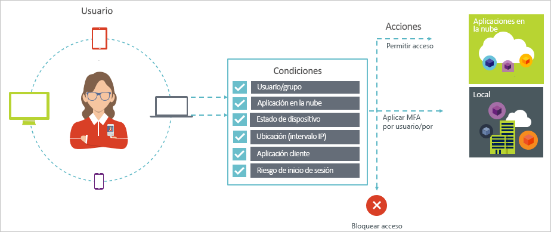
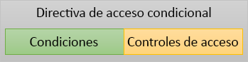

# ¿Qué es el acceso condicional?

La seguridad es una preocupación importante para las organizaciones que usan la nube. Un aspecto clave de la seguridad en la nube es la identidad y el acceso en lo referente a administrar los recursos de nube. En un mundo que da prioridad a los dispositivos móviles y la nube, los usuarios pueden acceder a los recursos de su organización mediante diversos dispositivos y aplicaciones desde cualquier parte. Como consecuencia de ello, ya no es suficiente con centrarse en quién puede acceder a un recurso. Para dominar el equilibrio entre seguridad y productividad, también debe incluir en la decisión sobre el control de acceso el modo en que se accede a los recursos. Con el acceso condicional de Azure Active Directory (Azure AD), puede abordar este requisito. El acceso condicional es una funcionalidad de Azure Active Directory. Con él, puede implementar decisiones de control de acceso automatizadas para acceder a las aplicaciones en la nube según unas condiciones.

Las directivas de acceso condicional se aplican una vez que se completa la autenticación en una fase. Por lo tanto, el acceso condicional no está pensado como primera línea de defensa en escenarios de tipo ataques por denegación de servicio (DoS), pero puede usar indicios de estos eventos (por ejemplo, el nivel de riesgo de inicio de sesión, la ubicación de la solicitud, etc.) para determinar el acceso.  

En este artículo se proporciona una introducción a los conceptos del acceso condicional en Azure AD.

## Escenarios comunes

En un mundo Mobile First, Cloud First, Azure Active Directory permite el inicio de sesión único en dispositivos, aplicaciones y servicios desde cualquier parte. Con la proliferación de dispositivos (incluidos BYOD), el trabajo fuera de las redes corporativas y las aplicaciones SaaS de terceros se enfrenta a dos objetivos opuestos:

- Capacitar a los usuarios para ser productivos donde sea y cuando sea.
- Proteger los activos corporativos en todo momento.

Mediante las directivas de acceso condicional, puede aplicar los controles de acceso adecuados en las condiciones necesarias. El acceso condicional de Azure AD proporciona seguridad adicional cuando es necesario y no se cruza en el camino de los usuarios cuando no lo es.

A continuación se muestran algunos problemas de acceso comunes con los que puede ayudarle el acceso condicional:

- **[Riesgo de inicio de sesión](conditions.md#sign-in-risk)** : Azure AD Identity Protection detecta riesgos de inicio de sesión. ¿Cómo se restringe el acceso si un riesgo de inicio de sesión detectado indica un actor incorrecto? ¿Qué ocurre si desea obtener una evidencia más sólida de que un inicio de sesión fue realizado por un usuario legítimo? ¿Qué ocurre si la duda tiene el peso suficiente como para incluso bloquear el acceso a una aplicación a usuarios específicos?  
- **[Ubicación de red](location-condition.md)** : Azure AD es accesible desde cualquier lugar. ¿Y si se realiza un intento de acceso desde una ubicación de red que no se encuentra bajo el control de su departamento de TI? Una combinación de nombre de usuario y contraseña podría ser suficiente como prueba de identidad para los intentos de acceso desde la red corporativa. ¿Y si demanda una prueba de identidad más sólida para los intentos de acceso que se inician desde otros países o regiones inesperadas del mundo? ¿Y si quisiera bloquear incluso los intentos de acceso desde determinadas ubicaciones?  
- **[Administración de dispositivos](conditions.md#device-platforms)** : En Azure AD, los usuarios pueden acceder a las aplicaciones en la nube desde una amplia variedad de dispositivos, como dispositivos móviles y personales. ¿Y si demanda que el intento de acceso solo debería realizarse con dispositivos que administra su departamento de TI? ¿Y si quisiera impedir incluso el acceso de determinados tipos de dispositivos en las aplicaciones en la nube de su entorno?
- **[Aplicación cliente](conditions.md#client-apps)** : En la actualidad, se puede acceder a muchas aplicaciones en la nube mediante diferentes tipos de aplicaciones, como aplicaciones web, aplicaciones móviles o aplicaciones de escritorio. ¿Y si un intento de acceso se realiza mediante un tipo de aplicación cliente que provoca problemas conocidos? ¿Y si un dispositivo que administra el departamento de TI lo necesita para determinados tipos de aplicaciones?

Estas preguntas y sus respuestas relacionadas representan escenarios de acceso comunes en el acceso condicional de Azure AD.
El acceso condicional es una funcionalidad de Azure Active Directory que le permite administrar escenarios de acceso mediante un enfoque basado en directivas.

> [!VIDEO https://www.youtube.com/embed/eLAYBwjCGoA]

## Directivas de acceso condicional

Una directiva de acceso condicional es la definición de un escenario de acceso usando el siguiente patrón:

**Cuando esto suceda** define la razón para la que se desencadena la directiva. Esta razón se caracteriza por un grupo de condiciones que se han cumplido. En el acceso condicional de Azure AD, las dos condiciones de asignación desempeñan un papel especial:

- **[Usuarios](conditions.md#users-and-groups)** : Los usuarios que realizan un intento de acceso (**Quién**).
- **[Aplicaciones en la nube](conditions.md#cloud-apps-and-actions)** : Los destinos de un intento de acceso (**Qué**).

Ambas condiciones son obligatorias en una directiva de acceso condicional. Además de las dos condiciones obligatorias, también puede incluir condiciones adicionales que describan cómo se lleva a cabo el intento de acceso. Por ejemplo, usar dispositivos móviles o desde ubicaciones que se encuentran fuera de la red corporativa. Para más información, consulte [¿Qué son las condiciones en el acceso condicional de Azure Active Directory?](conditions.md)

La combinación de condiciones con controles de acceso representa una directiva de acceso condicional.

Con el acceso condicional de Azure AD, puede controlar el modo en que los usuarios autorizados acceden a las aplicaciones en la nube. El objetivo de una directiva de acceso condicional es aplicar controles de acceso adicionales sobre los intentos de acceso a las aplicaciones en la nube, en función de cómo se realizan estos.

Un enfoque basado en directivas para proteger el acceso a las aplicaciones en la nube le permite empezar a bosquejar los requisitos de directivas en su entorno mediante la estructura que se describe en este artículo sin preocuparse por la implementación técnica.

## Acceso condicional de Azure AD y autenticación federada

Las directivas de acceso condicional funcionan perfectamente con la [autenticación federada](../../security/fundamentals/choose-ad-authn.md#federated-authentication). Esta compatibilidad incluye todas las condiciones y controles admitidos, y visibilidad de cómo se aplica la directiva a los inicios de sesión de usuario activos mediante las [notificaciones de Azure AD](../reports-monitoring/concept-sign-ins.md).

*Autenticación federada con Azure AD* significa que un servicio de autenticación de confianza controla la autenticación del usuario en Azure AD. Un servicio de autenticación de confianza como, por ejemplo, los Servicios de federación de Active Directory (AD FS), o cualquier otro servicio de federación. En esta configuración, la autenticación del usuario principal se realiza en el servicio y, después, se usa Azure AD para iniciar sesión en las aplicaciones individuales. El acceso condicional de Azure AD se aplica antes de conceder acceso a la aplicación al usuario que desea acceder. 

Cuando la directiva de acceso condicional configurada requiere autenticación multifactor, Azure AD usa de forma predeterminada Azure MFA. Si usa el servicio de federación para MFA, puede configurar Azure AD para que redirija al servicio de federación cuando se necesite MFA estableciendo `-SupportsMFA` en `$true` en [PowerShell](https://docs.microsoft.com/powershell/module/msonline/set-msoldomainfederationsettings). Esta configuración funciona con los servicios de autenticación federada que admiten la solicitud de desafío de MFA emitida por Azure AD mediante `wauth= http://schemas.microsoft.com/claims/multipleauthn`.

Una vez que el usuario ha iniciado sesión en el servicio de autenticación federada, Azure AD administra los demás requisitos de directiva como el cumplimiento del dispositivo o una aplicación aprobada.

## Requisitos de licencia

[!INCLUDE [Active Directory P1 license](../../../includes/active-directory-p1-license.md)]

Los clientes con [licencias de Microsoft 365 Empresa](https://docs.microsoft.com/office365/servicedescriptions/microsoft-365-service-descriptions/microsoft-365-business-service-description) también tienen acceso a características de acceso condicional. 

## Pasos siguientes

Para saber cómo implementar el acceso condicional en su entorno, consulte [Planeamiento de la implementación del acceso condicional en Azure Active Directory](plan-conditional-access.md).
