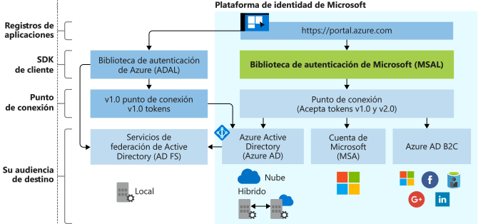

# Evolución de la Plataforma de identidad de Microsoft

Plataforma de identidad de Microsoft es una evolución de la plataforma para desarrolladores de Azure Active Directory (Azure AD). Permite que los desarrolladores compilen aplicaciones que inician sesión de usuarios, obtienen tokens para llamar a API como Microsoft Graph o a API que los desarrolladores hayan creado. Consiste en un servicio de autenticación, bibliotecas de código abierto, registro y configuración de aplicaciones (a través de un portal para desarrolladores y una API de aplicación), documentación completa para desarrolladores, ejemplos de inicio rápido, ejemplos de código, tutoriales, guías paso a paso y otros contenidos para desarrolladores. La plataforma de identidad de Microsoft admite los protocolos estándar del sector como OAuth 2.0 y OpenID Connect.

Hasta ahora, la mayoría de los desarrolladores han trabajado con la plataforma de Azure AD v1.0 para autenticar las cuentas profesionales y educativas (aprovisionadas por Azure AD) solicitando tokens desde el punto de conexión de Azure AD v1.0, mediante la Biblioteca de autenticación de Azure AD (ADAL), Azure Portal para el registro y configuración de aplicaciones y Azure AD Graph API para la configuración de aplicaciones mediante programación.

Con la Plataforma de identidad de Microsoft (versión 2.0) unificada, puede escribir código una vez y autenticar cualquier identidad de Microsoft en la aplicación. Si hay varias plataformas, se recomienda usar la Biblioteca de autenticación de Microsoft (MSAL) de código abierto, que es totalmente compatible, con los puntos de conexión de la plataforma de identidad. MSAL es fácil de usar, ofrece experiencias increíbles de inicio de sesión único (SSO) para los usuarios, lo ayuda a alcanzar una alta confiabilidad y rendimiento y se desarrolla con el Ciclo de vida de desarrollo de seguridad (SDL) de Microsoft. Al llamar a las API, puede configurar la aplicación para que use el consentimiento incremental, lo que permite retrasar la solicitud de consentimiento para ámbitos más invasivos hasta que el uso de la aplicación lo garantice en el entorno de ejecución.  MSAL también es compatible con Azure Active Directory B2C, por lo que los clientes usan las identidades de la cuenta de redes sociales, corporativa o local que prefieran para obtener el acceso mediante inicio de sesión único a sus aplicaciones y API.

Con la Plataforma de identidad de Microsoft, aumente el acceso a estos tipos de usuarios:

- Cuentas profesionales y educativas (cuentas aprovisionadas por Azure AD).
- Cuentas personales (como Outlook.com o Hotmail.com)
- Los clientes que traen su propio correo electrónico o identidad en redes sociales (como LinkedIn, Facebook, Google) mediante MSAL y Azure AD B2C

Puede usar Azure Portal para registrar y configurar la aplicación, además de usar Microsoft Graph API para la configuración de aplicaciones mediante programación.

Actualice la aplicación a su propio ritmo. Las aplicaciones compiladas con bibliotecas ADAL siguen siendo compatibles. También se admiten carteras de aplicaciones mixtas, que constan de aplicaciones compiladas con bibliotecas ADAL y aplicaciones compiladas con bibliotecas SMAL. Esto significa que las aplicaciones que usan las bibliotecas ADAL y MSAL más recientes entregarán SSO en toda la cartera, proporcionado por la caché de tokens compartidos entre estas dos bibliotecas. Las aplicaciones actualizadas de ADAL a MSAL mantendrán el estado de inicio de sesión del usuario después de la actualización.

## Experiencia de la plataforma de identidad de Microsoft

En el siguiente diagrama se muestra la experiencia de identidad de Microsoft en un alto nivel, incluida la experiencia de registro de aplicaciones, los SDK, los puntos de conexión y las identidades compatibles.

### Experiencia de registro de aplicación

La experiencia de **[Registros de aplicaciones](https://go.microsoft.com/fwlink/?linkid=2083908)** de Azure Portal es la única experiencia de portal para administrar todas las aplicaciones que integró con la Plataforma de identidad de Microsoft. Si ha usado el portal de registro de aplicación, empiece a usar la experiencia de registro de aplicación de Azure Portal en su lugar.

Para la integración con Azure AD B2C (al autenticar identidades sociales o locales), deberá registrar la aplicación en un inquilino de Azure AD B2C. Esta experiencia también forma parte de Azure Portal.

La **API de aplicación en Microsoft Graph** actualmente está en versión preliminar. Use esta API para configurar mediante programación las aplicaciones integradas con la Plataforma de identidad de Microsoft y autenticar cualquier identidad de Microsoft. Sin embargo, hasta que esta API alcance la disponibilidad general, deberá usar Azure AD Graph 1.6 API y el manifiesto de aplicación.

### Bibliotecas MSAL

Puede usar la biblioteca MSAL para compilar aplicaciones que autentiquen todas las identidades de Microsoft. Las bibliotecas MSAL en .NET y JavaScript están disponibles con carácter general. Las bibliotecas MSAL para iOS y Android están en versión preliminar y se pueden usar en un entorno de producción. Se proporciona la misma compatibilidad en el nivel de producción para las bibliotecas MSAL en versión preliminar que se proporciona para las versiones de MSAL y ADAL que están disponibles con carácter general.

También puede usar las bibliotecas MSAL para integrar la aplicación con Azure AD B2C.

Las bibliotecas del lado servidor para compilar aplicaciones web y API web están disponibles con carácter general: [ASP.NET](https://docs.microsoft.com/aspnet/overview) y [ASP.NET Core](https://docs.microsoft.com/aspnet/core/?view=aspnetcore-2.2)

### Punto de conexión de la plataforma de identidad de Microsoft

El punto de conexión de la Plataforma de identidad de Microsoft (v2.0) ahora está certificado por OIDC. Funciona con las bibliotecas de autenticación de Microsoft (MSAL) o cualquier otra biblioteca que cumpla con los estándares. Implementa los ámbitos legibles por el ser humano, según lo estipulado en los estándares del sector.

## Pasos siguientes

Obtenga más información acerca de v1.0 y v2.0.

* [Acerca de la versión 2.0](v2-overview.md)
* [Azure Active Directory for developers (v1.0) overview](../azuread-dev/v1-overview.md) (Información general sobre Azure Active Directory para desarrolladores [v1.0])
