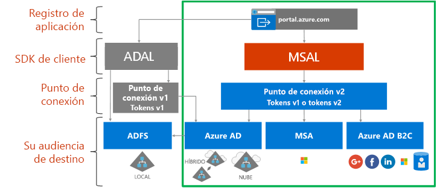

# Acerca de la plataforma de identidad de Microsoft

La plataforma de identidad de Microsoft es una evolución de la plataforma de desarrolladores y de servicio de identidad de Azure Active Directory (Azure AD). Permite a los desarrolladores crear aplicaciones que inicien sesión en todas las identidades de Microsoft, obtener tokens para llamar a Microsoft Graph, otras API de Microsoft o API que los desarrolladores hayan creado. Es una plataforma completa que consiste en un servicio de autenticación, bibliotecas de código abierto, registro y configuración de aplicaciones (a través de un portal de desarrolladores y una API de aplicación), documentación completa para desarrolladores, muestras de código y otros contenidos para desarrolladores. La plataforma de identidad de Microsoft admite los protocolos estándar del sector, como OAuth 2.0 y OpenID Connect.

Hasta ahora, la mayoría de los desarrolladores han trabajado con la plataforma de Azure AD v1.0 para autenticar las identidades de Azure AD (cuentas profesionales o educativas) solicitando tokens desde el punto de conexión de Azure AD v1.0, mediante la Biblioteca de autenticación de Azure AD (ADAL), Azure Portal para el registro y configuración de aplicaciones y Azure AD Graph API para la configuración de aplicaciones mediante programación. La plataforma de Azure AD v1.0 es una oferta de plataforma avanzada que seguirá funcionando para las aplicaciones empresariales.

Para expandir y hacer evolucionar las funcionalidades de la plataforma de identidad de Microsoft, ahora puede autenticar un conjunto más amplio de identidades de Microsoft (identidades de Azure AD, cuentas de Microsoft [como outlook.com y hotmail.com] y cuentas locales y sociales a través de Azure AD B2C) a través de lo que se conocía como punto de conexión de Azure AD v2.0. En este caso, usará la biblioteca de autenticación de Microsoft (MSAL) o cualquier biblioteca de código abierto OAuth 2.0 u OpenID Connect, Azure Portal para el registro y la configuración de aplicaciones y Microsoft Graph API para la configuración de aplicaciones mediante programación. La plataforma de identidad actualizada de Microsoft (en particular, las bibliotecas MSAL y la experiencia de registro de aplicaciones de Azure Portal más reciente) ha evolucionado significativamente durante el último año. Para finalizar esta versión, animamos a los desarrolladores a desarrollar y probar sus aplicaciones mediante la plataforma de identidad de Microsoft más reciente.

Las aplicaciones que usan las bibliotecas ADAL y la MSAL más recientes realizarán un inicio de sesión único entre sí. Las aplicaciones actualizadas de ADAL a MSAL mantendrán el estado de inicio de sesión del usuario. Los desarrolladores pueden elegir actualizar sus aplicaciones a MSAL según lo consideren oportuno, mientras que las aplicaciones compiladas con ADAL seguirá funcionando y siendo compatibles.

## Experiencia de la plataforma de identidad de Microsoft

En el siguiente diagrama se muestra la experiencia de identidad de Microsoft en un alto nivel, incluida la experiencia de registro de aplicaciones, los SDK, los puntos de conexión y las identidades compatibles.

La plataforma de identidad de Microsoft tiene dos puntos de conexión (v1.0 y v2.0) y dos conjuntos de bibliotecas de cliente para controlarlos. Al desarrollar una nueva aplicación, tenga en cuenta las ventajas y el estado actual de los puntos de conexión y las bibliotecas de autenticación. También debe tener en cuenta los siguientes aspectos:

* Plataformas compatibles

    * [ADAL](active-directory-authentication-libraries.md) es compatible con .NET, JavaScript, iOS, Android, Java y Python.
    * [Versión preliminar de MSAL](reference-v2-libraries.md) es compatible con .NET, JavaScript, iOS y Android.
    * Ambos puntos de conexión son compatibles con middleware de servidor Node.js y .NET para proteger las API y el inicio de sesión. 

* La mayor parte de la innovación, como el consentimiento dinámico y el consentimiento incremental, se produce en el punto de conexión v2.0 y MSAL, mientras que v1.0 y ADAL siguen siendo compatibles.

    En Azure Portal, anteriormente tenía que identificar estáticamente todos los ámbitos que necesitaba la aplicación. Con el punto de conexión v2.0 y los portales asociados a este, puede definir estáticamente los ámbitos igual que antes o bien solicitarlos dinámicamente según la aplicación necesite el permiso. El modo dinámico proporciona un consentimiento incremental y una funcionalidad más opcional. El consentimiento incremental le permite solicitar un subconjunto de ámbitos que necesita cuando un usuario se autentica por primera vez, así como solicitar ámbitos adicionales cuando sean necesarios. 
    
    Por ejemplo, cuando se usa una aplicación de cámara en un dispositivo móvil, se pregunta al usuario si permite que la aplicación acceda a la cámara y, solo después de que este haya dado su consentimiento, la aplicación podrá acceder a la cámara y hacer una foto.  Cuando la aplicación está lista para guardar la foto nueva, puede solicitar permiso de lectura o escritura de fotos. 

* Posibles cambios importantes

    MSAL es adecuado para usar en un entorno de producción. Se ofrece el mismo soporte técnico de nivel de producción para MSAL que para nuestras bibliotecas de producción actuales. Durante el período de versión preliminar pueden realizarse cambios en la API, en el formato de la memoria caché interna y en otros mecanismos de esta biblioteca, los cuales deberá aceptar junto con correcciones de errores o mejoras de las características. Esto puede afectar a la aplicación. Por ejemplo, un cambio al formato de la memoria caché puede afectar a sus usuarios, como, por ejemplo, exigirles que vuelva a iniciar sesión. Un cambio a la API puede requerir que actualice el código. Cuando se ofrezca la versión de disponibilidad general (GA), deberá actualizar a esta versión en los seis meses siguientes, ya que es posible que las aplicaciones escritas con una versión preliminar de la biblioteca dejen de funcionar.

## Pasos siguientes

Obtenga más información acerca de v1.0 y v2.0.

* [Acerca de v1.0](v1-overview.md)
* [Acerca de v2.0](v2-overview.md)
