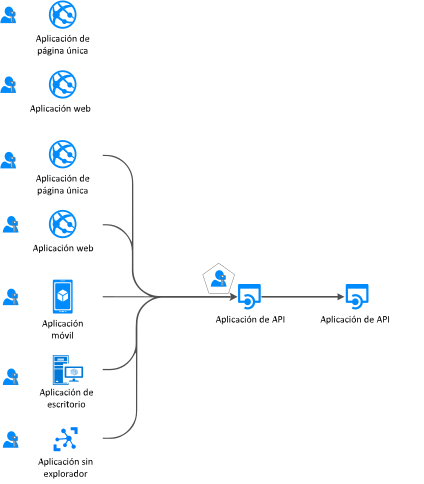
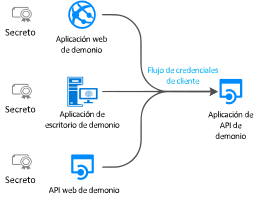
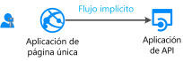
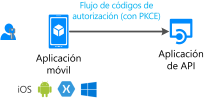

# Flujos de autenticación y escenarios de aplicaciones

El punto de conexión de la plataforma de identidad de Microsoft (v 2.0) admite la autenticación para diferentes tipos de arquitecturas de aplicación modernas. Todas ellas se basan en los protocolos estándar del sector [OAuth 2.0 y OpenID Connect](active-directory-v2-protocols.md).  Con las [bibliotecas de autenticación](reference-v2-libraries.md), las aplicaciones autentican las identidades y adquieren tokens para obtener acceso a las API protegidas.

En este artículo se describen los diferentes flujos de autenticación y los escenarios de aplicaciones en los que se usan. También se proporcionan listas de:
- [Escenarios y flujos de autenticación compatibles con la aplicación](#scenarios-and-supported-authentication-flows).
- [Escenarios, plataformas y lenguajes compatibles con la aplicación](#scenarios-and-supported-platforms-and-languages).

## Categorías de aplicaciones

Los tokens se pueden adquirir a partir de varios tipos de aplicaciones, entre las que se incluyen:

- Aplicaciones web
- Aplicaciones móviles
- Aplicaciones de escritorio
- API web

También se pueden adquirir de aplicaciones que se ejecutan en dispositivos sin explorador o que se ejecutan en IoT.

Las aplicaciones se pueden clasificar como en la lista siguiente:

- [Recursos protegidos frente a aplicaciones cliente](#protected-resources-vs-client-applications): algunos escenarios están relacionados con la protección de recursos, como las aplicaciones web o las API web. En cambio, otros, con la adquisición de un token de seguridad para llamar a una API web protegida.
- [Con usuarios o sin usuarios](#with-users-or-without-users): algunos escenarios implican un usuario que ha iniciado sesión, mientras que otros (como los escenarios de demonio) no implican ninguno.
- [Aplicaciones cliente públicas y confidenciales, de página única](#single-page-public-client-and-confidential-client-applications): Son tres grandes categorías de tipos de aplicaciones. Cada se usa con diferentes bibliotecas y objetos.
- [Públicos de inicio de sesión](v2-supported-account-types.md#certain-authentication-flows-dont-support-all-the-account-types): los flujos de autenticación disponibles difieren en función de la audiencia de inicio de sesión. Algunos flujos solo están disponibles para las cuentas profesionales o educativas. Y otros, para las cuentas tanto profesionales como educativas, así como para las cuentas Microsoft personales. El público permitido depende de los flujos de autenticación.
- [Flujos de OAuth 2.0 admitidos](#scenarios-and-supported-authentication-flows):  los flujos de autenticación se usan para implementar los escenarios de aplicaciones que solicitan tokens. No hay ninguna asignación individual entre los escenarios de aplicaciones y los flujos de autenticación.
- [Plataformas compatibles](#scenarios-and-supported-platforms-and-languages): No todos los escenarios de aplicaciones están disponibles para todas las plataformas.

### Recursos protegidos frente a aplicaciones cliente

Los escenarios de autenticación implican dos actividades:

- **Adquisición de tokens de seguridad para una API web protegida**: Microsoft recomienda el uso de [bibliotecas de autenticación](reference-v2-libraries.md#microsoft-supported-client-libraries) para adquirir tokens; en concreto, la familia de bibliotecas de autenticación de Microsoft (MSAL).
- **Protección de una API web o una aplicación web**: un desafío de la protección de una API web o un recurso de aplicación web es validar el token de seguridad. En algunas plataformas, Microsoft ofrece [bibliotecas de middleware](reference-v2-libraries.md#microsoft-supported-server-middleware-libraries).

### Con usuarios o sin usuarios

La mayoría de los escenarios de autenticación adquieren tokens en nombre de un usuario con la sesión iniciada.

Sin embargo, también hay escenarios de aplicaciones de demonio en los que las aplicaciones adquieren tokens en nombre de sí mismos, sin usuario.

### Aplicaciones cliente públicas y confidenciales, de página única

Los tokens de seguridad se pueden adquirir desde varios tipos de aplicaciones. Las aplicaciones tienden a dividirse en tres categorías:

- **Aplicaciones de página única**: también se conocen como SPA, son aplicaciones web en las que los tokens se adquieren desde una aplicación de JavaScript o TypeScript que se ejecuta en el explorador. Muchas aplicaciones modernas tienen un front-end de aplicación de página única escrito principalmente en JavaScript. A menudo, la aplicación usa un marco como Angular, React o Vue. MSAL.js es la única biblioteca de autenticación de Microsoft que admite aplicaciones de página única.

- **Aplicaciones cliente públicas**: Estas aplicaciones siempre inician la sesión de los usuarios:
  - Aplicaciones de escritorio que llaman a API web en nombre del usuario que inició sesión
  - Aplicaciones móviles
  - Aplicaciones que se ejecutan en dispositivos sin explorador, como las que se ejecutan en IoT

  Estas aplicaciones están representadas por la clase [PublicClientApplication](msal-client-applications.md) de MSAL.

- **Aplicaciones cliente confidenciales**:
  - Aplicaciones web que llaman a una API web
  - API web que llaman a una API web
  - Aplicaciones de demonio, incluso cuando se implementan como servicio de consola, como un demonio de Linux o un servicio de Windows

  Estos tipos de aplicaciones usan la clase [ConfidentialClientApplication](msal-client-applications.md).

## Escenarios de aplicación

El punto de conexión de la plataforma de identidad de Microsoft admite la autenticación para diferentes tipos de arquitecturas de aplicación:

- Aplicaciones de una sola página
- Aplicaciones web
- API web
- Aplicaciones móviles
- Aplicaciones nativas
- Aplicaciones de demonio
- Aplicaciones de servidor

Las aplicaciones usan los distintos flujos de autenticación para iniciar la sesión de los usuarios y obtener tokens para llamar a API protegidas.

### Aplicación de página única

Muchas aplicaciones web modernas se compilan como aplicaciones cliente de página única escritas con JavaScript o un marco de SPA, como Angular, Vue.js y React.js. Estas aplicaciones se ejecutan en un explorador web. Sus características de autenticación difieren de las de las aplicaciones web tradicionales de servidor. Con la plataforma de identidad de Microsoft las aplicaciones de página única pueden iniciar la sesión de los usuarios y obtengan tokens para acceder a los servicios de back-end o a las API web.

Para más información, consulte [Aplicaciones de página única](scenario-spa-overview.md).

### Aplicación web que está iniciando la sesión de un usuario

Para proteger una aplicación web que está iniciando la sesión de un usuario:

- Si se está desarrollando en .NET, se usa ASP.NET o ASP.NET Core con el middleware ASP.NET Open ID Connect. La protección de un recurso implica la validación del token de seguridad, que se realiza con la biblioteca de [extensiones IdentityModel para .NET](https://github.com/AzureAD/azure-activedirectory-identitymodel-extensions-for-dotnet/wiki), no con las bibliotecas MSAL.

- Si se desarrolla en Node.js, se usa Passport.js.

Para más información, consulte [Aplicación web que permite iniciar sesión a los usuarios](scenario-web-app-sign-user-overview.md).

### Aplicación web que inicia la sesión de un usuario y llama a una API web en nombre del usuario

Para llamar a una API web desde una aplicación web en nombre de un usuario, use la clase **ConfidentialClientApplication** de MSAL. Se usa el flujo del código de autorización y se almacenan los tokens adquiridos en la caché de tokens. Cuando sea necesario, MSAL actualiza los tokens y el controlador adquiere los tokens de la memoria caché de forma silenciosa.

Para más información, consulte [Aplicación web que llama a API web](scenario-web-app-call-api-overview.md).

### Aplicación de escritorio que llama a una API web en nombre de un usuario que ha iniciado sesión

Para que una aplicación de escritorio llame a una API web que permite el inicio de sesión de los usuarios, use los métodos de adquisición de tokens interactivos de la clase **PublicClientApplication** de MSAL. Estos métodos interactivos permiten controlar la experiencia de inicio de sesión en la interfaz de usuario. MSAL usa un explorador web para esta interacción.

Existe otra posibilidad para las aplicaciones hospedadas en Windows en equipos unidos, ya sea a un dominio de Windows, o mediante Azure Active Directory (Azure AD). Estas aplicaciones pueden adquirir un token de forma silenciosa con la [autenticación integrada de Windows](https://aka.ms/msal-net-iwa).

Las aplicaciones que se ejecutan en un dispositivo sin explorador podrán seguir llamando a una API en nombre de un usuario. Para realizar la autenticación, el usuario debe iniciar sesión en otro dispositivo que tenga un explorador web. En este escenario es necesario usar [Device Code Flow](https://aka.ms/msal-net-device-code-flow).

Aunque no se recomienda usarlo, el [flujo de nombre de usuario y contraseña](https://aka.ms/msal-net-up) está disponible en las aplicaciones cliente públicas. Este flujo sigue siendo necesario en algunos escenarios, como DevOps.

Pero el uso de este flujo impone restricciones en las aplicaciones. Por ejemplo, las aplicaciones que usan este flujo no pueden iniciar la sesión de un usuario que necesite autenticación multifactor o acceso condicional. Las aplicaciones tampoco se benefician del inicio de sesión único.

La autenticación mediante el flujo de nombre de usuario y contraseña va en contra de los principios de la autenticación moderna y solo se proporciona por motivos de herencia.

En aplicaciones de escritorio, si quiere que la caché de tokens sea persistente, debe [personalizar la serialización de la caché de tokens](https://aka.ms/msal-net-token-cache-serialization). Con la implementación de la [serialización de la caché de tokens dobles](https://aka.ms/msal-net-dual-cache-serialization), puede usar cachés de tokens compatibles con versiones anteriores y posteriores con las generaciones anteriores de las bibliotecas de autenticación. Las bibliotecas específicas incluyen las versiones 3 y 4 de la biblioteca de autenticación de Azure AD para .NET (ADAL.NET).

Para más información, consulte [Aplicación de escritorio que llama a las API web](scenario-desktop-overview.md).

### Aplicación móvil que llama a una API web en nombre de un usuario interactivo

Del mismo modo que una aplicación de escritorio, una aplicación móvil llama a los métodos interactivos de adquisición de tokens de la clase **PublicClientApplication**  de MSAL para adquirir un token para llamar a una API web.

MSAL iOS y MSAL Android usan el explorador web del sistema de forma predeterminada. Sin embargo, también puede dirigirlos para que usen la vista web insertada en su lugar. Existen algunas características específicas que dependen de la plataforma móvil: Plataforma universal de Windows (UWP), iOS o Android.

Algunos escenarios, como los que implican el acceso condicional relacionado con un identificador de dispositivo o una inscripción de dispositivo, requieren que se instale un [agente](https://github.com/AzureAD/azure-activedirectory-library-for-dotnet/wiki/leveraging-brokers-on-Android-and-iOS) en el dispositivo. Algunos ejemplos de agentes son Portal de empresa de Microsoft en Android y Microsoft Authenticator en Android e iOS. Además, MSAL ahora puede interactuar con los agentes.

> [!NOTE]
> La aplicación móvil que usa MSAL.iOS, MSAL.Android o MSAL.NET en Xamarin puede tener directivas de protección de aplicaciones aplicadas. Por ejemplo, las directivas pueden impedir que un usuario copie texto protegido. Esta aplicación móvil está [administrada por Intune](https://docs.microsoft.com/intune/app-sdk) y reconocida por Intune como aplicación administrada. El [SDK de la aplicación Intune](https://docs.microsoft.com/intune/app-sdk-get-started) es independiente de las bibliotecas de MSAL e interactúa con Azure AD por sí solo.

Para más información, consulte [Aplicación móvil que llama a las API web](scenario-mobile-overview.md).

### API web protegida

Puede usar el punto de conexión de la plataforma de identidad de Microsoft para proteger servicios web como la API web RESTful de la aplicación. Se llama a una API web protegida con un token de acceso para proteger sus datos y autenticar las solicitudes entrantes. El llamador de una API web anexa un token de acceso al encabezado de autorización de una solicitud HTTP.

Si quiere proteger su API web de ASP.NET o ASP.NET Core, debe validar el token de acceso. Para la validación se usa el middleware JWT de ASP.NET. Esta validación se realiza con la biblioteca de [extensiones IdentityModel para .NET](https://github.com/AzureAD/azure-activedirectory-identitymodel-extensions-for-dotnet/wiki), no con MSAL.NET.

Para más información, consulte [API web protegida](scenario-protected-web-api-overview.md).

### API web que llama a otra API web en nombre de un usuario

Para que la API web protegida de ASP.NET o ASP.NET Core llame a otra API web en nombre de un usuario, la aplicación debe adquirir un token para la API web posterior. Para ello, llama al método [AcquireTokenOnBehalfOf](https://aka.ms/msal-net-on-behalf-of) de la clase **ConfidentialClientApplication**. Estas llamadas también se denominan llamadas de servicio a servicios. Las API web que llaman a otras API web también tendrán que proporcionar una serialización de caché personalizada.

  

Para más información, consulte [API web que llama a las API web](scenario-web-api-call-api-overview.md).

### Aplicación de demonio que llama a una API web en el nombre del demonio

Las aplicaciones que contienen procesos de larga duración o que funcionan sin la interacción de usuario también necesitan un modo de acceder a API web protegidas. Estas aplicaciones pueden autenticarse y obtener tokens mediante la identidad de la aplicación, en lugar de usar una identidad delegada del usuario. La aplicación demuestra su identidad mediante un certificado o secreto de cliente.

Puede escribir estas aplicaciones de demonio para que adquieran un token para la aplicación que realiza la llamada con los métodos de adquisición de [credenciales de cliente](https://aka.ms/msal-net-client-credentials) de la clase **ConfidentialClientApplication** de MSAL. Estos métodos requieren que la aplicación que realiza la llamada haya registrado un secreto con Azure AD. A continuación, la aplicación comparte el secreto con el demonio al que ha llamado. Algunos ejemplos de estos secretos son las contraseñas de aplicación, la aserción de certificado o la aserción de cliente.

Para más información, consulte [Aplicación de demonio que llama a las API web](scenario-daemon-overview.md).

## Escenarios y flujos de autenticación compatibles

Los escenarios que implican la adquisición de tokens también se asignan a los flujos de autenticación de OAuth 2.0, tal y como se describe en los detalles de los [Protocolos de la Plataforma de identidad de Microsoft](active-directory-v2-protocols.md).

<table>
 <thead>
  <tr><th>Escenario</th> <th>Tutorial detallado de escenarios</th> <th>Flujo y concesión de OAuth 2.0</th> <th>Público</th></tr>
 </thead>
 <tbody>
  <tr>
   <td></td>
   <td><a href="scenario-spa-overview.md">Aplicación de una sola página</a></td>
   <td><a href="v2-oauth2-implicit-grant-flow.md">Implícito</a></td>
   <td>Cuentas profesionales o educativas, cuentas personales y Microsoft Azure Active Directory B2C (Azure AD B2C)</td>
 </tr>

  <tr>
   <td></td>
   <td><a href="scenario-web-app-sign-user-overview.md">Aplicación web que inicia la sesión de los usuarios</a></td>
   <td><a href="v2-oauth2-auth-code-flow.md">Código de autorización</a></td>
   <td>Cuentas profesionales o educativas, cuentas personales y Azure AD B2C</td>
 </tr>

  <tr>
   <td></td>
   <td><a href="scenario-web-app-call-api-overview.md">Aplicación web que llama a las API web</a></td>
   <td><a href="v2-oauth2-auth-code-flow.md">Código de autorización</a></td>
   <td>Cuentas profesionales o educativas, cuentas personales y Azure AD B2C</td>
 </tr>

  <tr>
   <td rowspan="3"></td>
   <td rowspan="4"><a href="scenario-desktop-overview.md">Aplicación de escritorio que llama a las API web</a></td>
   <td>Interactivo mediante un <a href="v2-oauth2-auth-code-flow.md">código de autorización</a> con PKCE</td>
   <td>Cuentas profesionales o educativas, cuentas personales y Azure AD B2C</td>
 </tr>

  <tr>
   <td>Autenticación de Windows integrada</td>
   <td>Cuentas profesionales o educativas</td>
 </tr>

  <tr>
   <td><a href="v2-oauth-ropc.md">Contraseña del propietario del recurso</a></td>
   <td>Cuentas profesionales o educativas y Azure AD B2C</td>
 </tr>

  <tr>
   <td></td>
   <td><a href="v2-oauth2-device-code.md">Código del dispositivo</a></td>
   <td>Cuentas profesionales o educativas</td>
 </tr>

 <tr>
   <td rowspan="2"></td>
   <td rowspan="2"><a href="scenario-mobile-overview.md">Aplicación móvil que llama a las API web</a></td>
   <td>Interactivo mediante un <a href="v2-oauth2-auth-code-flow.md">código de autorización</a> con PKCE</td>
   <td>Cuentas profesionales o educativas, cuentas personales y Azure AD B2C</td>
 </tr>

  <tr>
   <td><a href="v2-oauth-ropc.md">Contraseña del propietario del recurso</a></td>
   <td>Cuentas profesionales o educativas y Azure AD B2C</td>
 </tr>

  <tr>
   <td></td>
   <td><a href="scenario-daemon-overview.md">Aplicación de demonio que llama a las API web</a></td>
   <td><a href="v2-oauth2-client-creds-grant-flow.md">Credenciales de cliente</a></td>
   <td>Permisos de solo aplicación sin usuario y que solo se usan en organizaciones Azure AD</td>
 </tr>

  <tr>
   <td></td>
   <td><a href="scenario-web-api-call-api-overview.md">API web que llama a API web</a></td>
   <td><a href="v2-oauth2-on-behalf-of-flow.md">En nombre de</a></td>
   <td>Cuentas profesionales o educativas y cuentas personales</td>
 </tr>

 </tbody>
</table>

## Escenarios, plataformas y lenguajes compatibles

Las bibliotecas de autenticación de Microsoft admiten varias plataformas:

- JavaScript
- .NET Framework
- .NET Core
- Windows 10/UWP
- Xamarin.iOS
- Xamarin.Android
- iOS nativo
- macOS
- Android nativo
- Java
- Python

También puede usar varios lenguajes para compilar las aplicaciones. Tenga en cuenta que algunos tipos de aplicación no están disponibles en todas las plataformas.

En la columna Windows de la tabla siguiente, cada vez que se menciona .NET Core, también es posible .NET Framework. El último se omite para evitar la acumulación en la tabla.

|Escenario  | Windows | Linux | Mac | iOS | Android
|--|--|--|--|--|--|--|
| [Aplicación de una sola página](scenario-spa-overview.md)   |  MSAL.js |  MSAL.js |  MSAL.js |  MSAL.js |  MSAL.js
| [Aplicación web que inicia sesión de usuarios](scenario-web-app-sign-user-overview.md)   |  ASP.NET Core |  ASP.NET Core |  ASP.NET Core
| [Aplicación web que llama a las API web](scenario-web-app-call-api-overview.md)     |  ASP.NET Core y MSAL.NET   Java de MSAL  Flask y Python de MSAL|  ASP.NET Core y MSAL.NET  Java de MSAL  Flask y Python de MSAL|  ASP.NET Core y MSAL.NET  Java de MSAL   Flask y Python de MSAL
| [Aplicación de escritorio que llama a las API web](scenario-desktop-overview.md)      | MSAL.NET  Java de MSAL   Python de MSAL| MSAL.NET  Java de MSAL  Python de MSAL| MSAL.NET  Java de MSAL  Python de MSAL    MSAL.objc |
| [Aplicación móvil que llama a las API web](scenario-mobile-overview.md)    |  MSAL.NET  MSAL.NET | | |  MSAL.objc |  MSAL.Android
| [Aplicación de demonio](scenario-daemon-overview.md)    | MSAL.NET  Java de MSAL  Python de MSAL|  MSAL.NET  Java de MSAL  Python de MSAL| MSAL.NET  Java de MSAL  Python de MSAL
| [API web que llama a API web](scenario-web-api-call-api-overview.md)     |  ASP.NET Core y MSAL.NET  Java de MSAL  Python de MSAL|  ASP.NET Core y MSAL.NET  Java de MSAL  Python de MSAL|  ASP.NET Core y MSAL.NET  Java de MSAL  Python de MSAL

Consulte también [Bibliotecas compatibles con Microsoft por sistema operativo y lenguaje](reference-v2-libraries.md#microsoft-supported-libraries-by-os--language).

## Pasos siguientes
Obtenga más información sobre [los aspectos básicos de la autenticación](authentication-scenarios.md) y los [tokens de acceso](access-tokens.md).
