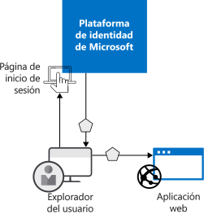

# ¿Qué es la autenticación?

La *autenticación*es acto de solicitar a un usuario credenciales legítimas, lo que proporciona la base para la creación de una entidad de seguridad que se utilizará para el control de identidades y de acceso. En términos más sencillos, es el proceso de comprobar que es quien dice ser. A veces, la autenticación se abrevia como AuthN.

La *autorización* es el acto de conceder un permiso a la entidad de seguridad autenticada para hacer algo. Especifica a qué datos puede acceder y qué puede hacer con ellos. A veces, la autorización se abrevia como AuthZ.

La plataforma de identidad de Microsoft simplifica la autenticación para los desarrolladores de aplicaciones, ya que ofrece la identidad como servicio, con compatibilidad con protocolos estándares del sector, como OAuth 2.0 y OpenID Connect, además de bibliotecas de código abierto para distintas plataformas para poder empezar a programar rápidamente.

Hay dos casos de uso principales en el modelo de programación de la plataforma de identidad de Microsoft:

* Durante un flujo de concesión de autorización de OAuth 2.0: cuando el propietario del recurso autoriza a la aplicación cliente, lo que permite al cliente acceder a los recursos del propietario del recurso.
* Durante el acceso a los recursos por el cliente: cuando lo implementa el servidor de recursos, mediante el uso de los valores de notificación presentes en el token de acceso para tomar decisiones de control de acceso basadas en ellos.

## Aspectos básicos de la autenticación en la plataforma de identidad de Microsoft

Veamos el escenario más básico en el que es necesario identificarse: un usuario de un explorador web debe autenticarse en una aplicación web. El siguiente diagrama muestra este escenario:

Esto es lo que necesita saber sobre los distintos componentes que se muestran en el diagrama:

* La plataforma de identidad de Microsoft es el proveedor de identidades. El proveedor de identidades es el responsable de comprobar la identidad de los usuarios y las aplicaciones que existen en el directorio de una organización y de emitir tokens de seguridad tras la autenticación correcta de dichos usuarios y aplicaciones.
* Cualquier aplicación que necesite externalizar la autenticación a la plataforma de identidad de Microsoft se debe registrar en Azure Active Directory (Azure AD). Azure AD registra la aplicación y la identifica de forma única en el directorio.
* Los desarrolladores pueden usar las bibliotecas de autenticación de código abierto de la plataforma de identidad de Microsoft para facilitar la autenticación, ya que administran los detalles de los protocolos para el usuario. Para más información, consulte las [bibliotecas de autenticación v2.0](reference-v2-libraries.md) y las [bibliotecas de autenticación v1.0](active-directory-authentication-libraries.md) de la plataforma de identidad de Microsoft.
* Una vez autenticado el usuario, la aplicación debe validar el token de seguridad de este para garantizar que la autenticación se realizó correctamente. Puede encontrar guías de inicio rápido, tutoriales y ejemplos de código en una variedad de lenguajes y marcos que muestran lo que debe hacer la aplicación.
  * Para crear rápidamente una aplicación y agregar funcionalidad similar a obtener tokens, actualizar tokens, iniciar la sesión de un usuario, mostrar información de usuario y mucho más, vea la sección **Inicios rápidos** de la documentación.
  * Para obtener procedimientos detallados basados en un escenario para tareas de autenticación principales para desarrolladores, como obtener tokens de acceso y usarlos en las llamadas a Microsoft Graph API y otras API, implementar el inicio de sesión con Microsoft con una aplicación tradicional basada en explorador web mediante OpenID Connect y más, consulte la sección **Tutoriales** de la documentación.
  * Para descargar ejemplos de código, vaya a [GitHub](https://github.com/Azure-Samples?q=active-directory).
* El flujo de solicitudes y respuestas del proceso de autenticación lo determina el protocolo de autenticación que usó, como OAuth 2.0, OpenID Connect, WS-Federation o SAML 2.0. Para obtener más información acerca de los protocolos, consulte la sección **Conceptos > Protocolos** de la documentación.

En el escenario de ejemplo anterior, puede clasificar las aplicaciones según estos dos roles:

* Aplicaciones que necesitan acceso seguro a recursos
* Aplicaciones que desempeñan el rol del propio recurso

Ahora que ya tiene información general sobre los conceptos básicos, siga leyendo para comprender la API y el modelo de aplicaciones de identidad, el funcionamiento del aprovisionamiento en la plataforma de identidad de Microsoft y vínculos a información detallada sobre los escenarios comunes que admite esta plataforma.

## Modelo de aplicación

La plataforma de identidad de Microsoft representa las aplicaciones que siguen un modelo específico que se ha diseñado para satisfacer dos funciones principales:

* **Identificar la aplicación de acuerdo con los protocolos de autenticación que admite**: esto implica enumerar todos los identificadores, direcciones URL, secretos e información relacionada necesaria en el momento de la autenticación. Aquí, la plataforma de identidad de Microsoft:

    * Contiene todos los datos necesarios para admitir la autenticación en tiempo de ejecución.
    * Contiene todos los datos para decidir qué podría necesitar una aplicación para acceder y si una solicitud determinada se debería completar y en qué circunstancias.
    * Proporciona la infraestructura para implementar el aprovisionamiento de la aplicación dentro del inquilino del desarrollador de la aplicación y en cualquier otro inquilino de Azure AD.

* **Controlar el consentimiento del usuario en el momento de solicitud del token y facilitar el aprovisionamiento dinámico de aplicaciones en varios inquilinos**. En este caso, la plataforma de identidad de Microsoft:

    * Permite a los usuarios y administradores conceder o denegar el consentimiento dinámicamente para que la aplicación acceda a recursos en su nombre.
    * Permite a los administradores decidir qué pueden hacer las aplicaciones en última instancia, qué usuarios pueden utilizar aplicaciones específicas y cómo se accede a los recursos de directorio.

En la plataforma de identidad de Microsoft, un **objeto de aplicación** describe una aplicación como entidad abstracta. Los desarrolladores trabajan con aplicaciones. Durante la implementación, la plataforma de identidad de Microsoft usa un objeto de aplicación determinado como plano técnico para crear una **entidad de servicio** que representa una instancia concreta de una aplicación en un directorio o inquilino. Es la entidad de servicio la que define lo que la aplicación realmente puede hacer en un directorio de destino específico, quién la puede usar, a qué recursos tiene acceso, etc. La plataforma de identidad de Microsoft crea una entidad de servicio desde un objeto de aplicación a través del **consentimiento**.

En el siguiente diagrama se muestra un flujo de aprovisionamiento de la plataforma de identidad de Microsoft basado en el consentimiento.  En él, existen dos inquilinos (A y B), el inquilino A es propietario de la aplicación y el inquilino B crea una instancia de la aplicación mediante una entidad de servicio.  

En este flujo de aprovisionamiento:

|   |   |
|---|---|
| 1 | Un usuario del inquilino B intenta iniciar sesión con la aplicación |
| 2 | Se adquieren y verifican las credenciales de usuario |
| 3 | El usuario debe dar su consentimiento para que la aplicación tenga acceso al inquilino B |
| 4 | La plataforma de identidad de Microsoft usa el objeto de aplicación de A como plano técnico para crear una entidad de servicio en el inquilino B |
| 5 | El usuario recibe el token solicitado |
|   |   |

Puede repetir este proceso tantas veces como quiera para otros inquilinos (C, D, etc.). El inquilino A conserva el plano técnico de la aplicación (objeto de aplicación). Los usuarios y administradores del resto de inquilinos en que se concede consentimiento a la aplicación conservan el control sobre lo que puede hacer la aplicación a través del objeto de la entidad de servicio correspondiente de cada inquilino. Para más información, consulte [Objetos de aplicación y de entidad de servicio en la plataforma de identidad de Microsoft](app-objects-and-service-principals.md).

## Notificaciones en tokens de seguridad de la plataforma de identidad de Microsoft

Los tokens de seguridad (tokens de identificación y acceso) que emite la plataforma de identidad de Microsoft contienen notificaciones o aserciones de información sobre el usuario que se ha autenticado. Las aplicaciones pueden usar notificaciones para varias tareas, como:

* Validar el token
* Identificar el inquilino del directorio del firmante
* Mostrar información de usuario
* Determinar la autorización del firmante

Las notificaciones presentes en cualquier token de seguridad dependen del tipo de token, el tipo de credencial que se usa para autenticar al usuario y la configuración de la aplicación.

En la tabla siguiente se proporciona una breve descripción de cada tipo de notificación que emite la plataforma de identidad de Microsoft. Para más información, consulte los [tokens de acceso](access-tokens.md) y [tokens de identificador](id-tokens.md) que emite la plataforma de identidad de Microsoft.

| Notificación | DESCRIPCIÓN |
| --- | --- |
| Identificador de aplicación | Identifica la aplicación que está usando el token. |
| Público | Identifica el recurso de destinatario al que está destinado el token. |
| Referencia de clase de contexto de autenticación de aplicación | Indica cómo se autenticó el cliente (cliente público frente a cliente confidencial). |
| Instante de autenticación | Registra la fecha y la hora de la autenticación. |
| Método de autenticación | Indica cómo se autenticó el firmante del token (contraseña, certificado, etc.). |
| Nombre de usuario | Proporciona el nombre de usuario, tal como se estableció en Azure AD. |
| Grupos | Contiene identificadores de objeto de los grupos de Azure AD de los que es miembro el usuario. |
| Proveedor de identidades | Registra el proveedor de identidades que autenticó al firmante del token. |
| Emitido a las | Registra la hora a la que se emitió el token; suele utilizarse para la actualización del token. |
| Emisor | Identifica al STS que emitió el token, así como el inquilino de Azure AD. |
| Apellidos | Proporciona los apellidos del usuario, tal como se establecieron en Azure AD. |
| NOMBRE | Proporciona un valor en lenguaje natural que identifica al firmante del token. |
| Id. de objeto | Contiene un identificador único e inmutable del firmante en Azure AD. |
| Roles | Contiene los nombres descriptivos de los roles de aplicación de Azure AD que se han concedido al usuario. |
| Ámbito | Indica los permisos concedidos a la aplicación cliente. |
| Asunto | Indica la entidad de seguridad sobre la que el token valida información. |
| Id. de inquilino | Contiene un identificador único e inmutable del inquilino de directorio que emitió el token. |
| Duración del token | Define el intervalo de tiempo dentro del cual es válido un token. |
| Nombre principal de usuario | Contiene el nombre principal de usuario del firmante. |
| Versión | Contiene el número de versión del token. |

## Pasos siguientes

* Más información sobre los [tipos de aplicaciones y escenarios que se admiten en la plataforma de identidad de Microsoft](app-types.md)
