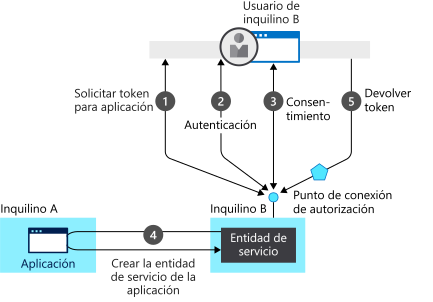

# Conceptos básicos sobre autenticación

## ¿Qué es la autenticación?

En este artículo, se explican muchos de los conceptos sobre la autenticación que debe conocer para poder crear aplicaciones web protegidas, API web o aplicaciones que llamen a API web protegidas. Si ve un término con el que no está familiarizado, pruebe nuestro (glosario)[developer-glossary.md].

La **autenticación** es el proceso mediante el que se comprueba que es quien dice ser. A veces, la autenticación se abrevia como AuthN.

La **autorización** es el acto de conceder a una parte autenticada permiso para hacer algo. Especifica a qué datos se puede acceder y qué se puede hacer con ellos. A veces, la autorización se abrevia como AuthZ.

En lugar de crear aplicaciones que tengan un nombre de usuario y una contraseña propios, lo que supone una gran carga administrativa cuando es necesario agregar o quitar usuarios en varias aplicaciones, las aplicaciones pueden delegar esa responsabilidad en un proveedor de identidades.

Azure Active Directory (Azure AD) es un proveedor de identidades centralizado en la nube. Al delegar la autenticación y la autorización en esta solución, se abren otras posibilidades, como el uso de directivas de acceso condicional que requieren que un usuario esté en una ubicación específica, el uso de la autenticación multifactor y la posibilidad de que un usuario solo tenga que iniciar sesión una vez para que, de forma automática, inicie sesión en todas las aplicaciones web que comparten el mismo directorio centralizado. Esta funcionalidad se conoce como "inicio de sesión único" (SSO).

Un proveedor de identidades centralizado es aún más importante para las aplicaciones que tienen usuarios repartidos por todo el mundo y que no inician sesión necesariamente desde la red de la empresa. Azure AD autentica a los usuarios y les proporciona tokens de acceso. Un [token de acceso](https://docs.microsoft.com/azure/active-directory/develop/developer-glossary#access-token) es un token de seguridad emitido por un servidor de autorización. Contiene información sobre el usuario y la aplicación para la que se ha creado el token y se puede usar para acceder tanto a las API web como a otros recursos protegidos.

La Plataforma de identidad de Microsoft simplifica la autenticación a los desarrolladores de aplicaciones, ya que ofrece la identidad como servicio, con compatibilidad con protocolos estándares del sector, como [OAuth 2.0](https://oauth.net/2/) y [OpenID Connect](https://openid.net/connect/), además de bibliotecas de código abierto para distintas plataformas, lo que le permitirá empezar a programar rápidamente. Permite a los desarrolladores crear aplicaciones que inicien sesión en todas las identidades de Microsoft, obtener tokens para llamar a [Microsoft Graph](https://developer.microsoft.com/graph/), otras API de Microsoft o API que los desarrolladores hayan creado. Para más información, consulte [Evolución de la Plataforma de identidad de Microsoft](about-microsoft-identity-platform.md).

### Inquilinos

Los proveedores de identidades en la nube dan servicio a muchas organizaciones. Para mantener separados a los usuarios de las diferentes organizaciones, Azure AD está dividido en inquilinos, con un inquilino por organización.

Los inquilinos mantienen un seguimiento de los usuarios y las aplicaciones asociadas. La Plataforma de identidad de Microsoft también permite que los usuarios puedan iniciar sesión con cuentas Microsoft personales.

Azure AD también dispone de Azure Active Directory B2C, de modo que las organizaciones pueden permitir que los usuarios, normalmente clientes, inicien sesión utilizando identidades sociales, como una cuenta de Google. Para más información, consulte [Documentación de Azure Active Directory B2C](https://docs.microsoft.com/azure/active-directory-b2c).

### Tokens de seguridad

Los tokens de seguridad contienen información sobre los usuarios y las aplicaciones. Azure AD usa tokens basados en JSON (JWT) que contienen notificaciones.

Una notificación proporciona aserciones sobre una entidad (como una [aplicación cliente](https://docs.microsoft.com/azure/active-directory/develop/developer-glossary#client-application) o un [propietario de recursos](https://docs.microsoft.com/azure/active-directory/develop/developer-glossary#resource-owner)), a otra entidad (como un [servidor de recursos](https://docs.microsoft.com/azure/active-directory/develop/developer-glossary#resource-server)).

Las notificaciones son pares nombre-valor que retransmiten hechos sobre el firmante del token. Por ejemplo, una notificación puede contener hechos sobre la entidad de seguridad autenticada por el [servidor de autorización](https://docs.microsoft.com/azure/active-directory/develop/developer-glossary#authorization-server). Las notificaciones presentes en cualquier token dependen de muchas cosas, como el tipo de token, el tipo de credencial que se usa para autenticar el firmante, la configuración de la aplicación, etc.

Las aplicaciones pueden usar notificaciones para varias tareas, como:

* Validar el token.
* Identificación del inquilino del firmante del token
* Mostrar información sobre el usuario.
* Determinar la autorización del sujeto.

Una notificación se compone de pares clave-valor que proporcionan información, como:

* El servidor de tokens de seguridad que generó el token.
* La fecha en la que se generó el token.
* El firmante (por ejemplo, el usuario, excepto en el caso de los demonios)
* La audiencia, que es la aplicación para la que se generó el token.
* La aplicación (el cliente) que solicitó el token. En el caso de las aplicaciones web, puede ser igual a la audiencia.

Para más detalles sobre las notificaciones, consulte los [tokens de acceso](access-tokens.md) y los [tokens de identificación](id-tokens.md).

La validación del token depende de la aplicación para la que se generó el token, de la aplicación web en la que inició sesión el usuario o la API web que se está invocando. El token está firmado por el servidor de token de seguridad (STS) con una clave privada. El STS publica la clave pública correspondiente. Para validar un token, la aplicación comprueba la firma utilizando la clave pública de STS a fin de validar que se creó con la clave privada.

Los tokens solo son válidos durante un período de tiempo limitado. Normalmente, el STS proporciona un par de tokens: un token de acceso para acceder a la aplicación o al recurso protegido, y un token de actualización que se usa para actualizar el token de acceso cuando está a punto de vencer.

Los tokens de acceso se pasan a una API web en el encabezado de `Authorization` como un token de portador. Una aplicación puede proporcionar un token de actualización al STS y, si el acceso del usuario a la aplicación no se ha revocado, recibirá un nuevo token de acceso y un nuevo token de actualización. Así es cómo se administran los casos cuando alguien abandona la empresa. Cuando el STS recibe el token de actualización, si el usuario ya no está autorizado, no emitirá otro token de acceso válido.

## Modelo de aplicación

Las aplicaciones pueden iniciar por sí mismas la sesión de los usuarios o delegar el inicio de sesión en un proveedor de identidades. Consulte [Flujos de autenticación y escenarios de aplicaciones ](authentication-flows-app-scenarios.md) para más información sobre los escenarios de inicio de sesión admitidos por Azure AD.

Para que un proveedor de identidades sepa que un usuario tiene acceso a una determinada aplicación, tanto el usuario como la aplicación deben estar registrados con el proveedor de identidades. Cuando registra una aplicación con Azure AD, proporciona una configuración de identidad para la aplicación, lo que permite integrarla con Azure AD. El registro de la aplicación también le permite:

* Personalizar la marca de la aplicación en el cuadro de diálogo de inicio de sesión. Esto es importante, ya que es el primer contacto que tendrá un usuario con la aplicación.
* Decidir si desea permitir que los usuarios únicamente puedan iniciar sesión si pertenecen a su organización. (aplicación de un solo inquilino) o si los usuarios podrán iniciar sesión con una cuenta profesional o educativa (aplicación de varios inquilinos). También puede permitir cuentas Microsoft personales o una cuenta de las redes sociales: LinkedIn, Google, etc.
* Solicitar permisos de ámbito. Por ejemplo, puede solicitar el ámbito "user.read", que concede permiso para leer el perfil del usuario conectado.
* Definir ámbitos que definan el acceso a la API web. Normalmente, cuando una aplicación desea acceder a la API, tiene que solicitar permisos para los ámbitos que se definen.
* Compartir un secreto con Azure AD, lo que demuestra a Azure AD la identidad de la aplicación.  Esto es aplicable cuando la aplicación es una aplicación cliente confidencial. Una aplicación cliente confidencial es una aplicación que puede almacenar las credenciales de forma segura. Se necesita un servidor back-end de confianza para almacenar las credenciales.

Una vez registrada la aplicación, se le proporcionará un identificador único a dicha aplicación que compartirá con Azure AD cuando solicite tokens. Si la aplicación es una [aplicación cliente confidencial](https://docs.microsoft.com/azure/active-directory/develop/developer-glossary#client-application), también compartirá el secreto o la clave pública*, dependiendo de si se utilizaron certificados o secretos.

La Plataforma de identidad de Microsoft representa a las aplicaciones que usan un modelo que cumple dos funciones principales:

* Identificar la aplicación mediante los protocolos de autenticación que admite.
* Proporcionar todos los identificadores, las direcciones URL, los secretos y la información relacionada que se necesitan para la autenticación.

La Plataforma de identidad de Microsoft:

* Contiene todos los datos necesarios para admitir la autenticación en tiempo de ejecución.
* Contiene todos los datos para decidir qué recursos podría necesitar una aplicación para obtener acceso y en qué circunstancias debería cumplimentarse una solicitud.
* Proporciona la infraestructura necesaria para implementar el aprovisionamiento de la aplicación dentro del inquilino del desarrollador de la aplicación y en cualquier otro inquilino de Azure AD.
* Controla el consentimiento del usuario en el momento de solicitud del token y facilitar el aprovisionamiento dinámico de aplicaciones en varios inquilinos.

El consentimiento es el proceso de un propietario de recursos para conceder autorización a una aplicación cliente a acceder a recursos protegidos, bajo permisos específicos, en nombre del propietario del recurso. La Plataforma de identidad de Microsoft:

* Permite a los usuarios y administradores conceder o denegar el consentimiento dinámicamente para que la aplicación acceda a recursos en su nombre.
* Permite a los administradores decidir qué pueden hacer las aplicaciones en última instancia, qué usuarios pueden utilizar aplicaciones específicas y cómo se accede a los recursos de directorio.

En la Plataforma de identidad de Microsoft, un [objeto de aplicación](https://docs.microsoft.com/azure/active-directory/develop/developer-glossary#application-object) describe una aplicación. Durante la implementación, la Plataforma de identidad de Microsoft usa el objeto de aplicación como plano técnico para crear una [entidad de servicio](https://docs.microsoft.com/azure/active-directory/develop/developer-glossary#service-principal-object), que representa una instancia concreta de una aplicación de un directorio o inquilino. La entidad de servicio define qué es lo que puede hacer realmente la aplicación en un directorio de destino específico, quién puede usarla, a qué recursos tiene acceso, etc. La Plataforma de identidad de Microsoft crea una entidad de servicio a partir de un objeto de aplicación mediante su **consentimiento**.

En el siguiente diagrama se muestra un flujo de aprovisionamiento de la plataforma de identidad de Microsoft basado en el consentimiento. Aparecen dos inquilinos: A y B. El inquilino A es el propietario de la aplicación. El inquilino B crea instancias de la aplicación mediante una entidad de servicio.  

En este flujo de aprovisionamiento:

1. Un usuario del inquilino B intenta iniciar sesión con la aplicación y el punto de conexión de autorización solicita un token para la aplicación.
1. Se adquieren y verifican las credenciales de usuario para la autenticación.
1. El usuario debe dar su consentimiento para que la aplicación tenga acceso al inquilino B.
1. La Plataforma de identidad de Microsoft usa el objeto de aplicación del inquilino A como plano técnico para crear una entidad de servicio en el inquilino B.
1. El usuario recibe el token solicitado.

Puede repetir este proceso con otros inquilinos. El inquilino A conserva el plano técnico de la aplicación (objeto de aplicación). Los usuarios y administradores de todos los demás inquilinos en los que se concede consentimiento a la aplicación conservan el control sobre lo que la aplicación puede hacer con el objeto de la entidad de servicio correspondiente de cada inquilino. Para más información, consulte [Objetos de aplicación y de entidad de servicio en la plataforma de identidad de Microsoft](app-objects-and-service-principals.md).

## Flujo de inicio de sesión de una aplicación web con Azure AD

Cuando un usuario navega en el explorador a una aplicación web, ocurre lo siguiente:

* La aplicación web determina si el usuario está autenticado.
* Si no lo está, la aplicación web delega en Azure AD el inicio de sesión del usuario. Ese inicio de sesión tendrá que cumplir la directiva de la organización, lo que puede significar que se le pida al usuario que escriba sus credenciales, que utilice la autenticación multifactor o que ni siquiera tenga que especificar una contraseña (por ejemplo, si utiliza Windows Hello).
* Se pide al usuario que dé el consentimiento de acceso que necesita la aplicación cliente. Este es el motivo por el que las aplicaciones cliente deben registrarse con Azure AD, ya que Azure AD puede proporcionar tokens que representan el acceso autorizado por el usuario.

Cuando el usuario se ha autenticado correctamente:

* Azure AD envía un token a la aplicación web.
* Se guarda una cookie, asociada al dominio de Azure AD, que contiene la identidad del usuario en el archivo jar de la cookie del explorador. La próxima vez que una aplicación use el explorador para ir al punto de conexión de autorización de Azure AD, el explorador presentará la cookie para que el usuario no tenga que volver a iniciar sesión. También es la mecanismo por el que se realiza el SSO. Azure AD genera la cookie y solo él puede entenderla.
* A continuación, la aplicación web valida el token. Si la validación se realiza correctamente, la aplicación web muestra la página protegida y guarda una cookie de sesión en el archivo jar de la cookie del explorador. Cuando el usuario accede a otra página, la aplicación web sabe que el usuario está autenticado por la cookie de sesión.

En el siguiente diagrama de secuencias, se resume esta interacción:

### Cómo determina una aplicación web si el usuario está autenticado

Los desarrolladores de aplicaciones web pueden especificar si todas o solo algunas páginas requieren autenticación. Por ejemplo, en ASP.NET/ASP.NET Core, esto se hace agregando el atributo `[Authorize]` a las acciones del controlador. 

Este atributo hace que ASP.NET compruebe la presencia de una cookie de sesión que contiene la identidad del usuario. Si esta cookie no está, ASP.NET redirige la autenticación al proveedor de identidades especificado. Si el proveedor de identidades es Azure AD, la aplicación web redirige la autenticación a `https://login.microsoftonline.com`, que muestra un cuadro de diálogo de inicio de sesión.

### Cómo delega una aplicación web el inicio de sesión en Azure AD y obtiene un token

La autenticación del usuario se realiza mediante el explorador. El protocolo OpenID usa mensajes con el protocolo HTTP estándar.
* La aplicación web envía un mensaje HTTP 302 (redireccionamiento) al explorador para que utilice Azure AD.
* Cuando se autentica el usuario, Azure AD envía el token a la aplicación web utilizando un redireccionamiento mediante el explorador.
* La aplicación web proporciona el redireccionamiento en forma de un URI de redirección. Este URI de redirección se registra con el objeto de aplicación de Azure AD. Puede haber varios URI de redireccionamiento, ya que la aplicación puede estar implementada en varias direcciones URL. Por lo tanto, la aplicación web también tendrá que especificar el URI de redirección que va a utilizar.
* Azure AD verifica que el URI de redirección enviado por la aplicación web es uno de los URI de redirección registrados para la aplicación.

## Flujo de inicio de sesión para aplicaciones móviles y de escritorio con Azure AD

El flujo descrito anteriormente se aplica, con ligeras diferencias, tanto a las aplicaciones móviles como a las aplicaciones de escritorio.

Las aplicaciones móviles y de escritorio pueden utilizar un control web integrado o un explorador del sistema para la autenticación. En el diagrama siguiente, se muestra cómo una aplicación móvil o de escritorio usa la biblioteca de autenticación de Microsoft (MSAL) para adquirir tokens de acceso y llamar a las API web.

MSAL usa un explorador para obtener los tokens. Al igual que con las aplicaciones web, la autenticación se delega en Azure AD.

Como Azure AD guarda en el explorador la misma cookie de identidad que utiliza con las aplicaciones web, si la aplicación nativa o móvil usa el explorador del sistema, obtendrá de inmediato SSO con la aplicación web correspondiente.

De forma predeterminada, MSAL usa el explorador del sistema. La excepción son las aplicaciones de escritorio de .NET Framework, en las que se usa un control integrado para proporcionar al usuario una experiencia más fluida.

## Pasos siguientes

* Consulte el [glosario para desarrolladores de la Plataforma de identidad de Microsoft](developer-glossary.md) para familiarizarse con los términos más habituales.
* Consulte [Flujos de autenticación y escenarios de aplicaciones](authentication-flows-app-scenarios.md) para más información sobre otros escenarios de autenticación de usuarios compatibles con la plataforma de identidad de Microsoft.
* Consulte las [bibliotecas MSAL](msal-overview.md) para más información sobre las bibliotecas de Microsoft, que le ayudarán a desarrollar aplicaciones que funcionan con cuentas Microsoft, cuentas de Azure AD y usuarios de Azure AD B2C en un modelo de programación simplificado y único.
* Consulte [Configuración de la aplicación de App Service para usar el inicio de sesión de Azure AD](/azure/app-service/configure-authentication-provider-aad) para aprender a configurar la autenticación para la aplicación de App Service.
