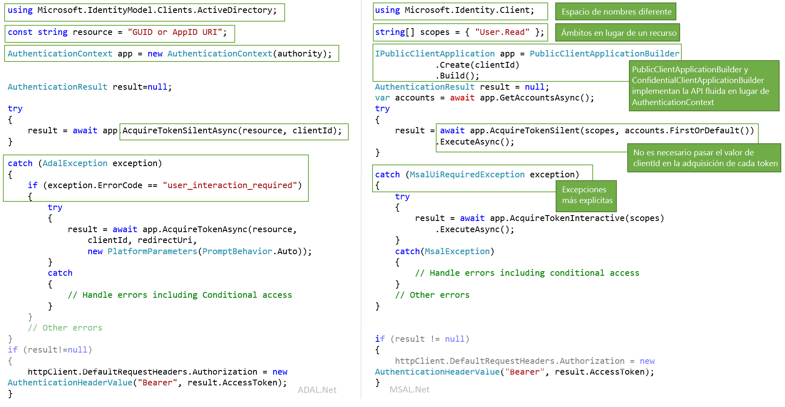

# <a name="migrating-applications-to-msalnet"></a>Migración de aplicaciones a MSAL.NET

Tanto Microsoft Authentication Library for .NET (MSAL.NET) como Azure AD Authentication Library for .NET (ADAL.NET) se usan para autenticar entidades de Azure AD y solicitar tokens a Azure AD. Hasta ahora, la mayoría de los desarrolladores ha usado la plataforma Azure AD para desarrolladores (v1.0) para autenticar identidades de Azure AD (cuentas profesionales y educativas) mediante la solicitud de tokens conAzure AD Authentication Library (ADAL). Con MSAL:

- puede autenticar un conjunto más amplio de identidades de Microsoft (identidades de Azure AD y cuentas Microsoft, así como cuentas de redes sociales y locales mediante Azure AD B2C) puesto que se usa el punto de conexión de la plataforma de identidad de Microsoft.
- los usuarios obtendrán la mejor experiencia de inicio de sesión único.
- la aplicación puede permitir el consentimiento incremental y es más fácil admitir el acceso condicional
- se beneficia de la innovación.

**MSAL.NET es ahora la biblioteca de autenticación recomendada para la plataforma de identidad de Microsoft**. No se implementarán nuevas características en ADAL.NET. Los trabajos se centran en mejorar MSAL.

En este artículo se describen las diferencias entre la biblioteca de autenticación de Microsoft para .NET (MSAL.NET) y la biblioteca de autenticación de Azure AD para .NET (ADAL.NET), y contiene información para ayudarle a migrar a MSAL.  

## <a name="differences-between-adal-and-msal-apps"></a>Diferencias entre las aplicaciones de ADAL y MSAL

En la mayoría de los casos deseará usar MSAL.NET y el punto de conexión de la plataforma de identidad de Microsoft, que es la última generación de bibliotecas de autenticación de Microsoft. Mediante MSAL.NET adquiere tokens para los usuarios que inician sesión en su aplicación con Azure AD (cuentas profesionales y educativas), cuentas (personales) Microsoft (MSA) o Azure AD B2C. 

Si ya conoce el punto de conexión de Azure AD para desarrolladores (v1.0) (y ADAL.NET), puede que desee leer [Diferencias del punto de conexión de la plataforma de identidad de Microsoft (v2.0)](active-directory-v2-compare.md).

Sin embargo, aun así deberá usar ADAL.NET si la aplicación necesita iniciar sesión en los usuarios con versiones anteriores de [Servicios de federación de Active Directory (AD FS)](/windows-server/identity/active-directory-federation-services). Para más información, consulte al [soporte técnico de Azure](https://aka.ms/msal-net-adfs-support).

La imagen siguiente resume algunas de las diferencias entre ADAL.NET y MSAL.NET 

### <a name="nuget-packages-and-namespaces"></a>Espacios de nombres y paquetes NuGet

ADAL.NET se consume desde el paquete NuGet [Microsoft.IdentityModel.Clients.ActiveDirectory](https://www.nuget.org/packages/Microsoft.IdentityModel.Clients.ActiveDirectory). El espacio de nombres que se usa es `Microsoft.IdentityModel.Clients.ActiveDirectory`.

Para usar MSAL.NET será preciso agregar el paquete NuGet [Microsoft.Identity.Client](https://www.nuget.org/packages/Microsoft.Identity.Client) y utilizar el espacio de nombres `Microsoft.Identity.Client`

### <a name="scopes-not-resources"></a>Ámbitos, no recursos

ADAL.NET adquiere tokens para los *recursos*, pero MSAL.NET adquiere tokens para los *ámbitos*. Algunas invalidaciones de AcquireToken de MSAL.NET requieren un parámetro denominado scopes (`IEnumerable<string> scopes`). Este parámetro no es más que una lista de cadenas que declaran los permisos y recursos deseados que se solicitan. Los [ámbitos de Microsoft Graph](/graph/permissions-reference) son muy conocidos.

In MSAL.NET también se puede acceder a los recursos de v1.0. Vea los detalles en [Ámbitos para una aplicación v1.0](#scopes-for-a-web-api-accepting-v10-tokens). 

### <a name="core-classes"></a>Clases principales

- ADAL.NET usa [AuthenticationContext](https://github.com/AzureAD/azure-activedirectory-library-for-dotnet/wiki/AuthenticationContext:-the-connection-to-Azure-AD) como representación de la conexión al servidor de autorización o al servicio de token de seguridad (STS), a través de una entidad. Por el contrario, MSAL.NET está diseñado en torno a [aplicaciones cliente](https://github.com/AzureAD/microsoft-authentication-library-for-dotnet/wiki/Client-Applications). Proporciona dos clases independientes: `PublicClientApplication` y `ConfidentialClientApplication`

- Adquisición de tokens: ADAL.NET y MSAL.NET tienen las mismas llamadas de autenticación (`AcquireTokenAsync` y `AcquireTokenSilentAsync` para ADAL.NET, y `AcquireTokenInteractive` y `AcquireTokenSilent` en MSAL.NET), pero con distintos parámetros requeridos. Una diferencia es el hecho de que, en MSAL.NET, no es preciso usar el `ClientID` de la aplicación en todas las llamadas a AcquireTokenXX. De hecho, `ClientID` se establece una sola vez al compilar `IPublicClientApplication` o `IConfidentialClientApplication`.

### <a name="iaccount-not-iuser"></a>IAccount no IUser

ADAL.NET ha manipulado a los usuarios. Sin embargo, un usuario es una persona o un agente de software, pero puede poseer, ser propietario o ser responsable de una o varias cuentas en el sistema de identidad de Microsoft (varias cuentas de Azure AD, Azure AD B2C, cuentas personales de Microsoft). 

MSAL.NET 2.x ahora define el concepto de cuenta (a través de la interfaz de IAccount). Este cambio importante proporciona la semántica correcta: el hecho de que el mismo usuario pueda tener varias cuentas en diferentes directorios de Azure AD. También MSAL.NET proporciona mejor información en escenarios de invitado, cuando se proporciona información de la cuenta doméstica.

Para más información acerca de las diferencias entre IUser e IAccount, consulte [MSAL.NET 2.x](https://aka.ms/msal-net-2-released).

### <a name="exceptions"></a>Excepciones

#### <a name="interaction-required-exceptions"></a>Excepciones requeridas en la interacción

MSAL.NET tiene más excepciones explícitas. Por ejemplo, cuando se produce un error de autenticación en modo silencioso en ADAL el procedimiento es detectar la excepción y buscar el código de error `user_interaction_required`:

```csharp
catch(AdalException exception)
{
 if (exception.ErrorCode == "user_interaction_required")
 {
  try
  {“try to authenticate interactively”}}
 }
}
```

En la sección [Recommended pattern to acquire a token](https://github.com/AzureAD/azure-activedirectory-library-for-dotnet/wiki/AcquireTokenSilentAsync-using-a-cached-token#recommended-pattern-to-acquire-a-token) (Patrón recomendado para adquirir un token) con ADAL.NET, encontrará detalles al respecto

Mediante MSAL.NET se detecta `MsalUiRequiredException`, como se describe en [AcquireTokenSilent](https://github.com/AzureAD/microsoft-authentication-library-for-dotnet/wiki/AcquireTokenSilentAsync-using-a-cached-token).

```csharp
catch(MsalUiRequiredException exception)
{
 try {“try to authenticate interactively”}
}
```

#### <a name="handling-claim-challenge-exceptions"></a>Controlar las excepciones en los desafíos de notificaciones

En ADAL.NET, las excepciones en los desafíos de notificaciones se controlan de la siguiente forma:

- `AdalClaimChallengeException` es una excepción (que se deriva de `AdalServiceException`) producida por el servicio en caso de que un recurso requiera más notificaciones del usuario (por ejemplo, autenticación en dos fases). El miembro `Claims` contiene algún fragmento de JSON con las notificaciones, que se esperan.
- Sin salir de ADAL.NET, la aplicación cliente pública que recibe esta excepción necesita llamar a la invalidación `AcquireTokenInteractive` teniendo un parámetro de notificaciones. Esta invalidación de `AcquireTokenInteractive` ni siquiera intenta llegar a la memoria caché, ya que no es necesario. La razón es que el token de la memoria caché no tiene las notificaciones correctas (de lo contrario, no se habría producido `AdalClaimChallengeException`). Por tanto, no es preciso examinar la memoria caché. Tenga en cuenta que `ClaimChallengeException` se puede recibir en una WebAPI que hace OBO, mientras que `AcquireTokenInteractive` debe llamarse en una aplicación cliente pública que llama a esta API web.
- Para más información al respecto, incluidos ejemplos, consulte Handling [AdalClaimChallengeException](https://github.com/AzureAD/azure-activedirectory-library-for-dotnet/wiki/Exceptions-in-ADAL.NET#handling-adalclaimchallengeexception) (Control de AdalClaimChallengeException)

En MSAL.NET, las excepciones en los desafíos de notificaciones se controlan de la siguiente forma:

- `Claims` se exponen en `MsalServiceException`.
- Hay un método `.WithClaim(claims)` que se puede aplicar al generador `AcquireTokenInteractive`. 

### <a name="supported-grants"></a>Concesiones que se admiten

En MSAL.NET y en el punto de conexión v2.0 aún no se admiten todas las concesiones. A continuación encontrará un resumen en el que se comparan las concesiones que se admiten de ADAL.NET y MSAL. NET.

#### <a name="public-client-applications"></a>Aplicaciones cliente públicas

Estas son las concesiones que se admiten en ADAL.NET y MSAL.NET para aplicaciones de escritorio y para dispositivos móviles

Conceder | ADAL.NET | MSAL.NET
----- |----- | -----
Interactive | [Autenticación interactiva](https://github.com/AzureAD/azure-activedirectory-library-for-dotnet/wiki/Acquiring-tokens-interactively---Public-client-application-flows) | [Adquisición de tokens de forma interactiva en MSAL.NET](https://github.com/AzureAD/microsoft-authentication-library-for-dotnet/wiki/Acquiring-tokens-interactively)
Autenticación integrada de Windows | [Autenticación integrada en Windows (Kerberos)](https://github.com/AzureAD/azure-activedirectory-library-for-dotnet/wiki/AcquireTokenSilentAsync-using-Integrated-authentication-on-Windows-(Kerberos)) | [Autenticación integrada de Windows](msal-authentication-flows.md#integrated-windows-authentication)
Nombre de usuario y contraseña | [Adquisición de tokens con nombre de usuario y contraseña](https://github.com/AzureAD/azure-activedirectory-library-for-dotnet/wiki/Acquiring-tokens-with-username-and-password)| [Autenticación de nombre de usuario y contraseña](msal-authentication-flows.md#usernamepassword)
Flujo de código de dispositivo | [Perfil de dispositivo para dispositivos sin exploradores web](https://github.com/AzureAD/azure-activedirectory-library-for-dotnet/wiki/Device-profile-for-devices-without-web-browsers) | [Flujo de código de dispositivo](msal-authentication-flows.md#device-code)

#### <a name="confidential-client-applications"></a>Aplicaciones cliente confidenciales

Estas son las concesiones que se admiten en ADAL.NET y MSAL.NET para aplicaciones web, API web y aplicaciones de demonio:

Tipo de aplicación | Conceder | ADAL.NET | MSAL.NET
----- | ----- | ----- | -----
Web App, API web, demonio | Credenciales de cliente | [Flujos de credenciales de cliente en ADAL.NET](https://github.com/AzureAD/azure-activedirectory-library-for-dotnet/wiki/Client-credential-flows) | [Flujos de credenciales de cliente en MSAL.NET](msal-authentication-flows.md#client-credentials)
API Web | En nombre de | [Llamadas de servicio a servicio en nombre del usuario con ADAL.NET](https://github.com/AzureAD/azure-activedirectory-library-for-dotnet/wiki/Service-to-service-calls-on-behalf-of-the-user) | [En nombre de MSAL.NET](msal-authentication-flows.md#on-behalf-of)
Aplicación web | Código de autenticación | [Adquisición de tokens con códigos de autorización en aplicaciones web con ADAL.NET](https://github.com/AzureAD/azure-activedirectory-library-for-dotnet/wiki/Acquiring-tokens-with-authorization-codes-on-web-apps) | [Adquisición de tokens con códigos de autorización en aplicaciones web con MSAL.NET](msal-authentication-flows.md#authorization-code)

### <a name="cache-persistence"></a>Persistencia en la caché

ADAL.NET le permite ampliar la clase `TokenCache` para implementar la funcionalidad de persistencia deseada en las plataformas sin un almacenamiento seguro (.NET Framework y .NET Core) mediante el uso de los métodos `BeforeAccess` y `BeforeWrite`. Para más información, consulte [Token Cache Serialization in ADAL.NET](https://github.com/AzureAD/azure-activedirectory-library-for-dotnet/wiki/Token-cache-serialization) (Serialización de la caché de tokens in ADAL.NET).

MSAL.NET hace que la caché de tokens sea una clase sellada y elimina la posibilidad de ampliarla. Por tanto, la implementación de la persistencia en la caché de tokens debe ser en forma de clase auxiliar que interactúa con la caché de tokens sellada. Esta interacción se describe en [Token Cache Serialization in MSAL.NET](https://github.com/AzureAD/microsoft-authentication-library-for-dotnet/wiki/token-cache-serialization) (Serialización de caché de tokens in MSAL.NET).

## <a name="signification-of-the-common-authority"></a>Significación de la autoridad común

En la versión 1.0, si usa la autoridad https://login.microsoftonline.com/common , permitirá a los usuarios iniciar sesión con cualquier cuenta de AAD (para cualquier organización). Consulte [Validación de autoridad en ADAL.NET](https://github.com/AzureAD/azure-activedirectory-library-for-dotnet/wiki/AuthenticationContext:-the-connection-to-Azure-AD#authority-validation)

Si usa la autoridad https://login.microsoftonline.com/common en la versión 2.0, permitirá a los usuarios iniciar sesión con una cuenta personal de Microsoft (MSA) o de cualquier organización de AAD. En MSAL.NET, si desea restringir el inicio de sesión a cualquier cuenta de AAD (el mismo comportamiento que con ADAL.NET), es preciso que use https://login.microsoftonline.com/organizations. Para más información, consulte el parámetro `authority` en la [aplicación cliente pública](https://github.com/AzureAD/microsoft-authentication-library-for-dotnet/wiki/Client-Applications#publicclientapplication).

## <a name="v10-and-v20-tokens"></a>Tokens de las versiones 1.0 y 2.0

Hay dos versiones de tokens:
- Tokens de la versión 1.0
- Tokens de la versión 2.0 

El punto de conexión de la versión 1.0 (usada por ADAL) solo emite tokens de la versión 1.0.

Sin embargo, el punto de conexión de la versión 2.0 (usada por MSAL) emite la versión del token que la API web acepta. Una propiedad del manifiesto de aplicación de la API web permite a los desarrolladores elegir la versión del token que se acepta. Consulte `accessTokenAcceptedVersion` en la documentación de referencia del [manifiesto de aplicación](reference-app-manifest.md).

Para más información acerca de los tokens de las versiones 1.0 y 2.0, consulte [Tokens de acceso de Azure Active Directory](access-tokens.md)

## <a name="scopes-for-a-web-api-accepting-v10-tokens"></a>Ámbitos para una API web que acepta tokens de la versión 1.0

Los permisos de OAuth2 son ámbitos de permiso que una aplicación de API web (recurso) de la versión 1.0 expone a las aplicaciones cliente. Estos ámbitos de permisos pueden concederse a las aplicaciones cliente durante el consentimiento. Vea la sección acerca de oauth2Permissions en [Manifiesto de aplicación de Azure Active Directory](active-directory-application-manifest.md).

### <a name="scopes-to-request-access-to-specific-oauth2-permissions-of-a-v10-application"></a>Ámbitos para solicitar acceso a permisos específicos de OAuth2 de una aplicación de la versión 1.0

Si desea adquirir tokens para ámbitos específicos de una aplicación de la versión 1.0 (por ejemplo el gráfico de AAD, que es https://graph.windows.net) , necesitaría crear `scopes` mediante la concatenación de un identificador de recurso deseado con un permiso de OAuth2 deseado para dicho recurso.

Por ejemplo, para acceder en nombre del usuario a una API Web v1.0 que tiene un URI de identificador de aplicación `ResourceId`, es probable que desee usar:

```csharp
var scopes = new [] {  ResourceId+"/user_impersonation"};
```

Si desea leer y escribir con MSAL.NET Azure Active Directory mediante la API Graph de AAD (https://graph.windows.net/) , debe crear una lista de ámbitos, como en el siguiente fragmento de código:

```csharp
ResourceId = "https://graph.windows.net/";
var scopes = new [] { ResourceId + "Directory.Read", ResourceID + "Directory.Write"}
```

#### <a name="warning-should-you-have-one-or-two-slashes-in-the-scope-corresponding-to-a-v10-web-api"></a>Advertencia: debe tener uno o dos barras diagonales en el ámbito correspondiente a una API web v1.0

Si desea escribir el ámbito correspondiente a la API de Azure Resource Manager (https://management.core.windows.net/) , es preciso que solicite el ámbito siguiente (tenga en cuenta las dos barras diagonales) 

```csharp
var scopes = new[] {"https://management.core.windows.net//user_impersonation"};
var result = await app.AcquireTokenInteractive(scopes).ExecuteAsync();

// then call the API: https://management.azure.com/subscriptions?api-version=2016-09-01
```

Esto se debe a que la API de Resource Manager espera una barra diagonal en su notificación de la audiencia (`aud`), y, después, hay una barra diagonal para separar el nombre de la API del ámbito.

La lógica que usa Azure AD es la siguiente:
- Para el punto de conexión de ADAL (v1.0) con un token de acceso de la versión 1.0 (el único posible), aud = resource
- Si MSAL (punto de conexión de la versión 2.0) pide un token de acceso para un recurso que acepta tokens de la versión 2.0, aud=resource.AppId
- Si MSAL (punto de conexión de la versión 2.0) pide un token de acceso para un recurso que acepta tokens de la versión 1.0 (que es el caso anterior), Azure AD analiza la audiencia deseada desde el ámbito solicitado tomando todo el contenido antes de la última barra diagonal y usándolo como el identificador del recurso. Por lo tanto, si https:\//database.windows.net espera una audiencia de "https://database.windows.net/ ", deberá solicitar un ámbito de https:\/ /database.windows.net//.default. Vea también el problema [747](https://github.com/AzureAD/microsoft-authentication-library-for-dotnet/issues/747): falta la barra diagonal final de la dirección URL, lo que ha provocado el produjo el error de autenticación de SQL #747


### <a name="scopes-to-request-access-to-all-the-permissions-of-a-v10-application"></a>Ámbitos para solicitar acceso a todos los permisos de una aplicación de la versión 1.0

Por ejemplo, si desea adquirir un token para todos los ámbitos estáticos de una aplicación de la versión 1.0, sería preciso utilizar:

```csharp
ResourceId = "someAppIDURI";
var scopes = new [] {  ResourceId+"/.default"};
```

### <a name="scopes-to-request-in-the-case-of-client-credential-flow--daemon-app"></a>Ámbitos para solicitar acceso en el caso de flujo de credenciales de cliente o aplicación demonio

En el caso de flujo de credenciales de cliente, el ámbito que se pasa también sería `/.default`. Este ámbito indica a Azure AD: "todos los permisos de nivel de aplicación a los que el administrador ha dado su consentimiento para el registro de la aplicación".

## <a name="adal-to-msal-migration"></a>Migración de ADAL a MSAL

En ADAL.NET v2.X, se han expuesto los tokens de actualización, lo que le permite desarrollar soluciones en torno al uso de estos tokens mediante su almacenamiento en caché y el uso de los `AcquireTokenByRefreshToken` que proporciona ADAL 2.x. Algunas de estas soluciones se han usado en escenarios como:
* Servicios de ejecución prolongada que realizan acciones, lo que incluye la actualización de paneles en nombre de los usuarios, mientras que los usuarios no están conectados. 
* Escenarios de WebFarm que permiten al cliente llevar el RT al servicio web (el almacenamiento en caché se realiza en el lado cliente, con la cookie cifrada, no en el del servidor)

Por motivos de seguridad, MSAL.NET no expone tokens de actualización: MSAL los administra automáticamente. 

Afortunadamente, MSAL.NET ahora tiene una API que permite migrar los tokens de actualización anteriores (adquiridos con ADAL) a `IConfidentialClientApplication`:

```csharp
/// <summary>
/// Acquires an access token from an existing refresh token and stores it and the refresh token into 
/// the application user token cache, where it will be available for further AcquireTokenSilent calls.
/// This method can be used in migration to MSAL from ADAL v2 and in various integration 
/// scenarios where you have a RefreshToken available. 
/// (see https://aka.ms/msal-net-migration-adal2-msal2)
/// </summary>
/// <param name="scopes">Scope to request from the token endpoint. 
/// Setting this to null or empty will request an access token, refresh token and ID token with default scopes</param>
/// <param name="refreshToken">The refresh token from ADAL 2.x</param>
IByRefreshToken.AcquireTokenByRefreshToken(IEnumerable<string> scopes, string refreshToken);
```
 
Con este método puede proporcionar el token de actualización que ha usado anteriormente junto con todos los ámbitos (recursos) que desee. El token de actualización se intercambiará por otro nuevo y se almacenará en caché en la aplicación.  

Como este método está pensado para escenarios que no sean habituales, no se puede acceder a él en todo momento con `IConfidentialClientApplication` sin convertirlo primero en `IByRefreshToken`.

Este fragmento de código muestra código de migración en una aplicación cliente confidencial. `GetCachedRefreshTokenForSignedInUser` recupera el token de actualización que almacenó en algún tipo de almacenamiento una versión anterior de la aplicación que se utilizaba para aprovechar ADAL 2.x. `GetTokenCacheForSignedInUser` deserializa una cache para el usuario que ha iniciado sesión (ya que las aplicaciones cliente confidenciales deben tener una sola caché por usuario).

```csharp
TokenCache userCache = GetTokenCacheForSignedInUser();
string rt = GetCachedRefreshTokenForSignedInUser();

IConfidentialClientApplication app;
app = ConfidentialClientApplicationBuilder.Create(clientId)
 .WithAuthority(Authority)
 .WithRedirectUri(RedirectUri)
 .WithClientSecret(ClientSecret)
 .Build();
IByRefreshToken appRt = app as IByRefreshToken;
         
AuthenticationResult result = await appRt.AcquireTokenByRefreshToken(null, rt)
                                         .ExecuteAsync()
                                         .ConfigureAwait(false);
```

Verá un token de acceso y un token de identificador devueltos en AuthenticationResult mientras el nuevo token de actualización se almacena en la memoria caché.

Este método también se puede usar para diversos escenarios de integración en los que hay un token de actualización disponible.

## <a name="next-steps"></a>Pasos siguientes

Puede encontrar más información acerca de los ámbitos en [Ámbitos, permisos y consentimiento en el punto de conexión de la plataforma de identidad de Microsoft](v2-permissions-and-consent.md)
