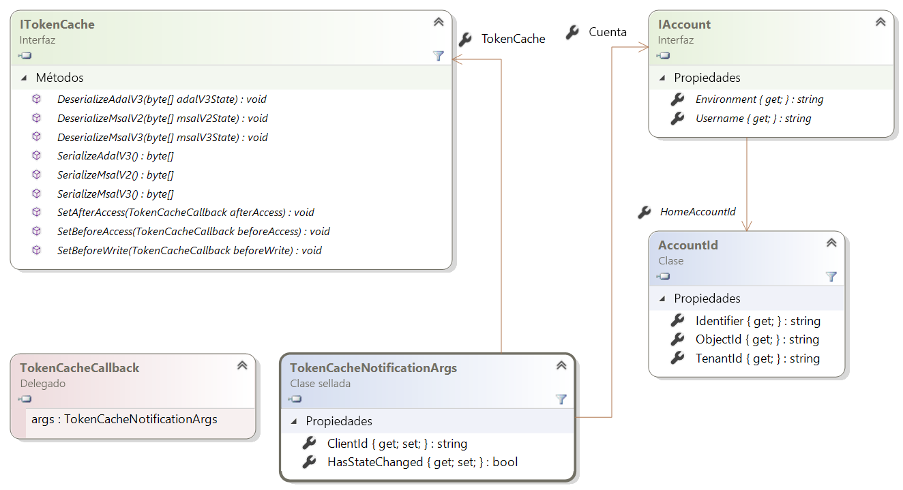
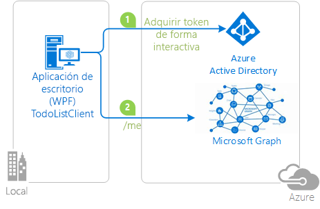

# <a name="token-cache-serialization-in-msalnet"></a>Serialización de la caché de tokens en MSAL.NET
Después de [adquirir un token](msal-acquire-cache-tokens.md), Microsoft Authentication Library for .NET (MSAL) lo almacena en la caché.  El código de la aplicación debe intentar obtener un token de la caché antes de adquirirlo por otro método.  Este artículo describe la serialización predeterminada y personalizada de la caché de tokens en MSAL.NET.

Este artículo es para MSAL.NET 3.x. Si está interesado en MSAL.NET 2.x, consulte [Token cache serialization in MSAL.NET 2.x](https://github.com/AzureAD/microsoft-authentication-library-for-dotnet/wiki/Token-cache-serialization-2x) (Serialización de la caché de tokens en MSAL.NET 2.x).

## <a name="default-serialization-for-mobile-platforms"></a>Serialización predeterminada para plataformas móviles

En MSAL.NET, se proporciona una caché de tokens en memoria de forma predeterminada. Se proporciona serialización de forma predeterminada para las plataformas en las que el almacenamiento seguro está disponible para un usuario como parte de la plataforma. Este es el caso de Plataforma universal de Windows (UWP), Xamarin.iOS y Xamarin.Android.

> [!Note]
> Cuando se migra un proyecto de Xamarin.Android de MSAL.NET 1.x a MSAL.NET 3.x, puede que desee agregar `android:allowBackup="false"` al proyecto para evitar que los tokens almacenados en caché antiguos vuelvan cuando las implementaciones de Visual Studio desencadenen una restauración del almacenamiento local. Consulte el [problema 659](https://github.com/AzureAD/microsoft-authentication-library-for-dotnet/issues/659#issuecomment-436181938).

## <a name="custom-serialization-for-windows-desktop-apps-and-web-appsweb-apis"></a>Serialización personalizada de las aplicaciones de escritorio de Windows y aplicaciones web o API web

Recuerde que la serialización personalizada no está disponible en plataformas para dispositivos móviles (UWP, Xamarin.iOS y Xamarin.Android). MSAL ya define un mecanismo de serialización seguro y de alto rendimiento para estas plataformas. Sin embargo, las aplicaciones de escritorio de .NET y de .NET Core tienen diversas arquitecturas y MSAL no puede implementar un mecanismo de serialización de uso general. Por ejemplo, los sitios web puede elegir almacenar los tokens en una caché en Redis y las aplicaciones de escritorio hacerlo en un archivo cifrado. Por tanto, la serialización no se proporciona de fábrica. Para que haya una aplicación de la caché de tokens de forma constante en el escritorio de .NET o en .NET Core, es preciso personalizar la serialización.

Las siguientes clases e interfaces se usan en la serialización de la caché de tokens:

- `ITokenCache`, que define eventos para suscribirse a las solicitudes de serialización de la caché de tokens, así como métodos para serializar o deserializar la memoria caché en diversos formatos (ADAL v3.0, MSAL 2.x y MSAL 3.x = ADAL v5.0).
- `TokenCacheCallback` es una devolución de llamada que se pasa a los eventos para que pueda controlar la serialización. Se les llamará con argumentos del tipo `TokenCacheNotificationArgs`.
- `TokenCacheNotificationArgs` sólo proporciona el `ClientId` de la aplicación y una referencia al usuario para el que está disponible el token.

  

> [!IMPORTANT]
> MSAL.NET crea automáticamente las cachés de tokens y le ofrece la caché de `IToken` cuando se llama a las propiedades `UserTokenCache` y `AppTokenCache` de una aplicación. Se supone que no va a implementar la interfaz usted mismo. Su responsabilidad al implementar una serialización de caché de tokens personalizada es:
> - Reaccione ante "eventos" `BeforeAccess` y `AfterAccess` (o sus tipos asincrónicos). El delegado de `BeforeAccess` es el responsable de deserializar la memoria caché, mientras que `AfterAccess` es el de serializarla.
> - Una parte de estos eventos almacena o carga blobs, que se pasan a través del argumento del evento al almacenamiento que se desee.

Las estrategias son diferentes en función de si se escribe una serialización de la caché de tokens para una [aplicación cliente pública](msal-client-applications.md) (escritorio) o una [aplicación cliente confidencial](msal-client-applications.md) (aplicación web, API web o aplicación de demonio).

### <a name="token-cache-for-a-public-client"></a>Caché de tokens para un cliente público 

Desde MSAL.NET v2.x hay varias opciones para serializar la caché de tokens de un cliente público. La memoria caché solo se puede serializar en formato MSAL.NET (la caché de formato unificado es común para MSAL y para las plataformas).  También puede admitir la serialización de la caché de tokens [heredada](https://github.com/AzureAD/azure-activedirectory-library-for-dotnet/wiki/Token-cache-serialization) de ADAL V3.

La personalización de la serialización de la caché de tokens para compartir el estado de inicio de sesión único entre ADAL.NET 3.x, ADAL.NET 5.x y MSAL.NET se explica en una parte del ejemplo siguiente: [active-directory-dotnet-v1-to-v2](https://github.com/Azure-Samples/active-directory-dotnet-v1-to-v2).

> [!Note]
> El formato de la caché de tokens MSAL.NET 1.1.4-preview ya no es compatible con MSAL 2.x. Si tiene aplicaciones que aprovechan MSAL.NET 1.x, los usuarios tendrán que volver a iniciar sesión. Sin embargo, se admite la migración desde ADAL 4.x (y 3.x).

#### <a name="simple-token-cache-serialization-msal-only"></a>Serialización de la caché de tokens simple (solo MSAL)

A continuación encontrará un ejemplo de una implementación sencilla de serialización personalizada de una caché de tokens para aplicaciones de escritorio. En este caso, la caché de tokens de usuario es un archivo que está en la misma carpeta que la aplicación.

Después de compilar la aplicación, para habilitar la serialización llame al método `TokenCacheHelper.EnableSerialization()` y use la aplicación `UserTokenCache`.

```csharp
app = PublicClientApplicationBuilder.Create(ClientId)
    .Build();
TokenCacheHelper.EnableSerialization(app.UserTokenCache);
```

La clase auxiliar `TokenCacheHelper` se define como:

```csharp
static class TokenCacheHelper
 {
  public static void EnableSerialization(ITokenCache tokenCache)
  {
   tokenCache.SetBeforeAccess(BeforeAccessNotification);
   tokenCache.SetAfterAccess(AfterAccessNotification);
  }

  /// <summary>
  /// Path to the token cache
  /// </summary>
  public static readonly string CacheFilePath = System.Reflection.Assembly.GetExecutingAssembly().Location + ".msalcache.bin3";

  private static readonly object FileLock = new object();


  private static void BeforeAccessNotification(TokenCacheNotificationArgs args)
  {
   lock (FileLock)
   {
    args.TokenCache.DeserializeMsalV3(File.Exists(CacheFilePath)
            ? ProtectedData.Unprotect(File.ReadAllBytes(CacheFilePath),
                                      null,
                                      DataProtectionScope.CurrentUser)
            : null);
   }
  }

  private static void AfterAccessNotification(TokenCacheNotificationArgs args)
  {
   // if the access operation resulted in a cache update
   if (args.HasStateChanged)
   {
    lock (FileLock)
    {
     // reflect changesgs in the persistent store
     File.WriteAllBytes(CacheFilePath,
                         ProtectedData.Protect(args.TokenCache.SerializeMsalV3(),
                                                 null,
                                                 DataProtectionScope.CurrentUser)
                         );
    }
   }
  }
 }
```

Hay una versión preliminar de un serializador basado en archivos de la caché de tokens con calidad de producto para aplicaciones cliente públicas (para aplicaciones de escritorio que se ejecutan en Windows, Mac y Linux) disponible en la biblioteca de código abierto [Microsoft.Identity.Client.Extensions.Msal](https://github.com/AzureAD/microsoft-authentication-extensions-for-dotnet/tree/master/src/Microsoft.Identity.Client.Extensions.Msal). La puede incluir en sus aplicaciones desde el siguiente paquete NuGet: [Microsoft.Identity.Client.Extensions.Msal](https://www.nuget.org/packages/Microsoft.Identity.Client.Extensions.Msal/).

#### <a name="dual-token-cache-serialization-msal-unified-cache-and-adal-v3"></a>Serialización de la caché de tokens dual (caché unificada de MSAL y ADAL v3)

Si desea implementar la serialización de la caché de tokens tanto con el formato de caché unificado (común a ADAL.NET 4.x, MSAL.NET 2.x y a otros MSALs de la misma generación, o anteriores, que se encuentran en la misma plataforma), eche un vistazo al código siguiente:

```csharp
string appLocation = Path.GetDirectoryName(Assembly.GetEntryAssembly().Location;
string cacheFolder = Path.GetFullPath(appLocation) + @"..\..\..\..");
string adalV3cacheFileName = Path.Combine(cacheFolder, "cacheAdalV3.bin");
string unifiedCacheFileName = Path.Combine(cacheFolder, "unifiedCache.bin");

IPublicClientApplication app;
app = PublicClientApplicationBuilder.Create(clientId)
                                    .Build();
FilesBasedTokenCacheHelper.EnableSerialization(app.UserTokenCache,
                                               unifiedCacheFileName,
                                               adalV3cacheFileName);

```

Esta vez la clase auxiliar se define como:

```csharp
using System;
using System.IO;
using System.Security.Cryptography;
using Microsoft.Identity.Client;

namespace CommonCacheMsalV3
{
 /// <summary>
 /// Simple persistent cache implementation of the dual cache serialization (ADAL V3 legacy
 /// and unified cache format) for a desktop applications (from MSAL 2.x)
 /// </summary>
 static class FilesBasedTokenCacheHelper
 {
  /// <summary>
  /// Enables the serialization of the token cache
  /// </summary>
  /// <param name="adalV3CacheFileName">File name where the cache is serialized with the
  /// ADAL V3 token cache format. Can
  /// be <c>null</c> if you don't want to implement the legacy ADAL V3 token cache
  /// serialization in your MSAL 2.x+ application</param>
  /// <param name="unifiedCacheFileName">File name where the cache is serialized
  /// with the Unified cache format, common to
  /// ADAL V4 and MSAL V2 and above, and also across ADAL/MSAL on the same platform.
  ///  Should not be <c>null</c></param>
  /// <returns></returns>
  public static void EnableSerialization(ITokenCache tokenCache, string unifiedCacheFileName, string adalV3CacheFileName)
  {
   UnifiedCacheFileName = unifiedCacheFileName;
   AdalV3CacheFileName = adalV3CacheFileName;

   tokenCache.SetBeforeAccess(BeforeAccessNotification);
   tokenCache.SetAfterAccess(AfterAccessNotification);
  }

  /// <summary>
  /// File path where the token cache is serialized with the unified cache format
  /// (ADAL.NET V4, MSAL.NET V3)
  /// </summary>
  public static string UnifiedCacheFileName { get; private set; }

  /// <summary>
  /// File path where the token cache is serialized with the legacy ADAL V3 format
  /// </summary>
  public static string AdalV3CacheFileName { get; private set; }

  private static readonly object FileLock = new object();

  public static void BeforeAccessNotification(TokenCacheNotificationArgs args)
  {
   lock (FileLock)
   {
    args.TokenCache.DeserializeAdalV3(ReadFromFileIfExists(AdalV3CacheFileName));
    try
    {
     args.TokenCache.DeserializeMsalV3(ReadFromFileIfExists(UnifiedCacheFileName));
    }
    catch(Exception ex)
    {
     // Compatibility with the MSAL v2 cache if you used one
     args.TokenCache.DeserializeMsalV2(ReadFromFileIfExists(UnifiedCacheFileName));
    }
   }
  }

  public static void AfterAccessNotification(TokenCacheNotificationArgs args)
  {
   // if the access operation resulted in a cache update
   if (args.HasStateChanged)
   {
    lock (FileLock)
    {
     WriteToFileIfNotNull(UnifiedCacheFileName, args.TokenCache.SerializeMsalV3());
     if (!string.IsNullOrWhiteSpace(AdalV3CacheFileName))
     {
      WriteToFileIfNotNull(AdalV3CacheFileName, args.TokenCache.SerializeAdalV3());
     }
    }
   }
  }

  /// <summary>
  /// Read the content of a file if it exists
  /// </summary>
  /// <param name="path">File path</param>
  /// <returns>Content of the file (in bytes)</returns>
  private static byte[] ReadFromFileIfExists(string path)
  {
   byte[] protectedBytes = (!string.IsNullOrEmpty(path) && File.Exists(path))
       ? File.ReadAllBytes(path) : null;
   byte[] unprotectedBytes = encrypt ?
       ((protectedBytes != null) ? ProtectedData.Unprotect(protectedBytes, null, DataProtectionScope.CurrentUser) : null)
       : protectedBytes;
   return unprotectedBytes;
  }

  /// <summary>
  /// Writes a blob of bytes to a file. If the blob is <c>null</c>, deletes the file
  /// </summary>
  /// <param name="path">path to the file to write</param>
  /// <param name="blob">Blob of bytes to write</param>
  private static void WriteToFileIfNotNull(string path, byte[] blob)
  {
   if (blob != null)
   {
    byte[] protectedBytes = encrypt
      ? ProtectedData.Protect(blob, null, DataProtectionScope.CurrentUser)
      : blob;
    File.WriteAllBytes(path, protectedBytes);
   }
   else
   {
    File.Delete(path);
   }
  }

  // Change if you want to test with an un-encrypted blob (this is a json format)
  private static bool encrypt = true;
 }
}
```

### <a name="token-cache-for-a-web-app-confidential-client-application"></a>Caché de tokens para una aplicación web (aplicación cliente confidencial)

En las aplicaciones web o las API web la caché puede aprovechar la sesión, una caché en Redis o una base de datos.

En aplicaciones web o API web, mantenga una caché de tokens por cada cuenta.  En el caso de las aplicaciones web, la caché de tokens debe estar protegida con clave mediante el identificador de cuenta.  En el caso de las API web, la cuenta debe estar protegida con clave mediante el hash del token usado para llamar a la API. MSAL.NET proporciona serialización de caché de tokens personalizada en .NET Framework y las subplataformas .NET Core. Los eventos se desencadenan cuando se accede a la caché; las aplicaciones pueden elegir si serializar o deserializar la caché. En aplicaciones cliente confidenciales que controlan a los usuarios (aplicaciones web que inician la sesión de los usuarios y llaman a las API web, y API web que llaman a las API web de nivel inferior), puede haber muchos usuarios y los usuarios se procesan en paralelo. Por motivos de seguridad y rendimiento, se recomienda serializar una caché por cada usuario. Los eventos de serialización calculan una clave de caché según la identidad del usuario procesado y serializan o deserializan una caché de tokens para ese usuario.

Hay ejemplos de uso de las cachés de tokens para aplicaciones web y API web disponibles en el [tutorial de aplicaciones web de ASP.NET Core](https://ms-identity-aspnetcore-webapp-tutorial), en la fase [2-2 Token Cache](https://github.com/Azure-Samples/active-directory-aspnetcore-webapp-openidconnect-v2/tree/master/2-WebApp-graph-user/2-2-TokenCache). Para ver las implementaciones, diríjase a la carpeta [TokenCacheProviders](https://github.com/Azure-Samples/active-directory-aspnetcore-webapp-openidconnect-v2/tree/master/Microsoft.Identity.Web/TokenCacheProviders) de la biblioteca [microsoft-authentication-extensions-for-dotnet](https://github.com/AzureAD/microsoft-authentication-extensions-for-dotnet) (en la carpeta [ Microsoft.Identity.Client.Extensions.Web](https://github.com/AzureAD/microsoft-authentication-extensions-for-dotnet/tree/master/src/Microsoft.Identity.Client.Extensions.Web)). 

## <a name="next-steps"></a>Pasos siguientes
Los ejemplos siguientes ilustran la serialización de la caché de tokens.

| Muestra | Plataforma | Descripción|
| ------ | -------- | ----------- |
|[active-directory-dotnet-desktop-msgraph-v2](https://github.com/azure-samples/active-directory-dotnet-desktop-msgraph-v2) | Escritorio (WPF) | Aplicación .NET de Windows Desktop (WPF) que llama a la API Microsoft Graph. |
|[active-directory-dotnet-v1-to-v2](https://github.com/Azure-Samples/active-directory-dotnet-v1-to-v2) | Escritorio (consola) | Conjunto de soluciones de Visual Studio que ilustra la migración de aplicaciones de Azure AD v1.0 (mediante ADAL.NET) a aplicaciones de Azure AD v2.0, también denominadas aplicaciones convergente (mediante MSAL.NET), en particular [migración de la caché de tokens](https://github.com/Azure-Samples/active-directory-dotnet-v1-to-v2/blob/master/TokenCacheMigration/README.md)|
