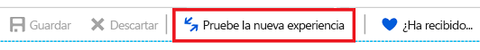
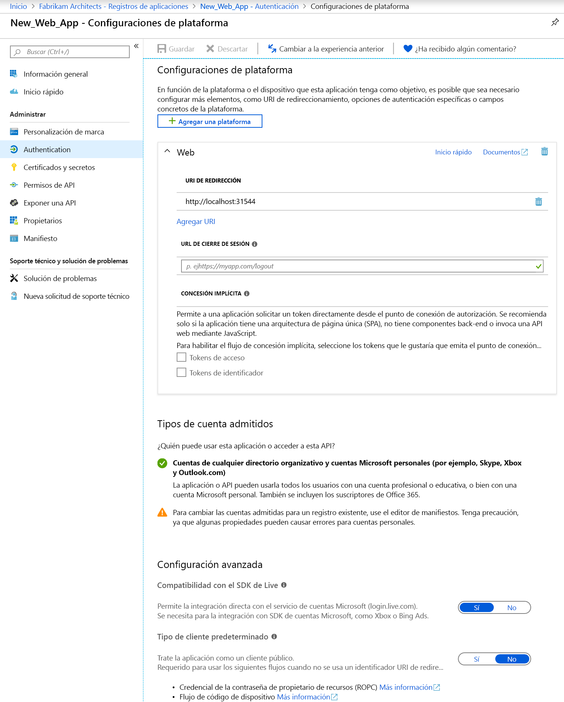

# Inicio rápido: Configuración de una aplicación cliente para tener acceso a las API web

Para que una aplicación cliente web o confidencial pueda participar en un flujo de concesión de autorización que requiera autenticación (y obtener un token de acceso), debe establecer credenciales seguras. El método de autenticación predeterminado compatible con Azure Portal es un identificador de cliente y una clave secreta.

Además, para que un cliente pueda tener acceso a una API web expuesta por una aplicación de recursos (como Microsoft Graph API), el marco de consentimiento garantiza que el cliente obtenga la concesión de los permisos necesarios en función de los solicitados. De forma predeterminada, todas las aplicaciones pueden elegir permisos de Microsoft Graph API. El [permiso "Iniciar sesión y leer el perfil de usuario" de Graph API](https://developer.microsoft.com/graph/docs/concepts/permissions_reference#user-permissions) se selecciona de forma predeterminada. Puede seleccionar entre [dos tipos de permisos](developer-glossary.md#permissions) para cada API web que desee:

* **Permisos de la aplicación**: la aplicación cliente necesita acceso directo a la API web como sí misma (sin contexto de usuario). Este tipo de permiso requiere el consentimiento del administrador y no está disponible para aplicaciones cliente públicas (para dispositivos de escritorio y móviles).
* **Permisos delegados**: la aplicación cliente necesita acceso a la API web como el usuario que inició sesión, pero con acceso limitado por el permiso seleccionado. Este tipo de permiso lo puede conceder un usuario a menos que el permiso requiera el consentimiento del administrador.

  > [!NOTE]
  > La adición de un permiso delegado a una aplicación no concede consentimiento automáticamente a los usuarios del inquilino. Los usuarios tienen todavía que conceder manualmente el consentimiento para los permisos delegados agregados en tiempo de ejecución, a menos que lo haga el administrador en nombre de todos los usuarios.

En esta guía de inicio rápido, le mostraremos cómo configurar la aplicación mediante:

* [Adición de identificadores URI de redireccionamiento a la aplicación](#add-redirect-uris-to-your-application)
* [Configuración avanzada de la aplicación](#configure-advanced-settings-for-your-application)
* [Modificación de los tipos de cuenta admitidos](#modify-supported-account-types)
* [Adición de credenciales a la aplicación web](#add-credentials-to-your-web-application)
* [Adición de permisos para acceder a las API web](#add-permissions-to-access-web-apis)

## Prerequisites

Para comenzar, asegúrese de que completa estos requisitos previos:

* Aprenda sobre los [permisos y consentimiento](v2-permissions-and-consent.md) admitidos, que son importantes comprender al crear aplicaciones que necesitan ser utilizadas por otros usuarios o aplicaciones.
* Tiene un inquilino que tenga las aplicaciones registradas en él.
  * Si no tiene aplicaciones registradas, [aprenda a registrar aplicaciones con la plataforma de identidad de Microsoft](quickstart-register-app.md).

## Inicio de sesión en Azure Portal y selección de la aplicación

Antes de configurar la aplicación, siga estos pasos:

1. Inicie sesión en [Azure Portal](https://portal.azure.com) con una cuenta personal, profesional o educativa de Microsoft.
1. Si la cuenta proporciona acceso a más de un inquilino, haga clic en la cuenta en la esquina superior derecha y establezca la sesión del portal en el inquilino de Azure AD deseado.
1. Busque y seleccione **Azure Active Directory**. 
1. En el panel izquierdo, seleccione **Registros de aplicaciones**.
1. Busque y seleccione la aplicación que desea configurar. Cuando haya seleccionado la aplicación, verá la página **Introducción** de la aplicación o la de registro principal.
1. Siga los pasos para configurar la aplicación para acceder a las API web:
    * [Adición de identificadores URI de redireccionamiento a la aplicación](#add-redirect-uris-to-your-application)
    * [Configuración avanzada de la aplicación](#configure-advanced-settings-for-your-application)
    * [Modificación de los tipos de cuenta admitidos](#modify-supported-account-types)
    * [Adición de credenciales a la aplicación web](#add-credentials-to-your-web-application)
    * [Adición de permisos para acceder a las API web](#add-permissions-to-access-web-apis)

## Adición de identificadores URI de redireccionamiento a la aplicación

Para agregar un identificador URI de redireccionamiento a la aplicación:

1. Desde la página **Introducción** de la aplicación, seleccione la sección **Autenticación**.
1. Para agregar un URI de redireccionamiento personalizado para aplicaciones cliente web y públicas, siga estos pasos:
   1. Busque la sección **URI de redireccionamiento**.
   1. Seleccione el tipo de aplicación que se va a crear, **Web** o **Cliente público (móvil y escritorio)** .
   1. Escriba el identificador URI de redireccionamiento para la aplicación.
      * Para aplicaciones web, proporcione la dirección URL base de la aplicación. Por ejemplo, `http://localhost:31544` podría ser la dirección URL de una aplicación web que se ejecuta en la máquina local. Los usuarios utilizan esta dirección URL para iniciar sesión en una aplicación cliente web.
      * Para aplicaciones públicas, proporcione el identificador URI que utiliza Azure AD para devolver las respuestas de los tokens. Escriba un valor específico para la aplicación, como `https://MyFirstApp`.

1. Para elegir entre los identificadores URI de redireccionamiento sugeridos para clientes públicos (para dispositivos móviles o de escritorio), siga estos pasos:
    1. Localice la sección **URI de redireccionamiento sugeridos para clientes públicos (para dispositivos móviles o de escritorio)** .
    1. Seleccione los identificadores URI de redireccionamiento adecuados para su aplicación mediante las casillas. También puede escribir un URI de redireccionamiento personalizado. Si no está seguro de lo que debe usar, consulte la documentación de la biblioteca.

Hay ciertas restricciones que se aplican a los URI de redireccionamiento. Más información sobre las [limitaciones y restricciones de los URI de redireccionamiento](https://docs.microsoft.com/azure/active-directory/develop/reply-url).
> [!NOTE]
> Pruebe la nueva experiencia de configuración de **autenticación**, donde puede configurar su aplicación basándose en la plataforma o dispositivo que tenga como destino.
>
> Para acceder a esta vista, seleccione **Probar la nueva experiencia** en la vista de página **Autenticación** predeterminada.
>
> 
>
> Se abrirá la [nueva página **Configuraciones de plataforma**](#configure-platform-settings-for-your-application).

### Configuración avanzada de la aplicación

Según la aplicación que quiera registrar, hay opciones adicionales que puede que tenga que configurar, como las siguientes:

* **Dirección URL de cierre de sesión**
* Para las aplicaciones de una página, puede habilitar la opción **Concesión implícita** y seleccionar los tokens que quiera que emita el punto de conexión de autorización.
* Para las aplicaciones de escritorio que obtienen tokens con la autenticación integrada de Windows, un flujo de código del dispositivo o un nombre de usuario y contraseña en la sección **Tipo de cliente predeterminado**, establezca la opción **Considerar la aplicación como un cliente público** en **Sí**.
* En el caso de las aplicaciones heredadas que usaban el SDK de LIVE para la integración con el servicio de cuentas Microsoft, establezca la opción **Compatibilidad con el SDK de Live**. Las nuevas aplicaciones no necesitan esta configuración.
* **Tipo de cliente predeterminado**

### Modificación de los tipos de cuenta admitidos

La opción **Tipos de cuenta admitidos** especifica quién puede usar la aplicación o acceder a la API.

Después de [configurar los tipos de cuenta admitidos](quickstart-register-app.md) al registrar inicialmente la aplicación, solo podrá cambiar esta opción mediante el editor de manifiesto de la aplicación si:

* Cambia los tipos de cuenta de **AzureADMyOrg** o **AzureADMultipleOrgs** a **AzureADandPersonalMicrosoftAccount**, o viceversa.
* Cambia los tipos de cuenta de **AzureADMyOrg** a **AzureADMultipleOrgs**, o viceversa.

Para cambiar los tipos de cuenta admitidos de un registro de aplicación existente:

* Vea [Configurar el manifiesto de la aplicación](reference-app-manifest.md) y actualice la clave `signInAudience`.

## Configuración de la plataforma para su aplicación

Para configurar la aplicación según la plataforma o dispositivo que tenga como destino:

1. En la página **Configuraciones de plataforma**, haga clic en **Agregar una plataforma** y seleccione una de las opciones disponibles.

   

1. Especifique la información de configuración según la plataforma que haya seleccionado.

   | Plataforma                | Opciones              | Parámetros de configuración            |
   |-------------------------|----------------------|-----------------------------------|
   | **Aplicaciones web**    | **Web**              | Escriba el **URI de redireccionamiento** para la aplicación. |
   | **Aplicaciones móviles** | **iOS**              | Escriba el **Identificador de paquete** de la aplicación, que encontrará en Xcode en Info.plist, o bien en Configuración de compilación. Al agregar del identificador del paquete, se crea automáticamente un URI de redireccionamiento para la aplicación. |
   |                         | **Android**          | * Especifique el **Nombre del paquete** de la aplicación, que encontrará en el archivo AndroidManifest.xml. * Genere y especifique el **Hash de firma**. Al agregar el hash de firma, se crea automáticamente un URI de redireccionamiento para la aplicación.  |
   | **Escritorio y dispositivos**   | **Escritorio y dispositivos** | * Opcional. Si va a crear aplicaciones para dispositivos y equipos de escritorio, seleccione uno de los **URI de redireccionamiento sugeridos**. * Opcional. Escriba un **URI de redireccionamiento personalizado**, que se usa como la ubicación a la que Azure AD redirigirá a los usuarios en respuesta a las solicitudes de autenticación. Por ejemplo, para las aplicaciones de .NET Core en las que quiera agregar una interacción, use `https://localhost`. |

   > [!IMPORTANT]
   > En el caso de las aplicaciones móviles que no usen la biblioteca de MSAL más reciente o que no usen un agente, tendrá que configurar los URI de redireccionamiento para esas aplicaciones en **Escritorio y dispositivos**.

1. Según la plataforma que use, es posible que pueda configurar opciones adicionales. Para las aplicaciones **web**, puede realizar estas acciones:
    * Adición de URI de redireccionamiento
    * Configure la opción **Concesión implícita** para seleccionar los tokens que quiera que emita el punto de conexión de autorización:
        * Para aplicaciones de una página, seleccione las opciones **Tokens de acceso** y **Tokens de identificador**.
        * Para las aplicaciones web, seleccione **Tokens de identificador**.

## Adición de credenciales a la aplicación web

Para agregar una credencial a la aplicación web:

1. Desde la página **Introducción** de la aplicación, seleccione la sección **Certificados y secretos**.

1. Para agregar un certificado, siga estos pasos:

    1. Seleccione **Cargar certificado**.
    1. Seleccione el archivo que desea cargar. Debe ser uno de los siguientes tipos de archivo: .cer, .pem, .crt.
    1. Seleccione **Agregar**.

1. Para agregar un secreto de cliente, siga estos pasos:

    1. Seleccione **Nuevo secreto de cliente**.
    1. Agregue una descripción para el secreto de cliente.
    1. Seleccione una duración.
    1. Seleccione **Agregar**.

> [!NOTE]
> Después de guardar los cambios de configuración, la columna en el extremo derecho contendrá el valor del secreto de cliente. **Asegúrese de copiar el valor** para su uso en el código de la aplicación cliente, ya que no es accesible una vez se sale de esta página.

## Adición de permisos para acceder a las API web

Para agregar permisos para tener acceso a las API de recursos desde el cliente:

1. Desde la página **Introducción** de la aplicación, seleccione **Permisos de API**.
1. En la sección **Permisos configurados**, seleccione el botón **Agregar un permiso**.
1. De forma predeterminada, la vista le permite seleccionar en las **API de Microsoft**. Seleccione la sección de las API que le interesa:
    * **API de Microsoft**: le permite seleccionar los permisos para las API de Microsoft, como Microsoft Graph.
    * **API usadas en mi organización**: le permite seleccionar los permisos para las API que se han expuesto por la organización o para las API con las que se ha integrado la organización.
    * **Mis API**: le permite seleccionar los permisos para las API que ha expuesto.
1. Una vez que haya seleccionado las API, verá la página **Solicitud de permisos de API**. Si la API expone permisos delegados y de aplicación, seleccione el tipo de permiso que necesita la aplicación.
1. Cuando termine, seleccione **Agregar permisos**. Volverá a la página **Permisos de API**, donde los permisos se han guardado y agregado a la tabla.

## Descripción de los permisos de API y la UI de consentimiento del administrador

### Permisos configurados

En esta sección se muestran los permisos que se han configurado explícitamente en el objeto de aplicación (los permisos que forman parte de la lista de acceso a recursos necesarios de la aplicación). Puede agregar o quitar permisos de esta tabla. Como administrador, en esta sección también puede conceder o revocar el consentimiento del administrador para un conjunto de permisos de una API o permisos individuales.

### Otros permisos concedidos

Si la aplicación está registrada en un inquilino, es posible que vea una sección adicional titulada **Other permissions granted for Tenant** (Otros permisos concedidos para el inquilino). En esta sección se muestran los permisos que se han concedido para el inquilino, pero que no se han configurado explícitamente en el objeto de aplicación (por ejemplo, los permisos que se solicitaron y concedieron dinámicamente). Esta sección solo aparece si hay al menos un permiso que se aplique.

Puede agregar un conjunto de permisos de API o permisos individuales que aparecen en esta sección a la sección **Permisos configurados**. Como administrador, en esta sección también puede revocar el consentimiento del administrador para API o permisos individuales.

### Botón Consentimiento del administrador

Si la aplicación está registrada en un inquilino, verá un botón **Grant admin consent for Tenant** (Conceder consentimiento del administración al inquilino). Se deshabilitará si no es administrador o si no se han configurado permisos para la aplicación.
Este botón permite a un administrador conceder fácilmente el consentimiento del administrador a los permisos configurados para la aplicación. Al hacer clic en el botón de consentimiento del administrador, se abre una nueva ventana con una petición de consentimiento que muestra todos los permisos configurados.

> [!NOTE]
> Hay un retraso entre que se configuran los permisos para la aplicación y que aparecen en la petición de consentimiento. Si no ve todos los permisos configurados en la petición de consentimiento, ciérrela y vuelva a iniciarla.

Si tiene permisos que se han concedido, pero no configurado, al hacer clic en el botón de consentimiento del administrador, se le pedirá que decida cómo administrar estos permisos. Puede agregarlos a los permisos configurados o puede quitarlos.

La petición de consentimiento da la opción de **Aceptar** o **Cancelar**. Si selecciona **Aceptar**, se concede el consentimiento del administrador. Si selecciona **Cancelar**, no se concede el consentimiento del administrador, y verá un error que indica que se ha rechazado el consentimiento.

> [!NOTE]
> Hay un retraso entre que se concede el consentimiento del administrador (seleccionar **Aceptar** en la petición de consentimiento) y el estado del consentimiento del administrador se ve reflejado en la interfaz de usuario.

## Pasos siguientes

Obtenga información acerca de estas otras guías de inicio rápido de administración de aplicaciones relacionadas para aplicaciones:

* [Registro de una aplicación con la plataforma de identidad de Microsoft](quickstart-register-app.md)
* [Configuración de una aplicación para exponer las API web](quickstart-configure-app-expose-web-apis.md)
* [Modificación de las cuentas compatibles con una aplicación](quickstart-modify-supported-accounts.md)
* [Eliminación de una aplicación registrada con la plataforma de identidad de Microsoft](quickstart-remove-app.md)

Para obtener más información acerca de los dos objetos de Azure AD que representan una aplicación registrada y la relación entre ellos, consulte [Objetos de aplicación y de entidad de servicio](app-objects-and-service-principals.md).

Para obtener más información acerca de las directrices de personalización de marca que hay que usar al desarrollar aplicaciones con Azure Active Directory, consulte [Directrices de personalización de marca para aplicaciones](howto-add-branding-in-azure-ad-apps.md).
