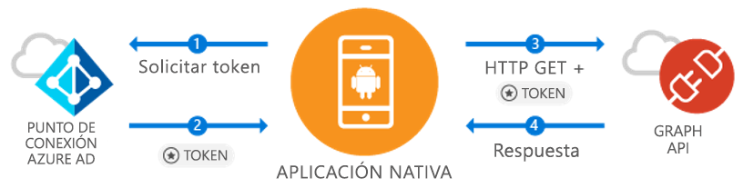

# <a name="quickstart-sign-in-users-and-call-the-microsoft-graph-api-from-an-android-app"></a>Guía de inicio rápido: Inicie sesión de los usuarios y llame a Microsoft Graph API desde una aplicación de Android

[!INCLUDE [active-directory-develop-applies-v1-adal](../../../includes/active-directory-develop-applies-v1-adal.md)]

Si está desarrollando una aplicación para Android, Microsoft hace que los usuarios puedan iniciar sesión en Azure Active Directory (Azure AD) de forma fácil y directa. Azure AD permite que la aplicación acceda a los datos de usuario a través de Microsoft Graph o de su propia API web protegida.

La biblioteca para Android, Biblioteca de Autenticación de Azure AD (ADAL), permite que la aplicación pueda empezar a usar [Microsoft Azure Cloud](https://azure.microsoft.com/free/cloud-services/) y [Microsoft Graph API](https://developer.microsoft.com/graph) al ser compatible con [cuentas de Microsoft Azure Active Directory](https://azure.microsoft.com/services/active-directory/) con OAuth 2.0 y OpenID Connect estándar del sector.

En esta guía de inicio rápido, aprenderá a hacer lo siguiente:

* Obtener un token de Microsoft Graph
* Actualizar un token
* Llamar a Microsoft Graph
* Cerrar la sesión del usuario

## <a name="prerequisites"></a>Requisitos previos

Para comenzar, necesitará a un inquilino de Azure AD en el que pueda crear usuarios y registrar una aplicación. Si aún no tiene un inquilino, [descubra cómo conseguir uno](quickstart-create-new-tenant.md).

## <a name="scenario-sign-in-users-and-call-the-microsoft-graph"></a>Escenario: Realice el inicio de sesión de usuarios y llame a Microsoft Graph



Puede usar esta aplicación para todas las cuentas de Azure AD. Es compatible con escenarios únicos y multiinquilino (que se describen en pasos). Muestra cómo puede compilar aplicaciones para conectarse con usuarios empresariales y acceder a sus datos de Azure + O365 a través de Microsoft Graph. Durante el flujo de autenticación, los usuarios finales deberán iniciar sesión y aceptar los permisos de la aplicación y, en algunos casos, es posible que un administrador tenga que dar su consentimiento a la aplicación. La mayoría de la lógica de este ejemplo muestra cómo autenticar un usuario final y realizar una llamada básica a Microsoft Graph.

## <a name="sample-code"></a>Código de ejemplo

El código de ejemplo completo se puede encontrar [en GitHub](https://github.com/Azure-Samples/active-directory-android).

```Java
// Initialize your app with MSAL
AuthenticationContext mAuthContext = new AuthenticationContext(
        MainActivity.this,
        AUTHORITY,
        false);


// Perform authentication requests
mAuthContext.acquireToken(
    getActivity(),
    RESOURCE_ID,
    CLIENT_ID,
    REDIRECT_URI,
    PromptBehavior.Auto,
    getAuthInteractiveCallback());

// ...

// Get tokens to call APIs like the Microsoft Graph
mAuthResult.getAccessToken()
```

## <a name="step-1-register-and-configure-your-app"></a>Paso 1: Registrar y configurar la aplicación

Debe haber registrado una aplicación cliente nativa con Microsoft mediante [Azure Portal](https://portal.azure.com).

1. Acceder al registro de la aplicación
    - Acceda a [Azure Portal](https://aad.portal.azure.com).
    - Seleccione ***Azure Active Directory*** > ***Registros de aplicaciones***.

2. Creación de la aplicación
    - Seleccione **Nuevo registro**.
    - Escriba un nombre de aplicación en el campo **Nombre**.
    - En **Supported account types** (Tipos de cuenta compatibles), seleccione **Accounts in any organizational directory and personal Microsoft accounts** (Cuentas en cualquier directorio de organización y cuentas personales de Microsoft).
    - En **URI de redireccionamiento**, seleccione **Public client (mobile and desktop)** (Cliente público [dispositivos móviles y escritorio]) en la lista desplegable y escriba `http://localhost`.
    - Haga clic en **Registrar**.

3. Configurar Microsoft Graph
    - Seleccione **Permisos de API**.
    - Seleccione **Agregar un permiso** y, dentro de **Seleccionar una API**, seleccione ***Microsoft Graph***.
    - En **Permisos delegados**, seleccione el permiso **User.Read** y presione **Agregar** para guardar.        
    
4. ¡Enhorabuena! La aplicación se ha configurado correctamente. En la siguiente sección, necesitará:
    - `Application ID`
    - `Redirect URI`

## <a name="step-2-get-the-sample-code"></a>Paso 2: Obtención del código de ejemplo

1. Clonar el código.
    ```
    git clone https://github.com/Azure-Samples/active-directory-android
    ```
2. Abra el ejemplo en Android Studio.
    - Seleccione **Abrir un proyecto existente de Android Studio**.

## <a name="step-3-configure-your-code"></a>Paso 3: Configurar el código

Puede encontrar toda la configuración de este ejemplo de código en el archivo ***src/main/java/com/azuresamples/azuresampleapp/MainActivity.java***.

1. Reemplace la constante `CLIENT_ID` con el valor `ApplicationID`.
2. Reemplace la constante `REDIRECT URI` con el valor `Redirect URI` que configuró anteriormente (`http://localhost`).

## <a name="step-4-run-the-sample"></a>Paso 4: Ejecución del ejemplo

1. Seleccione **Compilar > Limpiar el proyecto**.
2. Seleccione **Ejecutar > ejecutar aplicación**.
3. La aplicación debe compilarse y mostrar la experiencia del usuario básica. Al hacer clic en el botón `Call Graph API`, se solicita un inicio de sesión y después, en modo silencioso, se llama a Microsoft Graph API con el nuevo token.

## <a name="next-steps"></a>Pasos siguientes

1. Consulte la [wiki de ADAL para Android](https://github.com/AzureAD/azure-activedirectory-library-for-android/wiki) para obtener más información sobre los mecanismos de biblioteca y cómo configurar nuevos escenarios y funcionalidades.
2. En escenarios nativo, la aplicación usará un elemento WebView incrustado y no saldrá de la aplicación. El valor `Redirect URI` puede ser arbitrario.
3. ¿Encontró algún problema o tiene preguntas? Puede crear un problema o una publicación en Stack Overflow con la etiqueta `azure-active-directory`.

### <a name="cross-app-sso"></a>SSO entre aplicaciones

Obtenga información sobre la [Habilitación de SSO entre aplicaciones en Android mediante ADAL](howto-v1-enable-sso-android.md).

### <a name="auth-telemetry"></a>Telemetría de autenticación

La biblioteca ADAL expone telemetría de autenticación para ayudar a los desarrolladores de aplicaciones a comprender cómo se comportan sus aplicaciones para poder crear mejores experiencias. Esto le permite obtener un inicio de sesión correcto, usuarios activos y varias otras conclusiones interesantes. Para usar telemetría de autenticación, los desarrolladores de aplicaciones necesitan establecer un servicio de telemetría para agregar y almacenar eventos.

Para obtener más información sobre telemetría de autenticación, consulte [Telemetría de autenticación de ADAL para Android](https://github.com/AzureAD/azure-activedirectory-library-for-android/wiki/Telemetry).
