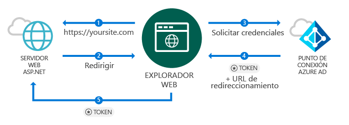
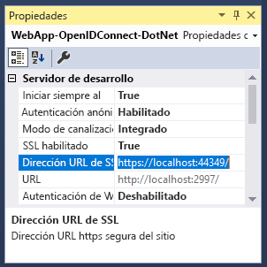
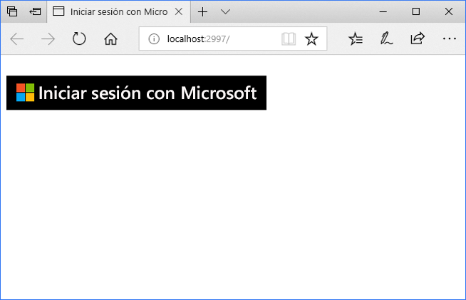
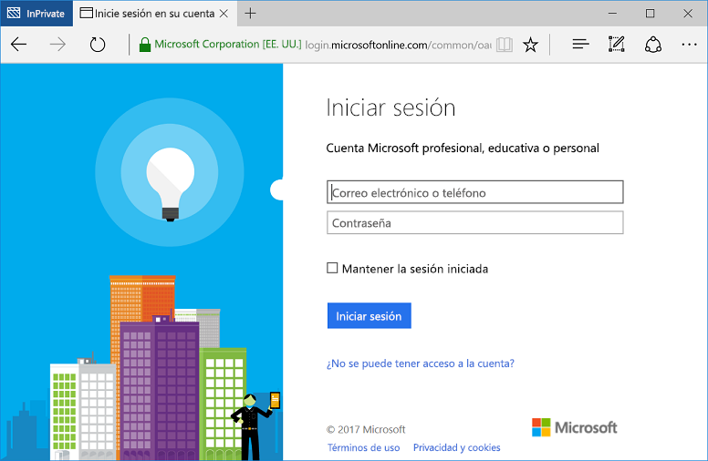

# <a name="quickstart-add-sign-in-with-microsoft-to-an-aspnet-web-app"></a>Inicio rápido: Adición de inicio de sesión con Microsoft a una aplicación web ASP.NET

[!INCLUDE [active-directory-develop-applies-v1](../../../includes/active-directory-develop-applies-v1.md)]

En este inicio rápido, obtendrá información sobre cómo implementar el inicio de sesión con Microsoft mediante una solución MVC de ASP.NET con una aplicación basada en explorador web tradicional mediante OpenID Connect. Obtendrá información acerca de cómo habilitar los inicios de sesión de cuentas profesionales y educativas en la aplicación ASP.NET.

Al final de esta guía de inicio rápido, la aplicación aceptará inicios de sesión de cuentas profesionales y educativas de organizaciones que se han integrado con Azure Active Directory (Azure AD).

> [!NOTE]
> Si necesita habilitar los inicios de sesión para las cuentas personales además de hacerlo para las cuentas profesionales y educativas, puede usar el *[punto de conexión de la plataforma de identidad](azure-ad-endpoint-comparison.md)*. Para más información, consulte [este tutorial de ASP.NET](tutorial-v2-asp-webapp.md) y [este artículo](active-directory-v2-limitations.md), que explica el *punto de conexión de la plataforma de identidad de Microsoft*.

## <a name="prerequisites"></a>Requisitos previos

Para comenzar, asegúrese de que cumple estos requisitos previos:

* Tener instalado Visual Studio 2015 Update 3 o una versión posterior. ¿No lo tiene? [Descargar Visual Studio 2019 de manera gratuita](https://www.visualstudio.com/downloads/)

## <a name="scenario-sign-in-users-from-work-and-school-accounts-in-your-aspnet-app"></a>Escenario: realice el inicio sesión de los usuarios desde cuentas profesionales y educativas en la aplicación ASP.NET



Un explorador tiene acceso a un sitio web ASP.NET y solicita a un usuario la autenticación mediante un botón de inicio de sesión. En esa situación, la mayoría del trabajo para representar la página web se produce en el servidor.

El inicio rápido muestra cómo los usuarios inician sesión en una aplicación web ASP.NET a partir de una plantilla vacía. También incluye pasos para agregar un botón de inicio de sesión y cada controlador y métodos. Además, se explican los conceptos inherentes a estas tareas. También puede crear un proyecto para iniciar sesión de los usuarios de Azure AD (cuentas profesionales y educativas) mediante el uso de la [plantilla web de Visual Studio](https://docs.microsoft.com/aspnet/visual-studio/overview/2013/creating-web-projects-in-visual-studio#organizational-account-authentication-options) y la selección de **cuentas de organización** y, luego, una de las opciones de la nube. Esta opción usa una plantilla enriquecida, con controladores, métodos y vistas adicionales.

## <a name="libraries"></a>Bibliotecas

En esta guía de inicio rápido se usan los paquetes siguientes:

| Biblioteca | DESCRIPCIÓN |
|---|---|
| [Microsoft.Owin.Security.OpenIdConnect](https://www.nuget.org/packages/Microsoft.Owin.Security.OpenIdConnect/) | Middleware que permite a una aplicación que use OpenIDConnect para la autenticación |
| [Microsoft.Owin.Security.Cookies](https://www.nuget.org/packages/Microsoft.Owin.Security.Cookies) |Middleware que permite a una aplicación que mantenga la sesión del usuario mediante cookies |
| [Microsoft.Owin.Host.SystemWeb](https://www.nuget.org/packages/Microsoft.Owin.Host.SystemWeb) | Permite que aplicaciones basadas en OWIN se ejecuten en IIS mediante la canalización de solicitudes ASP.NET |
|  |  |

## <a name="step-1-set-up-your-project"></a>Paso 1: Configurar su proyecto

Estos pasos le indican cómo instalar y configurar la canalización de autenticación a través del middleware OWIN en un proyecto de ASP.NET con OpenID Connect.

Para descargar este proyecto de Visual Studio de ejemplo en su lugar, siga estos pasos:
1. [Descargue el proyecto en GitHub](https://github.com/AzureADQuickStarts/WebApp-OpenIdConnect-DotNet/archive/GuidedSetup.zip).
1. Vaya al paso de configuración para configurar el código de ejemplo antes de ejecutarlo.

## <a name="step-2-create-your-aspnet-project"></a>Paso 2: Creación del proyecto de ASP.NET

1. En Visual Studio, vaya a **Archivo -> Nuevo > Proyecto**.
2. En **Tipo de proyecto**, seleccione **Web** y, después, **Aplicación web ASP.NET (.NET Framework)**.
3. Asigne un nombre a la aplicación y seleccione **Crear**.
4. Seleccione **Vacío** y, después, seleccione **MVC** en **Agregar carpetas y referencias principales** para agregar referencias de MVC.
5. Seleccione **Crear**.

## <a name="step-3-add-authentication-components"></a>Paso 3: Adición de componentes de autenticación

1. En Visual Studio, vaya a **Herramientas > Administrador de paquetes NuGet > Consola del Administrador de paquetes**.
2. Agregue los **paquetes de NuGet de middleware de OWIN** escribiendo lo siguiente en la ventana de la Consola del Administrador de paquetes:

    ```powershell
    Install-Package Microsoft.Owin.Security.OpenIdConnect
    Install-Package Microsoft.Owin.Security.Cookies
    Install-Package Microsoft.Owin.Host.SystemWeb
    ```

<!--start-collapse-->
> ### <a name="about-these-packages"></a>Información sobre estos paquetes
>Las bibliotecas anteriores habilitan el inicio de sesión único (SSO) utilizando OpenID Connect a través de la autenticación basada en cookies. Una vez que se completa la autenticación y se envía el token que representa al usuario a la aplicación, el middleware de OWIN crea una cookie de sesión. El explorador usa a continuación esta cookie en solicitudes posteriores para que el usuario no tenga que volver a autenticarse y no es necesaria ninguna comprobación adicional.
<!--end-collapse-->

## <a name="step-4-configure-the-authentication-pipeline"></a>Paso 4: Configuración de la canalización de autenticación

Siga estos pasos para crear una *clase de inicio* del middleware de OWIN para configurar la autenticación de OpenID Connect. Esta clase se ejecuta automáticamente.

> [!TIP]
> Si el proyecto no tiene un archivo `Startup.cs` en la carpeta raíz:<br/>
> 1. Haga clic con el botón derecho en la carpeta raíz del proyecto: >    **Agregar > Nuevo elemento... > Clase de inicio OWIN**.<br/>
> 2. Asígnele el nombre `Startup.cs`.<br/>
>
>> Asegúrese de que la clase seleccionada es una clase de inicio de OWIN y no una clase estándar de C#. Para confirmarlo, compruebe si ve `[assembly: OwinStartup(typeof({NameSpace}.Startup))]` encima del espacio de nombres.

Para crear una *clase de inicio* de middleware de OWIN:

1. Agregue los espacios de nombres *OWIN* y *Microsoft.IdentityModel* a `Startup.cs`:

    [!code-csharp[main](../../../WebApp-OpenIDConnect-DotNet/WebApp-OpenIDConnect-DotNet/Startup.cs?name=AddedNameSpaces "Startup.cs")]

2. Reemplace la clase de inicio por el código siguiente:

    [!code-csharp[main](../../../WebApp-OpenIDConnect-DotNet/WebApp-OpenIDConnect-DotNet/Startup.cs?name=Startup "Startup.cs")]

<!--start-collapse-->
> [!NOTE]
> Los parámetros que se proporcionan en *OpenIDConnectAuthenticationOptions* sirven de coordenadas para que la aplicación se comunique con Azure AD. Dado el que middleware de OpenID Connect usa cookies, también debe configurar la autenticación con cookies como muestra el código anterior. El valor *ValidateIssuer* indica a OpenIdConnect que no restrinja el acceso a una organización específica.
<!--end-collapse-->

<!--end-setup-->

<!--start-use-->

## <a name="step-5-add-a-controller-to-handle-sign-in-and-sign-out-requests"></a>Paso 5: Agregar un controlador para controlar las solicitudes de inicio de sesión y cierre de sesión

Cree un controlador para exponer los métodos de inicio de sesión y cierre de sesión.

1.  Haga clic con el botón derecho en la carpeta **Controladores** y seleccione **Agregar > Controlador**.
2.  Seleccione **Controlador MVC {version}: vacío**.
3.  Seleccione **Agregar**.
4.  Asígnele el nombre `HomeController` y seleccione **Agregar**.
5.  Agregue espacios de nombres **OWIN** a la clase:

    [!code-csharp[main](../../../WebApp-OpenIDConnect-DotNet/WebApp-OpenIDConnect-DotNet/Controllers/HomeController.cs?name=AddedNameSpaces "HomeController.cs")]

6. Agregue los métodos siguientes para controlar el inicio de sesión y el cierre de sesión en el controlador iniciando un desafío de autenticación a través de código:

    [!code-csharp[main](../../../WebApp-OpenIDConnect-DotNet/WebApp-OpenIDConnect-DotNet/Controllers/HomeController.cs?name=SigInAndSignOut "HomeController.cs")]

## <a name="step-6-create-the-apps-home-page-to-sign-in-users-via-a-sign-in-button"></a>Paso 6: Creación de la página principal de la aplicación para que los usuarios inicien sesión mediante un botón de inicio de sesión

En Visual Studio, cree otra vista para agregarle el botón de inicio de sesión y mostrar información del usuario tras la autenticación:

1. Haga clic con el botón derecho en la carpeta **Vistas\Inicio** y seleccione **Agregar vista**.
1. Asígnele el nombre **Índice**.
1. Agregue el código HTML siguiente, que incluye el botón de inicio de sesión, al archivo:

    [!code-html[main](../../../WebApp-OpenIDConnect-DotNet/WebApp-OpenIDConnect-DotNet/Views/Home/Index.cshtml "Index.cshtml")]

<!--start-collapse-->
Esta página agrega un botón de inicio de sesión en formato SVG con un fondo negro:<br/><br/> Para obtener más botones de inicio de sesión, vaya a [Directrices de personalización de marca para aplicaciones](howto-add-branding-in-azure-ad-apps.md).
<!--end-collapse-->

## <a name="step-7-display-users-claims-by-adding-a-controller"></a>Paso 7: Agregar un controlador para mostrar las notificaciones del usuario

Este controlador muestra los usos del atributo `[Authorize]` para proteger un controlador. Este atributo restringe el acceso al controlador permitiendo únicamente usuarios autenticados. El código siguiente usa el atributo para mostrar notificaciones de usuario que se han recuperado como parte del inicio de sesión.

1. Haga clic con el botón derecho en la carpeta **Controladores** y, a continuación, seleccione **Agregar > Controlador**.
1. Seleccione **Controlador MVC {version}: vacío**.
1. Seleccione **Agregar**.
1. Asígnele el nombre **ClaimsController**.
1. Reemplace el código de la clase de controlador por el código siguiente; en este ejemplo se agrega el atributo `[Authorize]` a la clase:

    [!code-csharp[main](../../../WebApp-OpenIDConnect-DotNet/WebApp-OpenIDConnect-DotNet/Controllers/ClaimsController.cs?name=ClaimsController "ClaimsController.cs")]

<!--start-collapse-->
> [!NOTE]
> Debido al uso del atributo `[Authorize]`, todos los métodos de este controlador solo pueden ejecutarse si el usuario está autenticado. Si el usuario no se ha autenticado e intenta acceder al controlador, OWIN inicia un desafío de autenticación y obligará al usuario a autenticarse. El código anterior busca en la colección de notificaciones del usuario para los atributos específicos incluidos en el token del usuario. Estos atributos incluyen el nombre completo del usuario y el nombre de usuario, así como el firmante del identificador de usuario global. También contienen el *Id. del inquilino*, que representa el identificador de la organización del usuario.
<!--end-collapse-->

## <a name="step-8-create-a-view-to-display-the-users-claims"></a>Paso 8: Creación de una vista que muestre las notificaciones del usuario

En Visual Studio, cree otra vista para mostrar las notificaciones del usuario en una página web:

1. Haga clic con el botón derecho en la carpeta **Vistas\Inicio** y, a continuación, seleccione **Agregar vista**.
1. Asígnele el nombre **Índice**.
1. Agregue el código HTML siguiente al archivo:

    [!code-html[main](../../../WebApp-OpenIDConnect-DotNet/WebApp-OpenIDConnect-DotNet/Views/Claims/Index.cshtml "Index.cshtml")]

<!--end-use-->

<!--start-configure-->

## <a name="step-9-configure-your-webconfig-and-register-an-application"></a>Paso 9: Configure *web.config* y registre una aplicación

1. En Visual Studio, agregue lo siguiente en `web.config` (ubicado en la carpeta raíz) en la sección `configuration\appSettings`:

    ```xml
    <add key="ClientId" value="Enter_the_Application_Id_here" />
    <add key="RedirectUrl" value="Enter_the_Redirect_Url_here" />
    <add key="Tenant" value="common" />
    <add key="Authority" value="https://login.microsoftonline.com/{0}" />
    ```
2. En el Explorador de soluciones, seleccione el proyecto y observe la ventana <i>Propiedades</i> (si no ve una ventana Propiedades, presione F4)
3. Cambie SSL habilitado a <code>True</code>.
4. Copie la dirección URL de SSL del proyecto en el Portapapeles:<br/><br/><br />
5. En <code>web.config</code>, reemplace <code>Enter_the_Redirect_URL_here</code> por la dirección URL de SSL del proyecto.

### <a name="register-your-application-in-the-azure-portal-then-add-its-information-to-webconfig"></a>Registre la aplicación en Azure Portal y, luego, agregue su información a *web.config*.

1. Vaya a [Microsoft Azure Portal: registros de aplicaciones](https://portal.azure.com/#blade/Microsoft_AAD_IAM/ActiveDirectoryMenuBlade/RegisteredApps) para registrar una aplicación.
2. Seleccione **Nuevo registro de aplicaciones**.
3. Escriba un nombre para la aplicación.
4. Pegue la *dirección URL de SSL* del proyecto de Visual Studio en la **Dirección URL de inicio de sesión**. Esta dirección URL también se agrega automáticamente a la lista de direcciones URL de respuesta de la aplicación que registra.
5. Seleccione **Crear** para registrar la aplicación. Esta acción lo devuelve a la lista de aplicaciones.
6. Ahora, busque o seleccione la aplicación que acaba de crear para abrir sus propiedades.
7. Copie el GUID que se encuentra en **Identificador de aplicación** en el Portapapeles.
8. Vuelva a Visual Studio y, en `web.config`, reemplace `Enter_the_Application_Id_here` por el identificador de aplicación de la aplicación que acaba de registrar.

> [!TIP]
> Si la cuenta está configurada para acceder a varios directorios, asegúrese de seleccionar el directorio correcto de la organización en la que desea registrar la aplicación. Para ello, haga clic en el nombre de la cuenta en la esquina superior derecha de Azure Portal y, luego, compruebe que el directorio seleccionado es el que se indica:<br/>

## <a name="step-10-configure-sign-in-options"></a>Paso 10: Configuración de las opciones de inicio de sesión

Puede configurar la aplicación para que solo permita que los usuarios que pertenecen a la instancia de Azure AD de una organización inicien sesión o para que acepte los inicios de sesión de usuarios que pertenecen a cualquier organización. Siga las instrucciones de una de estas opciones:

### <a name="configure-your-application-to-allow-sign-ins-of-work-and-school-accounts-from-any-company-or-organization-multi-tenant"></a>Configure la aplicación para que permita inicios de sesión de cuentas profesionales y educativas de cualquier empresa u organización (multiinquilino)

Siga estos pasos si desea aceptar inicios de sesión de cuentas profesionales y educativas de cualquier empresa u organización que se integró con Azure AD. La imprevisibilidad es habitual entre las *aplicaciones SaaS*:

1. Vuelva a [Microsoft Azure Portal: registros de aplicaciones](https://portal.azure.com/#blade/Microsoft_AAD_IAM/ActiveDirectoryMenuBlade/RegisteredApps) y localice la aplicación que acaba de registrar.
2. En **Todas las configuraciones**, seleccione **Propiedades**.
3. Cambio la propiedad **Multiinquilino** a **Sí** y, a continuación, seleccione **Guardar**.

Para obtener más información sobre esta configuración y el concepto de las aplicaciones multiinquilino, consulte [Introducción a multiinquilino](howto-convert-app-to-be-multi-tenant.md).

### <a name="restrict-users-from-only-one-organizations-active-directory-instance-to-sign-in-to-your-application-single-tenant"></a>Restricción de los usuarios de una instancia de Active Directory de solo una organización para que inicien sesión en la aplicación (único inquilino)

Esta opción es un escenario común para las aplicaciones de línea de negocio.

Si desea que la aplicación acepte inicios de sesión solo de cuentas que pertenezcan a una instancia específica de Azure AD (incluidas las *cuentas invitadas* de esa instancia), siga estos pasos:

1. Reemplace el parámetro `Tenant` en *web.config* de `Common` por el nombre del inquilino de la organización, por ejemplo, *contoso.onmicrosoft.com*.
1. Cambie el argumento `ValidateIssuer` de la [*Clase de inicio OWIN*](#step-4-configure-the-authentication-pipeline) a `true`.

Para solo permitir usuarios de una lista de organizaciones específicas, siga estos pasos:

1. Establezca `ValidateIssuer` en true.
1. Use el parámetro `ValidIssuers` para especificar una lista de organizaciones.

Otra posibilidad es implementar un método personalizado para validar los emisores con el parámetro *IssuerValidator*. Para obtener más información sobre `TokenValidationParameters`, consulte [este artículo de MSDN](https://msdn.microsoft.com/library/system.identitymodel.tokens.tokenvalidationparameters.aspx "artículo de MSDN sobre TokenValidationParameters").

<!--end-configure-->

<!--start-configure-arp-->
<!--
## Configure your ASP.NET Web App with the application's registration information

In this step, you will configure your project to use SSL, and then use the SSL URL to configure your application’s registration information. After this, add the application’ registration information to your solution via *web.config*.

1.  In Solution Explorer, select the project and look at the `Properties` window (if you don’t see a Properties window, press F4)
2.  Change `SSL Enabled` to `True`
3.  Copy the value from `SSL URL` above and paste it in the `Redirect URL` field on the top of this page, then click *Update*:<br/><br/><br />
4.  Add the following in `web.config` file located in root’s folder, under section `configuration\appSettings`:

```xml
<add key="ClientId" value="[Enter the application Id here]" />
<add key="RedirectUri" value="[Enter the Redirect URL here]" />
<add key="Tenant" value="common" />
<add key="Authority" value="https://login.microsoftonline.com/{0}" /> 
```
-->
<!--end-configure-arp-->
<!--start-test-->

## <a name="step-11-test-your-code"></a>Paso 11: Prueba del código

1. Presione **F5** para ejecutar el proyecto en Visual Studio. El explorador se abre y le dirige a `http://localhost:{port}`, donde verá el botón **Iniciar sesión en Microsoft**.
1. Seleccione el botón de inicio de sesión.

### <a name="sign-in"></a>Iniciar sesión

Cuando esté listo para realizar una prueba, use una cuenta profesional (Azure AD) para iniciar sesión.





#### <a name="expected-results"></a>Resultados esperados

Después de iniciar sesión, se redirige al usuario a la página principal del sitio web correspondiente a la dirección URL HTTPS especificada en la información de registro de la aplicación en el Portal de registro de aplicaciones de Microsoft. Esta página muestra ahora *Hola, {usuario}* y un vínculo para cerrar sesión, así como un vínculo para ver las notificaciones del usuario (que es un vínculo al controlador de autorización creado anteriormente).

### <a name="see-users-claims"></a>Ver notificaciones del usuario

Seleccione el hipervínculo para ver la notificaciones del usuario. Esta acción le lleva hasta el controlador y una vista que solo está disponible para los usuarios autenticados.

#### <a name="expected-results"></a>Resultados esperados

 Debe ver una tabla que contiene las propiedades básicas del usuario que ha iniciado sesión:

| Propiedad | Valor | DESCRIPCIÓN |
|---|---|---|
| NOMBRE | {Nombre completo del usuario} | Nombre y apellido del usuario |
| Nombre de usuario | <span>user@domain.com</span> | Nombre de usuario utilizado para identificar al usuario |
| Asunto| {Firmante} |Cadena que identifica de forma única el inicio de sesión de usuario en la web |
| Id. de inquilino | {Guid} | *GUID* que representa de forma única la organización de Azure AD del usuario |

Además, ve una tabla con todas las notificaciones de usuario incluidas en la solicitud de autenticación. Para obtener una lista de todas las notificaciones de un token de identificador y su explicación, consulte [Lista de notificaciones en token de identificador](https://docs.microsoft.com/azure/active-directory/develop/active-directory-token-and-claims).

### <a name="optional-access-a-method-that-has-an-authorize-attribute"></a>(Opcional) Probar el acceso a un método que tiene un atributo *[Authorize]*

En este paso, prueba el acceso al controlador de notificaciones como usuario anónimo:<br/>
Seleccione el vínculo al cierre de sesión del usuario y complete el proceso de cierre de sesión.<br/>
Ya en el explorador, escriba `http://localhost:{port}/claims` para acceder al controlador que está protegido con el atributo `[Authorize]`

#### <a name="expected-results"></a>Resultados esperados

Debe recibir el mensaje que le pide que se autentique para ver la vista.

## <a name="additional-information"></a>Información adicional

<!--start-collapse-->
### <a name="protect-your-entire-web-site"></a>Proteger todo el sitio web

Para proteger todo el sitio web, agregue `AuthorizeAttribute` a `GlobalFilters` en el método `Global.asax` `Application_Start`:

```csharp
GlobalFilters.Filters.Add(new AuthorizeAttribute());
```
<!--end-collapse-->

<div></div>
<br/>

<!--end-test-->

## <a name="next-steps"></a>Pasos siguientes

Ahora puede pasar a otros escenarios.

> [!div class="nextstepaction"]
> [Tutorial de ASP.NET](https://docs.microsoft.com/azure/active-directory/develop/tutorial-v2-asp-webapp)
