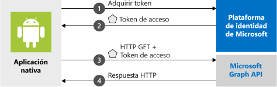

# <a name="quickstart-sign-in-users-and-call-the-microsoft-graph-api-from-an-android-app"></a>Inicio rápido: Inicie sesión de los usuarios y llame a Microsoft Graph API desde una aplicación de Android

En esta guía de inicio rápido se usa un ejemplo de código para mostrar cómo una aplicación Android puede iniciar sesión en cuentas personales, profesionales o educativas mediante la plataforma de Microsoft Identity y, después, obtener un token de acceso y llamar a la API de Microsoft Graph.

Las aplicaciones deben estar representadas por un objeto de aplicación en Azure Active Directory para que la plataforma de identidad de Microsoft pueda compartir tokens con la aplicación.

> [!div renderon="docs"]
> Por comodidad, el ejemplo de código incluye una predeterminada `redirect_uri`preconfigurada en el `AndroidManifest.xml` archivo para que no tenga que registrar primero su propio objeto de aplicación. Una `redirect_uri` se basa en parte en la clave de firma de la aplicación. El proyecto de ejemplo está preconfigurado con una clave de firma para que el `redirect_uri` proporcionado funcione. Para más información sobre el registro de un objeto de aplicación y su integración con su aplicación, consulte el [Inicio de sesión de los usuarios y llame al Microsoft Graph desde un tutorial de aplicaciones de Android](tutorial-v2-android.md).



> [!NOTE]
> **Requisitos previos**
> * Android Studio 
> * Android 16 +

> [!div class="sxs-lookup" renderon="portal"]
> ### <a name="step-1-configure-your-application-in-the-azure-portal"></a>Paso 1: Configuración de la aplicación en Azure Portal 
>  Para que el código de ejemplo de esta guía de inicio rápido funcione, debe agregar un identificador URI de redirección compatible con el agente de autenticación.
> > [!div renderon="portal" id="makechanges" class="nextstepaction"]
> > [Realizar estos cambios por mí]()
>
> > [!div id="appconfigured" class="alert alert-info"]
> >  La aplicación está configurada con estos atributos
>
> ### <a name="step-2-download-the-project"></a>Paso 2: Descarga del proyecto 
> * [Descargar el código de ejemplo](https://github.com/Azure-Samples/ms-identity-android-java/archive/master.zip)
>
> ### <a name="step-3-configure-your-project"></a>Paso 3: Configuración del proyecto
> 1. Extraiga y abra el proyecto en Android Studio.
> 2. Dentro de **aplicación** > **src** > **main** > **res** > **raw**, abra **auth_config_multiple_account.json** y reemplácelo por el código siguiente:
> ```javascript 
> {
>   "client_id" : "Enter_the_Application_Id_Here",
>   "authorization_user_agent" : "DEFAULT",
>   "redirect_uri" : "Enter_the_Redirect_Uri_Here",
>   "account_mode" : "MULTIPLE",
>   "broker_redirect_uri_registered": true,
>   "authorities" : [
>     {
>       "type": "AAD",
>       "audience": {
>         "type": "Enter_the_Audience_Info_Here",
>         "tenant_id": "Enter_the_Tenant_Info_Here"
>       }
>     }
>   ]
> }
> ```

> [!div class="sxs-lookup" renderon="portal"]
> 3. Dentro de **aplicación** > **src** > **main** > **res** > **raw**, abra **auth_config_single_account.json** y reemplácelo por el código siguiente:
> ```javascript 
> {
>   "client_id" : "Enter_the_Application_Id_Here",
>   "authorization_user_agent" : "DEFAULT",
>   "redirect_uri" : "Enter_the_Redirect_Uri_Here",
>   "account_mode" : "SINGLE",
>   "broker_redirect_uri_registered": true,
>   "authorities" : [
>     {
>       "type": "AAD",
>       "audience": {
>         "type": "Enter_the_Audience_Info_Here",
>         "tenant_id": "Enter_the_Tenant_Info_Here"
>       }
>     }
>   ]
> }
> ```

> [!div class="sxs-lookup" renderon="portal"]
> 4. Dentro de **aplicación** > **src** > **main**, abra **AndroidManifest.xml**.
> 5. En el nodo **manifest\application**, reemplace el nodo **activity android:name="com.microsoft.identity.client.BrowserTabActivity"** por lo siguiente:    
> ```xml
> <!--Intent filter to catch Microsoft's callback after Sign In-->
> <activity android:name="com.microsoft.identity.client.BrowserTabActivity">
>     <intent-filter>
>         <action android:name="android.intent.action.VIEW" />
>         <category android:name="android.intent.category.DEFAULT" />
>         <category android:name="android.intent.category.BROWSABLE" />
>         <!--
>             Add in your scheme/host from registered redirect URI 
>             note that the leading "/" is required for android:path
>         -->
>         <data 
>             android:host="Enter_the_Package_Name"
>             android:path="/Enter_the_Signature_Hash"
>             android:scheme= "msauth" />
>     </intent-filter>
> </activity>
> ```
> 6. Ejecute la aplicación.   
> La aplicación de ejemplo se inicia en la pantalla **Modo de cuenta única**. De forma predeterminada, se proporciona un ámbito predeterminado, **user.read**, que se usa al leer sus propios datos de perfil en la llamada a Microsoft Graph API. La dirección URL de la llamada a Microsoft Graph API se proporciona de forma predeterminada. Ambos elementos se pueden cambiar si se desea.
>
> 
>
> Use el menú de la aplicación para cambiar entre los modos de una y varias cuentas.
>
> En el modo de una cuenta única, inicie sesión con una cuenta profesional o personal:
>
> 1. Seleccione **Get graph data interactively (Obtener datos de gráfico de forma interactiva)** para pedir al usuario sus credenciales. El resultado de la llamada a Microsoft Graph API aparecerá en la parte inferior de la pantalla.
> 2. Una vez que haya iniciado sesión, seleccione **Get graph data silently** (Obtener datos de gráfico sin intervención del usuario) para realizar una llamada a Microsoft Graph API sin volver a pedir las credenciales al usuario. El resultado de la llamada a Microsoft Graph API aparecerá en la parte inferior de la pantalla.
>
> En el modo de varias cuentas, puede repetir los mismos pasos.  Además, puede quitar la cuenta con la que se ha iniciado sesión, lo que también quita los tokens almacenados en caché de esa cuenta.

> [!div class="sxs-lookup" renderon="portal"]
> > [!NOTE]
> > Este inicio rápido admite Enter_the_Supported_Account_Info_Here.

> [!div renderon="docs"]
> ## <a name="step-1-get-the-sample-app"></a>Paso 1: Obtención de la aplicación de ejemplo
>
> [Descargue el código](https://github.com/Azure-Samples/ms-identity-android-java/archive/master.zip).
>
> ## <a name="step-2-run-the-sample-app"></a>Paso 2: Ejecutar la aplicación de ejemplo
>
> Seleccione el emulador o dispositivo físico del menú desplegable **dispositivos disponibles** de Android Studio y ejecute la aplicación.
>
> La aplicación de ejemplo se inicia en la pantalla **Modo de cuenta única**. De forma predeterminada, se proporciona un ámbito predeterminado, **user.read**, que se usa al leer sus propios datos de perfil en la llamada a Microsoft Graph API. La dirección URL de la llamada a Microsoft Graph API se proporciona de forma predeterminada. Ambos elementos se pueden cambiar si se desea.
>
> 
>
> Use el menú de la aplicación para cambiar entre los modos de una y varias cuentas.
>
> En el modo de una cuenta única, inicie sesión con una cuenta profesional o personal:
>
> 1. Seleccione **Get graph data interactively (Obtener datos de gráfico de forma interactiva)** para pedir al usuario sus credenciales. El resultado de la llamada a Microsoft Graph API aparecerá en la parte inferior de la pantalla.
> 2. Una vez que haya iniciado sesión, seleccione **Get graph data silently** (Obtener datos de gráfico sin intervención del usuario) para realizar una llamada a Microsoft Graph API sin volver a pedir las credenciales al usuario. El resultado de la llamada a Microsoft Graph API aparecerá en la parte inferior de la pantalla.
>
> En el modo de varias cuentas, puede repetir los mismos pasos.  Además, puede quitar la cuenta con la que se ha iniciado sesión, lo que también quita los tokens almacenados en caché de esa cuenta.

## <a name="how-the-sample-works"></a>Funcionamiento del ejemplo

El código se organiza en fragmentos que muestran cómo escribir una aplicación de MSAL de una y varias cuentas. Los archivos del código se organizan de la siguiente manera:

| Archivo  | Muestra  |
|---------|---------|
| MainActivity | Administra la interfaz de usuario |
| MSGraphRequestWrapper  | Llama a Microsoft Graph API mediante el token proporcionado por MSAL |
| MultipleAccountModeFragment  | Inicializa una aplicación de varias cuentas, carga una cuenta de usuario y obtiene un token para llamar a Microsoft Graph API |
| SingleAccountModeFragment | Inicializa una aplicación de una cuenta, carga una cuenta de usuario y obtiene un token para llamar a Microsoft Graph API |
| res/auth_config_multiple_account.json  | El archivo de configuración de varias cuentas |
| res/auth_config_single_account.json  | El archivo de configuración de una cuenta |
| Gradle Scripts/build.grade (Module:app) | Aquí se agregan las dependencias de la biblioteca MSAL |

Ahora vamos a examinar estos archivos con más detalle y a llamar al código específico de MSAL en cada uno.

### <a name="adding-msal-to-the-app"></a>Agregar MSAL a la aplicación

MSAL ([com.microsoft.identity.client](https://javadoc.io/doc/com.microsoft.identity.client/msal)) es la biblioteca que se usa para iniciar la sesión de los usuarios y solicitar tokens de acceso a una API protegida por la Plataforma de identidad de Microsoft. Gradle 3.0 + instala la biblioteca cuando agrega lo siguiente a **Scripts de Gradle** > **build.gradle (Module: app)** en **Dependencias**:

```gradle  
implementation 'com.microsoft.identity.client:msal:1.0.0'
```

Puede verlo en el proyecto de ejemplo de build.gradle (Module: app):

```java
dependencies {
    ...
    implementation 'com.microsoft.identity.client:msal:1.0.+'
    ...
}
```

Esto indica a Gradle que descargue y compile MSAL desde Maven Central.

### <a name="msal-imports"></a>Importaciones de MSAL

Las importaciones que son relevantes para la biblioteca MSAL son `com.microsoft.identity.client.*`.  Por ejemplo, verá `import com.microsoft.identity.client.PublicClientApplication;`, que es el espacio de nombres de la clase `PublicClientApplication`, que representa la aplicación cliente pública.

### <a name="singleaccountmodefragmentjava"></a>SingleAccountModeFragment.java

En este archivo se muestra cómo crear una aplicación MSAL de una cuenta y llamar a Microsoft Graph API.

Las aplicaciones de una cuenta las utilizan usuarios individuales.  Por ejemplo, es posible que solo tenga una cuenta con la que inicia sesión en la aplicación de asignación.

#### <a name="single-account-msal-initialization"></a>Inicialización MSAL de cuenta única

En `auth_config_single_account.json`, en `onCreateView()`, se crea una sola cuenta `PublicClientApplication` con la información de configuración almacenada en el archivo `auth_config_single_account.json`.  Así es como se inicializa la biblioteca MSAL para su uso en una aplicación de MSAL de cuenta única:

```java
...
// Creates a PublicClientApplication object with res/raw/auth_config_single_account.json
PublicClientApplication.createSingleAccountPublicClientApplication(getContext(),
        R.raw.auth_config_single_account,
        new IPublicClientApplication.ISingleAccountApplicationCreatedListener() {
            @Override
            public void onCreated(ISingleAccountPublicClientApplication application) {
                /**
                 * This test app assumes that the app is only going to support one account.
                 * This requires "account_mode" : "SINGLE" in the config json file.
                 **/
                mSingleAccountApp = application;
                loadAccount();
            }

            @Override
            public void onError(MsalException exception) {
                displayError(exception);
            }
        });
```

#### <a name="sign-in-a-user"></a>Inicio de sesión de un usuario

En `SingleAccountModeFragment.java`, el código para iniciar sesión de un usuario está en `initializeUI()`, en el controlador de clic `signInButton`.

Llame a `signIn()` antes de intentar adquirir tokens. `signIn()` se comporta como si se llamara a `acquireToken()`, lo que genera un aviso interactivo para que el usuario inicie sesión.

El inicio de sesión de un usuario es una operación asincrónica. Se pasa una devolución de llamada que llama a Microsoft Graph API y actualiza la interfaz de usuario una vez que el usuario inicia sesión:

```java
mSingleAccountApp.signIn(getActivity(), null, getScopes(), getAuthInteractiveCallback());
```

#### <a name="sign-out-a-user"></a>Cierre de la sesión de un usuario

En `SingleAccountModeFragment.java`, el código para cerrar la sesión de un usuario está en `initializeUI()`, en el controlador de clic `signOutButton`.  El cierre de la sesión de un usuario es una operación asincrónica. Al cerrar la sesión del usuario, también se borra la caché de tokens de esa cuenta. Una vez que la sesión del usuario se ha cerrado, se crea una devolución de llamada para actualizar la interfaz de usuario:

```java
mSingleAccountApp.signOut(new ISingleAccountPublicClientApplication.SignOutCallback() {
    @Override
    public void onSignOut() {
        updateUI(null);
        performOperationOnSignOut();
    }

    @Override
    public void onError(@NonNull MsalException exception) {
        displayError(exception);
    }
});
```

#### <a name="get-a-token-interactively-or-silently"></a>Obtención de tokens de forma interactiva o sin intervención del usuario

Para presentar el menor número de mensajes posible al usuario, lo habitual es que el token se obtenga sin intervención del usuario. Si se produce algún error, intente obtener el token de forma interactiva. La primera vez que la aplicación llama a `signIn()`, actúa como una llamada a `acquireToken()`, que solicitará las credenciales al usuario.

Estas son algunas situaciones en las que puede que se pida al usuario que seleccione su cuenta, escriba sus credenciales o dé su consentimiento a los permisos que ha solicitado la aplicación:

* La primera vez que el usuario inicia sesión en la aplicación.
* Si un usuario restablece su contraseña, deberá escribir sus credenciales.
* Si se revoca el consentimiento.
* Si la aplicación requiere explícitamente el consentimiento.
* Cuando la aplicación solicita acceso a un recurso por primera vez.
* Cuando se requieren MFA u otras directivas de acceso condicional.

El código para obtener un token de forma interactiva, es decir, con una interfaz de usuario que implique al usuario, está en `SingleAccountModeFragment.java`, en `initializeUI()`, en el controlador de clic `callGraphApiInteractiveButton`:

```java
/**
 * If acquireTokenSilent() returns an error that requires an interaction (MsalUiRequiredException),
 * invoke acquireToken() to have the user resolve the interrupt interactively.
 *
 * Some example scenarios are
 *  - password change
 *  - the resource you're acquiring a token for has a stricter set of requirement than your Single Sign-On refresh token.
 *  - you're introducing a new scope which the user has never consented for.
 **/
mSingleAccountApp.acquireToken(getActivity(), getScopes(), getAuthInteractiveCallback());
```

Si el usuario ya ha iniciado sesión,`acquireTokenSilentAsync()` permite a las aplicaciones solicitar tokens de sin intervención del usuario, como se muestra en `initializeUI()`, en el controlador de clics `callGraphApiSilentButton`:

```java
/**
 * Once you've signed the user in,
 * you can perform acquireTokenSilent to obtain resources without interrupting the user.
 **/
  mSingleAccountApp.acquireTokenSilentAsync(getScopes(), AUTHORITY, getAuthSilentCallback());
```

#### <a name="load-an-account"></a>Carga de una cuenta

El código para cargar una cuenta está en `SingleAccountModeFragment.java` en `loadAccount()`.  La carga de la cuenta del usuario es una operación asincrónica, por lo que las devoluciones de llamada que se controlan cuando la cuenta se carga o cambia, o cuando se produce un error se pasan a MSAL.  El código siguiente también controla `onAccountChanged()`, que se produce cuando se quita una cuenta, el usuario cambia de cuenta, etc.

```java
private void loadAccount() {
    ...

    mSingleAccountApp.getCurrentAccountAsync(new ISingleAccountPublicClientApplication.CurrentAccountCallback() {
        @Override
        public void onAccountLoaded(@Nullable IAccount activeAccount) {
            // You can use the account data to update your UI or your app database.
            updateUI(activeAccount);
        }

        @Override
        public void onAccountChanged(@Nullable IAccount priorAccount, @Nullable IAccount currentAccount) {
            if (currentAccount == null) {
                // Perform a cleanup task as the signed-in account changed.
                performOperationOnSignOut();
            }
        }

        @Override
        public void onError(@NonNull MsalException exception) {
            displayError(exception);
        }
    });
```

#### <a name="call-microsoft-graph"></a>Llamada a Microsoft Graph

Cuando un usuario inicia sesión, la llamada a Microsoft Graph se realiza a través de una solicitud HTTP por `callGraphAPI()` que se define en `SingleAccountModeFragment.java`. Esta función es un contenedor que simplifica el ejemplo mediante la realización de algunas tareas, como obtener el token de acceso de `authenticationResult` y empaquetar la llamada a MSGraphRequestWrapper y mostrar los resultados de la llamada.

```java
private void callGraphAPI(final IAuthenticationResult authenticationResult) {
    MSGraphRequestWrapper.callGraphAPIUsingVolley(
            getContext(),
            graphResourceTextView.getText().toString(),
            authenticationResult.getAccessToken(),
            new Response.Listener<JSONObject>() {
                @Override
                public void onResponse(JSONObject response) {
                    /* Successfully called graph, process data and send to UI */
                    ...
                }
            },
            new Response.ErrorListener() {
                @Override
                public void onErrorResponse(VolleyError error) {
                    ...
                }
            });
}
```

### <a name="auth_config_single_accountjson"></a>auth_config_single_account.json

Es el archivo de configuración de una aplicación MSAL que usa una cuenta única.

Para obtener una explicación de estos campos, consulte [Información acerca del archivo de configuración de Android MSAL](msal-configuration.md).

Observe la presencia de `"account_mode" : "SINGLE"`, que configura esta aplicación para que use una sola cuenta.

`"client_id"` está preconfigurado para usar un registro de objeto de aplicación que Microsoft mantiene.
`"redirect_uri"`está preconfigurado para usar la clave de firma proporcionada con el ejemplo de código.

```json
{
  "client_id" : "0984a7b6-bc13-4141-8b0d-8f767e136bb7",
  "authorization_user_agent" : "DEFAULT",
  "redirect_uri" : "msauth://com.azuresamples.msalandroidapp/1wIqXSqBj7w%2Bh11ZifsnqwgyKrY%3D",
  "account_mode" : "SINGLE",
  "broker_redirect_uri_registered": true,
  "authorities" : [
    {
      "type": "AAD",
      "audience": {
        "type": "AzureADandPersonalMicrosoftAccount",
        "tenant_id": "common"
      }
    }
  ]
}
```

### <a name="multipleaccountmodefragmentjava"></a>MultipleAccountModeFragment.java

En este archivo se muestra cómo crear una aplicación MSAL de varias cuentas y llamar a Microsoft Graph API.

Un ejemplo de aplicación de varias cuentas es una aplicación de correo que permite trabajar con varias cuentas de usuario, como una cuenta profesional y una cuenta personal.

#### <a name="multiple-account-msal-initialization"></a>Inicialización MSAL de varias cuentas

En el archivo de `MultipleAccountModeFragment.java`, en `onCreateView()`, se crea un objeto de aplicación de varias cuentas (`IMultipleAccountPublicClientApplication`) con la información de configuración almacenada en el `auth_config_multiple_account.json file`:

```java
// Creates a PublicClientApplication object with res/raw/auth_config_multiple_account.json
PublicClientApplication.createMultipleAccountPublicClientApplication(getContext(),
        R.raw.auth_config_multiple_account,
        new IPublicClientApplication.IMultipleAccountApplicationCreatedListener() {
            @Override
            public void onCreated(IMultipleAccountPublicClientApplication application) {
                mMultipleAccountApp = application;
                loadAccounts();
            }

            @Override
            public void onError(MsalException exception) {
                ...
            }
        });
```

El objeto `MultipleAccountPublicClientApplication` creado se almacena en una variable de miembro de clase, con el fin de que se pueda usar para interactuar con la biblioteca MSAL para adquirir tokens y cargar y quitar la cuenta de usuario.

#### <a name="load-an-account"></a>Carga de una cuenta

Las aplicaciones de varias cuentas habitualmente llaman a `getAccounts()` para seleccionar la cuenta que se va a usar para las operaciones de MSAL. El código para cargar una cuenta está en el archivo `MultipleAccountModeFragment.java`, en `loadAccounts()`.  La carga de la cuenta del usuario es una operación asincrónica. Por consiguiente, una devolución de llamada controla las situaciones cuando se la cuenta se carga o se cambia, o cuando se produce un error.

```java
/**
 * Load currently signed-in accounts, if there's any.
 **/
private void loadAccounts() {
    if (mMultipleAccountApp == null) {
        return;
    }

    mMultipleAccountApp.getAccounts(new IPublicClientApplication.LoadAccountsCallback() {
        @Override
        public void onTaskCompleted(final List<IAccount> result) {
            // You can use the account data to update your UI or your app database.
            accountList = result;
            updateUI(accountList);
        }

        @Override
        public void onError(MsalException exception) {
            displayError(exception);
        }
    });
}
```

#### <a name="get-a-token-interactively-or-silently"></a>Obtención de tokens de forma interactiva o sin intervención del usuario

Estas son algunas situaciones en las que puede que se pida al usuario que seleccione su cuenta, escriba sus credenciales o dé su consentimiento a los permisos que ha solicitado la aplicación:

* La primera vez que los usuarios inician sesión en la aplicación
* Si un usuario restablece su contraseña, deberá escribir sus credenciales. 
* Si se revoca el consentimiento. 
* Si la aplicación requiere explícitamente el consentimiento. 
* Cuando la aplicación solicita acceso a un recurso por primera vez.
* Cuando se requieren MFA u otras directivas de acceso condicional.

Lo habitual es que las aplicaciones de varias cuentas normalmente adquieran los tokens de forma interactiva, es decir, con una interfaz de usuario que implique al usuario, con una llamada a `acquireToken()`.  El código para obtener un token interactivamente está en el archivo de `MultipleAccountModeFragment.java` en `initializeUI()`, en el controlador de clic `callGraphApiInteractiveButton`:

```java
/**
 * Acquire token interactively. It will also create an account object for the silent call as a result (to be obtained by getAccount()).
 *
 * If acquireTokenSilent() returns an error that requires an interaction,
 * invoke acquireToken() to have the user resolve the interrupt interactively.
 *
 * Some example scenarios are
 *  - password change
 *  - the resource you're acquiring a token for has a stricter set of requirement than your SSO refresh token.
 *  - you're introducing a new scope which the user has never consented for.
 **/
mMultipleAccountApp.acquireToken(getActivity(), getScopes(), getAuthInteractiveCallback());
```

Las aplicaciones no deberían requerir que el usuario inicie sesión cada vez que soliciten un token. Si el usuario ya ha iniciado sesión, `acquireTokenSilentAsync()` permite a las aplicaciones solicitar tokens sin preguntar al usuario, como se muestra en el archivo de `MultipleAccountModeFragment.java`, en`initializeUI()` en el controlador de clic `callGraphApiSilentButton`:

```java
/**
 * Performs acquireToken without interrupting the user.
 *
 * This requires an account object of the account you're obtaining a token for.
 * (can be obtained via getAccount()).
 */
mMultipleAccountApp.acquireTokenSilentAsync(getScopes(),
    accountList.get(accountListSpinner.getSelectedItemPosition()),
    AUTHORITY,
    getAuthSilentCallback());
```

#### <a name="remove-an-account"></a>Eliminación de una cuenta

El código para quitar una cuenta y todos los tokens almacenados en caché de la cuenta se encuentra en el archivo `MultipleAccountModeFragment.java` en `initializeUI()` en el controlador del botón quitar cuenta. Para poder quitar una cuenta, necesita un objeto de cuenta, que se obtiene de los métodos MSAL como `getAccounts()` y `acquireToken()`. Dado que la eliminación de una cuenta es una operación asincrónica, se proporciona la devolución de llamada `onRemoved` para actualizar la interfaz de usuario.

```java
/**
 * Removes the selected account and cached tokens from this app (or device, if the device is in shared mode).
 **/
mMultipleAccountApp.removeAccount(accountList.get(accountListSpinner.getSelectedItemPosition()),
        new IMultipleAccountPublicClientApplication.RemoveAccountCallback() {
            @Override
            public void onRemoved() {
                ...
                /* Reload account asynchronously to get the up-to-date list. */
                loadAccounts();
            }

            @Override
            public void onError(@NonNull MsalException exception) {
                displayError(exception);
            }
        });
```

### <a name="auth_config_multiple_accountjson"></a>auth_config_multiple_account.json

Es el archivo de configuración de una aplicación MSAL que usa varias cuentas.

Consulte [Comprender el archivo de configuración de Android MSAL ](msal-configuration.md) para obtener una explicación de los distintos campos.

A diferencia del archivo de configuración [auth_config_single_account.json](#auth_config_single_accountjson) este archivo de configuración tiene `"account_mode" : "MULTIPLE"` en lugar de `"account_mode" : "SINGLE"`, ya que se trata de una aplicación de varias cuentas.

`"client_id"` está preconfigurado para usar un registro de objeto de aplicación que Microsoft mantiene.
`"redirect_uri"`está preconfigurado para usar la clave de firma proporcionada con el ejemplo de código.

```json
{
  "client_id" : "0984a7b6-bc13-4141-8b0d-8f767e136bb7",
  "authorization_user_agent" : "DEFAULT",
  "redirect_uri" : "msauth://com.azuresamples.msalandroidapp/1wIqXSqBj7w%2Bh11ZifsnqwgyKrY%3D",
  "account_mode" : "MULTIPLE",
  "broker_redirect_uri_registered": true,
  "authorities" : [
    {
      "type": "AAD",
      "audience": {
        "type": "AzureADandPersonalMicrosoftAccount",
        "tenant_id": "common"
      }
    }
  ]
}
```

## <a name="next-steps"></a>Pasos siguientes

### <a name="learn-the-steps-to-create-the-application-used-in-this-quickstart"></a>Más información sobre los pasos para crear la aplicación que se usa en esta guía de inicio rápido

Pruebe el [Inicio de sesión de usuarios y llame al Microsoft Graph desde una aplicación de Android](tutorial-v2-android.md) para obtener una guía paso a paso para crear una aplicación de Android que obtenga un token de acceso y la use para llamar a la API de Microsoft Graph.

> [!div class="nextstepaction"]
> [Tutorial para llamar a Graph API desde Android](https://docs.microsoft.com/azure/active-directory/develop/guidedsetups/active-directory-android)

### <a name="msal-for-android-library-wiki"></a>Wiki de la biblioteca MSAL para Android

Obtenga más información acerca de la biblioteca MSAL para Android:

> [!div class="nextstepaction"]
> [Wiki de la biblioteca MSAL para Android](https://github.com/AzureAD/microsoft-authentication-library-for-android/wiki)

[!INCLUDE [Help and support](../../../includes/active-directory-develop-help-support-include.md)]

Ayúdenos a mejorar la Plataforma de identidad de Microsoft. Rellene una breve encuesta de dos preguntas y háganos saber su opinión.

> [!div class="nextstepaction"]
> [Encuesta sobre la Plataforma de identidad de Microsoft](https://forms.office.com/Pages/ResponsePage.aspx?id=v4j5cvGGr0GRqy180BHbRyKrNDMV_xBIiPGgSvnbQZdUQjFIUUFGUE1SMEVFTkdaVU5YT0EyOEtJVi4u)
