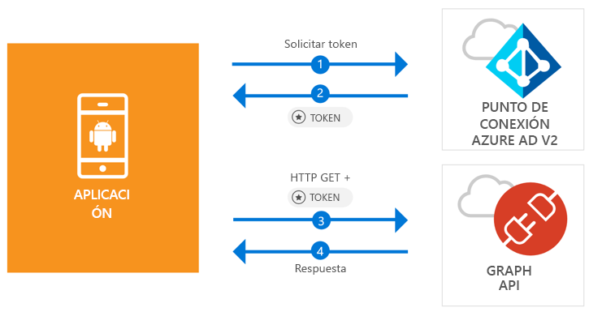

# <a name="quickstart-sign-in-users-and-call-the-microsoft-graph-api-from-an-android-app"></a>Inicio rápido: Inicie sesión de los usuarios y llame a Microsoft Graph API desde una aplicación de Android

[!INCLUDE [active-directory-develop-applies-v2-msal](../../../includes/active-directory-develop-applies-v2-msal.md)]

En esta guía de inicio rápido hay código de ejemplo que muestra cómo una aplicación de Android puede iniciar sesión en cuentas personales, de trabajo y educativas, obtener un token de acceso y llamar a Microsoft Graph API.



> [!NOTE]
> **Requisitos previos**
> * Android Studio 3 o posterior
> * Se requiere Android SDK 21 o posterior (se recomienda SDK 27)

> [!div renderon="docs"]
> ## <a name="register-and-download"></a>Registro y descarga
> ### <a name="register-and-configure-your-application-and-code-sample"></a>Registro y configuración de una aplicación y el código de ejemplo
> #### <a name="step-1-register-your-application"></a>Paso 1: Registrar su aplicación
> Para registrar la aplicación y agregar la información de registro de aplicación a la solución, siga estos pasos:
> 1. Vaya al [Portal de registro de aplicaciones de Microsoft](https://apps.dev.microsoft.com/portal/register-app) para registrar una aplicación.
> 1. En el cuadro**Application Name** (Nombre de la aplicación) escriba el nombre de su aplicación.
> 1. Asegúrese de que la casilla **Guided Setup** (Instalación guiada) esté desactivada y, luego, seleccione **Create** (Crear).
> 1. Seleccione **Add Platform** (Agregar plataforma), seleccione **Native Application** (Aplicación nativa) y, luego, seleccione **Save** (Guardar).

> [!div renderon="portal" class="sxs-lookup"]
> #### <a name="step-1-configure-your-application"></a>Paso 1: Configuración de la aplicación
> Para que el ejemplo de código de esta guía rápida funcione, debe agregar una dirección URL de respuesta como **msal {AppId}://auth** (donde {AppId} es el identificador de la aplicación).
> > [!div renderon="portal" id="makechanges" class="nextstepaction"]
> > [Hacer este cambio por mí]()
>
> > [!div id="appconfigured" class="alert alert-info"]
> >  La aplicación está configurada con estos atributos

#### <a name="step-2-download-the-project"></a>Paso 2: Descarga del proyecto

* [Descargar el proyecto de Android Studio](https://github.com/Azure-Samples/active-directory-android-native-v2/archive/master.zip)

#### <a name="step-3-configure-your-project"></a>Paso 3: Configuración del proyecto

1. Extraiga y abra el proyecto en Android Studio.
1. En **app** > **java** > **<i>{host}.{espacio de nombres}</i>**, abra **MainActivity**.
1. Reemplace la línea que empieza con `final static String CLIENT_ID` por:

    > [!div renderon="portal" class="sxs-lookup"]
    > ```java
    > final static String CLIENT_ID = "ENTER_THE_APPLICATION_ID_HERE";
    > ```

    > [!div renderon="docs"]
    > ```java
    > final static String CLIENT_ID = "<ENTER_THE_APPLICATION_ID_HERE>";
    > ```

1. Abra: **aplicación** > **manifiestos** > **AndroidManifest.xml**.
1. Agregue la siguiente actividad en el nodo **manifest\application**. El fragmento de código registra una **BrowserTabActivity** para permitir que el sistema operativo reanude la aplicación después de completar la autenticación:

    > [!div renderon="docs"]
    > ```xml
    > <!--Intent filter to capture System Browser calling back to our app after Sign In-->
    > <activity
    >     android:name="com.microsoft.identity.client.BrowserTabActivity">
    >     <intent-filter>
    >         <action android:name="android.intent.action.VIEW" />
    >         <category android:name="android.intent.category.DEFAULT" />
    >         <category android:name="android.intent.category.BROWSABLE" />
    > 
    >         <!--Add in your scheme/host from registered redirect URI-->
    >         <!--By default, the scheme should be similar to 'msal[appId]' -->
    >         <data android:scheme="msal<ENTER_THE_APPLICATION_ID_HERE>"
    >             android:host="auth" />
    >     </intent-filter>
    > </activity>
    > ```

    > [!div renderon="portal" class="sxs-lookup"]
    > ```xml
    > <!--Intent filter to capture System Browser calling back to our app after Sign In-->
    > <activity
    >     android:name="com.microsoft.identity.client.BrowserTabActivity">
    >     <intent-filter>
    >         <action android:name="android.intent.action.VIEW" />
    >         <category android:name="android.intent.category.DEFAULT" />
    >         <category android:name="android.intent.category.BROWSABLE" />
    > 
    >         <!--Add in your scheme/host from registered redirect URI-->
    >         <!--By default, the scheme should be similar to 'msal[appId]' -->
    >         <data android:scheme="msalENTER_THE_APPLICATION_ID_HERE"
    >             android:host="auth" />
    >     </intent-filter>
    > </activity>
    > ```

> [!div renderon="docs"]
> <span>6.</span> Reemplace `<ENTER_THE_APPLICATION_ID_HERE>` por el *id. de aplicación* de su aplicación. Si necesita encontrar el *id. de aplicación*, vaya a la página *Información general*.

## <a name="more-information"></a>Más información

Lea las secciones siguientes para obtener más información acerca de esta guía de inicio rápido.

### <a name="msal"></a>MSAL

MSAL ([com.microsoft.identity.client](https://javadoc.io/doc/com.microsoft.identity.client/msal)) es la biblioteca que se usa para iniciar la sesión de los usuarios y solicitar tokens de acceso a una API protegida por Microsoft Azure Active Directory (Azure AD). Puede usar Gradle para instalarla si agrega lo siguiente en la sección **Dependencies** (Dependencias) de **Gradle Scripts** > **build.gradle (Module: app)**:

```gradle  
implementation 'com.android.volley:volley:1.1.1'
implementation 'com.microsoft.identity.client:msal:0.1.+'
```

### <a name="msal-initialization"></a>Inicialización de MSAL

Puede agregar la referencia de MSAL con el código siguiente:

```java
import com.microsoft.identity.client.*;
```

A continuación, realice la inicialización de MSAL con el siguiente código:

```java
sampleApp = new PublicClientApplication(
        this.getApplicationContext(),
        CLIENT_ID);
```

> |Donde: ||
> |---------|---------|
> |`CLIENT_ID` | El identificador de aplicación de la aplicación registrada en *portal.azure.com* |

### <a name="requesting-tokens"></a>Solicitud de tokens

MSAL tiene dos métodos para adquirir tokens: `acquireToken` y `acquireTokenSilentAsync`

#### <a name="getting-a-user-token-interactively"></a>Obtención de un token de usuario interactivamente

En algunas situaciones, es necesario forzar a los usuarios a que interactúen con el punto de conexión de Azure AD v2.0, lo que cambia de contexto al explorador del sistema, ya sea para validar las credenciales del usuario o para obtener su consentimiento. Estos son algunos ejemplos:

* La primera vez que los usuarios inician sesión en la aplicación
* Cuando los usuarios deben volver a escribir sus credenciales porque la contraseña expiró
* Cuando la aplicación solicita acceso a un recurso para el cual el usuario necesita dar su consentimiento
* Cuando se requiere la autenticación en dos fases

```java
sampleApp.acquireToken(this, SCOPES, getAuthInteractiveCallback());
```

> |Donde:||
> |---------|---------|
> | `SCOPES` | Contiene los ámbitos que se solicitan (es decir, `{ "user.read" }` para Microsoft Graph o `{ "<Application ID URL>/scope" }` para las API web personalizadas (por ejemplo, `api://<Application ID>/access_as_user`) |
> | `getAuthInteractiveCallback` | Es la devolución de llamada que se ejecuta cuando la aplicación recupera el control después de la autenticación |

#### <a name="getting-a-user-token-silently"></a>Obtención de un token de usuario en silencio

No desea pedirle al usuario que valide sus credenciales cada vez que necesite acceder a un recurso. La mayor parte del tiempo, quiere que la renovación y adquisición de tokens ocurra sin la interacción del usuario. Puede usar el método `AcquireTokenSilentAsync` para obtener tokens que permiten acceder a recursos protegidos después del método `acquireToken` inicial:

```java
sampleApp.acquireToken(getActivity(), SCOPES, getAuthInteractiveCallback());
```

> |Donde:||
> |---------|---------|
> | `SCOPES` | Contiene los ámbitos que se solicitan (es decir, `{ "user.read" }` para Microsoft Graph o `{ "<Application ID URL>/scope" }` para las API web personalizadas (por ejemplo, `api://<Application ID>/access_as_user`) |
> | `getAuthInteractiveCallback` | Es la devolución de llamada que se ejecuta cuando la aplicación recupera el control después de la autenticación |

## <a name="next-steps"></a>Pasos siguientes

### <a name="learn-the-steps-to-create-the-application-used-in-this-quickstart"></a>Más información sobre los pasos para crear la aplicación que se usa en esta guía de inicio rápido

Visite el tutorial de Android para acceder a una guía completa paso a paso sobre la creación de aplicaciones y nuevas características, que incluye una explicación completa de esta guía de inicio rápido.

> [!div class="nextstepaction"]
> [Tutorial para llamar a Graph API desde Android](https://docs.microsoft.com/azure/active-directory/develop/guidedsetups/active-directory-android)

### <a name="msal-for-android-library-wiki"></a>Wiki de la biblioteca MSAL para Android

Obtenga más información acerca de la biblioteca MSAL para Android:

> [!div class="nextstepaction"]
> [Wiki de la biblioteca MSAL para Android](https://github.com/AzureAD/microsoft-authentication-library-for-android/wiki)

[!INCLUDE [Help and support](../../../includes/active-directory-develop-help-support-include.md)]
