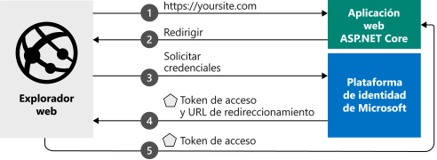

# <a name="quickstart-add-sign-in-with-microsoft-to-an-aspnet-core-web-app"></a>Inicio rápido: Adición del inicio de sesión con Microsoft a una aplicación web de ASP.NET Core

En esta guía de inicio rápido, obtendrá información sobre cómo una aplicación web ASP.NET Core puede iniciar sesión en cuentas personales (hotmail.com, outlook.com y otras), profesionales y educativas desde cualquier instancia de Azure Active Directory (Azure AD).



> [!div renderon="docs"]
> ## <a name="register-and-download-your-quickstart-app"></a>Registro y descarga de la aplicación de inicio rápido
> Tiene dos opciones para comenzar con la aplicación de inicio rápido:
> * [Rápido] [Opción 1: registrar y configurar de modo automático la aplicación y, a continuación, descargar el código de ejemplo](#option-1-register-and-auto-configure-your-app-and-then-download-your-code-sample)
> * [Manual] [Opción 2: registrar y configurar manualmente la aplicación y el código de ejemplo](#option-2-register-and-manually-configure-your-application-and-code-sample)
>
> ### <a name="option-1-register-and-auto-configure-your-app-and-then-download-your-code-sample"></a>Opción 1: registrar y configurar de modo automático la aplicación y, a continuación, descargar el código de ejemplo
>
> 1. Vaya a [Azure Portal: registros de aplicaciones](https://aka.ms/aspnetcore2-1-aad-quickstart-v2).
> 1. Escriba un nombre para la aplicación y seleccione **Registrar**.
> 1. Siga las instrucciones para descargar y configurar automáticamente la nueva aplicación en un solo clic.
>
> ### <a name="option-2-register-and-manually-configure-your-application-and-code-sample"></a>Opción 2: registrar y configurar manualmente la aplicación y el código de ejemplo
>
> #### <a name="step-1-register-your-application"></a>Paso 1: Registrar su aplicación
> Para registrar la aplicación y agregar la información de registro de la aplicación a la solución de forma manual, siga estos pasos:
>
> 1. Inicie sesión en [Azure Portal](https://portal.azure.com) con una cuenta personal, profesional o educativa de Microsoft.
> 1. Si la cuenta proporciona acceso a más de un inquilino, haga clic en la cuenta en la esquina superior derecha y establezca la sesión del portal en el inquilino de Azure AD deseado.
> 1. Vaya a la página [Registros de aplicaciones](https://go.microsoft.com/fwlink/?linkid=2083908) de la plataforma de identidad de Microsoft para desarrolladores.
> 1. Seleccione **Nuevo registro**.
> 1. Cuando aparece la página **Registrar una aplicación**, escriba la información de registro de la aplicación:
>    - En la sección **Nombre**, escriba un nombre significativo para la aplicación, que se mostrará a los usuarios de la aplicación, por ejemplo, `AspNetCore-Quickstart`.
>    - En **URI de redirección**, agregue `https://localhost:44321/` y seleccione **Registrar**.
> 1. Seleccione el menú **Autenticación** y, a continuación, agregue la siguiente información:
>    - En **URI de redirección**, agregue `https://localhost:44321/signin-oidc` y seleccione **Guardar**.
>    - En la sección **Configuración avanzada**, establezca **Dirección URL de cierre de sesión** en `https://localhost:44321/signout-oidc`.
>    - En **Concesión implícita**, marque **Tokens de identificador**.
>    - Seleccione **Guardar**.

> [!div class="sxs-lookup" renderon="portal"]
> #### <a name="step-1-configure-your-application-in-the-azure-portal"></a>Paso 1: Configuración de la aplicación en Azure Portal
> Para que el ejemplo de código de esta guía de inicio rápido funcione, deberá agregar direcciones URL de respuesta como `https://localhost:44321/` y `https://localhost:44321/signin-oidc`, agregar la dirección URL de cierre de sesión como `https://localhost:44321/signout-oidc` y los tokens de identificador de solicitud que van a ser emitidos por el punto de conexión de autorización.
> > [!div renderon="portal" id="makechanges" class="nextstepaction"]
> > [Hacer este cambio por mí]()
>
> > [!div id="appconfigured" class="alert alert-info"]
> >  La aplicación está configurada con estos atributos.

#### <a name="step-2-download-your-aspnet-core-project"></a>Paso 2: Descarga del proyecto de ASP.NET Core

- [Descargue la solución de Visual Studio 2019](https://github.com/Azure-Samples/active-directory-aspnetcore-webapp-openidconnect-v2/archive/aspnetcore2-2.zip)

#### <a name="step-3-configure-your-visual-studio-project"></a>Paso 3: Configuración del proyecto de Visual Studio

1. Extraiga el archivo ZIP en una carpeta local de la carpeta raíz (por ejemplo, **C:\Azure-Samples**)
1. Si usa Visual Studio 2019, abra la solución en Visual Studio (opcional).
1. Edite el archivo **appsettings.json**. Busque `ClientId` y actualice el valor de `ClientId` con el valor de **Identificador de aplicación (cliente)** de la aplicación que ha registrado. 

    ```json
    "ClientId": "Enter_the_Application_Id_here"
    "TenantId": "Enter_the_Tenant_Info_Here"
    ```

> [!div class="sxs-lookup" renderon="portal"]
> > [!NOTE]
> > Este inicio rápido admite Enter_the_Supported_Account_Info_Here.

> [!div renderon="docs"]
> Donde:
> - `Enter_the_Application_Id_here`: es el **Identificador de aplicación (cliente)** de la aplicación que ha registrado en Azure Portal. Puede encontrar el **Identificador de aplicación (cliente)** en la página **Información general** de la aplicación.
> - `Enter_the_Tenant_Info_Here`: es una de las siguientes opciones:
>   - Si la aplicación admite **Solo las cuentas de este directorio organizativo**, reemplace este valor por el **Identificador de inquilino** o el **Nombre de inquilino** (por ejemplo, contoso.microsoft.com)
>   - Si la aplicación admite **Cuentas en cualquier directorio organizativo**, reemplace este valor por `organizations`
>   - Si la aplicación admite **Todos los usuarios de cuentas Microsoft**, reemplace este valor por `common`
>
> > [!TIP]
> > Para buscar los valores de **Identificador de aplicación (cliente)** , **Identificador de directorio (inquilino)** y **Tipos de cuenta admitidos**, vaya a la página **Información general** en Azure Portal.

## <a name="more-information"></a>Más información

En esta sección, se proporciona una introducción al código necesario para el inicio de sesión de usuarios. Esto puede ser útil para comprender cómo funciona el código, los argumentos principales y también si desea agregar el inicio de sesión a una aplicación ASP.NET Core existente.

### <a name="startup-class"></a>Clase Startup

El middleware *Microsoft.AspNetCore.Authentication* usa una clase Startup que se ejecuta cuando se inicializa el proceso de hospedaje:

```csharp
public void ConfigureServices(IServiceCollection services)
{
  services.Configure<CookiePolicyOptions>(options =>
  {
    // This lambda determines whether user consent for non-essential cookies is needed for a given request.
    options.CheckConsentNeeded = context => true;
    options.MinimumSameSitePolicy = SameSiteMode.None;
  });

  services.AddAuthentication(AzureADDefaults.AuthenticationScheme)
          .AddAzureAD(options => Configuration.Bind("AzureAd", options));

  services.Configure<OpenIdConnectOptions>(AzureADDefaults.OpenIdScheme, options =>
  {
    options.Authority = options.Authority + "/v2.0/";         // Microsoft identity platform

    options.TokenValidationParameters.ValidateIssuer = false; // accept several tenants (here simplified)
  });

  services.AddMvc(options =>
  {
     var policy = new AuthorizationPolicyBuilder()
                     .RequireAuthenticatedUser()
                     .Build();
     options.Filters.Add(new AuthorizeFilter(policy));
  })
  .SetCompatibilityVersion(CompatibilityVersion.Version_2_1);
}
```

El método `AddAuthentication` configura el servicio para agregar la autenticación basada en cookies, que se usa en escenarios con explorador y establece el desafío en OpenId Connect. 

La línea que contiene `.AddAzureAd` agrega la autenticación de la Plataforma de identidad de Microsoft a la aplicación. A continuación, se configura para iniciar sesión con el punto de conexión de la Plataforma de identidad de Microsoft.

> |Where  |  |
> |---------|---------|
> | ClientId  | El identificador de aplicación (cliente) de la aplicación registrada en Azure Portal. |
> | Autoridad | El punto de conexión de STS para que el usuario se autentique. Normalmente es <https://login.microsoftonline.com/{tenant}/v2.0> para la nube pública, donde {tenant} es el nombre del inquilino o el identificador del inquilino o *common* para hacer referencia al punto de conexión común (que se usa para las aplicaciones multiinquilino) |
> | TokenValidationParameters | Una lista de parámetros para la validación del token. En este caso, `ValidateIssuer` se establece en `false` para indicar que puede aceptar inicios de sesión desde cualquier cuenta personal, profesional o educativa. |


> [!NOTE]
> Establecer `ValidateIssuer = false` es una simplificación para este inicio rápido. En las aplicaciones reales debe validar al emisor.
> Consulte los ejemplos para entender cómo hacerlo.

### <a name="protect-a-controller-or-a-controllers-method"></a>Protección de un controlador o del método de un controlador

Puede proteger un controlador o los métodos de un controlador mediante el atributo `[Authorize]`. Este atributo restringe el acceso al controlador o a los métodos, ya que solo permite usuarios autenticados, lo que significa que se puede iniciar el desafío de autenticación para acceder al controlador si el usuario no está autenticado.

[!INCLUDE [Help and support](../../../includes/active-directory-develop-help-support-include.md)]

## <a name="next-steps"></a>Pasos siguientes

Consulte el repositorio GitHub de este tutorial de ASP.NET Core para obtener más información, incluidas instrucciones sobre cómo agregar autenticación a una nueva aplicación web de ASP.NET Core, cómo llamar a Microsoft Graph y a otras API de Microsoft, cómo llamar a sus propias API, cómo agregar autorización, cómo iniciar sesión con usuarios en nubes nacionales, o con identidades sociales y mucho más:

> [!div class="nextstepaction"]
> [Tutorial de una aplicación web de ASP.NET Core](https://github.com/Azure-Samples/active-directory-aspnetcore-webapp-openidconnect-v2/)

Ayúdenos a mejorar la Plataforma de identidad de Microsoft. Rellene una breve encuesta de dos preguntas y háganos saber su opinión.

> [!div class="nextstepaction"]
> [Encuesta sobre la Plataforma de identidad de Microsoft](https://forms.office.com/Pages/ResponsePage.aspx?id=v4j5cvGGr0GRqy180BHbRyKrNDMV_xBIiPGgSvnbQZdUQjFIUUFGUE1SMEVFTkdaVU5YT0EyOEtJVi4u)