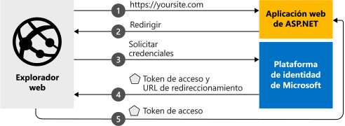

# <a name="quickstart-add-microsoft-identity-platform-sign-in-to-an-aspnet-web-app"></a>Inicio rápido: Adición del inicio de sesión de la plataforma de identidad de Microsoft a una aplicación web de ASP.NET
En este inicio rápido, utilizará un código de ejemplo para aprender cómo una aplicación web ASP.NET puede iniciar sesión en cuentas personales (hotmail.com, outlook.com y otras), profesionales y educativas desde cualquier instancia de Azure Active Directory (Azure AD).  (Para ilustrar este tema, consulte el apartado en el que se explica el [funcionamiento del ejemplo](#how-the-sample-works).)
> [!div renderon="docs"]
> ## <a name="register-and-download-your-quickstart-app"></a>Registro y descarga de la aplicación de inicio rápido
> Tiene dos opciones para comenzar con la aplicación de inicio rápido:
> * [Rápido] [Opción 1: registrar y configurar de modo automático la aplicación y, a continuación, descargar el código de ejemplo](#option-1-register-and-auto-configure-your-app-and-then-download-your-code-sample)
> * [Manual] [Opción 2: registrar y configurar manualmente la aplicación y el código de ejemplo](#option-2-register-and-manually-configure-your-application-and-code-sample)
>
> ### <a name="option-1-register-and-auto-configure-your-app-and-then-download-your-code-sample"></a>Opción 1: registrar y configurar de modo automático la aplicación y, a continuación, descargar el código de ejemplo
>
> 1. Vaya al nuevo panel de [Azure Portal: Registros de aplicaciones](https://portal.azure.com/#blade/Microsoft_AAD_RegisteredApps/applicationsListBlade/quickStartType/AspNetWebAppQuickstartPage/sourceType/docs).
> 1. Escriba un nombre para la aplicación y haga clic en **Registrar**.
> 1. Siga las instrucciones para descargar y configurar automáticamente la nueva aplicación en un solo clic.
>
> ### <a name="option-2-register-and-manually-configure-your-application-and-code-sample"></a>Opción 2: registrar y configurar manualmente la aplicación y el código de ejemplo
>
> #### <a name="step-1-register-your-application"></a>Paso 1: Registrar su aplicación
> Para registrar la aplicación y agregar la información de registro de la aplicación a la solución de forma manual, siga estos pasos:
>
> 1. Inicie sesión en [Azure Portal](https://portal.azure.com) con una cuenta personal, profesional o educativa de Microsoft.
> 1. Si la cuenta proporciona acceso a más de un inquilino, haga clic en la cuenta en la esquina superior derecha y establezca la sesión del portal en el inquilino de Azure AD deseado.
> 1. Vaya a la página [Registros de aplicaciones](https://go.microsoft.com/fwlink/?linkid=2083908) de la plataforma de identidad de Microsoft para desarrolladores.
> 1. Seleccione **Nuevo registro**.
> 1. Cuando aparece la página **Registrar una aplicación**, escriba la información de registro de la aplicación:
>      - En la sección **Nombre**, escriba un nombre significativo para la aplicación, que se mostrará a los usuarios de la aplicación, por ejemplo, `ASPNET-Quickstart`.
>      - Agregue `http://localhost:44368/` en **URI de redirección**y haga clic en **Registrar**.
>      - En el panel de navegación izquierdo, en la sección Administrar, seleccione **Autenticación**
>          - En la subsección **Concesión implícita** , seleccione **Tokens de id**.
>          - Y, después, seleccione **Guardar**.

> [!div class="sxs-lookup" renderon="portal"]
> #### <a name="step-1-configure-your-application-in-azure-portal"></a>Paso 1: Configuración de la aplicación en Azure Portal
> Para que el código de ejemplo de esta guía de inicio rápido funcione, es preciso agregar una dirección URL de respuesta como `https://localhost:44368/`.
> > [!div renderon="portal" id="makechanges" class="nextstepaction"]
> > [Hacer este cambio por mí]()
>
> > [!div id="appconfigured" class="alert alert-info"]
> >  La aplicación está configurada con este atributo

#### <a name="step-2-download-your-project"></a>Paso 2: Descarga del proyecto

> [!div renderon="docs"]
> [Descargue la solución de Visual Studio 2019](https://github.com/AzureADQuickStarts/AppModelv2-WebApp-OpenIDConnect-DotNet/archive/master.zip)

> [!div renderon="portal"]
> Ejecute el proyecto con Visual Studio 2019.
> [!div renderon="portal" id="autoupdate" class="nextstepaction"]
> [Descargar el código de ejemplo]()

> [!div class="sxs-lookup" renderon="portal"]
> #### <a name="step-3-your-app-is-configured-and-ready-to-run"></a>Paso 3: La aplicación está configurada y lista para ejecutarse
> Hemos configurado el proyecto con los valores de las propiedades de su aplicación. 

> [!div renderon="docs"]
> #### <a name="step-3-run-your-visual-studio-project"></a>Paso 3: Ejecución del proyecto de Visual Studio

1. Extraiga el archivo ZIP en la carpeta local más próxima a la carpeta raíz (por ejemplo, **C:\Azure-Samples**).
1. Abra la solución en Visual Studio (AppModelv2-WebApp-OpenIDConnect-DotNet.sln)
1. Según la versión de Visual Studio que use, es posible que necesite hacer clic con el botón derecho en el proyecto `AppModelv2-WebApp-OpenIDConnect-DotNet` y **Restaurar paquetes NuGet**.
1. Abra la Consola del Administrador de paquetes (Ver -> Otras ventanas -> Consola del Administrador de paquetes) y ejecute `Update-Package Microsoft.CodeDom.Providers.DotNetCompilerPlatform -r`.

> [!div renderon="docs"]
> 5. Edite **Web.config** y reemplace los parámetros `ClientId` y `Tenant` por:
>    ```xml
>    <add key="ClientId" value="Enter_the_Application_Id_here" />
>    <add key="Tenant" value="Enter_the_Tenant_Info_Here" />
>    ```
>    Donde:
> - `Enter_the_Application_Id_here`: es el identificador de aplicación de la aplicación que registró.
> - `Enter_the_Tenant_Info_Here`: es una de las opciones siguientes:
>   - Si la aplicación admite **Solo mi organización**, reemplace este valor por el de **Identificador de inquilino** o el de **Nombre de inquilino** (por ejemplo, contoso.onmicrosoft.com)
>   - Si la aplicación admite **Cuentas en cualquier directorio organizativo**, reemplace este valor por `organizations`
>   - Si la aplicación admite **Todos los usuarios de cuentas Microsoft**, reemplace este valor por `common`
>
> > [!TIP]
> > - Para buscar los valores de *Identificador de aplicación*, *Identificador de directorio (inquilino)* y *Tipos de cuenta admitidos*, vaya a la página **Información general**
> > - Asegúrese de que el valor de `redirectUri` en **Web.config** se corresponde con el **URI de redirección** definido para el registro de la aplicación en Azure AD (si no es así, vaya al menú **Autenticación** para encontrar el registro de la aplicación y actualice el **URI DE REDIRECCIÓN** para que coincida)

> [!div class="sxs-lookup" renderon="portal"]
> > [!NOTE]
> > Escriba_la_información_de_la_cuenta_admitida_aquí

## <a name="more-information"></a>Más información

En esta sección se proporciona información general acerca del código necesario para el inicio de sesión de usuarios. Esto puede ser útil para comprender cómo funciona el código, los argumentos principales y también si desea agregar el inicio de sesión a una aplicación ASP.NET existente.

### <a name="how-the-sample-works"></a>Funcionamiento del ejemplo


### <a name="owin-middleware-nuget-packages"></a>Paquetes NuGet del middleware OWIN

Puede configurar la canalización de autenticación con la autenticación basada en cookies mediante OpenID Connect en ASP.NET con paquetes del middleware OWIN. Puede instalar estos paquetes mediante la ejecución del siguiente comando en la **Consola del Administrador de paquetes** de Visual Studio:

```powershell
Install-Package Microsoft.Owin.Security.OpenIdConnect
Install-Package Microsoft.Owin.Security.Cookies
Install-Package Microsoft.Owin.Host.SystemWeb  
```

### <a name="owin-startup-class"></a>Clase de inicio OWIN

El middleware OWIN usa una *clase startup* que se ejecuta cuando se inicializa el proceso de hospedaje. En este tutorial, el archivo *startup.cs* se encuentra en la carpeta raíz. En el código siguiente se muestra el parámetro utilizado por esta guía de inicio rápido:

```csharp
public void Configuration(IAppBuilder app)
{
    app.SetDefaultSignInAsAuthenticationType(CookieAuthenticationDefaults.AuthenticationType);

    app.UseCookieAuthentication(new CookieAuthenticationOptions());
    app.UseOpenIdConnectAuthentication(
        new OpenIdConnectAuthenticationOptions
        {
            // Sets the ClientId, authority, RedirectUri as obtained from web.config
            ClientId = clientId,
            Authority = authority,
            RedirectUri = redirectUri,
            // PostLogoutRedirectUri is the page that users will be redirected to after sign-out. In this case, it is using the home page
            PostLogoutRedirectUri = redirectUri,
            Scope = OpenIdConnectScope.OpenIdProfile,
            // ResponseType is set to request the id_token - which contains basic information about the signed-in user
            ResponseType = OpenIdConnectResponseType.IdToken,
            // ValidateIssuer set to false to allow personal and work accounts from any organization to sign in to your application
            // To only allow users from a single organizations, set ValidateIssuer to true and 'tenant' setting in web.config to the tenant name
            // To allow users from only a list of specific organizations, set ValidateIssuer to true and use ValidIssuers parameter
            TokenValidationParameters = new TokenValidationParameters()
            {
                ValidateIssuer = false // Simplification (see note below)
            },
            // OpenIdConnectAuthenticationNotifications configures OWIN to send notification of failed authentications to OnAuthenticationFailed method
            Notifications = new OpenIdConnectAuthenticationNotifications
            {
                AuthenticationFailed = OnAuthenticationFailed
            }
        }
    );
}
```

> |Where  |  |
> |---------|---------|
> | `ClientId`     | El identificador de la aplicación registrada en Azure Portal |
> | `Authority`    | El punto de conexión STS para el usuario que se autenticará. Normalmente es <https://login.microsoftonline.com/{tenant}/v2.0> para la nube pública, donde {tenant} es el nombre del inquilino, el identificador del inquilino o *common* para hacer referencia al punto de conexión común (que se usa para las aplicaciones multiinquilino) |
> | `RedirectUri`  | Dirección URL a donde se envían a los usuarios después de la autenticación en el punto de conexión de la Plataforma de identidad de Microsoft |
> | `PostLogoutRedirectUri`     | Dirección URL a donde se redirige a los usuarios después de cerrar sesión |
> | `Scope`     | La lista de ámbitos que se solicitan, separados por espacios |
> | `ResponseType`     | La solicitud para que la respuesta de la autenticación contenga un token de identificador |
> | `TokenValidationParameters`     | Una lista de parámetros para la validación del token. En este caso, `ValidateIssuer` está establecido en `false` para indicar que puede aceptar inicios de sesión desde cualquier tipo de cuenta: personal, profesional o educativa |
> | `Notifications`     | Una lista de delegados que se pueden ejecutar en diferentes mensajes de *OpenIdConnect* |


> [!NOTE]
> Establecer `ValidateIssuer = false` es una simplificación para este inicio rápido. En las aplicaciones reales debe validar al emisor.
> Consulte los ejemplos para entender cómo hacerlo.

### <a name="initiate-an-authentication-challenge"></a>Inicio de un desafío de autenticación

Puede forzar a un usuario para que inicie sesión si solicita un desafío de autenticación en el controlador:

```csharp
public void SignIn()
{
    if (!Request.IsAuthenticated)
    {
        HttpContext.GetOwinContext().Authentication.Challenge(
            new AuthenticationProperties{ RedirectUri = "/" },
            OpenIdConnectAuthenticationDefaults.AuthenticationType);
    }
}
```

> [!TIP]
> Solicitar un desafío de autenticación mediante el método anterior es opcional y, normalmente, se utiliza cuando desea que exista una vista accesible tanto para los usuarios autenticados como para los que no lo están. También puede proteger los controladores mediante el método descrito en la sección siguiente.

### <a name="protect-a-controller-or-a-controllers-method"></a>Protección de un controlador o del método de un controlador

Puede proteger un controlador o las acciones de un controlador mediante el atributo `[Authorize]`. Este atributo restringe el acceso al controlador o a sus acciones al permitirle el acceso solo a los usuarios autenticados, por lo que el desafío de autenticación se realizará automáticamente cuando un usuario *sin autenticar* intente acceder a una de las acciones o controladores con el atributo `[Authorize]`.

## <a name="next-steps"></a>Pasos siguientes

Visite el tutorial de ASP.NET para acceder a una guía completa paso a paso sobre la creación de aplicaciones y nuevas características, que incluye una explicación completa de esta guía de inicio rápido.

### <a name="learn-the-steps-to-create-the-application-used-in-this-quickstart"></a>Más información sobre los pasos para crear la aplicación que se usa en esta guía de inicio rápido

> [!div class="nextstepaction"]
> [Tutorial de inicio de sesión](./tutorial-v2-asp-webapp.md)

[!INCLUDE [Help and support](../../../includes/active-directory-develop-help-support-include.md)]

Ayúdenos a mejorar la Plataforma de identidad de Microsoft. Rellene una breve encuesta de dos preguntas y háganos saber su opinión.

> [!div class="nextstepaction"]
> [Encuesta sobre la Plataforma de identidad de Microsoft](https://forms.office.com/Pages/ResponsePage.aspx?id=v4j5cvGGr0GRqy180BHbRyKrNDMV_xBIiPGgSvnbQZdUQjFIUUFGUE1SMEVFTkdaVU5YT0EyOEtJVi4u)
