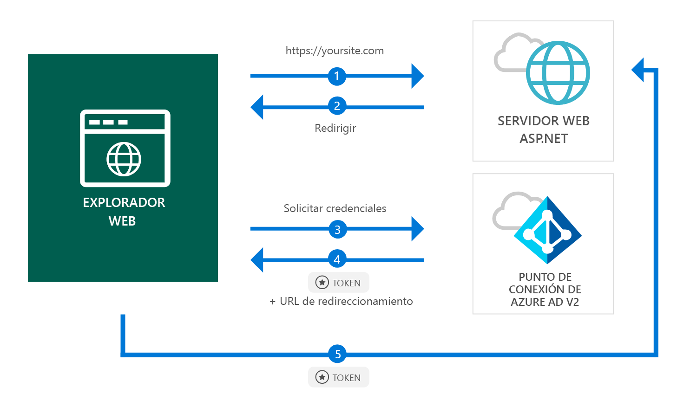

# <a name="quickstart-add-sign-in-with-microsoft-to-an-aspnet-web-app"></a>Guía de inicio rápido: Adición de inicio de sesión con Microsoft a una aplicación web ASP.NET

[!INCLUDE [active-directory-develop-applies-v2](../../../includes/active-directory-develop-applies-v2.md)]

En esta guía de inicio rápido, obtendrá información sobre cómo una aplicación web ASP.NET puede iniciar sesión en cuentas personales (hotmail.com, outlook.com y otras), profesionales y educativas desde cualquier instancia de Azure Active Directory (Azure AD).



> [!div renderon="docs"]
> ## <a name="register-your-application-and-download-your-quickstart-app"></a>Registro de una aplicación y descarga de la aplicación de la guía de inicio rápido
>
> ### <a name="register-and-configure-your-application-and-code-sample"></a>Registro y configuración de una aplicación y el código de ejemplo
> #### <a name="step-1-register-your-application"></a>Paso 1: Registro de la aplicación
> 
> 1. Vaya al [Portal de registro de aplicaciones de Microsoft](https://apps.dev.microsoft.com/portal/register-app).
> 1. Escriba un nombre de aplicación, asegúrese de que la opción de **Guided Setup** (Configuración guiada) no está activada y haga clic en **Create** (Crear).
> 1. Haga clic en `Add Platform` y, después, seleccione `Web`.
> 1. Asegúrese de que la casilla **Permitir flujo implícito** está *seleccionada*.
> 1. En **Direcciones URL de redireccionamiento**, escriba `https://localhost:44368/`.
> 1. Desplácese hasta la parte inferior de la página y haga clic en **Guardar**.

> [!div class="sxs-lookup" renderon="portal"]
> #### <a name="step-1-configure-your-application-in-azure-portal"></a>Paso 1: Configuración de la aplicación en Azure Portal
> Para que el código de ejemplo de esta guía de inicio rápido funcione, es preciso agregar una dirección URL de respuesta como `https://localhost:44368/`.
> > [!div renderon="portal" id="makechanges" class="nextstepaction"]
> > [Hacer este cambio por mí]()
>
> > [!div id="appconfigured" class="alert alert-info"]
> >  La aplicación está configurada con este atributo

#### <a name="step-2-download-your-project"></a>Paso 2: Descarga del proyecto

[Descargue la solución de Visual Studio 2017](https://github.com/AzureADQuickStarts/AppModelv2-WebApp-OpenIDConnect-DotNet/archive/master.zip)

#### <a name="step-3-configure-your-visual-studio-project"></a>Paso 3: Configuración del proyecto de Visual Studio

1. Extraiga el archivo ZIP en la carpeta local más próxima a la carpeta raíz (por ejemplo, **C:\Azure-Samples**).
1. Abra la solución en Visual Studio (AppModelv2-WebApp-OpenIDConnect-DotNet.sln)
1. Edite **Web.config** y reemplace `Enter_the_Application_Id_here` por el identificador de aplicación de la aplicación que acaba de registrar:

    ```xml
    <add key="ClientId" value="Enter_the_Application_Id_here" />
    ```
    
> [!div class="sxs-lookup" renderon="portal"]
> [!IMPORTANT]
> Si la aplicación es una *aplicación de inquilino único* (que tiene como destino solo las cuentas en este directorio), busque el valor de `Tenant` en el archivo **Web.config** y reemplace `common` por su **Id. de inquilino** o **nombre de inquilino** (por ejemplo, contoso.microsoft.com). El nombre del inquilino se puede obtener en la **página Información general**.

## <a name="more-information"></a>Más información

En esta sección se proporciona información general acerca del código necesario para el inicio de sesión de usuarios. Esto puede ser útil para comprender cómo funciona el código, los argumentos principales y también si desea agregar el inicio de sesión a una aplicación ASP.NET existente.

### <a name="owin-middleware-nuget-packages"></a>Paquetes NuGet del middleware OWIN

Puede configurar la canalización de autenticación con la autenticación basada en cookies mediante OpenID Connect en ASP.NET con paquetes del middleware OWIN. Puede instalar estos paquetes mediante la ejecución del siguiente comando en la **Consola del Administrador de paquetes** de Visual Studio:

```powershell
Install-Package Microsoft.Owin.Security.OpenIdConnect
Install-Package Microsoft.Owin.Security.Cookies
Install-Package Microsoft.Owin.Host.SystemWeb
```

### <a name="owin-startup-class"></a>Clase de inicio OWIN

El middleware OWIN usa una *clase de inicio* que se ejecuta cuando se inicializa el proceso de host (en el caso de esta guía de inicio rápido, el archivo *startup.cs* se encuentra en la carpeta raíz). En el código siguiente se muestra el parámetro utilizado por esta guía de inicio rápido:

```csharp
public void Configuration(IAppBuilder app)
{
    app.SetDefaultSignInAsAuthenticationType(CookieAuthenticationDefaults.AuthenticationType);

    app.UseCookieAuthentication(new CookieAuthenticationOptions());
    app.UseOpenIdConnectAuthentication(
        new OpenIdConnectAuthenticationOptions
        {
            // Sets the ClientId, authority, RedirectUri as obtained from web.config
            ClientId = clientId,
            Authority = authority,
            RedirectUri = redirectUri,
            // PostLogoutRedirectUri is the page that users will be redirected to after sign-out. In this case, it is using the home page
            PostLogoutRedirectUri = redirectUri,
            Scope = OpenIdConnectScope.OpenIdProfile,
            // ResponseType is set to request the id_token - which contains basic information about the signed-in user
            ResponseType = OpenIdConnectResponseType.IdToken,
            // ValidateIssuer set to false to allow personal and work accounts from any organization to sign in to your application
            // To only allow users from a single organizations, set ValidateIssuer to true and 'tenant' setting in web.config to the tenant name
            // To allow users from only a list of specific organizations, set ValidateIssuer to true and use ValidIssuers parameter 
            TokenValidationParameters = new TokenValidationParameters()
            {
                ValidateIssuer = false
            },
            // OpenIdConnectAuthenticationNotifications configures OWIN to send notification of failed authentications to OnAuthenticationFailed method
            Notifications = new OpenIdConnectAuthenticationNotifications
            {
                AuthenticationFailed = OnAuthenticationFailed
            }
        }
    );
}
```

> |Where  |  |
> |---------|---------|
> | `ClientId`     | El identificador de la aplicación registrada en Azure Portal |
> | `Authority`    | El punto de conexión STS para el usuario que se autenticará. Normalmente es https://login.microsoftonline.com/{tenant}/v2.0 para la nube pública, donde {tenant} es el nombre del inquilino, el id. de inquilino o *common* para hacer referencia al punto de conexión común (que se usa para las aplicaciones multiinquilino) |
> | `RedirectUri`  | Dirección URL a donde se redirige a los usuarios después de la autenticación en el punto de conexión de Azure AD v2.0 |
> | `PostLogoutRedirectUri`     | Dirección URL a donde se redirige a los usuarios después de cerrar sesión |
> | `Scope`     | La lista de ámbitos que se solicitan, separados por espacios |
> | `ResponseType`     | La solicitud para que la respuesta de la autenticación contenga un token de identificador |
> | `TokenValidationParameters`     | Una lista de parámetros para la validación del token. En este caso, `ValidateIssuer` está establecido en `false` para indicar que puede aceptar inicios de sesión desde cualquier tipo de cuenta: personal, profesional o educativa |
> | `Notifications`     | Una lista de delegados que se pueden ejecutar en diferentes mensajes de *OpenIdConnect* |

### <a name="initiate-an-authentication-challenge"></a>Inicialización de un desafío de autenticación

Puede forzar a un usuario para que inicie sesión si solicita un desafío de autenticación en el controlador:

```csharp
public void SignIn()
{
    if (!Request.IsAuthenticated)
    {
        HttpContext.GetOwinContext().Authentication.Challenge(
            new AuthenticationProperties{ RedirectUri = "/" },
            OpenIdConnectAuthenticationDefaults.AuthenticationType);
    }
}
```

> [!TIP]
> Solicitar un desafío de autenticación mediante el método anterior es opcional y, normalmente, se utiliza cuando desea que exista una vista accesible tanto para los usuarios autenticados como para los que no lo están. También puede proteger los controladores mediante el método descrito en la sección siguiente.

### <a name="protect-a-controller-or-a-controllers-method"></a>Protección de un controlador o del método de un controlador

Puede proteger un controlador o las acciones de un controlador mediante el atributo `[Authorize]`. Este atributo restringe el acceso al controlador o a sus acciones al permitirle el acceso solo a los usuarios autenticados, por lo que el desafío de autenticación se realizará automáticamente cuando un usuario *sin autenticar* intente acceder a una de las acciones o controladores con el atributo `[Authorize]`.

## <a name="next-steps"></a>Pasos siguientes

Visite el tutorial de ASP.NET para acceder a una guía completa paso a paso sobre la creación de aplicaciones y nuevas características, que incluye una explicación completa de esta guía de inicio rápido.

### <a name="learn-the-steps-to-create-the-application-used-in-this-quickstart"></a>Obtenga información sobre los pasos para crear la aplicación que se usa en esta guía de inicio rápido

> [!div class="nextstepaction"]
> [Tutorial de inicio de sesión](.\tutorial-v2-asp-webapp.md)

[!INCLUDE [Help and support](../../../includes/active-directory-develop-help-support-include.md)]