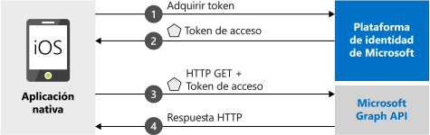

# <a name="quickstart-sign-in-users-and-call-the-microsoft-graph-api-from-an-ios-or-macos-app"></a>Inicio rápido: Inicio de sesión de los usuarios y llamada a Microsoft Graph API desde una aplicación de iOS o macOS

En este inicio rápido se incluye un código de ejemplo que muestra cómo una aplicación nativa de iOS o macOS puede usar la plataforma de identidad de Microsoft para iniciar sesión en cuentas personales, profesionales y educativas, obtener un token de acceso y llamar a Microsoft Graph API.

Este inicio rápido va dirigido a las aplicaciones de iOS y macOS. Algunos pasos solo son necesarios para las aplicaciones de iOS. Estos pasos indican que son solo para iOS.



> [!NOTE]
> **Requisitos previos**
> * XCode 10+
> * iOS 10+ 
> * macOS 10.12+

> [!div renderon="docs"]
> ## <a name="register-and-download-your-quickstart-app"></a>Registro y descarga de la aplicación de inicio rápido
> Tiene dos opciones para comenzar con la aplicación de inicio rápido:
> * [Rápido] [Opción 1: registrar y configurar de modo automático la aplicación y, a continuación, descargar el código de ejemplo](#option-1-register-and-auto-configure-your-app-and-then-download-the-code-sample)
> * [Manual] [Opción 2: registrar y configurar manualmente la aplicación y el código de ejemplo](#option-2-register-and-manually-configure-your-application-and-code-sample)
>
> ### <a name="option-1-register-and-auto-configure-your-app-and-then-download-the-code-sample"></a>Opción 1: Registrar y configurar de modo automático la aplicación y, luego, descargar el código de ejemplo
> #### <a name="step-1-register-your-application"></a>Paso 1: Registrar su aplicación
> Registro de aplicaciones
> 1. Vaya al nuevo panel de [Azure Portal: Registros de aplicaciones](https://portal.azure.com/#blade/Microsoft_AAD_RegisteredApps/applicationsListBlade/quickStartType/IosQuickstartPage/sourceType/docs).
> 1. Escriba un nombre para la aplicación y seleccione **Registrar**.
> 1. Siga las instrucciones para descargar y configurar automáticamente la nueva aplicación con un solo clic.
>
> ### <a name="option-2-register-and-manually-configure-your-application-and-code-sample"></a>Opción 2: registrar y configurar manualmente la aplicación y el código de ejemplo
>
> #### <a name="step-1-register-your-application"></a>Paso 1: Registrar su aplicación
> Para registrar la aplicación y agregar la información de registro de la aplicación a la solución de forma manual, siga estos pasos:
>
> 1. Vaya a la página [Registros de aplicaciones](https://aka.ms/MobileAppReg) de la plataforma de identidad de Microsoft para desarrolladores.
> 1. Seleccione **Nuevo registro**.
> 1. Cuando aparece la página **Registrar una aplicación**, escriba la información de registro de la aplicación:
>      - En la sección **Nombre**, escriba un nombre descriptivo para la aplicación que se mostrará a los usuarios de la aplicación cuando inicien sesión o den su consentimiento para la aplicación.
>      - Omita las demás configuraciones de esta página.
>      - Seleccione `Register`.
> 1. En la sección **Administrar**, seleccione `Authentication` > `Add Platform` > `iOS`.
>      - Escriba el ***identificador de agrupación*** de la aplicación. El identificador de agrupación es simplemente una cadena única que identifica de forma exclusiva la aplicación, por ejemplo `com.<yourname>.identitysample.MSALMacOS`. Anote el valor que usa.
>      - Tenga en cuenta que la configuración de iOS también va dirigida a las aplicaciones de macOS.
> 1. Seleccione `Configure` y guarde los detalles de ***Configuración de MSAL*** para usarlos más adelante en este inicio rápido.
> [!div renderon="portal" class="sxs-lookup"]
>
> #### <a name="step-1-configure-your-application"></a>Paso 1: Configuración de la aplicación
> Para que el código de ejemplo de esta guía de inicio rápido funcione, debe agregar un identificador URI de redirección compatible con el agente de autenticación.
> > [!div renderon="portal" id="makechanges" class="nextstepaction"]
> > [Hacer este cambio por mí]()
>
> > [!div id="appconfigured" class="alert alert-info"]
> >  La aplicación está configurada con estos atributos

#### <a name="step-2-download-the-sample-project"></a>Paso 2: Descarga del proyecto de ejemplo

- [Descargar el código de ejemplo para iOS](https://github.com/Azure-Samples/active-directory-ios-swift-native-v2/archive/master.zip)
- [Descargar el código de ejemplo para macOS](https://github.com/Azure-Samples/active-directory-macOS-swift-native-v2/archive/master.zip)

#### <a name="step-3-install-dependencies"></a>Paso 3: Instalar dependencias

En una ventana de terminal, vaya a la carpeta con el ejemplo de código descargado y ejecute `pod install` para instalar la biblioteca de MSAL más reciente.

#### <a name="step-4-configure-your-project"></a>Paso 4: Configuración del proyecto

> [!div renderon="docs"]
> Si ha seleccionado la opción 1 anterior, puede omitir estos pasos. 

> [!div renderon="portal" class="sxs-lookup"]
> 1. Extraiga el archivo ZIP y abra el proyecto en XCode.
> 1. Edite **ViewController.swift** y reemplace la línea que empieza con "let kClientID" por el siguiente fragmento de código: No olvide actualizar el valor de `kClientID` con el identificador de cliente que guardó al registrar la aplicación en el portal anteriormente en el inicio rápido:
>    ```swift
>    let kClientID = "Enter_the_Application_Id_Here"
>    ```
> 1. Abra la configuración del proyecto. En la sección **Identidad**, escriba el **identificador de agrupación** que especificó en el portal.
> 1. Solo en iOS, haga clic con el botón derecho en **Info.plist** y seleccione **Abrir como** > **Código fuente**.
> 1. Solo en iOS, en el nodo raíz dict, reemplace `CFBundleURLSchemes` por el valor de ***Id. de agrupación*** que escribió en el portal.
>
>    ```xml
>    <key>CFBundleURLTypes</key>
>    <array>
>       <dict>
>          <key>CFBundleURLSchemes</key>
>          <array>
>             <string>msauth.Enter_the_Bundle_Id_Here</string>
>          </array>
>       </dict>
>    </array>
>    ```
> 1. Compile y ejecute la aplicación.
> [!div class="sxs-lookup" renderon="portal"]
> > [!NOTE]
> > Este inicio rápido admite Enter_the_Supported_Account_Info_Here.
> [!div renderon="docs"]
>
> 1. Extraiga el archivo ZIP y abra el proyecto en XCode.
> 1. Edite **ViewController.swift** y reemplace la línea que empieza con "let kClientID" por el siguiente fragmento de código: No olvide actualizar el valor de `kClientID` con el identificador de cliente que guardó al registrar la aplicación en el portal anteriormente en este inicio rápido:
>    ```swift
>    let kClientID = "Enter_the_Application_Id_Here"
>    ```
> 1. Abra la configuración del proyecto. En la sección **Identidad**, escriba el **identificador de agrupación** que especificó en el portal.
> 1. Solo en iOS, haga clic con el botón derecho en **Info.plist** y seleccione **Abrir como** > **Código fuente**.
> 1. Solo en iOS, en el nodo raíz dict, reemplace `Enter_the_bundle_Id_Here` por el ***identificador de agrupación*** que usó en el portal.
>
>    ```xml
>    <key>CFBundleURLTypes</key>
>    <array>
>       <dict>
>          <key>CFBundleURLSchemes</key>
>          <array>
>             <string>msauth.Enter_the_Bundle_Id_Here</string>
>          </array>
>       </dict>
>    </array>
> 
>    ```
> 1. Compile y ejecute la aplicación. 

## <a name="more-information"></a>Más información

Lea estas secciones para obtener más información sobre esta guía de inicio rápido.

### <a name="get-msal"></a>Obtención de MSAL

MSAL ([MSAL.framework](https://github.com/AzureAD/microsoft-authentication-library-for-objc)) es la biblioteca que se usa para iniciar la sesión de los usuarios y solicitar los tokens que se usan para acceder a una API protegida por la Plataforma de identidad de Microsoft. Puede agregar MSAL a la aplicación mediante el proceso siguiente:

```
$ vi Podfile

```
Agregue lo siguiente a este podfile (con el destino de su proyecto):

```
use_frameworks!

target 'MSALiOS' do
   pod 'MSAL'
end

```

Ejecute el comando de instalación de CocoaPods:

```pod install```

### <a name="initialize-msal"></a>Inicializar MSAL

Puede agregar la referencia de MSAL con el código siguiente:

```swift
import MSAL
```

A continuación, realice la inicialización de MSAL con el siguiente código:

```swift
let authority = try MSALAADAuthority(url: URL(string: kAuthority)!)
            
let msalConfiguration = MSALPublicClientApplicationConfig(clientId: kClientID, redirectUri: nil, authority: authority)
self.applicationContext = try MSALPublicClientApplication(configuration: msalConfiguration)
```

> |Donde: ||
> |---------|---------|
> | `clientId` | El identificador de aplicación de la aplicación registrada en *portal.azure.com* |
> | `authority` | Punto de conexión de la Plataforma de identidad de Microsoft En la mayoría de los casos será *https<span/>://login.microsoftonline.com/common* |
> | `redirectUri` | URI de redireccionamiento de la aplicación. Puede pasar "nil" para usar el valor predeterminado o su URI de redireccionamiento personalizado. |

### <a name="for-ios-only-additional-app-requirements"></a>Solo en iOS, requisitos adicionales de la aplicación

La aplicación también debe tener lo siguiente en `AppDelegate`. Esto permite que el SDK de MSAL controle la respuesta del token desde la aplicación de agente de autenticación cuando realice la autenticación.

 ```swift
 func application(_ app: UIApplication, open url: URL, options: [UIApplication.OpenURLOptionsKey : Any] = [:]) -> Bool {
        
        return MSALPublicClientApplication.handleMSALResponse(url, sourceApplication: options[UIApplication.OpenURLOptionsKey.sourceApplication] as? String)
    }

 ```

> [!NOTE]
> En iOS 13+, si adopta `UISceneDelegate` en lugar de `UIApplicationDelegate`, coloque este código en la devolución de llamada `scene:openURLContexts:` (consulte la [documentación de Apple](https://developer.apple.com/documentation/uikit/uiscenedelegate/3238059-scene?language=objc)).
> Si admite UISceneDelegate y UIApplicationDelegate para la compatibilidad con sistemas operativos iOS anteriores, la devolución de llamada de MSAL debe colocarse en ambos lugares.

 ```swift
 func scene(_ scene: UIScene, openURLContexts URLContexts: Set<UIOpenURLContext>) {
        
        guard let urlContext = URLContexts.first else {
            return
        }
        
        let url = urlContext.url
        let sourceApp = urlContext.options.sourceApplication
        
        MSALPublicClientApplication.handleMSALResponse(url, sourceApplication: sourceApp)
    }
 ```

Por último, la aplicación debe tener una entrada `LSApplicationQueriesSchemes` en ***Info.plist*** junto con `CFBundleURLTypes`. El ejemplo incluye esto. 

   ```xml 
   <key>LSApplicationQueriesSchemes</key>
   <array>
      <string>msauthv2</string>
      <string>msauthv3</string>
   </array>
   ```

### <a name="sign-in-users--request-tokens"></a>Inicio de sesión de usuarios y solicitud de tokens

MSAL tiene dos métodos para adquirir tokens: `acquireToken` y `acquireTokenSilent`.

#### <a name="acquiretoken-get-a-token-interactively"></a>acquireToken: Obtención de un token interactivamente

Algunas situaciones requieren que los usuarios interactúen con la plataforma de identidad de Microsoft. En estos casos, puede que sea necesario que el usuario final seleccione su cuenta, escriba sus credenciales o dé su consentimiento a los permisos de la aplicación. Por ejemplo, 

* La primera vez que los usuarios inician sesión en la aplicación
* Si un usuario restablece su contraseña, deberá escribir sus credenciales. 
* Cuando la aplicación solicita acceso a un recurso por primera vez.
* Cuando se requieren MFA u otras directivas de acceso condicional.

```swift
let parameters = MSALInteractiveTokenParameters(scopes: kScopes, webviewParameters: self.webViewParamaters!)
self.applicationContext!.acquireToken(with: parameters) { (result, error) in /* Add your handling logic */}
```

> |Donde:||
> |---------|---------|
> | `scopes` | Contiene los ámbitos que se solicitan (es decir, `[ "user.read" ]` para Microsoft Graph o `[ "<Application ID URL>/scope" ]` para las API web personalizadas `api://<Application ID>/access_as_user`) |

#### <a name="acquiretokensilent-get-an-access-token-silently"></a>acquireTokenSilent: Obtención de un token de acceso de forma automática

Las aplicaciones no requieren que sus usuarios inicien sesión cada vez que soliciten un token. Si el usuario ya ha iniciado sesión, este método permite que las aplicaciones soliciten tokens de forma silenciosa. 

```swift
guard let account = try self.applicationContext!.allAccounts().first else { return }
        
let silentParams = MSALSilentTokenParameters(scopes: kScopes, account: account)
self.applicationContext!.acquireTokenSilent(with: silentParams) { (result, error) in /* Add your handling logic */}
```

> |Donde: ||
> |---------|---------|
> | `scopes` | Contiene los ámbitos que se solicitan (es decir, `[ "user.read" ]` para Microsoft Graph o `[ "<Application ID URL>/scope" ]` para las API web personalizadas `api://<Application ID>/access_as_user`) |
> | `account` | La cuenta para la que se solicita un token. Este inicio rápido trata de una aplicación de una sola cuenta. Si quiere compilar una aplicación de varias cuentas, deberá definir una lógica para identificar qué cuenta usar para las solicitudes de token que usen `applicationContext.account(forHomeAccountId: self.homeAccountId)` |

## <a name="next-steps"></a>Pasos siguientes

Pruebe el tutorial de iOS para ver una guía completa paso a paso sobre cómo compilar aplicaciones, incluida una explicación exhaustiva de este inicio rápido.

### <a name="learn-how-to-create-the-application-used-in-this-quickstart"></a>Aprenda a crear la aplicación que se ha usado en este inicio rápido.

> [!div class="nextstepaction"]
> [Tutorial de iOS de Graph API de llamada](https://docs.microsoft.com/azure/active-directory/develop/guidedsetups/active-directory-ios)

[!INCLUDE [Help and support](../../../includes/active-directory-develop-help-support-include.md)]

Ayúdenos a mejorar la Plataforma de identidad de Microsoft. Rellene una breve encuesta de dos preguntas y háganos saber su opinión.

> [!div class="nextstepaction"]
> [Encuesta sobre la Plataforma de identidad de Microsoft](https://forms.office.com/Pages/ResponsePage.aspx?id=v4j5cvGGr0GRqy180BHbRyKrNDMV_xBIiPGgSvnbQZdUQjFIUUFGUE1SMEVFTkdaVU5YT0EyOEtJVi4u)
