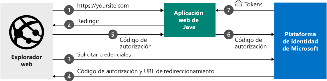

# <a name="quickstart-add-sign-in-with-microsoft-to-a-java-web-app"></a>Inicio rápido: Adición de inicio de sesión con Microsoft a una aplicación web de Java

En este inicio rápido, aprenderá a integrar una aplicación web de Java con la Plataforma de identidad de Microsoft. Su aplicación iniciará la sesión de un usuario, obtendrá un token de acceso para llamar a Microsoft Graph API y realizará una solicitud a Microsoft Graph API.

Cuando haya completado esta guía de inicio rápido, la aplicación aceptará inicios de sesión de cuentas personales de Microsoft (como outlook.com, live.com, etc.) y cuentas profesionales o educativas de cualquier empresa u organización que use Azure Active Directory.



## <a name="prerequisites"></a>Prerrequisitos

Para ejecutar este ejemplo, necesitará lo siguiente:

- [Kit de desarrollo de Java (JDK)](https://openjdk.java.net/) 8 o versión posterior y [Maven](https://maven.apache.org/).
- Un inquilino de Azure Active Directory (Azure AD). Para más información sobre cómo obtener un inquilino de Azure AD, consulte [Cómo obtener un inquilino de Azure AD](https://azure.microsoft.com/documentation/articles/active-directory-howto-tenant/).

> [!div renderon="docs"]
> ## <a name="register-and-download-your-quickstart-app"></a>Registro y descarga de la aplicación de inicio rápido
> Tiene dos opciones para comenzar con la aplicación de inicio rápido: Rápido (opción 1) y Manual (opción 2)
>
> ### <a name="option-1-register-and-auto-configure-your-app-and-then-download-your-code-sample"></a>Opción 1: registrar y configurar de modo automático la aplicación y, a continuación, descargar el código de ejemplo
>
> 1. Vaya a [Azure Portal: registros de aplicaciones](https://portal.azure.com/#blade/Microsoft_AAD_IAM/ActiveDirectoryMenuBlade/RegisteredApps).
> 1. Escriba un nombre para la aplicación y seleccione **Registrar**.
> 1. Siga las instrucciones para descargar y configurar automáticamente la nueva aplicación.
>
> ### <a name="option-2-register-and-manually-configure-your-application-and-code-sample"></a>Opción 2: registrar y configurar manualmente la aplicación y el código de ejemplo
>
> #### <a name="step-1-register-your-application"></a>Paso 1: Registrar su aplicación
>
> Para registrar la aplicación y agregar la información de registro de la aplicación a la solución de forma manual, siga estos pasos:
>
> 1. Inicie sesión en [Azure Portal](https://portal.azure.com) con una cuenta personal, profesional o educativa de Microsoft.
> 1. Si la cuenta proporciona acceso a más de un inquilino, haga clic en la cuenta en la esquina superior derecha y establezca la sesión del portal en el inquilino de Azure AD deseado.
>
> 1. Vaya a la página [Registros de aplicaciones](/azure/active-directory/develop/) de la plataforma de identidad de Microsoft para desarrolladores.
> 1. Seleccione **Nuevo registro**.
> 1. Cuando aparece la página **Registrar una aplicación**, escriba la información de registro de la aplicación:
>    - En la sección **Nombre**, escriba un nombre significativo para la aplicación, que se mostrará a los usuarios de la aplicación, por ejemplo, `java-webapp`.
>    - Deje **URI de redirección** en blanco por ahora y seleccione **Registrar**.
> 1. En la página **Información general**, busque los valores de **Identificador de la aplicación (cliente)** y **el identificador del Directorio (inquilino)**  de la aplicación. Copie estos valores para más adelante.
> 1. Seleccione la **Autenticación** en el menú y, después, agregue la siguiente información:
>    - En **URI de redirección**, agregue `https://localhost:8080/msal4jsample/secure/aad` y `https://localhost:8080/msal4jsample/graph/me`.
>    - Seleccione **Guardar**.
> 1. Seleccione los **Certificados y secretos** en el menú y, en la sección de **Secretos de cliente**, haga clic en **Nuevo secreto de cliente**:
>
>    - Escriba una descripción de clave (por ejemplo, secreto de aplicación).
>    - Seleccione una duración clave **En 1 año**.
>    - El valor de la clave se mostrará al seleccionar **Agregar**.
>    - Copie el valor de la clave para más adelante. Este valor de clave no se volverá a mostrar ni a recuperar de ninguna otra forma, de modo que regístrelo en cuanto esté visible en Azure Portal.
>
> [!div class="sxs-lookup" renderon="portal"]
> #### <a name="step-1-configure-your-application-in-the-azure-portal"></a>Paso 1: Configuración de la aplicación en Azure Portal
>
> Para que el código de ejemplo de este inicio rápido funcione, es preciso:
>
> 1. Agregue las direcciones URL de respuesta como `https://localhost:8080/msal4jsamples/secure/aad` y `https://localhost:8080/msal4jsamples/graph/me`.
> 1. Cree un secreto de cliente.
> > [!div renderon="portal" id="makechanges" class="nextstepaction"]
> > [Realizar estos cambios por mí]()
>
> > [!div id="appconfigured" class="alert alert-info"]
> >  La aplicación está configurada con estos atributos.

#### <a name="step-2-download-the-code-sample"></a>Paso 2: Descargar el código de ejemplo

 [Descargar el código de ejemplo](https://github.com/Azure-Samples/ms-identity-java-webapp/archive/master.zip)

#### <a name="step-3-configure-the-code-sample"></a>Paso 3: Configurar el ejemplo de código

 1. Extraiga el archivo zip en una carpeta local.
 1. Si usa un entorno de desarrollo integrado, abra el ejemplo en su IDE favorito (opcional).
 1. Abra el archivo application.properties, que puede encontrarse en la carpeta src/main/resources/ y reemplace el valor de los campos *aad.clientId*, *aad.authority* y *aad.secretKey* con los valores respectivos de **Identificador de la aplicación**, **ID. de inquilino** y **Secreto de cliente** como el siguiente:

    ```file
    aad.clientId=Enter_the_Application_Id_here
    aad.authority=https://login.microsoftonline.com/Enter_the_Tenant_Info_Here/
    aad.secretKey=Enter_the_Client_Secret_Here
    aad.redirectUriSignin=https://localhost:8080/msal4jsample/secure/aad
    aad.redirectUriGraph=https://localhost:8080/msal4jsample/graph/me
    ```

    > [!div renderon="docs"]
    > Donde:
    >
    > - `Enter_the_Application_Id_here`: es el identificador de aplicación de la aplicación que registró.
    > - `Enter_the_Client_Secret_Here`: es el valor de **Secreto de cliente** que creó en **Certificados y secretos** para la aplicación registrada.
    > - `Enter_the_Tenant_Info_Here`: el valor de **Id. de directorio (inquilino)** de la aplicación que registró.

 1. Para usar https con localhost, rellene las propiedades server.ssl.key. Para generar un certificado autofirmado, use la utilidad keytool (que se incluye en JRE).

   ```
   Example: 
   keytool -genkeypair -alias testCert -keyalg RSA -storetype PKCS12 -keystore keystore.p12 -storepass password

   server.ssl.key-store-type=PKCS12  
   server.ssl.key-store=classpath:keystore.p12  
   server.ssl.key-store-password=password  
   server.ssl.key-alias=testCert 
   ```

   Coloque el archivo del almacén de claves generado en la carpeta "Resources".

#### <a name="step-4-run-the-code-sample"></a>Paso 4: Ejecución del ejemplo de código

Para ejecutar el proyecto, puede:

Ejecutarlo directamente desde el IDE mediante el servidor de Spring boot integrado o empaquételo en un archivo WAR mediante [Maven](https://maven.apache.org/plugins/maven-war-plugin/usage.html) e impleméntelo en una solución de contenedor de J2EE como [Apache Tomcat](http://tomcat.apache.org/).

##### <a name="running-from-ide"></a>Ejecutarlo desde IDE

Si está ejecutando la aplicación web desde un IDE, haga clic en ejecutar y, luego, vaya a la Página principal del proyecto. En este ejemplo, la dirección URL de la Página principal estándar es https://localhost:8080.

1. En la página de información, seleccione el botón **Inicio de sesión** para redirigir a Azure Active Directory y solicite al usuario sus credenciales.

1. Una vez autenticado el usuario, se redirigen a *https://localhost:8080/msal4jsample/secure/aad* . Ahora han iniciado sesión y la página mostrará información sobre la cuenta que ha iniciado sesión. La interfaz de usuario de ejemplo tiene los siguientes botones:
    - *Sign Out* (Cerrar sesión): Cierra la sesión del usuario actual de la aplicación y lo redirige a la página principal.
    - *Mostrar información de usuario*: Adquiere un token para Microsoft Graph y llama a Microsoft Graph con una solicitud que contiene el token, que devuelve información básica sobre el usuario que inició sesión.

> [!IMPORTANT]
> Esta aplicación de inicio rápido usa un secreto de cliente para identificarse como cliente confidencial. Dado que el secreto de cliente se agrega como texto sin formato a los archivos de proyecto, por motivos de seguridad se recomienda que use un certificado en lugar de un secreto de cliente antes de considerar la aplicación como aplicación de producción. Para más información sobre cómo usar un certificado, consulte [Credenciales de certificado para la autenticación de la aplicación](https://docs.microsoft.com/azure/active-directory/develop/active-directory-certificate-credentials).

## <a name="more-information"></a>Más información

### <a name="getting-msal"></a>Obtención de MSAL

MSAL for Java (MSAL4J) es la biblioteca de Java que se usa para que inicien sesión los usuarios y solicitar tokens usados para acceder a una API protegida por la plataforma de Microsoft Identity.

Agregue MSAL4J a la aplicación con Maven o Gradle para administrar las dependencias al realizar los cambios siguientes en el archivo pom.xml (Maven) o build.gradle (Gradle) de la aplicación.

```XML
<dependency>
    <groupId>com.microsoft.azure</groupId>
    <artifactId>msal4j</artifactId>
    <version>1.0.0</version>
</dependency>
```

```$xslt
compile group: 'com.microsoft.azure', name: 'msal4j', version: '1.0.0'
```

### <a name="msal-initialization"></a>Inicialización de MSAL

Para agregar una referencia a MSAL for Java, incorpore el código siguiente al principio del archivo en el que va a usar MSAL4J:

```Java
import com.microsoft.aad.msal4j.*;
```

## <a name="next-steps"></a>Pasos siguientes

Más información sobre los permisos y el consentimiento:

> [!div class="nextstepaction"]
> [Permisos y consentimiento](https://docs.microsoft.com/azure/active-directory/develop/v2-permissions-and-consent)

Para más información sobre el flujo de autenticación en este escenario, consulte el flujo del código de autorización de OAuth 2.0:

> [!div class="nextstepaction"]
> [Flujo del código de autorización de OAuth](https://docs.microsoft.com/azure/active-directory/develop/v2-oauth2-auth-code-flow)

Ayúdenos a mejorar la Plataforma de identidad de Microsoft. Rellene una breve encuesta de dos preguntas y háganos saber su opinión.

> [!div class="nextstepaction"]
> [Encuesta sobre la Plataforma de identidad de Microsoft](https://forms.office.com/Pages/ResponsePage.aspx?id=v4j5cvGGr0GRqy180BHbRyKrNDMV_xBIiPGgSvnbQZdUQjFIUUFGUE1SMEVFTkdaVU5YT0EyOEtJVi4u)

[!INCLUDE [Help and support](../../../includes/active-directory-develop-help-support-include.md)]
