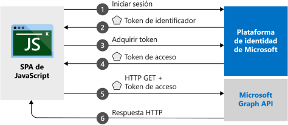

# <a name="quickstart-sign-in-users-and-get-an-access-token-in-a-javascript-spa"></a>Inicio rápido: Inicio de sesión de usuarios y obtención de un token de acceso en un SPA de JavaScript

En este inicio rápido se usa un código de ejemplo que muestra cómo una aplicación de página única (SPA) de JavaScript puede iniciar sesión en usuarios de cuentas personales, profesionales y educativas. Una SPA de JavaScript también puede obtener un token de acceso para llamar a Microsoft Graph API o a cualquier API web. (Para ilustrar este tema, consulte el apartado en el que se explica el [funcionamiento del ejemplo](#how-the-sample-works).)

## <a name="prerequisites"></a>Prerrequisitos

* Una suscripción a Azure: [cree una cuenta gratuita](https://azure.microsoft.com/free/?WT.mc_id=A261C142F)
* [Node.js](https://nodejs.org/en/download/)
* [Visual Studio Code](https://code.visualstudio.com/download) (para editar archivos de proyecto)


> [!div renderon="docs"]
> ## <a name="register-and-download-your-quickstart-application"></a>Registro y descarga de la aplicación de inicio rápido
> Para iniciar la aplicación de inicio rápido, use cualquiera de las siguientes opciones.
>
> ### <a name="option-1-express-register-and-auto-configure-your-app-and-then-download-your-code-sample"></a>Opción 1 (Rápido): registrar y configurar de modo automático la aplicación y, a continuación, descargar el código de ejemplo
>
> 1. Inicie sesión en [Azure Portal](https://portal.azure.com) con una cuenta personal, profesional o educativa de Microsoft.
> 1. Si la cuenta le proporciona acceso a más de un inquilino, seleccione la cuenta en la esquina superior derecha y establezca la sesión del portal en el inquilino de Active Directory (Azure AD) que desee utilizar.
> 1. Vaya al nuevo panel de [Azure Portal: Registros de aplicaciones](https://portal.azure.com/#blade/Microsoft_AAD_RegisteredApps/ApplicationsListBlade/quickStartType/JavascriptSpaQuickstartPage/sourceType/docs).
> 1. Escriba un nombre para la aplicación. 
> 1. En **Supported account types** (Tipos de cuenta compatibles), seleccione **Accounts in any organizational directory and personal Microsoft accounts** (Cuentas en cualquier directorio de organización y cuentas personales de Microsoft).
> 1. Seleccione **Registrar**.
> 1. Siga las instrucciones para descargar y configurar automáticamente la nueva aplicación.
>
> ### <a name="option-2-manual-register-and-manually-configure-your-application-and-code-sample"></a>Opción 2 (Manual): registrar y configurar manualmente la aplicación y el código de ejemplo
>
> #### <a name="step-1-register-your-application"></a>Paso 1: Registrar su aplicación
>
> 1. Inicie sesión en [Azure Portal](https://portal.azure.com) con una cuenta personal, profesional o educativa de Microsoft.
>
> 1. Si la cuenta proporciona acceso a más de un inquilino, seleccione la cuenta en la esquina superior derecha y establezca la sesión del portal en el inquilino de Azure AD que desee utilizar.
> 1. Vaya a la página [Registros de aplicaciones](https://go.microsoft.com/fwlink/?linkid=2083908) de la plataforma de identidad de Microsoft para desarrolladores.
> 1. Seleccione **Nuevo registro**.
> 1. Cuando se abra la página **Registrar una aplicación**, escriba el nombre de su aplicación.
> 1. En **Supported account types** (Tipos de cuenta compatibles), seleccione **Accounts in any organizational directory and personal Microsoft accounts** (Cuentas en cualquier directorio de organización y cuentas personales de Microsoft).
> 1. Seleccione **Registrar**. En la página de **información general** de la aplicación, anote el valor del **Identificador de aplicación (cliente)** para su uso posterior.
> 1. Para esta guía, se requiere que habilite el [flujo de concesión implícita](v2-oauth2-implicit-grant-flow.md). En el panel izquierdo de la aplicación registrada, seleccione **Autenticación**.
> 1. En **Configuraciones de plataforma**, seleccione **Agregar una plataforma**. Se abre un panel a la izquierda. Allí, seleccione la región de **Aplicaciones web**.
> 1. También en el panel de la izquierda, establezca el valor **URI de redireccionamiento** en `http://localhost:3000/`. A continuación, seleccione **Token de acceso** y **Token de identificador**.
> 1. Seleccione **Configurar**.

> [!div class="sxs-lookup" renderon="portal"]
> #### <a name="step-1-configure-your-application-in-the-azure-portal"></a>Paso 1: Configuración de la aplicación en Azure Portal
> Para hacer que el código de ejemplo funcione en este inicio rápido, tiene que agregar un `redirectUri` como `http://localhost:3000/` y habilitar **Concesión implícita**.
> > [!div renderon="portal" id="makechanges" class="nextstepaction"]
> > [Realizar estos cambios por mí]()
>
> > [!div id="appconfigured" class="alert alert-info"]
> >  La aplicación está configurada con estos atributos.

#### <a name="step-2-download-the-project"></a>Paso 2: Descarga del proyecto

> [!div renderon="docs"]
> Para ejecutar el proyecto con un servidor web con Node.js. [descargue los archivos principales del proyecto](https://github.com/Azure-Samples/active-directory-javascript-graphapi-v2/archive/quickstart.zip).

> [!div renderon="portal"]
> Ejecutar el proyecto con un servidor Web mediante Node.js

> [!div renderon="portal" id="autoupdate" class="nextstepaction"]
> [Descargar el código de ejemplo]()

> [!div renderon="docs"]

> #### <a name="step-3-configure-your-javascript-app"></a>Paso 3: Configuración de la aplicación de JavaScript
>
> En la carpeta *JavaScriptSPA*, edite *authConfig.js* y establezca los valores `clientID`, `authority` y `redirectUri` en `msalConfig`.
>
> ```javascript
>
>  // Config object to be passed to Msal on creation
>  const msalConfig = {
>    auth: {
>      clientId: "Enter_the_Application_Id_Here",
>      authority: "Enter_the_Cloud_Instance_Id_HereEnter_the_Tenant_Info_Here",
>      redirectUri: "Enter_the_Redirect_Uri_Here",
>    },
>    cache: {
>      cacheLocation: "sessionStorage", // This configures where your cache will be stored
>      storeAuthStateInCookie: false, // Set this to "true" if you are having issues on IE11 or Edge
>    }
>  };  
>
>```

> [!div renderon="portal"]
> > [!NOTE]
> > Escriba_la_información_de_la_cuenta_admitida_aquí

> [!div renderon="docs"]
>
> Donde:
> - *\<Enter_the_Application_Id_here>* es el **identificador de aplicación (cliente)** de la aplicación que ha registrado.
> - *\<Enter_the_Cloud_Instance_Id_Here >* es la instancia de la nube de Azure. En el caso de la nube de Azure principal o global, simplemente escriba *https://login.microsoftonline.com* . Para nubes **nacionales** (por ejemplo, China), consulte [Nubes nacionales](https://docs.microsoft.com/azure/active-directory/develop/authentication-national-cloud).
> - *\<Enter_the_Tenant_info_here >* está establecido en una de las opciones siguientes:
>    - Si la aplicación admite *solo las cuentas de este directorio organizativo*, reemplace este valor por el **identificador de inquilino** o el **nombre de inquilino** (por ejemplo, *contoso.microsoft.com*).
>    - Si la aplicación admite *cuentas en cualquier directorio organizativo*, reemplace este valor por **organizaciones**.
>    - Si la aplicación admite *cuentas en cualquier directorio organizativo y cuentas Microsoft personales*, reemplace este valor por **común**. Para restringir la compatibilidad a *Personal Microsoft accounts only* (Solo cuentas Microsoft personales), reemplace este valor por **consumidores**.
>
> > [!TIP]
> > Para buscar los valores de **Identificador de aplicación (cliente)** , **Identificador de directorio (inquilino)** y **Tipos de cuenta admitidos**, vaya a la página **Información general** en Azure Portal.
>
> [!div class="sxs-lookup" renderon="portal"]
> #### <a name="step-3-your-app-is-configured-and-ready-to-run"></a>Paso 3: La aplicación está configurada y lista para ejecutarse
> Hemos configurado el proyecto con los valores de las propiedades de su aplicación. 

> [!div renderon="docs"]
> 
> Después, en la misma carpeta, edite el archivo *graphConfig.js* para establecer `graphMeEndpoint` y `graphMeEndpoint` para el objeto `apiConfig`.
> ```javascript
>   // Add here the endpoints for MS Graph API services you would like to use.
>   const graphConfig = {
>     graphMeEndpoint: "Enter_the_Graph_Endpoint_Herev1.0/me",
>     graphMailEndpoint: "Enter_the_Graph_Endpoint_Herev1.0/me/messages"
>   };
>
>   // Add here scopes for access token to be used at MS Graph API endpoints.
>   const tokenRequest = {
>       scopes: ["Mail.Read"]
>   };
> ```
>

> [!div renderon="docs"]
>
> Donde:
> - *\<EspecifiqueAquíElPuntoDeConexiónDelGráfico>* es el punto de conexión en el que se realizarán las llamadas API. Para el servicio principal o global de Microsoft Graph API, simplemente escriba `https://graph.microsoft.com`. Para más información, consulte [Implementaciones de nube nacionales](https://docs.microsoft.com/graph/deployments)
>
> #### <a name="step-4-run-the-project"></a>Paso 4: Ejecución del proyecto

Ejecute el proyecto con un servidor web mediante [Node.js](https://nodejs.org/en/download/):

1. Para iniciar el servidor, ejecute el comando siguiente desde el directorio del proyecto:
    ```batch
    npm install
    npm start
    ```
1. Abra un explorador web y vaya a `http://localhost:3000/`.

1. Seleccione **Iniciar sesión**, inicie sesión y llame a Microsoft Graph API.

Cuando el explorador haya cargado la aplicación, seleccione **Iniciar sesión**. La primera vez que inicie sesión, también se le pedirá que dé su consentimiento para permitir que la aplicación obtenga acceso al perfil e inicie sesión automáticamente. Después de que haya iniciado sesión correctamente, la información del perfil de usuario debe mostrarse en la página.

## <a name="more-information"></a>Más información

### <a name="how-the-sample-works"></a>Funcionamiento del ejemplo



### <a name="msaljs"></a>msal.js

La biblioteca MSAL inicia la sesión de los usuarios y solicita los tokens que se usan para acceder a una API protegida por la plataforma de identidad de Microsoft. El archivo *index.html* del inicio rápido contiene una referencia a la biblioteca:

```html
<script type="text/javascript" src="https://alcdn.msftauth.net/lib/1.2.1/js/msal.js" integrity="sha384-9TV1245fz+BaI+VvCjMYL0YDMElLBwNS84v3mY57pXNOt6xcUYch2QLImaTahcOP" crossorigin="anonymous"></script>
```
> [!TIP]
> Puede reemplazar la versión anterior con la versión más reciente en las [versiones MSAL.js](https://github.com/AzureAD/microsoft-authentication-library-for-js/releases).

Si tiene Node.js instalado, también puede descargar la versión más reciente mediante el administrador de paquetes de Node.js (npm):

```batch
npm install msal
```

### <a name="msal-initialization"></a>Inicialización de MSAL

El código del inicio rápido también muestra cómo inicializar la biblioteca MSAL:

```javascript
  // Config object to be passed to Msal on creation
  const msalConfig = {
    auth: {
      clientId: "75d84e7a-40bx-f0a2-91b9-0c82d4c556aa", // this is a fake id
      authority: "https://login.microsoftonline.com/common",
      redirectUri: "http://localhost:3000/",
    },
    cache: {
      cacheLocation: "sessionStorage", // This configures where your cache will be stored
      storeAuthStateInCookie: false, // Set this to "true" if you are having issues on IE11 or Edge
    }
  };  

const myMSALObj = new Msal.UserAgentApplication(msalConfig);
```

> |Where  |  |
> |---------|---------|
> |`clientId`     | El identificador de la aplicación registrada en Azure Portal.|
> |`authority`    | (Opcional) La dirección URL que admite tipos de cuenta, como se describe anteriormente en la sección de configuración. La autoridad predeterminada es `https://login.microsoftonline.com/common`. |
> |`redirectUri`     | El URI de redirección/respuesta configurado del registro de aplicación. En este caso, `http://localhost:3000/`. |
> |`cacheLocation`  | (Opcional) Establece el almacenamiento del explorador para el estado de autenticación. El valor predeterminado es sessionStorage.   |
> |`storeAuthStateInCookie`  | (Opcional) La biblioteca que almacena el estado de la solicitud de autenticación necesario para la validación de los flujos de autenticación en las cookies del explorador. Esta cookie se establece para que los exploradores IE y Edge puedan solucionar determinados [problemas conocidos](https://github.com/AzureAD/microsoft-authentication-library-for-js/wiki/Known-issues-on-IE-and-Edge-Browser#issues). |

Para más información acerca de las opciones configurables disponibles, consulte [Inicializar aplicaciones cliente](msal-js-initializing-client-applications.md).

### <a name="sign-in-users"></a>Inicio de sesión de usuarios

El siguiente fragmento de código muestra cómo iniciar la sesión de los usuarios:

```javascript
// Add scopes for the id token to be used at Microsoft identity platform endpoints.
const loginRequest = {
    scopes: ["openid", "profile", "User.Read"],
};

myMSALObj.loginPopup(loginRequest)
    .then((loginResponse) => {
    //Login Success callback code here
}).catch(function (error) {
    console.log(error);
});
```

> |Where  |  |
> |---------|---------|
> | `scopes`   | (Opcional) Contiene los ámbitos que se solicitan para el consentimiento del usuario en el momento del inicio de sesión. Por ejemplo, `[ "user.read" ]` para Microsoft Graph o `[ "<Application ID URL>/scope" ]` para API web personalizadas, es decir, `api://<Application ID>/access_as_user`. |

> [!TIP]
> Como alternativa, puede usar el método `loginRedirect` para redirigir la página actual a la página de inicio de sesión en lugar de una ventana emergente.

### <a name="request-tokens"></a>Solicitud de tokens

MSAL utiliza tres métodos para adquirir tokens: `acquireTokenRedirect`, `acquireTokenPopup` y `acquireTokenSilent`

#### <a name="get-a-user-token-silently"></a>Obtención de un token de usuario en silencio

El método `acquireTokenSilent` controla la renovación y las adquisiciones de tokens sin la interacción del usuario. Después de que se ejecuten los métodos `loginRedirect` y `loginPopup` por primera vez, `acquireTokenSilent` es el método que se usa habitualmente para obtener los tokens que se utilizan para acceder a los recursos protegidos en las llamadas posteriores. Las llamadas para solicitar o renovar tokens se realizan en modo silencioso.

```javascript

const tokenRequest = {
    scopes: ["Mail.Read"]
};

myMSALObj.acquireTokenSilent(tokenRequest)
    .then((tokenResponse) => {
        // Callback code here
        console.log(tokenResponse.accessToken);
    }).catch((error) => {
        console.log(error);
    });
```

> |Where  |  |
> |---------|---------|
> | `scopes`   | Contiene los ámbitos cuya devolución se solicita en el token de acceso de la API. Por ejemplo, `[ "mail.read" ]` para Microsoft Graph o `[ "<Application ID URL>/scope" ]` para API web personalizadas, es decir, `api://<Application ID>/access_as_user`.|

#### <a name="get-a-user-token-interactively"></a>Obtención de un token de usuario interactivamente

Hay situaciones en las que es necesario forzar a los usuarios a interactuar con el punto de conexión de la plataforma de identidad de Microsoft. Por ejemplo:
* Es posible que los usuarios tengan que volver a escribir las credenciales porque su contraseña ha expirado.
* La aplicación solicita acceso a ámbitos de recursos adicionales para los que se necesita el consentimiento del usuario.
* Se requiere la autenticación en dos fases.

El patrón habitual recomendado para la mayoría de las aplicaciones es llamar primero a `acquireTokenSilent`, después detectar la excepción y, por último, llamar a `acquireTokenPopup` (o a `acquireTokenRedirect`) para iniciar una solicitud interactiva.

Una llamada a `acquireTokenPopup` da como resultado una ventana emergente para iniciar sesión. (O `acquireTokenRedirect` da como resultado la redirección de los usuarios al punto de conexión de la plataforma de identidad de Microsoft). En esa ventana, los usuarios tienen que interactuar confirmando las credenciales, dándole el consentimiento al recurso requerido o completando la autenticación en dos fases.

```javascript
// Add here scopes for access token to be used at MS Graph API endpoints.
const tokenRequest = {
    scopes: ["Mail.Read"]
};

myMSALObj.acquireTokenPopup(requestObj)
    .then((tokenResponse) => {
        // Callback code here
        console.log(tokenResponse.accessToken);
    }).catch((error) => {
        console.log(error);
    });
```

> [!NOTE]
> En este inicio rápido, se usan los métodos `loginRedirect` y `acquireTokenRedirect` con Microsoft Internet Explorer, debido a un [problema conocido](https://github.com/AzureAD/microsoft-authentication-library-for-js/wiki/Known-issues-on-IE-and-Edge-Browser#issues) relacionado con la manera en que Internet Explorer controla las ventanas emergentes.

## <a name="next-steps"></a>Pasos siguientes

Para obtener una guía paso a paso más detallada sobre la compilación de la aplicación para este inicio rápido, consulte:

> [!div class="nextstepaction"]
> [Tutorial para iniciar sesión y llamar a MS Graph](https://docs.microsoft.com/azure/active-directory/develop/guidedsetups/active-directory-javascriptspa)

Para examinar el repositorio de MSAL para encontrar documentación, preguntas más frecuentes, problemas, etc. consulte:

> [!div class="nextstepaction"]
> [Repositorio de GitHub MSAL.js](https://github.com/AzureAD/microsoft-authentication-library-for-js)

Ayúdenos a mejorar la Plataforma de identidad de Microsoft. Rellene una breve encuesta de dos preguntas y háganos saber su opinión.

> [!div class="nextstepaction"]
> [Encuesta sobre la Plataforma de identidad de Microsoft](https://forms.office.com/Pages/ResponsePage.aspx?id=v4j5cvGGr0GRqy180BHbRyKrNDMV_xBIiPGgSvnbQZdUQjFIUUFGUE1SMEVFTkdaVU5YT0EyOEtJVi4u)
