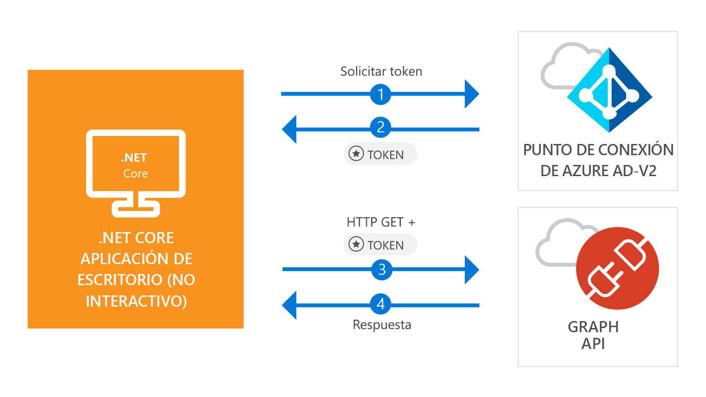

# <a name="quickstart-acquire-a-token-and-call-microsoft-graph-api-from-a-console-app-using-apps-identity"></a>Guía de inicio rápido: Adquisición de un token y llamada a Microsoft Graph API desde una aplicación de consola mediante la identidad de la aplicación

[!INCLUDE [active-directory-develop-applies-v2-msal](../../../includes/active-directory-develop-applies-v2-msal.md)]

En esta guía de inicio rápido, aprenderá a escribir una aplicación .NET Core que pueda obtener un token de acceso mediante la propia identidad de la aplicación, y a llamar a Microsoft Graph API para mostrar una [lista de usuarios](https://docs.microsoft.com/graph/api/user-list) en el directorio. Este escenario es útil en situaciones donde es necesario ejecutar trabajos desatendidos o servicios de Windows con una identidad de aplicación, en lugar de la identidad de un usuario.



## <a name="prerequisites"></a>Requisitos previos

Para esta guía de inicio rápido se requiere [.NET Core 2.1](https://www.microsoft.com/net/download/dotnet-core/2.1).

> [!div renderon="docs"]
> ## <a name="register-and-download-your-quickstart-app"></a>Registro y descarga de la aplicación de inicio rápido

> [!div renderon="portal" class="sxs-lookup"]
> Tiene dos opciones para comenzar con la aplicación de inicio rápido:
> * [Express] [Opción 1: registrar y configurar de modo automático la aplicación y, a continuación, descargar el código de ejemplo](#option-1-register-and-auto-configure-your-app-and-then-download-your-code-sample)
> * [Manual] [Opción 2: registrar y configurar manualmente la aplicación y el código de ejemplo](#option-2-register-and-manually-configure-your-application-and-code-sample)
>
> ### <a name="option-1-register-and-auto-configure-your-app-and-then-download-your-code-sample"></a>Opción 1: registrar y configurar de modo automático la aplicación y, a continuación, descargar el código de ejemplo
>
> 1. Vaya a [Azure Portal: registro de aplicaciones (versión preliminar)](https://portal.azure.com/?Microsoft_AAD_RegisteredApps=true#blade/Microsoft_AAD_RegisteredApps/applicationsListBlade/quickStartType/WinDesktopQuickstartPage/sourceType/docs).
> 1. Escriba un nombre para la aplicación y seleccione **Registrar**.
> 1. Siga las instrucciones para descargar y configurar automáticamente la nueva aplicación con un solo clic.
>
> ### <a name="option-2-register-and-manually-configure-your-application-and-code-sample"></a>Opción 2: registrar y configurar manualmente la aplicación y el código de ejemplo
>

> [!div renderon="docs"]
> #### <a name="step-1-register-your-application"></a>Paso 1: Registro de la aplicación
> Para registrar la aplicación y agregar la información de registro de la aplicación a la solución de forma manual, siga estos pasos:
>
> 1. Inicie sesión en [Azure Portal](https://portal.azure.com) con una cuenta personal, profesional o educativa de Microsoft.
> 1. Si la cuenta proporciona acceso a más de un inquilino, haga clic en la cuenta en la esquina superior derecha y establezca la sesión del portal en el inquilino de Azure AD deseado.
> 1. En el panel de navegación izquierdo, seleccione el servicio **Azure Active Directory** y, a continuación, seleccione **Registros de aplicaciones (versión preliminar)** > **Nuevo registro**.
> 1. En la sección **Nombre**, escriba un nombre de aplicación significativo que se mostrará a los usuarios de la aplicación, por ejemplo, `Daemon-console`; luego, seleccione **Registrarse** para crear la aplicación.
> 1. Una vez registrado, seleccione el menú **Certificates & secrets** (Certificados y secretos).
> 1. En **Secretos de cliente**, seleccione **+Nuevo secreto de cliente**. Asígnele un nombre y seleccione **Agregar**. Copie el secreto en una ubicación segura. Lo necesitará para usarlo en el código.
> 1. Ahora, seleccione el menú **Permisos de API**, haga clic en el botón **+ Agregar un permiso** y seleccione **Microsoft Graph**.
> 1. Seleccione **Permisos de aplicación**.
> 1. En el nodo **Usuario**, seleccione **User.Read.All** y, luego, **Agregar permisos**

> [!div class="sxs-lookup" renderon="portal"]
> #### <a name="step-1-configure-your-application-in-azure-portal"></a>Paso 1: Configuración de la aplicación en Azure Portal
> Para que el ejemplo de código de esta guía de inicio rápido funcione, debe crear un secreto de cliente y agregar el permiso de aplicación **User.Read.All** de Graph API.
> > [!div renderon="portal" id="makechanges" class="nextstepaction"]
> > [Realizar estos cambios por mí]()
>
> > [!div id="appconfigured" class="alert alert-info"]
> >  La aplicación está configurada con estos atributos.

#### <a name="step-2-download-your-visual-studio-project"></a>Paso 2: Descarga del proyecto de Visual Studio

[Descargue el proyecto de Visual Studio](https://github.com/Azure-Samples/active-directory-dotnetcore-daemon-v2/archive/master.zip)

#### <a name="step-3-configure-your-visual-studio-project"></a>Paso 3: Configuración del proyecto de Visual Studio

1. Extraiga el archivo ZIP en una carpeta local próxima a la raíz del disco, por ejemplo, **C:\Azure-Samples**.
1. Abra la solución en Visual Studio, **daemon console.sln** (opcional).
1. Edite **appsettings.json** y sustituya los valores de los campos `ClientId`, `Tenant` y `ClientSecret` por lo siguiente:

    ```json
    "Tenant": "Enter_the_Tenant_Id_Here",
    "ClientId": "Enter_the_Application_Id_Here",
    "ClientSecret": "Enter_the_Client_Secret_Here"
    ```
    > > [!div renderon="portal" id="certandsecretspage" class="sxs-lookup"]
    > > [Generación de un nuevo secreto de cliente]()
    
    > [!div renderon="docs"]
    >> Donde:
    >> * `Enter_the_Application_Id_Here`: es el **identificador de aplicación (cliente)** de la aplicación que registró.
    >> * `Enter_the_Tenant_Id_Here`: sustituya este valor por el **identificador de inquilino** o el **nombre de inquilino** (por ejemplo, contoso.microsoft.com).
    >> * `Enter_the_Client_Secret_Here`: sustituya este valor por el secreto de cliente creado en el paso 1.

    > > [!TIP]
    > > Para buscar los valores de **identificador de aplicación (cliente)** e **identificador de directorio (inquilino)**, vaya a la página **Información general** de Azure Portal. Para generar una nueva clave, vaya a la página **Certificates & secrets** (Certificados y secretos).
    
#### <a name="step-4-admin-consent"></a>Paso 4: Consentimiento del administrador

Cualquier *permiso de solo aplicación* requiere el consentimiento del administrador, lo que significa que necesita que un administrador global del directorio dé su consentimiento a la aplicación. Seleccione una de las opciones siguientes según el rol:

##### <a name="global-tenant-administrator"></a>Administrador de inquilinos global

> [!div renderon="docs"]
> Si es administrador de inquilinos global, vaya a la página **Permisos de API** del registro de aplicaciones de Azure Portal (versión preliminar) y seleccione **Grant admin consent for {Tenant Name}** (Conceder consentimiento del administrador para [Tenant Name]), donde el nombre del inquilino es el nombre del directorio.

> [!div renderon="portal" class="sxs-lookup"]
> Si es administrador global, vaya a la página **Permisos de API**, seleccione **Grant admin consent for Enter_the_Tenant_Name_Here** (Conceder consentimiento del administrador para _escribir_aquí_el_nombre_del_inquilino).
> > [!div id="apipermissionspage"]
> > [Ir a la página Permisos de API]()

##### <a name="standard-user"></a>Usuario estándar

Si es usuario estándar de su inquilino, deberá pedir a un administrador global que conceda consentimiento del administrador para su aplicación. Para ello, proporcione la siguiente dirección URL a su administrador:

```url
https://login.microsoftonline.com/Enter_the_Tenant_Id_Here/adminconsent?client_id=Enter_the_Application_Id_Here
```

> [!div renderon="docs"]
>> Donde:
>> * `Enter_the_Tenant_Id_Here`: sustituya este valor por el **identificador de inquilino** o el **nombre de inquilino** (por ejemplo, contoso.microsoft.com).
>> * `Enter_the_Application_Id_Here`: es el **identificador de aplicación (cliente)** de la aplicación que registró.

> [!NOTE]
> Es posible que después de conceder consentimiento a su aplicación mediante la URL anterior, aparezca el error *"AADSTS50011: No reply address is registered for the application"*. (AADSTS50011: no hay ninguna dirección de respuesta registrada para la aplicación). Esto sucede porque esta aplicación y la dirección URL no tienen un URI de redirección. No haga caso del error.

#### <a name="step-5-run-the-application"></a>Paso 5: Ejecución de la aplicación

Si usa Visual Studio, presione **F5** para ejecutar la aplicación; en caso contrario, ejecute la aplicación mediante la consola o el símbolo del sistema:

```console
cd {ProjectFolder}\daemon-console
dotnet run
```

> Donde:
> * *{ProjectFolder}*  es la carpeta donde extrajo el archivo zip. Por ejemplo: **C:\Azure-Samples\active-directory-dotnetcore-daemon-v2**

Como resultado, verá una lista de usuarios en el directorio de Azure AD.

## <a name="more-information"></a>Más información

### <a name="msalnet"></a>MSAL.NET

MSAL ([Microsoft.Identity.Client](https://www.nuget.org/packages/Microsoft.Identity.Client)) es la biblioteca que se usa para iniciar la sesión de los usuarios y solicitar tokens de acceso a una API protegida por Microsoft Azure Active Directory (Azure AD). Como se ha descrito, en esta guía de inicio rápido se solicitan tokens mediante la propia identidad de la aplicación, en lugar de permisos delegados. El flujo de autenticación usado en este caso se conoce como *[flujo de OAuth de credenciales de cliente](v2-oauth2-client-creds-grant-flow.md)*. Para más información sobre cómo usar MSAL.NET con el flujo de credenciales de cliente, consulte [este artículo](https://aka.ms/msal-net-client-credentials).

 Puede instalar MSAL mediante la ejecución del siguiente comando en la **Consola del Administrador de paquetes** de Visual Studio:

```powershell
Install-Package Microsoft.Identity.Client -Pre
```

### <a name="msal-initialization"></a>Inicialización de MSAL

Puede agregar la referencia de MSAL con el código siguiente:

```csharp
using Microsoft.Identity.Client;
```

A continuación, realice la inicialización de MSAL con el siguiente código:

```csharp
ClientCredential clientCredentials = new ClientCredential(secret: config.ClientSecret);

var app = new ConfidentialClientApplication(
    clientId: config.ClientId, 
    authority: config.Authority, 
    redirectUri: "https://daemon", 
    clientCredential: clientCredentials, 
    userTokenCache: null, 
    appTokenCache: new TokenCache()
);
```

> | Donde: ||
> |---------|---------|
> | `secret` | Es el secreto de cliente creado para la aplicación en Azure Portal. |
> | `clientId` | Es el **Identificador de aplicación (cliente)** de la aplicación registrada en Azure Portal. Puede encontrar este valor en la página **Información general** de la aplicación en Azure Portal. |
> | `Authority`    | (Opcional) El punto de conexión STS del usuario que se autenticará. Normalmente https://login.microsoftonline.com/{tenant} en la nube pública, donde {tenant} es el nombre o el identificador del inquilino.|
> | `redirectUri`  | Dirección URL donde se envía a los usuarios tras la autenticación. En este caso, como se trata de una aplicación de consola o no interactiva, este parámetro no se usa. |
> | `clientCredentials`  | El objeto de credenciales de cliente, que contiene el secreto o el certificado. |
> | `userTokenCache`  | Instancia de una caché de tokens para el usuario. En este caso, como esta aplicación se ejecuta en el contexto de la aplicación y no del usuario, este valor es null.|
> | `appTokenCache`  | Instancia de una caché de tokens para la aplicación|

Para más información, consulte la [documentación de referencia de `ConfidentialClientApplication`](https://docs.microsoft.com/dotnet/api/microsoft.identity.client.confidentialclientapplication.-ctor?view=azure-dotnet#Microsoft_Identity_Client_ConfidentialClientApplication__ctor_System_String_System_String_System_String_Microsoft_Identity_Client_ClientCredential_Microsoft_Identity_Client_TokenCache_Microsoft_Identity_Client_TokenCache).

### <a name="requesting-tokens"></a>Solicitud de tokens

Para solicitar un token mediante la identidad de la aplicación, use el método `AcquireTokenForClientAsync`:

```csharp
result = await app.AcquireTokenForClientAsync(scopes);
```

> |Donde:| |
> |---------|---------|
> | `scopes` | Contiene los ámbitos solicitados. Con clientes confidenciales, se debe usar el formato similar a `{Application ID URI}/.default` para indicar que los ámbitos que se solicitan son los definidos estáticamente en el objeto de aplicación establecido en Azure Portal (con Microsoft Graph, `{Application ID URI}` apunta a `https://graph.microsoft.com`). Con API web personalizadas, `{Application ID URI}` se define en la sección **Exponer una API** del registro de aplicaciones de Azure Portal (versión preliminar). |

Para más información, consulte la [documentación de referencia de `AcquireTokenForClientAsync`](https://docs.microsoft.com/dotnet/api/microsoft.identity.client.confidentialclientapplication.acquiretokenforclientasync?view=azure-dotnet#Microsoft_Identity_Client_ConfidentialClientApplication_AcquireTokenForClientAsync_System_Collections_Generic_IEnumerable_System_String__).

[!INCLUDE [Help and support](../../../includes/active-directory-develop-help-support-include.md)]

## <a name="next-steps"></a>Pasos siguientes

Más información sobre los permisos y el consentimiento:

> [!div class="nextstepaction"]
> [Permisos y consentimiento](v2-permissions-and-consent.md)

Para más información sobre el flujo de autenticación en este escenario, vea el flujo de credenciales de cliente de OAuth 2.0:

> [!div class="nextstepaction"]
> [Flujo de OAuth de credenciales de cliente](v2-oauth2-client-creds-grant-flow.md)

> [!div class="nextstepaction"]
> [Flujos de credenciales de cliente con MSAL.NET](https://aka.ms/msal-net-client-credentials)