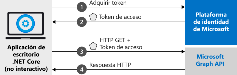

# <a name="quickstart-acquire-a-token-and-call-microsoft-graph-api-from-a-python-console-app-using-apps-identity"></a>Inicio rápido: Adquisición de un token y llamada a Microsoft Graph API desde una aplicación de consola en Python mediante la identidad de la aplicación

En este inicio rápido, aprenderá a escribir una aplicación en Python que obtenga un token de acceso mediante la identidad de la aplicación y que, a continuación, llame a Microsoft Graph API para mostrar una [lista de usuarios](https://docs.microsoft.com/graph/api/user-list) del directorio. Este escenario es útil en situaciones donde es necesario ejecutar trabajos desatendidos o servicios de Windows con una identidad de aplicación, en lugar de la identidad de un usuario.

> [!div renderon="docs"]
> .

## <a name="prerequisites"></a>Prerequisites

Para ejecutar esta muestra, necesita:

- [Python 2.7+](https://www.python.org/downloads/release/python-2713) o [Python 3+](https://www.python.org/downloads/release/python-364/)
- [MSAL Python](https://github.com/AzureAD/microsoft-authentication-library-for-python)

> [!div renderon="docs"]
> ## <a name="register-and-download-your-quickstart-app"></a>Registro y descarga de la aplicación de inicio rápido

> [!div renderon="docs" class="sxs-lookup"]
>
> Tiene dos opciones para comenzar con la aplicación de inicio rápido: Rápido (opción 1) y Manual (opción 2)
>
> ### <a name="option-1-register-and-auto-configure-your-app-and-then-download-your-code-sample"></a>Opción 1: registrar y configurar de modo automático la aplicación y, a continuación, descargar el código de ejemplo
>
> 1. Vaya al nuevo panel de [Azure Portal: Registros de aplicaciones](https://portal.azure.com/?Microsoft_AAD_RegisteredApps=true#blade/Microsoft_AAD_RegisteredApps/applicationsListBlade/quickStartType/PythonDaemonQuickstartPage/sourceType/docs).
> 1. Escriba un nombre para la aplicación y seleccione **Registrar**.
> 1. Siga las instrucciones para descargar y configurar automáticamente la nueva aplicación con un solo clic.
>
> ### <a name="option-2-register-and-manually-configure-your-application-and-code-sample"></a>Opción 2: registrar y configurar manualmente la aplicación y el código de ejemplo

> [!div renderon="docs"]
> #### <a name="step-1-register-your-application"></a>Paso 1: Registrar su aplicación
> Para registrar la aplicación y agregar la información de registro de la aplicación a la solución de forma manual, siga estos pasos:
>
> 1. Inicie sesión en [Azure Portal](https://portal.azure.com) con una cuenta personal, profesional o educativa de Microsoft.
> 1. Si la cuenta proporciona acceso a más de un inquilino, haga clic en la cuenta en la esquina superior derecha y establezca la sesión del portal en el inquilino de Azure AD deseado.
> 1. Vaya a la página [Registros de aplicaciones](https://go.microsoft.com/fwlink/?linkid=2083908) de la plataforma de identidad de Microsoft para desarrolladores.
> 1. Seleccione **Nuevo registro**.
> 1. Cuando aparezca la página **Registrar una aplicación**, escriba la información de registro de la aplicación. 
> 1. En la sección **Nombre**, escriba un nombre de aplicación significativo que se mostrará a los usuarios de la aplicación, por ejemplo, `Daemon-console`; luego, seleccione **Registrarse** para crear la aplicación.
> 1. Una vez registrado, seleccione el menú **Certificates & secrets** (Certificados y secretos).
> 1. En **Secretos de cliente**, seleccione **+Nuevo secreto de cliente**. Asígnele un nombre y seleccione **Agregar**. Copie el secreto en una ubicación segura. Lo necesitará para usarlo en el código.
> 1. Ahora, seleccione el menú **Permisos de API**, haga clic en el botón **+ Agregar un permiso** y seleccione **Microsoft Graph**.
> 1. Seleccione **Permisos de aplicación**.
> 1. En el nodo **Usuario**, seleccione **User.Read.All** y, luego, **Agregar permisos**

> [!div class="sxs-lookup" renderon="portal"]
> ### <a name="download-and-configure-your-quickstart-app"></a>Descarga y configuración de la aplicación de inicio rápido
> 
> #### <a name="step-1-configure-your-application-in-azure-portal"></a>Paso 1: Configuración de la aplicación en Azure Portal
> Para que el ejemplo de código de esta guía de inicio rápido funcione, debe crear un secreto de cliente y agregar el permiso de aplicación **User.Read.All** de Graph API.
> > [!div renderon="portal" id="makechanges" class="nextstepaction"]
> > [Realizar estos cambios por mí]()
>
> > [!div id="appconfigured" class="alert alert-info"]
> >  La aplicación está configurada con estos atributos.

#### <a name="step-2-download-your-python-project"></a>Paso 2: Descarga del proyecto de Python

[Descargue el proyecto de demonio de Python](https://github.com/Azure-Samples/ms-identity-python-daemon/archive/master.zip)

#### <a name="step-3-configure-your-python-project"></a>Paso 3: Configuración del proyecto de Python

1. Extraiga el archivo ZIP en una carpeta local próxima a la raíz del disco, por ejemplo, **C:\Azure-Samples**.
1. Navegue hasta la subcarpeta **1-Call-MsGraph-WithSecret"** .
1. Edite **parameters.json** y sustituya los valores de los campos `authority`, `client_id` y `secret` por el fragmento de código siguiente:

    ```json
    "authority": "https://login.microsoftonline.com/Enter_the_Tenant_Id_Here",
    "client_id": "Enter_the_Application_Id_Here",
    "secret": "Enter_the_Client_Secret_Here"
    ```
    > > [!div renderon="portal" id="certandsecretspage" class="sxs-lookup"]
    > > [Generación de un nuevo secreto de cliente]()
    
    > [!div class="sxs-lookup" renderon="portal"]
    > > [!NOTE]
    > > Este inicio rápido admite Enter_the_Supported_Account_Info_Here.
    
    > [!div renderon="docs"]
    >> Donde:
    >> * `Enter_the_Application_Id_Here`: es el **identificador de aplicación (cliente)** de la aplicación que registró.
    >> * `Enter_the_Tenant_Id_Here`: sustituya este valor por el **identificador de inquilino** o el **nombre de inquilino** (por ejemplo, contoso.microsoft.com).
    >> * `Enter_the_Client_Secret_Here`: sustituya este valor por el secreto de cliente creado en el paso 1.

    > [!div renderon="docs"]
    > > [!TIP]
    > > Para buscar los valores de **identificador de aplicación (cliente)** e **identificador de directorio (inquilino)** , vaya a la página **Información general** de Azure Portal. Para generar una nueva clave, vaya a la página **Certificates & secrets** (Certificados y secretos).
    
#### <a name="step-4-admin-consent"></a>Paso 4: Consentimiento de administrador

Si intenta ejecutar la aplicación en este momento, recibirá un error *HTTP 403 - Prohibido*: `Insufficient privileges to complete the operation`. Este error sucede porque cualquier *permiso de solo aplicación* requiere el consentimiento del administrador: un administrador global del directorio debe otorgar su consentimiento a la aplicación. Seleccione una de las opciones siguientes según el rol:

##### <a name="global-tenant-administrator"></a>Administrador de inquilinos global

> [!div renderon="docs"]
> Si es administrador de inquilinos global, vaya a la página **Permisos de API** del registro de aplicaciones de Azure Portal (versión preliminar) y seleccione **Grant admin consent for {Tenant Name}** (Conceder consentimiento del administrador para [Tenant Name]), donde el nombre del inquilino es el nombre del directorio.

> [!div renderon="portal" class="sxs-lookup"]
> Si es administrador global, vaya a la página **Permisos de API**, seleccione **Grant admin consent for Enter_the_Tenant_Name_Here** (Conceder consentimiento del administrador para _escribir_aquí_el_nombre_del_inquilino).
> > [!div id="apipermissionspage"]
> > [Ir a la página Permisos de API]()

##### <a name="standard-user"></a>Usuario estándar

Si es usuario estándar de su inquilino, deberá pedir a un administrador global que conceda consentimiento del administrador para su aplicación. Para ello, proporcione la siguiente dirección URL a su administrador:

```url
https://login.microsoftonline.com/Enter_the_Tenant_Id_Here/adminconsent?client_id=Enter_the_Application_Id_Here
```

> [!div renderon="docs"]
>> Donde:
>> * `Enter_the_Tenant_Id_Here`: sustituya este valor por el **identificador de inquilino** o el **nombre de inquilino** (por ejemplo, contoso.microsoft.com).
>> * `Enter_the_Application_Id_Here`: es el **identificador de aplicación (cliente)** de la aplicación que registró.

#### <a name="step-5-run-the-application"></a>Paso 5: Ejecución de la aplicación

Deberá instalar las dependencias de este ejemplo una vez

```console
pip install -r requirements.txt
```

A continuación, ejecute la aplicación a través del símbolo del sistema o la consola:

```console
python confidential_client_secret_sample.py parameters.json
```

Debería ver en la salida de la consola algún fragmento en JSON que representa una lista de usuarios en el directorio de Azure AD.

> [!IMPORTANT]
> Esta aplicación de inicio rápido usa un secreto de cliente para identificarse como cliente confidencial. Como el secreto de cliente se agrega como texto sin formato a los archivos del proyecto, por motivos de seguridad, se recomienda que use un certificado en lugar de un secreto de cliente antes de considerar el uso de la aplicación en producción. Para obtener más información sobre cómo usar un certificado, consulte [estas instrucciones](https://github.com/Azure-Samples/ms-identity-python-daemon/blob/master/2-Call-MsGraph-WithCertificate/README.md) en el mismo repositorio de GitHub que esta muestra, pero en la carpeta secundaria **2-Call-MsGraph-WithCertificate**

## <a name="more-information"></a>Más información

### <a name="msal-python"></a>Python de MSAL

[MSAL para Python](https://github.com/AzureAD/microsoft-authentication-library-for-python) es la biblioteca que se usa para iniciar la sesión de los usuarios y solicitar los tokens que se usan para acceder a una API protegida por la Plataforma de identidad de Microsoft. Como se ha descrito, en este inicio rápido se solicitan tokens mediante la propia identidad de la aplicación, en lugar de permisos delegados. El flujo de autenticación usado en este caso se conoce como *[flujo de OAuth de credenciales de cliente](v2-oauth2-client-creds-grant-flow.md)* . Para obtener más información sobre cómo usar MSAL para Python con aplicaciones de demonio, consulte [este artículo](scenario-daemon-overview.md).

 Para instalar MSAL para Python, ejecute el siguiente comando pip:

```powershell
pip install msal
```

### <a name="msal-initialization"></a>Inicialización de MSAL

Puede agregar la referencia de MSAL con el código siguiente:

```Python
import msal
```

A continuación, realice la inicialización de MSAL con el siguiente código:

```Python
app = msal.ConfidentialClientApplication(
    config["client_id"], authority=config["authority"],
    client_credential=config["secret"])
```

> | Donde: ||
> |---------|---------|
> | `config["secret"]` | Es el secreto de cliente creado para la aplicación en Azure Portal. |
> | `config["client_id"]` | Es el **Identificador de aplicación (cliente)** de la aplicación registrada en Azure Portal. Puede encontrar este valor en la página **Información general** de la aplicación en Azure Portal. |
> | `config["authority"]`    | El punto de conexión STS para el usuario que se autenticará. Normalmente <https://login.microsoftonline.com/{tenant}> en la nube pública, donde {tenant} es el nombre o el identificador del inquilino.|

Para más información, consulte la [documentación de referencia de `ConfidentialClientApplication`](https://msal-python.readthedocs.io/en/latest/#confidentialclientapplication).

### <a name="requesting-tokens"></a>Solicitud de tokens

Para solicitar un token mediante la identidad de la aplicación, use el método `AcquireTokenForClient`:

```Python
result = None
result = app.acquire_token_silent(config["scope"], account=None)

if not result:
    logging.info("No suitable token exists in cache. Let's get a new one from AAD.")
    result = app.acquire_token_for_client(scopes=config["scope"])
```

> |Donde:| |
> |---------|---------|
> | `config["scope"]` | Contiene los ámbitos solicitados. Con clientes confidenciales, se debe usar el formato similar a `{Application ID URI}/.default` para indicar que los ámbitos que se solicitan son los definidos estáticamente en el objeto de aplicación establecido en Azure Portal (con Microsoft Graph, `{Application ID URI}` apunta a `https://graph.microsoft.com`). Con API web personalizadas, `{Application ID URI}` se define en la sección **Exponer una API** del registro de aplicaciones de Azure Portal (versión preliminar). |

Para más información, consulte la [documentación de referencia de `AcquireTokenForClient`](https://msal-python.readthedocs.io/en/latest/#msal.ConfidentialClientApplication.acquire_token_for_client).

[!INCLUDE [Help and support](../../../includes/active-directory-develop-help-support-include.md)]

## <a name="next-steps"></a>Pasos siguientes

Para más información sobre las aplicaciones demonio, consulte la página de aterrizaje del escenario

> [!div class="nextstepaction"]
> [Aplicación demonio que llama a las API web](scenario-daemon-overview.md)

Para ver el tutorial de la aplicación demonio, consulte:

> [!div class="nextstepaction"]
> [Tutorial de la consola de Python de demonio](https://github.com/Azure-Samples/ms-identity-python-daemon)

Más información sobre los permisos y el consentimiento:

> [!div class="nextstepaction"]
> [Permisos y consentimiento](v2-permissions-and-consent.md)

Para más información sobre el flujo de autenticación en este escenario, vea el flujo de credenciales de cliente de OAuth 2.0:

> [!div class="nextstepaction"]
> [Flujo de OAuth de credenciales de cliente](v2-oauth2-client-creds-grant-flow.md)

Ayúdenos a mejorar la Plataforma de identidad de Microsoft. Rellene una breve encuesta de dos preguntas y háganos saber su opinión.

> [!div class="nextstepaction"]
> [Encuesta sobre la Plataforma de identidad de Microsoft](https://forms.office.com/Pages/ResponsePage.aspx?id=v4j5cvGGr0GRqy180BHbRyKrNDMV_xBIiPGgSvnbQZdUQjFIUUFGUE1SMEVFTkdaVU5YT0EyOEtJVi4u)
