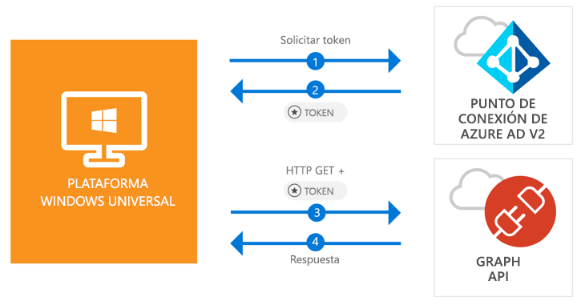

# <a name="quickstart-call-the-microsoft-graph-api-from-a-universal-windows-platform-uwp-application"></a>Guía de inicio rápido: Llamada a Microsoft Graph API desde una aplicación de la Plataforma universal de Windows (UWP)

[!INCLUDE [active-directory-develop-applies-v2-msal](../../../includes/active-directory-develop-applies-v2-msal.md)]

En esta guía de inicio rápido hay código de ejemplo que muestra cómo una aplicación de la Plataforma universal de Windows (UWP) puede iniciar sesión por los usuarios con cuentas personales, profesionales y educativas, obtener un token de acceso y llamar a Microsoft Graph API.



> [!div renderon="docs"]
> ## <a name="register-and-download-your-quickstart-app"></a>Registro y descarga de la aplicación de inicio rápido
> [!div renderon="docs" class="sxs-lookup"]
> Tiene dos opciones para comenzar con la aplicación de inicio rápido:
> * [Express] [Opción 1: registrar y configurar de modo automático la aplicación y, a continuación, descargar el código de ejemplo](#option-1-register-and-auto-configure-your-app-and-then-download-your-code-sample)
> * [Manual] [Opción 2: registrar y configurar manualmente la aplicación y el código de ejemplo](#option-2-register-and-manually-configure-your-application-and-code-sample)
>
> ### <a name="option-1-register-and-auto-configure-your-app-and-then-download-your-code-sample"></a>Opción 1: registrar y configurar de modo automático la aplicación y, a continuación, descargar el código de ejemplo
>
> 1. Vaya a [Azure Portal: registro de aplicaciones](https://portal.azure.com/?Microsoft_AAD_RegisteredApps=true#blade/Microsoft_AAD_RegisteredApps).
> 1. Escriba un nombre para la aplicación y haga clic en **Registrar**.
> 1. Siga las instrucciones para descargar y configurar automáticamente la nueva aplicación en un solo clic.
>
> ### <a name="option-2-register-and-manually-configure-your-application-and-code-sample"></a>Opción 2: registrar y configurar manualmente la aplicación y el código de ejemplo
> [!div renderon="docs"]
> #### <a name="step-1-register-your-application"></a>Paso 1: Registro de la aplicación
> Para registrar la aplicación y agregar la información de registro de la aplicación a la solución, siga estos pasos:
> 1. Inicie sesión en [Azure Portal](https://portal.azure.com) con una cuenta personal, profesional o educativa de Microsoft.
> 1. Si la cuenta proporciona acceso a más de un inquilino, haga clic en la cuenta en la esquina superior derecha y establezca la sesión del portal en el inquilino de Azure AD deseado.
> 1. En el panel de navegación izquierdo, seleccione el servicio **Azure Active Directory** y, a continuación, seleccione **Registros de aplicaciones (versión preliminar)** > **Nuevo registro**.
> 1. Cuando aparece la página **Registrar una aplicación**, escriba la información de registro de la aplicación:
>      - En la sección **Nombre**, escriba un nombre significativo para la aplicación, que se mostrará a los usuarios de la aplicación, por ejemplo, `UWP-App-calling-MsGraph`.
>      - En **Tipos de cuenta admitidos**, seleccione **Cuentas en cualquier directorio de organización y cuentas personales de Microsoft (por ejemplo, Skype, Xbox o Outlook.com)**.
>      - Seleccione **Registrar** para crear la aplicación.
> 1. En la lista de páginas de la aplicación, seleccione **Autenticación**.
> 1. En la sección **URL de redirección**, localice la sección **URI de redirección sugeridos para clientes públicos (móvil, escritorio)** y seleccione **"urn:ietf:wg:oauth:2.0:oob**.
> 1. Seleccione **Guardar**.

> [!div renderon="portal" class="sxs-lookup alert alert-info"]
> #### <a name="step-1-configure-your-application"></a>Paso 1: Configuración de la aplicación
> Para que el código de ejemplo de esta guía de inicio rápido funcione, debe agregar un identificador URL de redirección como **urn:ietf:wg:oauth:2.0:oob**.
> > [!div renderon="portal" id="makechanges" class="nextstepaction"]
> > [Hacer este cambio por mí]()
>
> > [!div id="appconfigured" class="alert alert-info"]
> >  La aplicación está configurada con estos atributos.

#### <a name="step-2-download-your-visual-studio-project"></a>Paso 2: Descarga del proyecto de Visual Studio

 - [Descargue el proyecto de Visual Studio 2017](https://github.com/Azure-Samples/active-directory-dotnet-native-uwp-v2/archive/master.zip)

#### <a name="step-3-configure-your-visual-studio-project"></a>Paso 3: Configuración del proyecto de Visual Studio

1. Extraiga el archivo ZIP en una carpeta local próxima a la raíz del disco, por ejemplo, **C:\Azure-Samples**.
1. Abra el proyecto en Visual Studio.
1. Edite el archivo **App.Xaml.cs** y reemplace los valores de los campos `ClientId` y `Tenant` con:

    ```csharp
    private static string ClientId = "Enter_the_Application_Id_here";
    private static string Tenant = "Enter_the_Tenant_Info_Here";
    ```

> [!div renderon="docs"]
> Donde:
> - `Enter_the_Application_Id_here`: es el identificador de aplicación de la aplicación que registró.
> - `Enter_the_Tenant_Info_Here`: es una de las opciones siguientes:
>   - Si la aplicación admite **Solo mi organización**, reemplace este valor por el **identificador de inquilino** o el **nombre de inquilino** (por ejemplo, contoso.microsoft.com)
>   - Si la aplicación admite **Cuentas en cualquier directorio organizativo**, reemplace este valor por `organizations`
>   - Si la aplicación admite **Todos los usuarios de cuentas Microsoft**, reemplace este valor por `common`
>
> > [!TIP]
> > Para buscar los valores de *Identificador de aplicación*, *Identificador de directorio (inquilino)* y *Tipos de cuenta admitidos*, vaya a la página **Información general**

## <a name="more-information"></a>Más información

En esta sección se proporciona más información acerca de la guía de inicio rápido.

### <a name="msalnet"></a>MSAL.NET

MSAL ([Microsoft.Identity.Client](https://www.nuget.org/packages/Microsoft.Identity.Client)) es la biblioteca que se usa para iniciar la sesión de los usuarios y solicitar tokens de acceso a una API protegida por Microsoft Azure Active Directory. Puede instalar MSAL mediante la ejecución del siguiente comando en la *Consola del Administrador de paquetes* de Visual Studio:

```powershell
Install-Package Microsoft.Identity.Client -Pre
```

### <a name="msal-initialization"></a>Inicialización de MSAL

Puede agregar la referencia de MSAL con el código siguiente:

```csharp
using Microsoft.Identity.Client;
```

A continuación, realice la inicialización de MSAL con el siguiente código:

```csharp
public static PublicClientApplication PublicClientApp = new PublicClientApplication(ClientId);
```

> |Donde: ||
> |---------|---------|
> | `ClientId` | Es el **Identificador de aplicación (cliente)** de la aplicación registrada en Azure Portal. Puede encontrar este valor en la página **Información general** de la aplicación en Azure Portal. |

### <a name="requesting-tokens"></a>Solicitud de tokens

MSAL tiene dos métodos para adquirir tokens: `AcquireTokenAsync` y `AcquireTokenSilentAsync`.

#### <a name="get-a-user-token-interactively"></a>Obtención de un token de usuario interactivamente

En algunas situaciones es necesario forzar a los usuarios a interactuar con el punto de conexión de Azure AD v2.0 mediante una ventana emergente para validar sus credenciales o dar su consentimiento. Estos son algunos ejemplos:

- La primera vez que los usuarios inician sesión en la aplicación
- Cuando los usuarios deben volver a escribir sus credenciales porque la contraseña expiró
- Cuando la aplicación solicita acceso a un recurso para el cual el usuario necesita dar su consentimiento
- Cuando se requiere la autenticación en dos fases

```csharp
authResult = await App.PublicClientApp.AcquireTokenAsync(scopes);
```

> |Donde:||
> |---------|---------|
> | `scopes` | Contiene los ámbitos que se solicitan, como `{ "user.read" }` para Microsoft Graph o `{ "api://<Application ID>/access_as_user" }` para las API web personalizadas. |

#### <a name="get-a-user-token-silently"></a>Obtención de un token de usuario en silencio

No desea pedirle al usuario que valide sus credenciales cada vez que necesite obtener acceso a un recurso. La mayor parte del tiempo, quiere que la renovación y adquisición de tokens ocurra sin la interacción del usuario. Puede usar el método `AcquireTokenSilentAsync` para obtener tokens que permiten acceder a recursos protegidos después del método `AcquireTokenAsync` inicial:

```csharp
var accounts = await App.PublicClientApp.GetAccountsAsync();
authResult = await App.PublicClientApp.AcquireTokenSilentAsync(scopes, accounts.FirstOrDefault());
```

> |Donde: ||
> |---------|---------|
> | `scopes` | Contiene los ámbitos que se solicitan, como `{ "user.read" }` para Microsoft Graph o `{ "api://<Application ID>/access_as_user" }` para las API web personalizadas |
> | `accounts.FirstOrDefault()` | Especifica el primer usuario en la memoria caché (MSAL admite varios usuarios en una sola aplicación) |

[!INCLUDE [Help and support](../../../includes/active-directory-develop-help-support-include.md)]

## <a name="next-steps"></a>Pasos siguientes

Visite el tutorial de escritorio de Windows para acceder a una guía completa paso a paso sobre la creación de aplicaciones y nuevas características, que incluye una explicación completa de esta guía de inicio rápido.

> [!div class="nextstepaction"]
> [UWP: Tutorial de Graph API de llamada](tutorial-v2-windows-uwp.md)
