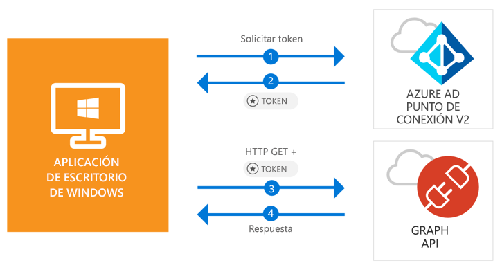

# <a name="quickstart-acquire-a-token-and-call-microsoft-graph-api-from-a-windows-desktop-app"></a>Inicio rápido: Adquisición de un token y llamada a Microsoft Graph API desde una aplicación de escritorio de Windows

[!INCLUDE [active-directory-develop-applies-v2-msal](../../../includes/active-directory-develop-applies-v2-msal.md)]

En esta guía de inicio rápido aprenderá que una aplicación .NET de escritorio de Windows (WPF) puede iniciar sesión en cuentas personales, profesionales y educativas, obtener un token de acceso y llamar a Microsoft Graph API.



> [!div renderon="docs"]
> ## <a name="register-and-download"></a>Registro y descarga
> ### <a name="register-and-configure-your-application-and-code-sample"></a>Registro y configuración de la aplicación y código de ejemplo
> #### <a name="step-1-register-your-application"></a>Paso 1: Registro de la aplicación
> Para registrar la aplicación y agregar la información de registro de aplicación a la solución, siga estos pasos:
> 1. Vaya al [Portal de registro de aplicaciones de Microsoft](https://apps.dev.microsoft.com/portal/register-app) para registrar una aplicación.
> 1. En el cuadro**Application Name** (Nombre de la aplicación) escriba el nombre de su aplicación.
> 1. Asegúrese de que la casilla **Guided Setup** (Instalación guiada) esté desactivada y, luego, seleccione **Create** (Crear).
> 1. Seleccione **Add Platform** (Agregar plataforma), seleccione **Native Application** (Aplicación nativa) y, luego, seleccione **Save** (Guardar).

> [!div renderon="portal" class="sxs-lookup"]
> #### <a name="step-1-configure-your-application"></a>Paso 1: Configuración de la aplicación
> Para que el código de ejemplo de esta guía de inicio rápido funcione, debe agregar una dirección URL de respuesta como **urn:ietf:wg:oauth:2.0:oob**.
> > [!div renderon="portal" id="makechanges" class="nextstepaction"]
> > [Hacer este cambio por mí]()
>
> > [!div id="appconfigured" class="alert alert-info"]
> >  La aplicación está configurada con estos atributos

#### <a name="step-2-download-your-visual-studio-project"></a>Paso 2: Descarga del proyecto de Visual Studio

[Descargue el proyecto de Visual Studio 2017](https://github.com/Azure-Samples/active-directory-dotnet-desktop-msgraph-v2/archive/master.zip)

#### <a name="step-3-configure-your-visual-studio-project"></a>Paso 3: Configuración del proyecto de Visual Studio

1. Extraiga el archivo ZIP en una carpeta local (por ejemplo, **C:\Azure-Samples**).
1. Abra el proyecto en Visual Studio.
1. Edite **App.Xaml.cs** y reemplace la línea que empieza con `private static string ClientId` por el identificador de aplicación de la aplicación que acaba de registrar:

```csharp
private static string ClientId = "Enter_the_Application_Id_here";
```

## <a name="more-information"></a>Más información

### <a name="msalnet"></a>MSAL.NET

MSAL ([Microsoft.Identity.Client](https://www.nuget.org/packages/Microsoft.Identity.Client)) es la biblioteca que se usa para iniciar la sesión de los usuarios y solicitar tokens de acceso a una API protegida por Microsoft Azure Active Directory (Azure AD). Puede instalarlo mediante la ejecución del siguiente comando en la **Consola del Administrador de paquetes** de Visual Studio:

```powershell
Install-Package Microsoft.Identity.Client -Pre
```

### <a name="msal-initialization"></a>Inicialización de MSAL

Puede agregar la referencia de MSAL con el código siguiente:

```csharp
using Microsoft.Identity.Client;
```

A continuación, realice la inicialización de MSAL con el siguiente código:

```csharp
public static PublicClientApplication PublicClientApp = new PublicClientApplication(ClientId);
```

> |Donde: ||
> |---------|---------|
> | `ClientId` | El identificador de aplicación de la aplicación registrada en *portal.microsoft.com* |

### <a name="requesting-tokens"></a>Solicitud de tokens

MSAL tiene dos métodos para adquirir tokens: `AcquireTokenAsync` y `AcquireTokenSilentAsync`.

#### <a name="get-a-user-token-interactively"></a>Obtención de un token de usuario interactivamente

En algunas situaciones es necesario forzar a los usuarios a interactuar con el punto de conexión de Azure AD v2.0 a través de una ventana emergente para validar sus credenciales o dar su consentimiento. Estos son algunos ejemplos:

- La primera vez que los usuarios inician sesión en la aplicación
- Cuando los usuarios deben volver a escribir sus credenciales porque la contraseña expiró
- Cuando la aplicación solicita acceso a un recurso para el cual el usuario necesita dar su consentimiento
- Cuando se requiere la autenticación en dos fases

```csharp
authResult = await App.PublicClientApp.AcquireTokenAsync(_scopes);
```

> |Donde:||
> |---------|---------|
> | `_scopes` | Contiene los ámbitos que se solicitan (es decir, `{ "user.read" }` para Microsoft Graph o `{ "api://<Application ID>/access_as_user" }` para las API web personalizadas) |

#### <a name="get-a-user-token-silently"></a>Obtención de un token de usuario en silencio

No desea pedirle al usuario que valide sus credenciales cada vez que necesite acceder a un recurso. La mayor parte del tiempo, quiere que la renovación y adquisición de tokens ocurra sin la interacción del usuario. Puede usar el método `AcquireTokenSilentAsync` para obtener tokens que permiten acceder a recursos protegidos después del método `AcquireTokenAsync` inicial:

```csharp
var accounts = await App.PublicClientApp.GetAccountsAsync();
authResult = await App.PublicClientApp.AcquireTokenSilentAsync(scopes, accounts.FirstOrDefault());
```

> |Donde: ||
> |---------|---------|
> |ámbitos | Contiene los ámbitos que se solicitan (es decir, `{ "user.read" }` para Microsoft Graph o `{ "api://<Application ID>/access_as_user" }` para las API web personalizadas) |
> |accounts.FirstOrDefault() | El primer usuario en la memoria caché (MSAL admite varios usuarios en una sola aplicación) |

## <a name="next-steps"></a>Pasos siguientes

Visite el tutorial de escritorio de Windows para acceder a una guía completa paso a paso sobre la creación de aplicaciones y nuevas características, que incluye una explicación completa de esta guía de inicio rápido.

### <a name="learn-the-steps-to-create-the-application-used-in-this-quickstart"></a>Más información sobre los pasos para crear la aplicación que se usa en esta guía de inicio rápido

> [!div class="nextstepaction"]
> [Tutorial de Graph API de llamada](https://docs.microsoft.com/azure/active-directory/develop/guidedsetups/active-directory-windesktop)

[!INCLUDE [Help and support](../../../includes/active-directory-develop-help-support-include.md)]
