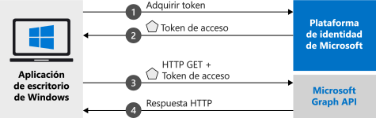

# <a name="quickstart-acquire-a-token-and-call-microsoft-graph-api-from-a-windows-desktop-app"></a>Inicio rápido: Adquisición de un token y llamada a Microsoft Graph API desde una aplicación de escritorio de Windows

En esta guía de inicio rápido aprenderá cómo escribir una aplicación .NET de escritorio de Windows (WPF) que puede iniciar sesión en cuentas personales, profesionales y educativas, obtener un token de acceso y llamar a Microsoft Graph API.



> [!div renderon="docs"]
> ## <a name="register-and-download-your-quickstart-app"></a>Registro y descarga de la aplicación de inicio rápido
> Tiene dos opciones para comenzar con la aplicación de inicio rápido:
> * [Rápido] [Opción 1: registrar y configurar de modo automático la aplicación y, a continuación, descargar el código de ejemplo](#option-1-register-and-auto-configure-your-app-and-then-download-your-code-sample)
> * [Manual] [Opción 2: registrar y configurar manualmente la aplicación y el código de ejemplo](#option-2-register-and-manually-configure-your-application-and-code-sample)
>
> ### <a name="option-1-register-and-auto-configure-your-app-and-then-download-your-code-sample"></a>Opción 1: registrar y configurar de modo automático la aplicación y, a continuación, descargar el código de ejemplo
>
> 1. Vaya al nuevo panel de [Azure Portal: Registros de aplicaciones](https://portal.azure.com/#blade/Microsoft_AAD_RegisteredApps/applicationsListBlade/quickStartType/WinDesktopQuickstartPage/sourceType/docs).
> 1. Escriba un nombre para la aplicación y seleccione **Registrar**.
> 1. Siga las instrucciones para descargar y configurar automáticamente la nueva aplicación con un solo clic.
>
> ### <a name="option-2-register-and-manually-configure-your-application-and-code-sample"></a>Opción 2: registrar y configurar manualmente la aplicación y el código de ejemplo
>
> #### <a name="step-1-register-your-application"></a>Paso 1: Registrar su aplicación
> Para registrar la aplicación y agregar la información de registro de la aplicación a la solución de forma manual, siga estos pasos:
>
> 1. Inicie sesión en [Azure Portal](https://portal.azure.com) con una cuenta personal, profesional o educativa de Microsoft.
> 1. Si la cuenta proporciona acceso a más de un inquilino, haga clic en la cuenta en la esquina superior derecha y establezca la sesión del portal en el inquilino de Azure AD deseado.
> 1. Vaya a la página [Registros de aplicaciones](https://aka.ms/MobileAppReg) de la plataforma de identidad de Microsoft para desarrolladores.
> 1. Seleccione **Nuevo registro**.
>      - En la sección **Nombre**, escriba un nombre significativo para la aplicación, que se mostrará a los usuarios de la aplicación, por ejemplo, `Win-App-calling-MsGraph`.
>      - En **Tipos de cuenta admitidos**, seleccione **Cuentas en cualquier directorio de organización y cuentas personales de Microsoft (por ejemplo, Skype, Xbox o Outlook.com)** .
>      - Seleccione **Registrar** para crear la aplicación.
> 1. En la lista de páginas de la aplicación, seleccione **Autenticación**.
> 1. En la sección **URI de redirección** | **URI de redireccionamiento sugeridos para clientes públicos (para dispositivos móviles o de escritorio)** , marque **https://login.microsoftonline.com/common/oauth2/nativeclient** .
> 1. Seleccione **Guardar**.

> [!div class="sxs-lookup" renderon="portal"]
> #### <a name="step-1-configure-your-application-in-azure-portal"></a>Paso 1: Configuración de la aplicación en Azure Portal
> Para que el código de ejemplo de este inicio rápido funcione, es preciso agregar una dirección URL de respuesta como **https://login.microsoftonline.com/common/oauth2/nativeclient** .
> > [!div renderon="portal" id="makechanges" class="nextstepaction"]
> > [Hacer este cambio por mí]()
>
> > [!div id="appconfigured" class="alert alert-info"]
> >  La aplicación está configurada con estos atributos.

#### <a name="step-2-download-your-visual-studio-project"></a>Paso 2: Descarga del proyecto de Visual Studio

[Descargar el proyecto de Visual Studio](https://github.com/Azure-Samples/active-directory-dotnet-desktop-msgraph-v2/archive/msal3x.zip) ([vea el proyecto en Github](https://github.com/Azure-Samples/active-directory-dotnet-desktop-msgraph-v2/))

#### <a name="step-3-configure-your-visual-studio-project"></a>Paso 3: Configuración del proyecto de Visual Studio

1. Extraiga el archivo ZIP en una carpeta local próxima a la raíz del disco, por ejemplo, **C:\Azure-Samples**.
1. Abra el proyecto en Visual Studio.
1. Edite el archivo **App.Xaml.cs** y reemplace los valores de los campos `ClientId` y `Tenant` con el código siguiente:

    ```csharp
    private static string ClientId = "Enter_the_Application_Id_here";
    private static string Tenant = "Enter_the_Tenant_Info_Here";
    ```
> [!div class="sxs-lookup" renderon="portal"]
> > [!NOTE]
> > Este inicio rápido admite Enter_the_Supported_Account_Info_Here.

> [!div renderon="docs"]
> Donde:
> - `Enter_the_Application_Id_here`: es el **identificador de aplicación (cliente)** de la aplicación que registró.
> - `Enter_the_Tenant_Info_Here` se establece como una de las opciones siguientes:
>   - Si la aplicación admite **Accounts in this organizational directory** (Cuentas en este directorio de la organización), reemplace este valor por el **identificador de inquilino** o el **nombre de inquilino** (por ejemplo, contoso.microsoft.com)
>   - Si la aplicación admite **Cuentas en cualquier directorio organizativo**, reemplace este valor por `organizations`
>   - Si la aplicación admite **Accounts in any organizational directory and personal Microsoft accounts** (Cuentas en cualquier directorio organizativo y cuentas Microsoft personales), reemplace este valor por `common`
>
> > [!TIP]
> > Para buscar los valores de **Identificador de aplicación (cliente)** , **Identificador de directorio (inquilino)** y **Tipos de cuenta admitidos**, vaya a la página **Información general** en Azure Portal.

## <a name="more-information"></a>Más información

### <a name="msalnet"></a>MSAL.NET

MSAL ([Microsoft.Identity.Client](https://www.nuget.org/packages/Microsoft.Identity.Client)) es la biblioteca que se usa para iniciar la sesión de los usuarios y solicitar tokens de acceso a una API protegida por la Plataforma de identidad de Microsoft. Puede instalar MSAL mediante la ejecución del siguiente comando en la **Consola del Administrador de paquetes** de Visual Studio:

```powershell
Install-Package Microsoft.Identity.Client -IncludePrerelease
```

### <a name="msal-initialization"></a>Inicialización de MSAL

Puede agregar la referencia de MSAL con el código siguiente:

```csharp
using Microsoft.Identity.Client;
```

A continuación, realice la inicialización de MSAL con el siguiente código:

```csharp
public static IPublicClientApplication PublicClientApp;
PublicClientApplicationBuilder.Create(ClientId)
                .WithAuthority(AzureCloudInstance.AzurePublic, Tenant)
                .Build();
```

> |Donde: ||
> |---------|---------|
> | `ClientId` | Es el **Identificador de aplicación (cliente)** de la aplicación registrada en Azure Portal. Puede encontrar este valor en la página **Información general** de la aplicación en Azure Portal. |

### <a name="requesting-tokens"></a>Solicitud de tokens

MSAL tiene dos métodos para adquirir tokens: `AcquireTokenInteractive` y `AcquireTokenSilent`.

#### <a name="get-a-user-token-interactively"></a>Obtención de un token de usuario interactivamente

En algunas situaciones es necesario forzar a los usuarios a interactuar con el punto de conexión de la Plataforma de identidad de Microsoft mediante una ventana emergente para validar sus credenciales o dar su consentimiento. Estos son algunos ejemplos:

- La primera vez que los usuarios inician sesión en la aplicación
- Cuando los usuarios deben volver a escribir sus credenciales porque la contraseña expiró
- Cuando la aplicación solicita acceso a un recurso para el cual el usuario necesita dar su consentimiento
- Cuando se requiere la autenticación en dos fases

```csharp
authResult = await App.PublicClientApp.AcquireTokenInteractive(_scopes)
                                      .ExecuteAsync();
```

> |Donde:||
> |---------|---------|
> | `_scopes` | Contiene los ámbitos que se solicitan, como `{ "user.read" }` para Microsoft Graph o `{ "api://<Application ID>/access_as_user" }` para las API web personalizadas. |

#### <a name="get-a-user-token-silently"></a>Obtención de un token de usuario en silencio

No desea pedirle al usuario que valide sus credenciales cada vez que necesite obtener acceso a un recurso. La mayor parte del tiempo, quiere que la renovación y adquisición de tokens ocurra sin la interacción del usuario. Puede usar el método `AcquireTokenSilent` para obtener tokens que permiten acceder a recursos protegidos después del método `AcquireTokenInteractive` inicial:

```csharp
var accounts = await App.PublicClientApp.GetAccountsAsync();
var firstAccount = accounts.FirstOrDefault();
authResult = await App.PublicClientApp.AcquireTokenSilent(scopes, firstAccount)
                                      .ExecuteAsync();
```

> |Donde: ||
> |---------|---------|
> | `scopes` | Contiene los ámbitos que se solicitan, como `{ "user.read" }` para Microsoft Graph o `{ "api://<Application ID>/access_as_user" }` para las API web personalizadas. |
> | `firstAccount` | Especifica el primer usuario en la memoria caché (MSAL admite varios usuarios en una sola aplicación). |

[!INCLUDE [Help and support](../../../includes/active-directory-develop-help-support-include.md)]

## <a name="next-steps"></a>Pasos siguientes

Visite el tutorial de escritorio de Windows para acceder a una guía completa paso a paso sobre la creación de aplicaciones y nuevas características, que incluye una explicación completa de esta guía de inicio rápido.

> [!div class="nextstepaction"]
> [Llamar al tutorial de Graph API](https://docs.microsoft.com/azure/active-directory/develop/guidedsetups/active-directory-windesktop)

Ayúdenos a mejorar la Plataforma de identidad de Microsoft. Rellene una breve encuesta de dos preguntas y háganos saber su opinión.

> [!div class="nextstepaction"]
> [Encuesta sobre la Plataforma de identidad de Microsoft](https://forms.office.com/Pages/ResponsePage.aspx?id=v4j5cvGGr0GRqy180BHbRyKrNDMV_xBIiPGgSvnbQZdUQjFIUUFGUE1SMEVFTkdaVU5YT0EyOEtJVi4u)
