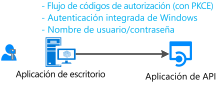
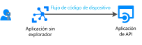

# Escenario: Aplicación de escritorio que llama a las API web

Aprenda a crear una aplicación de escritorio que llame a las API web.

## Prerequisites

[!INCLUDE [Pre-requisites](../../../includes/active-directory-develop-scenarios-prerequisites.md)]

## Introducción

Si aún no lo ha hecho, cree su primera aplicación siguiendo el inicio rápido de escritorio de .NET, el inicio rápido de la Plataforma universal de Windows (UWP) o el inicio rápido de aplicación nativa de macOS:

> [!div class="nextstepaction"]
> [Inicio rápido: Adquisición de un token y llamada a Microsoft Graph API desde una aplicación de escritorio de Windows](./quickstart-v2-windows-desktop.md)

> [!div class="nextstepaction"]
> [Inicio rápido: Adquisición de un token y llamada a Microsoft Graph API desde una aplicación de UWP](./quickstart-v2-uwp.md)

> [!div class="nextstepaction"]
> [Inicio rápido: Adquisición de un token y llamada a Microsoft Graph API desde una aplicación nativa de macOS](./quickstart-v2-ios.md)

## Información general

Supongamos que escribe una aplicación de escritorio y que desea que los usuarios inicien sesión en la aplicación, así como llamar a alguna API web como Microsoft Graph, otras API de Microsoft o su propia API web. Tiene varias posibilidades:

- Puede utilizar la adquisición interactiva de tokens:

  - Si la aplicación de escritorio admite controles gráficos; por ejemplo, si es una aplicación Windows.Form, una aplicación WPF o una aplicación nativa de macOS.
  - O si se trata de una aplicación .NET Core y acepta que la interacción de autenticación con Azure Active Directory (Azure AD) suceda en el explorador del sistema.

- En el caso de las aplicaciones hospedadas en Windows, también es posible que las aplicaciones que se ejecutan en equipos unidos a un dominio de Windows o unidos a Azure AD adquieran un token en modo silencioso mediante el uso de la autenticación integrada de Windows.
- Por último, y aunque no es recomendable, puede usar un nombre de usuario y una contraseña en las aplicaciones clientes públicas. Esto sigue siendo necesario en algunos escenarios, como DevOps. Su uso impone restricciones en la aplicación. Por ejemplo, no puede iniciar la sesión de un usuario que necesita realizar la autenticación multifactor (acceso condicional). Además, la aplicación no se beneficiará del inicio de sesión único (SSO).

  También va en contra de los principios de la autenticación moderna y solo se proporciona por motivos de herencia.

  

- Si escribe una herramienta de línea de comandos portátil (probablemente una aplicación .NET Core que se ejecuta en Linux o Mac) y acepta que la autenticación se delegue en el explorador del sistema, podrá usar la autenticación interactiva. .NET Core no proporciona un [explorador web](https://aka.ms/msal-net-uses-web-browser), por lo que la autenticación se produce en el explorador del sistema. De lo contrario, la mejor opción en ese caso es utilizar el flujo de código de dispositivo. Este flujo también se utiliza en las aplicaciones sin un explorador, como las aplicaciones de IoT.

  

## Características específicas

Las aplicaciones de escritorio tienen una serie de características específicas. Dependen principalmente de si la aplicación usa la autenticación interactiva o no.

## Pasos siguientes

> [!div class="nextstepaction"]
> [Aplicación de escritorio: registro de la aplicación](scenario-desktop-app-registration.md)
