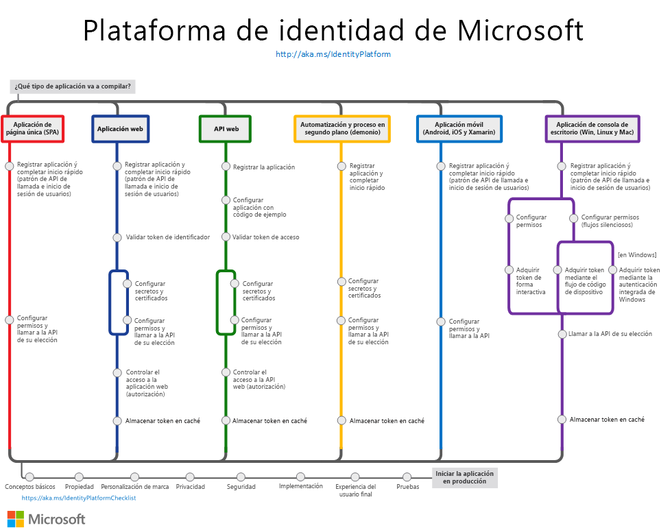

# Introducción a la Plataforma de identidad de Microsoft (versión 2.0)

Plataforma de identidad de Microsoft es una evolución de la plataforma para desarrolladores de Azure Active Directory (Azure AD). Permite a los desarrolladores compilar aplicaciones que inicien sesión en todas las identidades de Microsoft, obtener tokens para llamar a las API de Microsoft, como Microsoft Graph, o a otras API que los desarrolladores hayan creado. El punto de conexión de la Plataforma de identidad de Microsoft consta de lo siguiente:

- **Servicio de autenticación compatibles con los estándares OAuth 2.0 y OpenID Connect** que permite a los desarrolladores autenticar identidades de Microsoft como las siguientes:
  - Cuentas profesionales o educativas (aprovisionadas a través de Azure AD)
  - Cuentas personales de Microsoft (por ejemplo, Skype, Xbox y Outlook.com)
  - Cuentas locales y sociales (a través de Azure AD B2C)
- **Bibliotecas de código abierto**: bibliotecas de autenticación de Microsoft (MSAL) y compatibilidad con cualquier otra biblioteca que cumpla con los estándares.
- **Portal de administración de aplicaciones**: una experiencia de registro y configuración basada integrada en Azure Portal, junto con las demás funcionalidades de administración de Azure.
- **PowerShell y API de configuración de aplicaciones**: permite la configuración mediante programación de las aplicaciones a través de la API de REST (Microsoft Graph y Azure Active Directory Graph 1.6) y PowerShell, para que pueda automatizar las tareas de DevOps.
- **Contenido para desarrolladores**: documentación conceptual y de referencia, ejemplos de inicio rápido, ejemplos de código, tutoriales y guías paso a paso.

La Plataforma de identidad de Microsoft ofrece a los desarrolladores una perfecta integración con las innovaciones en el espacio de identidad y seguridad, como la autenticación sin contraseña, la autenticación de nivel superior y el acceso condicional.  No es necesario que implemente esta funcionalidad manualmente: las aplicaciones integradas de manera nativa con la Plataforma de identidad de Microsoft aprovechan estas innovaciones.

Con la Plataforma de identidad de Microsoft, puede escribir código una vez y llegar a cualquier usuario. Puede compilar una aplicación una sola vez y conseguir que funcione en muchas plataformas, o bien compilar una aplicación que funcione como un cliente, así como una aplicación de recursos (API).

## Introducción

Trabajar con la identidad no tiene porqué ser complicado. 

Vea un [vídeo de la plataforma de identidades de Microsoft](identity-videos.md) para conocer los aspectos básicos. 

Elija un [escenario](authentication-flows-app-scenarios.md) que se aplique a su trabajo: cada ruta de acceso de escenario tiene un inicio rápido y una página de información general para ayudarle a ponerse en marcha en cuestión de minutos:

- [Compilación de una aplicación de una sola página](scenario-spa-overview.md)
- [Compilación de una aplicación web que permite iniciar sesión a los usuarios](scenario-web-app-sign-user-overview.md)
- [Compilación de una aplicación web que llama a las API web](scenario-web-app-call-api-overview.md)
- [Compilación de una API web protegida](scenario-protected-web-api-overview.md)
- [Compilación de una API web que llama a las API web](scenario-web-api-call-api-overview.md)
- [Compilación de una aplicación de escritorio](scenario-desktop-overview.md)
- [Compilación de una aplicación demonio](scenario-daemon-overview.md)
- [Compilación de una aplicación móvil](scenario-mobile-overview.md)

En el gráfico siguiente se describen escenarios comunes de aplicaciones de autenticación: úselo como referencia al integrar la Plataforma de identidad de Microsoft con su aplicación.

## Pasos siguientes

Si desea obtener más información sobre los conceptos de autenticación más importantes, se recomienda empezar por estos temas:

- [Flujos de autenticación y escenarios de aplicaciones](authentication-flows-app-scenarios.md)
- [Conceptos básicos sobre autenticación](authentication-scenarios.md)
- [Aplicaciones y entidades de servicio](app-objects-and-service-principals.md)
- [Audiencias](v2-supported-account-types.md)
- [Permisos y consentimiento](v2-permissions-and-consent.md)
- [Tokens de identificador](id-tokens.md) y [tokens de acceso](access-tokens.md)

Compile una aplicación de datos enriquecido que llame a [Microsoft Graph](https://docs.microsoft.com/graph/overview).

Cuando lo tenga todo listo para iniciar la aplicación en un **entorno de producción**, revise estos procedimientos recomendados:

- [Habilite el registro](msal-logging.md) en su aplicación.
- Habilite la telemetría en su aplicación.
- Habilite los [servidores proxy y personalice los clientes HTTP](msal-net-provide-httpclient.md).
- Pruebe la integración siguiendo la [lista de comprobación de integración de la Plataforma de identidad de Microsoft](identity-platform-integration-checklist.md).

## Más información

Si tiene intención de compilar una aplicación orientada al cliente que inicie sesión en las identidades locales y sociales, eche un vistazo al artículo de [introducción a Azure AD B2C](https://docs.microsoft.com/azure/active-directory-b2c/tutorial-add-identity-providers).
