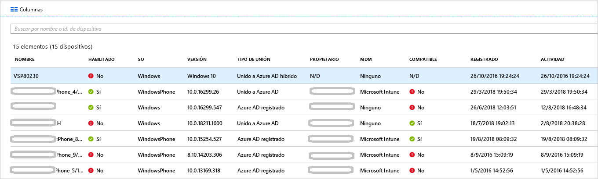

# <a name="how-to-manage-stale-devices-in-azure-ad"></a>Instrucciones: Administración de dispositivos obsoletos en Azure AD

Lo ideal es que, para completar el ciclo de vida, se anule el registro de los dispositivos registrados cuando ya no se necesiten. Sin embargo, debido, por ejemplo, a dispositivos perdidos, robados o rotos, o a reinstalaciones de sistemas operativos, normalmente tiene dispositivos obsoletos en su entorno. Como administrador de TI, es probable que desee un método para quitar los dispositivos obsoletos, de modo que pueda centrar sus recursos en la administración de los dispositivos que realmente requieren administración.

En este artículo, aprenderá a administrar eficazmente los dispositivos obsoletos en su entorno.
  

## <a name="what-is-a-stale-device"></a>¿Qué es un dispositivo obsoleto?

Un dispositivo obsoleto es un dispositivo que ha sido registrado con Azure AD pero que no se ha utilizado para acceder a ninguna aplicación de nube durante un periodo específico. Los dispositivos obsoletos tienen un impacto en su capacidad para administrar y admitir dispositivos y usuarios en el inquilino porque: 

- Los dispositivos duplicados pueden dificultar que el personal del departamento de soporte técnico pueda identificar qué dispositivo está activo actualmente.
- Un mayor número de dispositivos hace que se creen escrituras diferidas de dispositivos innecesarias, lo que aumenta el tiempo de sincronización de Azure AD Connect.
- Como norma recomendada general y para cumplir con los requisitos, es posible que desee tener un estado limpio de los dispositivos. 

Los dispositivos obsoletos en Azure AD pueden interferir con las directivas generales del ciclo de vida de los dispositivos de la organización.

## <a name="detect-stale-devices"></a>Detección de dispositivos obsoletos

Dado que un dispositivo obsoleto se define como un dispositivo registrado que no se ha utilizado para acceder a ninguna aplicación de nube durante un período específico, la detección de dispositivos obsoletos requiere una propiedad relacionada con la marca de tiempo. En Azure AD, esta propiedad se llama **ApproximateLastLogonTimestamp** o **marca de tiempo de actividad**. Si la diferencia entre ahora y el valor de la **marca de tiempo de actividad** supera el tiempo que ha definido para los dispositivos activos, se considera que un dispositivo está obsoleto. Esta **marca de tiempo de actividad** está ahora en versión preliminar pública.

## <a name="how-is-the-value-of-the-activity-timestamp-managed"></a>¿Cómo es el valor de la marca de tiempo de actividad administrada?  

La evaluación de la marca de tiempo de actividad se activa mediante un intento de autenticación de un dispositivo. Azure AD evalúa la marca de tiempo de la actividad cuando:

- Se ha desencadenado una directiva de acceso condicional que requiere [dispositivos administrados](../conditional-access/require-managed-devices.md) o [aplicaciones cliente aprobadas](../conditional-access/app-based-conditional-access.md).
- Los dispositivos de Windows 10 que están unidos a Azure AD o a Azure AD híbrido están activos en la red. 
- Los dispositivos administrados por Intune se han registrado en el servicio.

Si la diferencia entre el valor existente de la marca de tiempo de actividad y el valor actual es mayor de 14 días (con una variación de +/- 5 días), el valor existente se reemplaza por el nuevo.

## <a name="how-do-i-get-the-activity-timestamp"></a>¿Cómo se puede obtener la marca de tiempo de actividad?

Tiene dos opciones para recuperar el valor de la marca de tiempo de actividad:

- La columna **Actividad** en la [página de dispositivos](https://portal.azure.com/#blade/Microsoft_AAD_IAM/DevicesMenuBlade/Devices) de Azure Portal

    

- El cmdlet [Get-MsolDevice](https://docs.microsoft.com/powershell/module/msonline/get-msoldevice?view=azureadps-1.0)

    

## <a name="plan-the-cleanup-of-your-stale-devices"></a>Planeamiento de la limpieza de los dispositivos obsoletos

Para limpiar eficazmente los dispositivos obsoletos del entorno, debe definir una directiva relacionada. Esta directiva le ayuda a asegurarse de que captura todas las consideraciones relacionadas con los dispositivos obsoletos. En las siguientes secciones se incluyen ejemplos de consideraciones comunes de directivas. 

### <a name="cleanup-account"></a>Limpieza de cuenta

Para actualizar un dispositivo en Azure AD, necesita una cuenta que tenga asignada uno de los roles siguientes:

- Administrador global
- Administrador de dispositivos en la nube
- Administrador de servicios de Intune

En la directiva de limpieza, seleccione las cuentas que tengan los roles necesarios asignados. 

### <a name="timeframe"></a>Período de tiempo

Defina un período que sea el indicador de un dispositivo obsoleto. Cuando defina el período, tenga en cuenta la ventana para actualizar la marca de tiempo de actividad en su valor. Por ejemplo, no debe considerar una marca de tiempo que sea menor de 21 días (incluida la variación) como un indicador de un dispositivo obsoleto. Hay escenarios que pueden hacer que un dispositivo parezca obsoleto cuando no lo es. Por ejemplo, el propietario del dispositivo afectado puede estar de vacaciones o de baja por enfermedad.  Esto supera el período de tiempo para los dispositivos obsoletos.

### <a name="disable-devices"></a>Deshabilitar dispositivos

No es aconsejable eliminar inmediatamente un dispositivo que parezca obsoleto porque no se puede deshacer una eliminación en el caso de falsos positivos. Como procedimiento recomendado, deshabilite un dispositivo durante un período de gracia antes de eliminarlo. En la directiva, defina un período para deshabilitar una directiva antes de eliminarla.

### <a name="mdm-controlled-devices"></a>Dispositivos controlados por MDM

Si su dispositivo está bajo control de Intune o de cualquier otra solución MDM, retire el dispositivo del sistema de administración antes de deshabilitarlo o eliminarlo.

### <a name="system-managed-devices"></a>Dispositivos administrados por el sistema

No elimine los dispositivos administrados por el sistema. Por lo general, se trata de dispositivos como Autopilot. Una vez eliminados, estos dispositivos no se pueden volver a aprovisionar. De forma predeterminada, el nuevo cmdlet `get-msoldevice` excluye los dispositivos administrados por el sistema. 

### <a name="hybrid-azure-ad-joined-devices"></a>Dispositivos híbridos unidos a Azure AD

Los dispositivos unidos a Azure AD híbrido deben seguir las directivas para la administración de dispositivos obsoletos de un entorno local. 

Para realizar la limpieza de Azure AD:

- **Dispositivos de Windows 10**: deshabilite o elimine dispositivos de Windows 10 en la instancia de Azure AD local y deje que Azure AD Connect sincronice el estado del dispositivo modificado con Azure AD.
- **Windows 7/8**: deshabilite o elimine primero los dispositivos Windows 7/8 en Azure AD en el entorno local. No se puede usar Azure AD Connect para deshabilitar o eliminar dispositivos Windows 7/8 en Azure AD. En su lugar, cuando realice el cambio en su entorno local, debe deshabilitarlos o eliminarlos en Azure AD.

> [!NOTE]
>* La eliminación de dispositivos en la instancia de AD en el entorno local o en Azure AD no elimina el registro en el cliente. Solo impedirá el acceso a los recursos que usan el dispositivo como una identidad (por ejemplo, el acceso condicional). Lea información adicional sobre cómo [quitar el registro en el cliente](faq.md#hybrid-azure-ad-join-faq).
>* La eliminación de un dispositivo Windows 10 solo en Azure AD volverá a sincronizar el dispositivo desde el entorno local mediante Azure AD Connect, pero como un nuevo objeto en el estado "Pendiente". Se requiere un nuevo registro en el dispositivo.
>* Al quitar el dispositivo del ámbito de sincronización para dispositivos con Windows 10 o Server 2016, se eliminará el dispositivo Azure AD. Al volver a agregarlo al ámbito de sincronización, se colocará un nuevo objeto en el estado "Pendiente". Se requiere un nuevo registro del dispositivo.
>* Si no usa Azure AD Connect para que los dispositivos Windows 10 se sincronicen (por ejemplo, usando solo AD FS para el registro), debe administrar el ciclo de vida similar para los dispositivos Windows 7 o Windows 8.


### <a name="azure-ad-joined-devices"></a>Dispositivos unidos a Azure AD

Deshabilite o elimine los dispositivos unidos a Azure AD en Azure AD.

> [!NOTE]
>* La eliminación de un dispositivo de Azure AD no quita el registro en el cliente. Solo impedirá el acceso a los recursos que usan el dispositivo como una identidad (por ejemplo, el acceso condicional). 
>* Obtenga más información [sobre cómo separar en Azure AD](faq.md#azure-ad-join-faq) 

### <a name="azure-ad-registered-devices"></a>Dispositivos registrados en Azure AD

Deshabilite o elimine los dispositivos registrados de Azure AD en Azure AD.

> [!NOTE]
>* Al eliminar un dispositivo registrado de Azure AD en Azure AD, no se quita el registro en el cliente. Solo impedirá el acceso a los recursos que usan el dispositivo como una identidad (por ejemplo, el acceso condicional).
>* Obtenga más información [sobre cómo quitar un registro en el cliente](faq.md#azure-ad-register-faq)

## <a name="clean-up-stale-devices-in-the-azure-portal"></a>Limpieza de dispositivos obsoletos en Azure Portal  

Aunque puede limpiar los dispositivos obsoletos en Azure Portal, es más eficiente tratar este proceso mediante un script de PowerShell. Utilice el módulo PowerShell V1 más reciente para usar el filtro de marca de tiempo y para filtrar los dispositivos administrados por el sistema, como Autopilot. En este momento, no se recomienda el uso de PowerShell V2.

Una rutina típica consta de los pasos siguientes:

1. Conexión con Azure Active Directory mediante el cmdlet [Connect-MsolService](https://docs.microsoft.com/powershell/module/msonline/connect-msolservice?view=azureadps-1.0)
1. Obtención de la lista de dominios
1. Deshabilite el dispositivo mediante el cmdlet [Disable-MsolDevice](https://docs.microsoft.com/powershell/module/msonline/disable-msoldevice?view=azureadps-1.0). 
1. Espere el número de días que haya elegido del período de gracia antes de eliminar el dispositivo.
1. Quite el dispositivo mediante el cmdlet [Remove-MsolDevice](https://docs.microsoft.com/powershell/module/msonline/remove-msoldevice?view=azureadps-1.0).

### <a name="get-the-list-of-devices"></a>Obtención de la lista de dominios

Para obtener todos los dispositivos y almacenar los datos devueltos en un archivo CSV:

```PowerShell
Get-MsolDevice -all | select-object -Property Enabled, DeviceId, DisplayName, DeviceTrustType, Approxi
mateLastLogonTimestamp | export-csv devicelist-summary.csv
```

Si tiene un gran número de dispositivos en el directorio, utilice el filtro de marca de tiempo para reducir el número de dispositivos devueltos. Para obtener todos los dispositivos con una marca de tiempo anterior a una fecha específica y almacenar los datos devueltos en un archivo CSV: 

```PowerShell
$dt = [datetime]’2017/01/01’
Get-MsolDevice -all -LogonTimeBefore $dt | select-object -Property Enabled, DeviceId, DisplayName, DeviceTrustType, ApproximateLastLogonTimestamp | export-csv devicelist-olderthan-Jan-1-2017-summary.csv
```

## <a name="what-you-should-know"></a>Qué debería saber

### <a name="why-is-the-timestamp-not-updated-more-frequently"></a>¿Por qué la marca de tiempo no se actualiza con más frecuencia?

La marca de tiempo se actualiza para admitir escenarios de ciclo de vida del dispositivo. Esto no es una auditoría. Use los registros de auditoría de inicio de sesión para actualizaciones más frecuentes en el dispositivo.

### <a name="why-should-i-worry-about-my-bitlocker-keys"></a>¿Por qué debería preocuparme por mis claves de BitLocker?

Una vez configuradas, las claves de BitLocker para dispositivos Windows 10 se almacenan en el objeto de dispositivo en Azure AD. Si se elimina un dispositivo obsoleto, también se eliminan las claves de BitLocker almacenadas en el dispositivo. Debe determinar si su directiva de limpieza se alinea con el ciclo de vida real del dispositivo antes de eliminar un dispositivo obsoleto. 

### <a name="why-should-i-worry-about-windows-autopilot-devices"></a>¿Por qué debería preocuparme por los dispositivos Windows AutoPilot?

Cuando un dispositivo Azure AD se asocia a un objeto de Windows AutoPilot, pueden producirse los tres escenarios siguientes si dicho dispositivo se va a volver a usar en el futuro:
- Con implementaciones no meticulosas controladas por el usuario de Windows AutoPilot, se creará un nuevo dispositivo Azure AD, pero no se etiquetará con ZTDID.
- Con implementaciones en modo de autoimplementación de Windows AutoPilot, se producirá un error porque no se encuentra un dispositivo de Azure AD asociado.  (Se trata de un mecanismo de seguridad para asegurarse de que ningún dispositivo “impostor” intenta unirse a Azure AD sin credenciales). El error indicará una falta de coincidencia de ZTDID.
- Con implementaciones meticulosas de Windows AutoPilot, se producirá un error porque no se encuentra un dispositivo de Azure AD asociado. (En segundo plano, las implementaciones meticulosas usan el mismo proceso del modo de autoimplementación, por lo que aplican los mismos mecanismos de seguridad).

### <a name="how-do-i-know-all-the-type-of-devices-joined"></a>¿Cómo puedo conocer todos los tipos de dispositivos unidos?

Para más información sobre los distintos tipos, consulte la [introducción a la administración de dispositivos](overview.md).

### <a name="what-happens-when-i-disable-a-device"></a>¿Qué ocurre cuando se deshabilita un dispositivo?

Se deniega cualquier autenticación donde se use un dispositivo para autenticarse en Azure AD. Los ejemplos comunes son:

- **Dispositivo unido a Azure AD híbrido**: los usuarios podrían usar el dispositivo para iniciar sesión en su dominio local. Sin embargo, no pueden acceder a los recursos de Azure AD, como Office 365.
- **Dispositivo unido a Azure AD**: los usuarios no pueden usar el dispositivo para iniciar sesión. 
- **Dispositivos móviles**: el usuario no puede acceder a recursos de Azure AD, como Office 365. 

## <a name="next-steps"></a>Pasos siguientes

Para obtener información general sobre cómo administrar dispositivos en Azure Portal, vea [Managing devices using the Azure portal (Administración de dispositivos con Azure Portal)](device-management-azure-portal.md)
