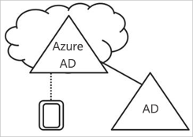
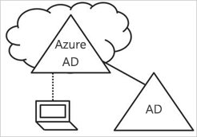
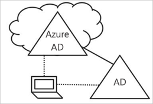

# ¿Qué es la administración de dispositivos en Azure Active Directory?

En un mundo donde la nube y la movilidad son prioritarias, Azure Active Directory (Azure AD) permite el inicio de sesión único en dispositivos, aplicaciones y servicios desde cualquier parte. Con la proliferación de dispositivos, así como las opciones que ofrece Bring Your Own Device (BYOD), los profesionales de TI se enfrentan con dos objetivos opuestos:

- Permitir que los usuarios finales sean productivos en cualquier lugar y en cualquier momento.
- Proteger los activos corporativos en todo momento.

Los usuarios acceden a los recursos corporativos a través de sus dispositivos. Para proteger los recursos corporativos, como administrador de TI, desea tener control sobre estos dispositivos. De esta forma, se asegura de que los usuarios acceden a los recursos desde dispositivos que satisfacen los estándares de seguridad y cumplimiento. 

La administración de dispositivos también es la base del [acceso condicional basado en dispositivos](../conditional-access/require-managed-devices.md). Con el acceso condicional basado en dispositivos, puede asegurarse de que el acceso a los recursos del entorno solo es posible con dispositivos administrados.   

En este artículo se explica cómo funciona la administración de dispositivos en Azure Active Directory.

> [!VIDEO https://www.youtube.com/embed/NeezfKhomQU]

## Dispositivos bajo el control de Azure AD

Para que un dispositivo esté bajo el control de Azure AD, tiene las dos opciones siguientes:

- Registro 
- Unión

El **registro** de un dispositivo en Azure AD le permite administrar la identidad de un dispositivo. Cuando se registra un dispositivo, el Registro de dispositivos de Azure AD le proporciona una identidad que se utiliza para autenticar el dispositivo cuando el usuario inicia sesión en Azure AD. Puede utilizar esta identidad para habilitar o deshabilitar un dispositivo.

Cuando se combina con una solución de administración de dispositivos móviles (MDM) como Microsoft Intune, los atributos del dispositivo en Azure AD se actualizan con información adicional sobre este. Esto le permite crear reglas de acceso condicional que obligan a que el acceso desde dispositivos cumpla con las normas de seguridad y cumplimiento. Para más información sobre la inscripción de dispositivos de Microsoft Intune, consulte el artículo [¿Qué es la inscripción de dispositivos?](https://docs.microsoft.com/intune/device-enrollment).

La **unión** de un dispositivo va más allá del simple registro. Esto significa que ofrece todas las ventajas de registrar un dispositivo y, además, también cambia el estado local de un dispositivo. El cambio del estado local permite a los usuarios iniciar sesión en un dispositivo mediante una cuenta profesional o educativa en lugar de con una cuenta personal.

## Dispositivos registrados en Azure AD   

El objetivo del registro de dispositivos de Azure AD es dar cabida al escenario **Bring Your Own Device (BYOD)**. En este escenario, el usuario puede acceder a los recursos controlados de Azure Active Directory de su organización con un dispositivo personal.  

El acceso se basa en una cuenta profesional o educativa que se ha introducido en el dispositivo.  
Por ejemplo, Windows 10 permite a los usuarios agregar una cuenta profesional o educativa en un equipo, una tableta o un teléfono.  
Cuando el usuario ha agregado una cuenta profesional o educativa, el dispositivo se registra con Azure AD y, opcionalmente, se inscribe en el sistema de administración de dispositivos móviles (MDM) que la organización ha configurado. Los usuarios de su organización pueden agregar un cuenta profesional o educativa a un dispositivo personal de forma cómoda:

- Al acceder a una aplicación de trabajo por primera vez
- Manualmente a través del menú **Configuración**, en el caso de Windows 10 

Puede configurar dispositivos registrados en Azure AD para Windows 10, iOS, Android y macOS.

## Dispositivos unidos a Azure AD

El objetivo de los dispositivos unidos a Azure AD es simplificar:

- Las implementaciones de Windows de los dispositivos de trabajo 
- El acceso a recursos y aplicaciones de la organización desde cualquier dispositivo Windows
- Administración basada en la nube de dispositivos de trabajo

La unión a Azure AD se puede implementar mediante cualquiera de los métodos siguientes: 
 - [Windows Autopilot](https://docs.microsoft.com/windows/deployment/windows-autopilot/windows-10-autopilot)
 - [Implementación masiva](https://docs.microsoft.com/intune/windows-bulk-enroll)
 - [Experiencia de autoservicio](azuread-joined-devices-frx.md) 

La **unión a Azure AD** está diseñada para organizaciones que quieren priorizar la nube (es decir, que usan principalmente los servicios en la nube con el objetivo de reducir el uso de una infraestructura local) o usar solo la nube (sin ninguna infraestructura local). No hay ninguna restricción de tamaño o tipo de organización que puede implementar una unión a Azure AD. La unión a Azure AD funciona bien incluso en un entorno híbrido y puede habilitar el acceso a aplicaciones y recursos de nube y locales.

La implementación de dispositivos unidos a Azure AD ofrece las siguientes ventajas:

- **Inicio de sesión único (SSO)** a las aplicaciones y servicios SaaS administrados por Azure. Los usuarios no ven mensajes de autenticación adicionales al acceder a los recursos de trabajo. Cuentan con la funcionalidad SSO incluso cuando no están conectados a la red de dominios.

- **Itinerancia de las configuraciones de usuario** conforme a la empresa entre dispositivos unidos. Los usuarios no necesitan conectarse a una cuenta de Microsoft (por ejemplo, Hotmail) para ver la configuración en todos los dispositivos.

- **Acceso a la Tienda Windows para empresas** mediante una cuenta de Azure AD. Los usuarios pueden elegir entre un inventario de aplicaciones ya seleccionadas por la organización.

- Compatibilidad con **Windows Hello** para un acceso cómodo y seguro a los recursos de trabajo.

- **Restricción del acceso** a las aplicaciones únicamente desde aquellos dispositivos que satisfagan las directivas de cumplimiento.

- **Acceso ininterrumpido a los recursos locales** cuando el dispositivo tiene línea de visión al controlador de dominio local. 

Aunque la unión a Azure AD esté pensada principalmente para aquellas organizaciones que no tengan una infraestructura de Windows Server Active Directory local, sin duda se puede utilizar en escenarios donde:

- Quiere realizar la transición a la infraestructura basada en la nube con Azure AD y un sistema MDM, como Intune.

- No puede usar una unión a un dominio local, por ejemplo, si tiene que controlar dispositivos móviles como tabletas y teléfonos.

- Los usuarios necesitan acceder sobre todo a Office 365 u otras aplicaciones de SaaS integradas con Azure AD.

- Desea administrar un grupo de usuarios en Azure AD en lugar de en Active Directory. Este puede ser el caso, por ejemplo, de trabajadores temporales, contratistas o alumnos.

- Desea proporcionar capacidades de unión a los trabajadores de sucursales remotas con infraestructura local limitada.

Puede configurar dispositivos unidos a Azure AD para dispositivos Windows 10.

## Dispositivos híbridos unidos a Azure AD

Durante más de una década, muchas organizaciones han usado la unión a un dominio en su instancia de Active Directory local para permitir:

- A los departamentos de TI administrar los dispositivos de empresa desde una ubicación central.

- A los usuarios iniciar sesión en sus dispositivos con sus cuentas profesionales o educativas de Active Directory. 

Normalmente, las organizaciones con un uso local confían en los métodos de creación de imágenes para aprovisionar los dispositivos y suelen usar **System Center Configuration Manager (SCCM)** o la **directiva de grupo** para administrarlos.

Si su entorno tiene un uso local de AD y también desea aprovechar las funcionalidades proporcionadas por Azure Active Directory, puede implementar dispositivos híbridos unidos a Azure AD. Se trata de dispositivos que se ha unido al entorno local de Active Directory y se han registrado en Azure Active Directory.

Debe usar dispositivos híbridos unidos a Azure AD si:

- Tiene aplicaciones Win32 implementadas en estos dispositivos que se basan en la autenticación de máquina de Active Directory.

- Requiere GP para administrar dispositivos.

- Desea seguir usando las soluciones de creación de imágenes para configurar los dispositivos de los empleados.

Puede configurar dispositivos híbridos unidos a Azure AD para Windows 10 y dispositivos de nivel inferior como Windows 8 y Windows 7.

## Resumen

Con la administración de dispositivos en Azure AD, puede: 

- Simplificar el proceso de poner los dispositivos bajo control de Azure AD

- Facilitar a los usuarios el acceso a los recursos de la organización basados en la nube

Como regla general, debe utilizar:

- Dispositivos registrados en Azure AD:

    - Para dispositivos personales. 

    - Para registrar dispositivos manualmente con Azure AD.

- Dispositivos unidos a Azure AD: 

    - Para dispositivos que pertenecen a su organización.

    - Para dispositivos que **no** estén unidos a un entorno local de AD.

    - Para registrar dispositivos manualmente con Azure AD.

    - Para cambiar el estado local de un dispositivo.

- Dispositivos híbridos unidos a Azure AD para dispositivos que están unidos a un entorno local de AD     

    - Para dispositivos que pertenecen a su organización.

    - Para dispositivos que estén unidos a un entorno local de AD.

    - Para registrar dispositivos automáticamente con Azure AD.

    - Para cambiar el estado local de un dispositivo.

## Pasos siguientes

- Para obtener información general sobre cómo administrar dispositivos en Azure Portal, vea [Managing devices using the Azure portal (Administración de dispositivos con Azure Portal)](device-management-azure-portal.md)

- Para más información sobre el acceso condicional basado en dispositivo, consulte las [directivas de acceso condicional basado en dispositivos para Azure Active Directory](../conditional-access/require-managed-devices.md).

- Para configurar:
    - Dispositivos Windows 10 registrados en Azure Active Directory, vea [How to configure Azure Active Directory registered Windows 10 devices (Configuración de dispositivos Windows 10 registrados en Azure Active Directory)](../user-help/device-management-azuread-registered-devices-windows10-setup.md)
    - Dispositivos unidos a Azure Active Directory, vea [How to configure Azure Active Directory joined devices (Configuración de dispositivos unidos a Azure Active Directory)](../user-help/device-management-azuread-joined-devices-setup.md)
    - Dispositivos unidos a Azure AD híbrido, consulte [Planeamiento de la implementación de la unión a Azure Active Directory híbrido](hybrid-azuread-join-plan.md).

