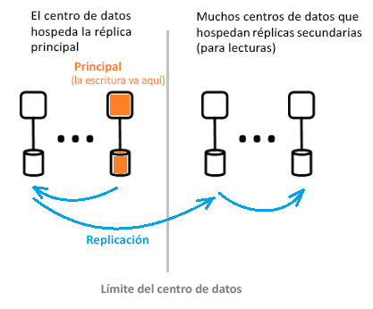

# ¿Qué es la arquitectura de Azure Active Directory?
Azure Active Directory (Azure AD) le permite administrar el acceso a los servicios y recursos de Azure para los usuarios de forma segura. Con Azure AD se incluye un conjunto completo de funcionalidades de administración de identidades. Para más información sobre las características de Azure AD, consulte [¿Qué es Azure Active Directory?](active-directory-whatis.md)

Con Azure AD, puede crear y administrar usuarios y grupos, y utilizar permisos para permitir o denegar el acceso a los recursos empresariales. Para más información sobre la administración de identidades, consulte [Aspectos básicos de la administración de identidades de Azure](active-directory-whatis.md).

## Arquitectura de Azure AD
La arquitectura distribuida geográficamente de Azure AD combina las funcionalidades de una amplia supervisión, el reenrutamiento automatizado, la conmutación por error y la recuperación, que ofrecen disponibilidad y rendimiento en toda la empresa a nuestros clientes.

En este artículo se tratan los siguientes elementos de la arquitectura:
 *  Diseño de la arquitectura del servicio
 *  Escalabilidad
 *  Disponibilidad continua
 *  Centros de datos

### Diseño de la arquitectura del servicio
La manera más común de compilar un sistema con datos enriquecidos que sea accesible y pueda usarse es con bloques de creación independientes o unidades de escalado. Para la capa de datos de Azure AD, a las unidades de escalado se les llama *particiones*. 

El nivel de datos tiene varios servicios front-end que proporcionan la funcionalidad de lectura y escritura. El diagrama siguiente muestra cómo se entregan los componentes de una partición de directorio único a lo largo de centros de datos geográficamente distribuidos. 

  

Los componentes de la arquitectura de Azure AD incluyen una réplica principal y réplicas secundarias.

**Réplica principal**

La *réplica principal* recibe todas las *operaciones de escritura* para la partición a la que pertenece. Esta operación de escritura se replica inmediatamente en una réplica secundaria de otro centro de datos antes volver correctamente al que llama, lo que garantiza la durabilidad de las operaciones de escritura con redundancia geográfica.

**Réplicas secundarias**

Todos los directorios *lee* son atendidas desde *réplicas secundarias*, que se encuentran en los centros de datos que están ubicados físicamente en regiones geográficas diferentes. Existen muchas réplicas secundarias, ya que los datos se replican de forma asincrónica. Lecturas de directorio, como las solicitudes de autenticación son atendidas desde los centros de datos que están cerca de los clientes. Las réplicas secundarias son responsables de la escalabilidad de lectura.

### Escalabilidad

La escalabilidad es la capacidad de un servicio de expandirse para satisfacer la creciente demanda de rendimiento. La escalabilidad de la operación de escritura se consigue mediante la creación de particiones de los datos. La escalabilidad de lectura se logra al replicar datos de una partición en varias réplicas secundarias que se distribuyen en todo el mundo.

Las solicitudes de las aplicaciones de directorio se enrutan al centro de datos que se encuentre físicamente más cerca. Las escrituras son redirigidas de forma transparente a la réplica principal para proporcionar coherencia de lectura y escritura. Las réplicas secundarias extienden significativamente la escala de las particiones porque los directorios suelen estar atendiendo a las lecturas la mayoría del tiempo.

Las aplicaciones de directorio se conectan a los centros de datos más cercanos. Esta conexión mejora el rendimiento y, por tanto, es posible el escalado horizontal. Como una partición de directorio puede tener varias réplicas secundarias, estas se pueden colocar más cerca a los clientes de directorio. Solo los componentes del servicio de directorio internos que requieren una gran cantidad de operaciones de escritura se dirigen directamente a la réplica principal activa.

### Disponibilidad continua

La disponibilidad (o tiempo de actividad) define la capacidad de un sistema de ejecutarse sin interrupciones. La clave para la alta disponibilidad de Azure AD es que los servicios pueden cambiar rápidamente el tráfico entre varios centros de datos distribuidos geográficamente. Cada centro de datos es independiente, lo que permite a los modos de error anular la correlación. En este diseño de alta disponibilidad, Azure AD no requiere ningún tiempo de inactividad para las actividades de mantenimiento.

El diseño de la partición de Azure AD se ha simplificado en comparación con el diseño empresarial de AD, mediante un diseño maestro único que incluye un proceso de conmutación por error de la réplica principal determinista y cuidadosamente organizado.

**Tolerancia a errores**

Un sistema está más disponible si es tolerante a errores de hardware, de red y de software. Para cada partición en el directorio, existe una réplica de alta disponibilidad: la réplica principal. Solo se realizan en esta réplica las operaciones de escritura en la partición. Esta réplica se supervisa constante y estrechamente, y las operaciones de escritura pueden desplazarse inmediatamente a otra réplica (que se convierte en la nueva réplica principal) si se detecta un error. Durante la conmutación por error, podría haber una pérdida de disponibilidad de escritura de 1 a 2 minutos. La disponibilidad de lectura no se ve afectada durante este tiempo.

Las operaciones de lectura (que superan a las de escritura en muchos órdenes de magnitud) solo van a las réplicas secundarias. Como las réplicas secundarias son idempotentes, la pérdida de alguna réplica en una en una partición determinada se compensa fácilmente dirigiendo las lecturas a otra réplica, normalmente en el mismo centro de datos.

**Durabilidad de datos**

Una operación de escritura es duradera en al menos dos centros de datos antes de su reconocimiento. Esto sucede por primera confirmación de la escritura en el servidor principal y, a continuación, replicar inmediatamente la operación de escritura en al menos un centro de datos. Esta acción de escritura garantiza que una potencial pérdida grave del centro de datos que hospeda la réplica principal no dar lugar a pérdida de datos.

Azure AD mantiene un [tiempo objetivo de recuperación (RTO)](https://en.wikipedia.org/wiki/Recovery_time_objective) de cero para no perder datos en las conmutaciones por error. Esto incluye:
-  Emisión de tokens y lecturas de directorio
-  Permite únicamente un RTO de 5 minutos para la escritura en directorios

### Centros de datos

Las réplicas de Azure AD se almacenan en centros de datos ubicados en todo el mundo. Para obtener más información, consulte [infraestructura global de Azure](https://azure.microsoft.com/global-infrastructure/).

Azure AD funciona a través de centros de datos con las siguientes características:

 * Autenticación, Graph y otros servicios de AD residen detrás del servicio de puerta de enlace. La puerta de enlace administra el equilibrio de carga de estos servicios. Se conmutará por error automáticamente si se detecta algún servidor incorrecto mediante el sondeo de estado transaccional. Según estos sondeos de estado, la puerta de enlace enruta dinámicamente el tráfico a centros de datos en buen estado.
 * Para *lee*, el directorio tiene réplicas secundarias y los servicios front-end correspondientes en una configuración activa-activa que funciona en varios centros de datos. En caso de error de todo un centro de datos, el tráfico se redirigirá automáticamente a otro centro de datos.
 *  Para *escribe*, el directorio se producirá un error a través de la réplica principal de (maestra) en centros de datos a través de planeada (nuevo elemento principal se sincroniza con el antiguo) o procedimientos de emergencia de conmutación por error. Durabilidad de los datos se logra al replicar cualquier confirmación en al menos dos centros de datos.

**Coherencia de datos**

El modelo de directorio es uno de coherencias finales. Uno de los problemas típicos con los sistemas de replicación distribuidos de forma asincrónica es que los datos devueltos de una réplica "determinada" pueden no estar actualizados. 

Azure AD proporciona coherencia de lectura y escritura para las aplicaciones dirigidas a una réplica secundaria mediante el enrutamiento de sus operaciones de escritura a la réplica principal y la recuperación de forma sincrónica de las operaciones de escritura a la réplica secundaria.

Las operaciones de escritura de la aplicación que utilizan Graph API de Azure AD se extraen de la afinidad de mantenimiento a una réplica de directorio para la coherencia de lectura y escritura. El servicio Graph de Azure AD mantiene una sesión lógica, que tiene afinidad con una réplica secundaria utilizada para las lecturas; la afinidad se captura en un "token de réplica" que el servicio Graph almacena en caché mediante una memoria caché distribuida. Este token se usa entonces para las siguientes operaciones de la misma sesión lógica. 

 >[!NOTE]
 >Las operaciones de escritura se replican inmediatamente a la réplica secundaria en la que se emitieron las operaciones de lectura de la sesión lógica.
 >

**Protección de copia de seguridad**

El directorio implementa eliminaciones temporales, en lugar de eliminaciones permanentes, para usuarios e inquilinos para una recuperación fácil en el caso de eliminaciones accidentales realizadas por un cliente. Si el administrador de inquilinos elimina accidentalmente usuarios, pueden deshacer esta operación con facilidad y restaurar a los usuarios eliminados. 

Azure AD implementa copias de seguridad diarias de todos los datos y, por tanto, puede restaurar de forma autoritativa los datos en el caso de eliminaciones lógicas o daños. La capa de datos emplea códigos de corrección de errores, por lo que se puede comprobar si hay errores y corregir automáticamente determinados tipos de errores de disco.

**Métricas y supervisiones**

Ejecutar un servicio de alta disponibilidad requiere métricas y funcionalidades de supervisión de primer nivel. Azure AD analiza continuamente e informa de métricas de estado de servicio clave y de criterios de éxito para cada uno de sus servicios. Además, continuamente desarrollamos y optimizamos las métricas, las capacidades de supervisión y las alertas para cada escenario, dentro de cada servicio de Azure AD y en todos los servicios.

Si algún servicio de Azure AD no funciona según lo previsto, nos encargamos inmediatamente para restaurar la funcionalidad lo antes posible. La métrica más importante que sigue Azure AD es la rapidez con la que podemos detectar y mitigar los problemas en el sitio activo para los clientes. Estamos realizando grandes inversiones en la supervisión y alertas para minimizar el tiempo de detección (TTD objetivo:<5 minutos) y la preparación operativa para minimizar el tiempo de mitigación (TTM objetivo: <30 minutos).

**Operaciones seguras**

Mediante el uso de controles operativos, como Multi-Factor Authentication (MFA) para cualquier operación, así como la auditoría de todas las operaciones. Además, se usa un sistema de elevación just-in-time para conceder el acceso temporal necesario a cualquier tarea operativa a petición de forma continuada. Para más información, consulte [La nube de confianza](https://azure.microsoft.com/support/trust-center).

## Pasos siguientes
[Guía del desarrollador de Azure Active Directory](https://docs.microsoft.com/azure/active-directory/develop/active-directory-developers-guide)

