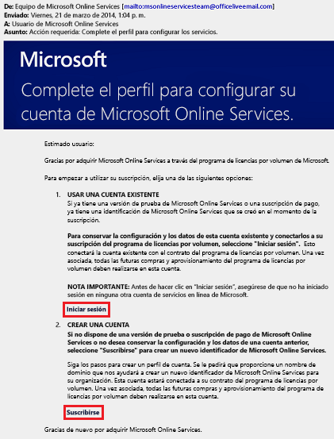
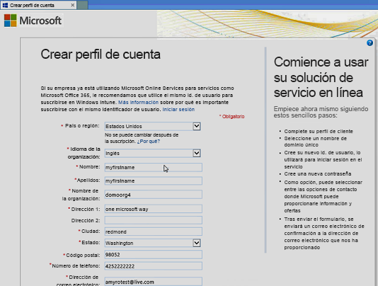
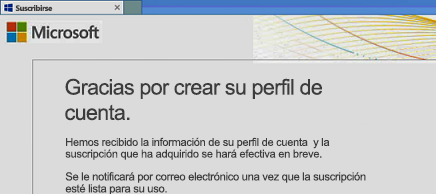
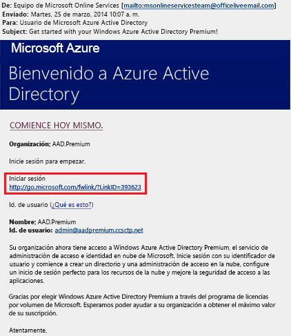
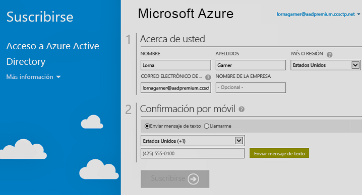

# Suscripción a las ediciones Azure Active Directory Premium
Puede adquirir ediciones Azure Active Directory (Azure AD) Premium y asociarlas a su suscripción de Azure. Si necesita crear una suscripción de Azure, debe activar también el plan de licencias y el acceso al servicio de Azure AD.

> [!NOTE]
>Las ediciones Azure AD Premium y Basic están disponibles para los clientes de China que utilizan la instancia de Azure Active Directory en todo el mundo. Las ediciones Azure AD Premium y Basic no se admiten actualmente en el servicio de Azure administrado por 21Vianet en China. Para más información, póngase en contacto con nosotros en el [foro de Azure Active Directory](https://feedback.azure.com/forums/169401-azure-active-directory/).

Antes de suscribirse a Active Directory Premium 1 o Premium 2, primero debe determinar qué suscripción o plan existente se va a usar:

- Mediante su suscripción de Azure u Office 365 existente

- Mediante su plan de licencias de Enterprise Mobility + Security

- Mediante un plan de licencias por volumen de Microsoft

El registro con su suscripción de Azure con licencias de Azure AD activadas y adquiridas previamente activa automáticamente las licencias en el mismo directorio. Si no es así, aún debe activar el plan de licencias y el acceso a Azure AD. Para más información sobre la activación del plan de licencias, vea [Activación del plan de licencias](#activate-your-new-license-plan). Para más información sobre la activación del acceso de Azure AD, vea [Activación de acceso de Azure Active Directory](#activate-your-azure-ad-access). 

## Registro mediante la suscripción existente de Azure u Office 365
Si ya cuenta con una suscripción a Azure u Office 365, puede comprar las ediciones en línea de Azure Active Directory Premium. Para ver los pasos detallados, consulte [How to Purchase Azure Active Directory Premium - Existing Customers](https://channel9.msdn.com/Series/Azure-Active-Directory-Videos-Demos/How-to-Purchase-Azure-Active-Directory-Premium-Existing-Customer) (Cómo comprar Azure Active Directory Premium: clientes existentes) o [How to Purchase Azure Active Directory Premium - New Customers](https://channel9.msdn.com/Series/Azure-Active-Directory-Videos-Demos/How-to-Purchase-Azure-Active-Directory-Premium-New-Customers) (Cómo comprar Azure Active Directory Premium: nuevos clientes).

## Registro mediante su plan de licencias de Enterprise Mobility + Security
Enterprise Mobility + Security es un conjunto compuesto por Azure AD Premium, Azure Information Protection y Microsoft Intune. Si ya tiene una licencia de EMS, puede empezar a trabajar con Azure AD mediante una de estas opciones de licencias:

Para más información sobre EMS, vea el [sitio web de Enterprise Mobility + Security](https://www.microsoft.com/cloud-platform/enterprise-mobility-security).

- Pruebe EMS con una [suscripción de prueba de Enterprise Mobility + Security E5](https://signup.microsoft.com/Signup?OfferId=87dd2714-d452-48a0-a809-d2f58c4f68b7&ali=1)

- Adquiera [licencias E5 de Enterprise Mobility + Security](https://signup.microsoft.com/Signup?OfferId=e6de2192-536a-4dc3-afdc-9e2602b6c790&ali=1)

- Adquiera [licencias E3 de Enterprise Mobility + Security](https://signup.microsoft.com/Signup?OfferId=4BBA281F-95E8-4136-8B0F-037D6062F54C&ali=1)

## Registro mediante su plan de licencias por volumen de Microsoft
Con su plan de licencias por volumen de Microsoft, puede suscribirse a Azure AD Premium con uno de estos dos programas, en función del número de licencias que desea obtener:

- **Para 250 o más licencias.** [Contrato Enterprise (EA) de Microsoft](https://www.microsoft.com/en-us/licensing/licensing-programs/enterprise.aspx)

- **Para 5 a 250 licencias.** [Licencia por volumen Open](https://www.microsoft.com/en-us/licensing/licensing-programs/open-license.aspx)

Para más información sobre las opciones de compra de licencias por volumen, vea [Cómo comprar mediante el programa de licencias por volumen](https://www.microsoft.com/en-us/licensing/how-to-buy/how-to-buy.aspx).

## Activación del nuevo plan de licencias
Si ha iniciado sesión con el nuevo plan de licencias de Azure AD, debe activarlo para su organización, con el uso del correo electrónico de confirmación enviado después de la compra.

### Para activar el plan de licencias
- Abra el correo electrónico de confirmación recibido de Microsoft después de suscribirse y luego haga clic en **Iniciar sesión** o **Registrarse**.
   
    

    - **Iniciar sesión.** Seleccione este vínculo si tiene un inquilino existente y luego inicia sesión con la cuenta de administrador existente. Debe ser administrador global en el inquilino en el que se activan las licencias.

    - **Registrarse.** Seleccione este vínculo si desea abrir la página **Crear perfil de cuenta** y cree un inquilino de Azure AD para el plan de licencias.

        

Cuando haya terminado, verá un cuadro de confirmación de agradecimiento por activar el plan de licencias del inquilino.

## Activación del acceso a Azure AD
Si va a agregar nuevas licencias de Azure AD Premium a una suscripción existente, ya se debe haber activado el acceso a Azure AD. En caso contrario, debe activar el acceso a Azure AD después de recibir el **mensaje de correo electrónico de bienvenida**.  

Una vez aprovisionadas las licencias adquiridas en el directorio, recibirá un **correo electrónico de bienvenida**. El correo electrónico confirma que puede empezar a administrar las licencias y características de Azure AD Premium o Enterprise Mobility + Security. 

> [!TIP]
> No podrá acceder a Azure AD en el nuevo inquilino hasta que active el acceso al directorio de Azure AD desde el correo electrónico de bienvenida.

### Para activar el acceso a Azure AD

1. Abra el **correo electrónico de bienvenida** y luego haga clic en **Iniciar sesión**.
   
    

2. Después de iniciar sesión correctamente, se le remitirá a una verificación en dos pasos mediante un dispositivo móvil.
   
    

El proceso de activación normalmente tarda solo unos minutos y después puede usar el inquilino de Azure AD. 

## Pasos siguientes
Ahora que tiene Azure AD Premium, puede [personalizar su dominio](add-custom-domain.md), agregar su [personalización de marca corporativa](customize-branding.md), [crear un inquilino](active-directory-access-create-new-tenant.md) y [agregar grupos](active-directory-groups-create-azure-portal.md) y [usuarios](add-users-azure-active-directory.md).
