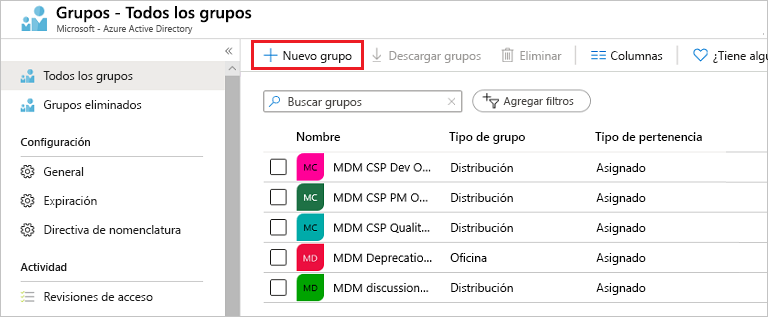
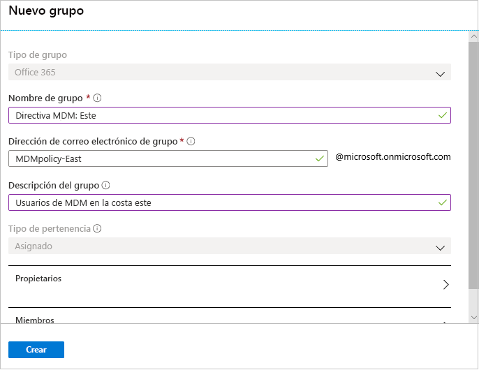

# Creación de un grupo básico e incorporación de miembros con Azure Active Directory
Puede crear un grupo básico con el portal de Azure Active Directory (Azure AD). Para los fines de este artículo, el propietario del recurso (administrador) agrega un grupo básico a un único recurso e incluye miembros específicos (empleados) que necesitan acceder a dicho recurso. Para escenarios más complejos, incluida la creación de reglas y las pertenencias dinámicas, vea la [documentación de administración de usuarios de Azure Active Directory](../users-groups-roles/index.yml).

## Creación de un grupo básico y adición de miembros
Puede crear un grupo básico y agregar los miembros al mismo tiempo.

### Para crear un grupo básico y agregar miembros
1. Inicie sesión en [Azure Portal](https://portal.azure.com) con una cuenta de administrador global del directorio.

2. Seleccione **Azure Active Directory**, **Grupos** y, a continuación, seleccione **Nuevo grupo**.

    

3. En la página **Grupo**, rellene la información necesaria.

    

    - **Tipo de grupo (obligatorio).** Seleccione un tipo de grupo definido previamente. Esto incluye:
        
        - **Seguridad**. Se usa para administrar el acceso de miembros y del equipo a los recursos compartidos de un grupo de usuarios. Por ejemplo, puede crear un grupo de seguridad para una directiva de seguridad específica. De esta forma, puede conceder una serie de permisos a todos los miembros a la vez, en lugar de tener que agregar permisos a cada miembro individualmente. Para más información sobre la administración de acceso a los recursos, vea [Administración de acceso a los recursos con grupos de Azure Active Directory](active-directory-manage-groups.md).
        
        - **Office 365**. Ofrece oportunidades de colaboración al conceder acceso a los miembros a un correo compartido, calendarios, archivos, el sitio de SharePoint y mucho más. Esta opción también permite ofrecer a personas de fuera de su organización acceso al grupo. Para más información sobre los Grupos de Office 365, vea [Obtenga más información sobre los grupos de Office 365](https://support.office.com/article/learn-about-office-365-groups-b565caa1-5c40-40ef-9915-60fdb2d97fa2).

    - **Nombre de grupo (obligatorio).** Agregue un nombre para el grupo, algo que sea fácil de recordar y que tenga sentido.

    - **Descripción del grupo.** Agregue una descripción opcional al grupo.

    - **Tipo de pertenencia (obligatorio).** Seleccione un tipo de pertenencia definido previamente. Esto incluye:

        - **Asignado.** Le permite agregar usuarios específicos para que sean miembros de este grupo y para que tengan permisos exclusivos. Para los fines de este artículo, vamos a usar esta opción.

        - **Usuario dinámico.** Le permite usar reglas de grupo dinámico para agregar y quitar miembros automáticamente. Si los atributos de un miembro cambian, el sistema examina las reglas del grupo dinámico del directorio para ver si el miembro cumple los requisitos de la regla (se agrega) o ya no cumple los requisitos de las reglas (se elimina).

        - **Dispositivo dinámico.** Le permite usar reglas de grupo dinámico para agregar y quitar dispositivos automáticamente. Si los atributos de un dispositivo cambian, el sistema examina las reglas del grupo dinámico del directorio para ver si el dispositivo cumple los requisitos de la regla (se agrega) o ya no cumple los requisitos de las reglas (se elimina).

        >[!Important]
        >Puede crear un grupo dinámico para dispositivos o usuarios, pero no para ambos. Tampoco se puede crear un grupo de dispositivos basado en los atributos de los propietarios de los dispositivos. Las reglas de pertenencia de dispositivo solo pueden hacer referencia a atribuciones de dispositivos. Para más información sobre cómo crear un grupo dinámico para los usuarios y dispositivos, consulte [Creación de un grupo dinámico y comprobación de su estado](../users-groups-roles/groups-create-rule.md).

4. Seleccione **Crear**.

    El grupo se crea y está listo para que agregue miembros.

5. Seleccione el área **Miembros** de la página **Grupo** y después empiece a buscar los miembros para agregarlos al grupo en la página **Seleccionar miembros**.

    

6. Cuando haya terminado de agregar miembros, elija **Seleccionar**.

    La página **Información general del grupo** se actualiza para mostrar el número de miembros que ahora se agregan al grupo.

    

## Pasos siguientes
Ahora que ha agregado un grupo y al menos un usuario, puede:

- [Visualización de grupos y miembros](active-directory-groups-view-azure-portal.md)

- [Administración de pertenencia al grupo](active-directory-groups-membership-azure-portal.md)

- [Administrar reglas dinámicas de los usuarios de un grupo](../users-groups-roles/groups-create-rule.md)

- [Edición de la configuración de un grupo](active-directory-groups-settings-azure-portal.md)

- [Administrar el acceso a los recursos mediante grupos](active-directory-manage-groups.md)

- [Administrar el acceso a las aplicaciones SaaS mediante grupos](../users-groups-roles/groups-saasapps.md)

- [Administrar grupos mediante los comandos de PowerShell](../users-groups-roles/groups-settings-v2-cmdlets.md)

- [Asociar o agregar una suscripción de Azure a Azure Active Directory](active-directory-how-subscriptions-associated-directory.md)
