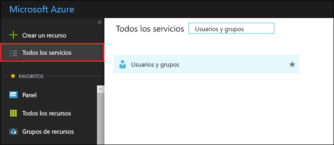
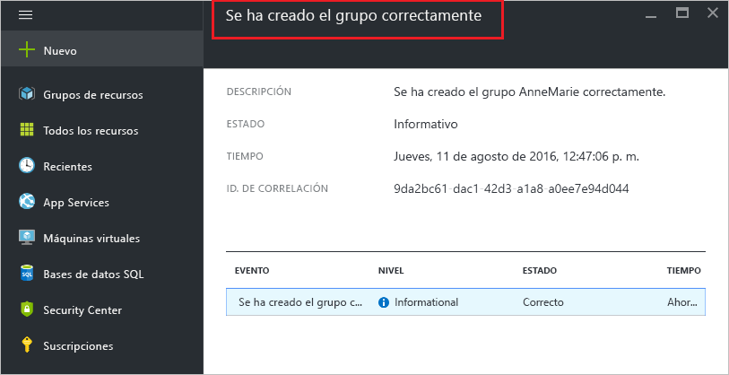

# Creación de un grupo y adición de miembros en Azure Active Directory
> [!div class="op_single_selector"]
> * [Azure Portal](active-directory-groups-create-azure-portal.md)
> * [PowerShell](../users-groups-roles/groups-settings-v2-cmdlets.md)

En este artículo se explica cómo crear y rellenar un nuevo grupo en Azure Active Directory. Use un grupo para realizar tareas de administración, como asignar licencias o permisos a un número de usuarios o dispositivos a la vez.

## ¿Cómo se crea un grupo?
1. Inicie sesión en [Azure Portal](https://portal.azure.com) con una cuenta que tenga el rol de administrador global en el directorio.
2. Seleccione **Todos los servicios**, escriba **Usuarios y grupos** en el cuadro de texto y, después, presione **Entrar**.

   
3. En la hoja **Usuarios y grupos**, seleccione **Todos los grupos**.

   
4. En la hoja **Usuarios y grupos - Todos los grupos**, seleccione el comando **Agregar**.

   
5. En la hoja **Grupo** , agregue un nombre y una descripción para el nuevo grupo.
6. Para seleccionar los miembros que se agregarán al grupo, seleccione **Asignado** en el cuadro **Membership type** (Tipo de pertenencia a grupos) y luego seleccione **Miembros**. Para obtener más información sobre cómo administrar la pertenencia de un grupo de forma dinámica, consulte el artículo sobre el [uso de atributos para crear reglas avanzadas de pertenencias a grupo](../users-groups-roles/groups-dynamic-membership.md).

   
7. En la hoja **Miembros**, seleccione uno o varios usuarios o dispositivos que quiera agregar al grupo y, luego, haga clic en el botón **Seleccionar** situado en la parte inferior de la hoja para agregarlos. El cuadro **Usuario** filtra la visualización en función de si coincide lo que ha escrito con cualquier parte del nombre de un usuario o dispositivo. No se aceptan caracteres comodín en el cuadro.
8. Cuando termine de agregar miembros al grupo, seleccione **Crear** en la hoja **Grupo**.    

   

## Pasos siguientes
Estos artículos proporcionan información adicional sobre Azure Active Directory.

* [Consulta de los grupos existentes](active-directory-groups-view-azure-portal.md)
* [Administración de la configuración de un grupo](active-directory-groups-settings-azure-portal.md)
* [Administrar miembros de un grupo](active-directory-groups-members-azure-portal.md)
* [Administrar la pertenencia a grupos](active-directory-groups-membership-azure-portal.md)
* [Administrar reglas dinámicas de los usuarios de un grupo](../users-groups-roles/groups-dynamic-membership.md)
