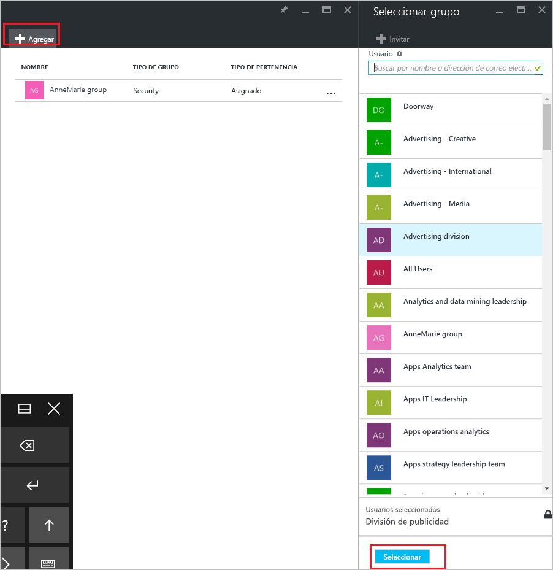
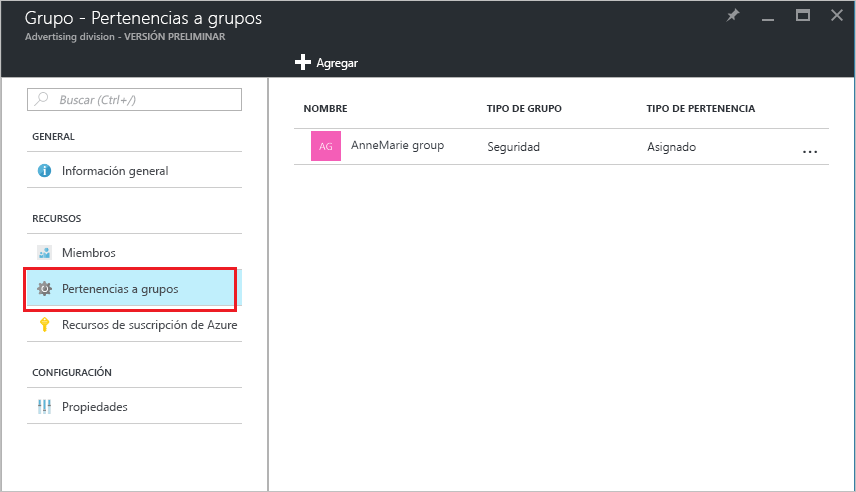

# Incorporación o eliminación de un grupo de otro grupo con Azure Active Directory
En este artículo encontrará ayuda para agregar y quitar un grupo de otro grupo con Azure Active Directory.

>[!Note]
>Si intenta eliminar el grupo primario, consulte el artículo sobre [la actualización y la eliminación de un grupo y sus miembros](active-directory-groups-delete-group.md).

## Incorporación de un grupo a otro grupo
Puede agregar un grupo de seguridad existente a otro grupo de seguridad existente (lo que también se conoce como grupos anidados), y crear un grupo de miembros (subgrupo) y un grupo principal. El grupo miembro hereda los atributos y las propiedades del grupo primario, lo que le ahorra tiempo de configuración.

>[!Important]
>En este momento, no se admite:<ul><li>Agregar grupos a un grupo sincronizado con Active Directory local.</li><li>Agregar grupos de seguridad a grupos de Office 365.</li><li>Agregar grupos de Office 365 a grupos de seguridad u otros grupos de Office 365.</li><li>Asignar aplicaciones a grupos anidados.</li><li>Aplicar licencias a grupos anidados.</li></ul>

### Para agregar un grupo como miembro de otro grupo, siga estos pasos:

1. Inicie sesión en [Azure Portal](https://portal.azure.com) con una cuenta de administrador global para el directorio.

2. Seleccione **Azure Active Directory** y después seleccione **Grupos**.

3. En la página **Grupos - Todos los grupos**, busque y seleccione el grupo que va a convertirse en miembro de otro grupo. Para este ejercicio, usaremos el grupo **MDM policy - West**.

    >[!Note]
    >Puede agregar el grupo como miembro solo a un otro grupo a la vez. Además, el cuadro **Seleccionar grupo** filtra la visualización en función de si coincide lo que ha escrito con cualquier parte del nombre de un usuario o dispositivo. Sin embargo, no se admiten caracteres comodín.

    

4. En la página **MDM policy - West - Group memberships**, seleccione **Pertenencia a grupos**, seleccione **Agregar**, busque el grupo de que quiere que su grupo sea miembro y, luego, elija **Seleccionar**. Para este ejercicio, usaremos el grupo **MDM policy - All org**.

    El grupo **MDM policy - West** ahora es miembro del grupo **MDM policy - All org**, y hereda todas las propiedades y la configuración del grupo MDM policy - All org.

    

5. Revise la página **MDM policy - West - Group memberships** para ver la relación entre el grupo y el miembro.

    

6. Para obtener una vista más detallada de la relación entre el grupo y el miembro, seleccione el nombre del grupo (**MDM policy - All org**) y eche un vistazo a los detalles de la página **MDM policy - West**.

    

## Eliminación de un grupo de otro grupo
Puede quitar un grupo de seguridad existente de otro grupo de seguridad. Sin embargo, al quitar el grupo también se eliminan los atributos y propiedades heredados de sus miembros.

### Para quitar un grupo miembro de otro grupo
1. En la página **Grupos - Todos los grupos**, busque y seleccione el grupo que va a quitarse como miembro de otro grupo. Para este ejercicio, volveremos a usar el grupo **MDM policy - West**.

2. En la página **Información general de MDM policy - West**, seleccione **Pertenencia a grupos**.

    

3. Seleccione el grupo **MDM policy - All org** de la página **MDM policy - West - Group memberships** y, luego, seleccione **Quitar** de los detalles de la página **MDM policy - West**.

    

## Información adicional
Estos artículos proporcionan información adicional sobre Azure Active Directory.

- [Visualización de grupos y miembros](active-directory-groups-view-azure-portal.md)

- [Creación de un grupo básico e incorporación de miembros](active-directory-groups-create-azure-portal.md)

- [Incorporación o eliminación de miembros de un grupo](active-directory-groups-members-azure-portal.md)

- [Edición de la configuración de un grupo](active-directory-groups-settings-azure-portal.md)

- [Uso de un grupo para administrar el acceso a las aplicaciones SaaS](../users-groups-roles/groups-saasapps.md)

- [Escenarios, limitaciones y problemas conocidos del uso de grupos para administrar las licencias en Azure Active Directory](../users-groups-roles/licensing-group-advanced.md#limitations-and-known-issues)
