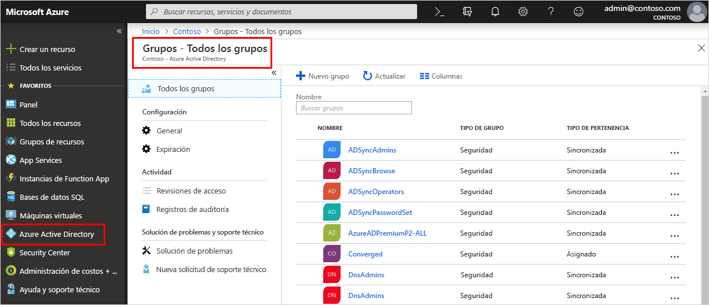

<!--As a brand-new Azure AD administrator, I need to view my organization’s groups along with the assigned members, so I can manage permissions to apps and services for people in my organization-->

# Inicio rápido: Visualización de los grupos y miembros de la organización en Azure Active Directory
Puede ver los grupos existentes en la organización y los miembros de los grupos mediante Azure Portal. Los grupos se usan para administrar usuarios (miembros) que necesitan el mismo acceso y permisos para servicios y aplicaciones potencialmente restringidos.

En esta guía de inicio rápido podrá ver todos los grupos existentes en la organización y ver los miembros asignados.

Si no tiene una suscripción a Azure, cree una [cuenta gratuita](https://azure.microsoft.com/free/) antes de empezar. 

## Prerequisites
Antes de comenzar, deberá:

- Crear un inquilino de Azure Active Directory. Para más información, consulte [Acceso al portal de Azure Active Directory y creación de un nuevo inquilino](active-directory-access-create-new-tenant.md).

## Inicio de sesión en Azure Portal
Debe iniciar sesión en [Azure Portal](https://portal.azure.com/) con una cuenta de administrador global del directorio.

## Creación de un grupo nuevo 
Cree un nuevo grupo llamado _MDM policy - West_. Para más información acerca de cómo crear un grupo, consulte [Cómo crear un grupo básico y agregar miembros](active-directory-groups-create-azure-portal.md).

1. Seleccione **Azure Active Directory**, **Grupos** y, a continuación, seleccione **Nuevo grupo**.

2. Rellene la página **Grupo**:
    
    - **Tipo de grupo:** seleccione **Seguridad**.
    
    - **Nombre del grupo:** escriba _MDM policy - West (Directiva de MDM - Oeste)_
    
    - **Tipo de pertenencia:** seleccione **Asignado**.

3. Seleccione **Crear**.

## Creación de un nuevo usuario
Cree un nuevo usuario llamado _Alain Charon_. El usuario debe existir antes de ser agregado como miembro del grupo. Revise primero la pestaña “Nombres de dominio personalizados” para obtener el nombre de dominio verificado en el que quiera crear usuarios. Para más información acerca de cómo crear un usuario, consulte [Cómo agregar o eliminar usuarios](add-users-azure-active-directory.md).

1. Seleccione **Azure Active Directory**, **Usuarios** y, a continuación, seleccione **Nuevo usuario**.

2. Rellene la página **Usuario**:

    - **Nombre:** escriba _Alain Charon_.

    - **Nombre de usuario:** Escriba *alain\@contoso.com*.

3. Copie la contraseña generada automáticamente proporcionada en el cuadro de texto **Contraseña** y, a continuación, seleccione **Crear**.

## Adición de un miembro del grupo
Ahora que tiene un grupo y un usuario, puede agregar a _Alain Charon_ como un miembro del grupo _MDM policy - West_. Para más información acerca de cómo agregar miembros del grupo, consulte [Cómo agregar o eliminar miembros del grupo](active-directory-groups-members-azure-portal.md).

1. Seleccione **Azure Active Directory** > **Grupos**.

2. En la página **Grupos - Todos los grupos**, busque y seleccione el grupo **MDM policy - West**.

3. En la página **Información general de MDM policy - West**, seleccione **Miembros** en el área **Administrar**.

4. Seleccione **Agregar miembros** y, a continuación, busque y seleccione **Alain Charon**.

5. Elija **Seleccionar**.

## Visualización de todos los grupos
Puede ver todos los grupos de la organización en la página **Grupos - Todos los grupos** de Azure Portal.

- Seleccione **Azure Active Directory** > **Grupos**.

    Aparecerá la página **Grupos - Todos los grupos** con todos los grupos activos.

    

## Búsqueda del grupo
Utilice la página **Grupos - Todos los grupos** para buscar el grupo **MDM policy - West**.

1. En la página **Grupos - Todos los grupos**, escriba _MDM_ en el cuadro **Buscar**.

    Los resultados de la búsqueda aparecen bajo el cuadro **Buscar**, incluido el grupo _MDM policy - West_.

    

3. Seleccione el grupo **MDM policy – West**.

4. Puede ver la información del grupo en la página **Información general de MDM policy - West**, incluido el número de miembros del grupo.

    

## Visualización de los miembros del grupo
Ahora que ha encontrado el grupo, puede ver todos los miembros asignados.

- Seleccione **Miembros** en el área **Administrar** y, a continuación, revise la lista completa de los nombres de los miembros asignados a ese grupo específico, incluido _Alain Charon_.

    

## Limpieza de recursos
Este grupo se utiliza en varios de los procesos de procedimientos disponibles en la sección **Guías de procedimientos** de esta documentación. Sin embargo, si prefiere no utilizar este grupo, puede eliminarlo y también los miembros asignados mediante los siguientes pasos:

1. En la página **Grupos - Todos los grupos**, busque el grupo **MDM policy - West**.

2.  Seleccione el grupo **MDM policy - West**.

    Aparece la página **Información general de MDM policy - West**.

3. Seleccione **Eliminar**.

    El grupo y los miembros asociados se eliminan.

    

    >[!Important]
    >Esta operación no elimina al usuario Alain Charon, solo su pertenencia al grupo eliminado.

## Pasos siguientes
Avance al siguiente artículo para obtener información sobre cómo asociar una suscripción al directorio de Azure AD.

> [!div class="nextstepaction"]
> [Asociación de una suscripción de Azure](active-directory-how-subscriptions-associated-directory.md)
