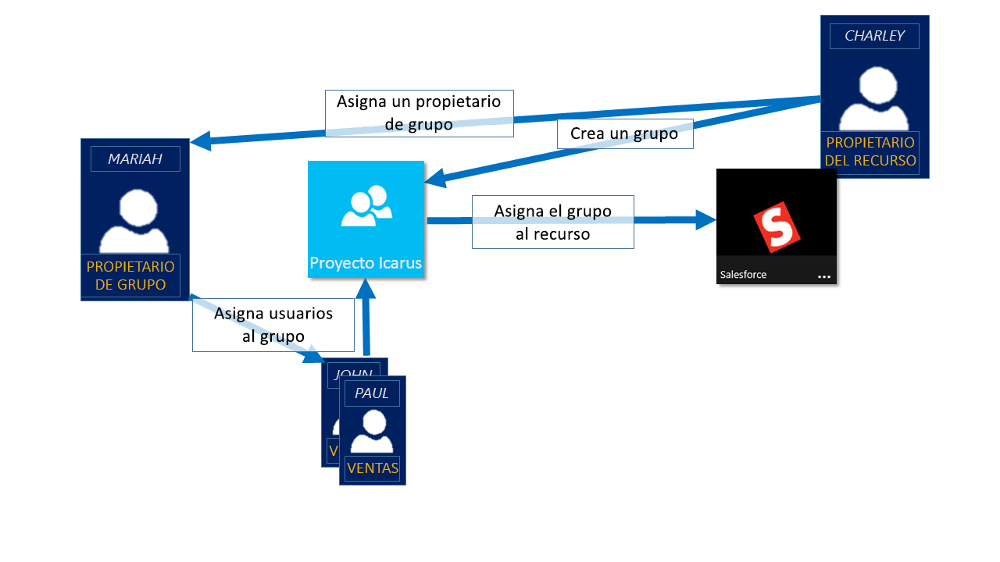
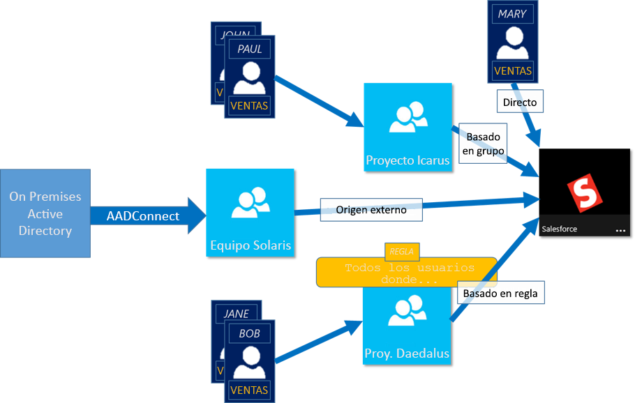

# Administración del acceso a recursos y aplicaciones con grupos en Azure Active Directory
Azure Active Directory (Azure AD) le ayuda a administrar aplicaciones en la nube de su organización, aplicaciones locales y recursos locales mediante los grupos de su organización. Sus recursos pueden formar parte del directorio, como los permisos para administrar objetos a través de los roles del directorio, o puede estar fuera del directorio, como las aplicaciones SaaS (software como servicio), los servicios de Azure, los sitios de SharePoint y los recursos locales.

>[!NOTE]
>Para usar Azure Active Directory, necesita una cuenta de Azure. Si aún no tiene ninguna, puede [registrarse para obtener una cuenta de Azure gratuita](https://azure.microsoft.com/free/).

## ¿Cómo funciona la administración de acceso en Azure AD?
Azure AD le ayuda a proporcionar acceso a los recursos de su organización, ya que proporciona derechos de acceso a un usuario individual o a todo un grupo de Azure AD. El uso de grupos permite al propietario de los recursos (o al propietario del directorio de Azure AD) asignar un conjunto de permisos de acceso a todos los miembros del grupo, en lugar de tener que proporcionar los derechos uno por uno. El propietario del recurso o del directorio también puede conceder derechos de administrador para la lista de miembros a otra persona, como por ejemplo, a un director de departamento o a un administrador del departamento de soporte técnico, y dejar que dicha persona agregue y quite miembros, según sea necesario. Para más información acerca de cómo administrar propietarios de grupos, consulte [Administración de propietarios de grupos](active-directory-accessmanagement-managing-group-owners.md)

## Formas de asignar derechos de acceso
Hay cuatro maneras de asignar derechos de acceso a los recursos a los usuarios:

- **Asignación directa.** El propietario del recurso asigna directamente el usuario al recurso.

- **Asignación de un grupo.** El propietario del recurso asigna un grupo de Azure AD al recurso, que automáticamente concede a todos sus miembros acceso al recurso. La pertenencia a un grupo la administran el propietario del grupo y el propietario del recurso, lo que permite a ambos propietarios agregar o quitar miembros del grupo. Para más información acerca de cómo agregar o eliminar miembros del grupo, consulte [Procedimiento para cómo agregar o quitar un grupo de otro grupo con Azure Active Directory](active-directory-groups-membership-azure-portal.md). 

- **Asignación basada en reglas.** El propietario del recurso crea un grupo y usa una regla para definir qué usuarios están asignados a un recurso concreto. La regla se basa en atributos que se asignan a usuarios individuales. El propietario del recurso administra la regla, lo que determina los atributos y valores que son necesarios para permitir el acceso al recurso. Para más información, consulte [Creación de un grupo dinámico y comprobación de su estado](../users-groups-roles/groups-create-rule.md).

    También puede ver este breve vídeo, donde encontrará para obtener una explicación rápida sobre cómo crear y usar grupos dinámicos:

    >[!VIDEO https://channel9.msdn.com/Series/Azure-Active-Directory-Videos-Demos/Azure-AD--Introduction-to-Dynamic-Memberships-for-Groups/player]

- **Asignación de una autoridad externa.** El acceso procede de un origen externo, como un directorio local o una aplicación SaaS. En esta situación, el propietario del recurso asigna al grupo para proporcionar acceso al recurso y, después, el origen externo administra los miembros del grupo.

   

## ¿Pueden los usuarios unirse a grupos sin que se les asignen?
El propietario del grupo puede permitir a los usuarios buscar los grupos a los que se van a unir, en lugar de asignarlos. El propietario también puede configurar el grupo para que acepte todos los usuarios que se unan a o para que exija aprobación.

Cuando un usuario solicita unirse a un grupo, la solicitud se reenvía al propietario del mismo. Si es necesario, el propietario puede aprobar la solicitud y se notifica al usuario de la pertenencia al grupo. Sin embargo, si tiene varios propietarios y uno de ellos la rechaza, el usuario recibe una notificación, pero no se agrega al grupo. Para más información e instrucciones acerca de cómo permitir a los usuarios solicitar su unión a grupos, consulte [Configuración de Azure AD para que los usuarios puedan solicitar unirse a grupos](../users-groups-roles/groups-self-service-management.md)

## Pasos siguientes
Tras esta introducción a la administración de acceso mediante grupos, empiece a administrar los recursos y aplicaciones.

- [Creación de un grupo y adición de miembros en Azure Active Directory](active-directory-groups-create-azure-portal.md) o [Creación y administración de grupos mediante los cmdlets de PowerShell](../users-groups-roles/groups-settings-v2-cmdlets.md)

- [Uso de grupos para asignar acceso a una aplicación SaaS integrada](../users-groups-roles/groups-saasapps.md)

- [Sincronización de un grupo local con Azure mediante Azure AD Connect](../hybrid/whatis-hybrid-identity.md)