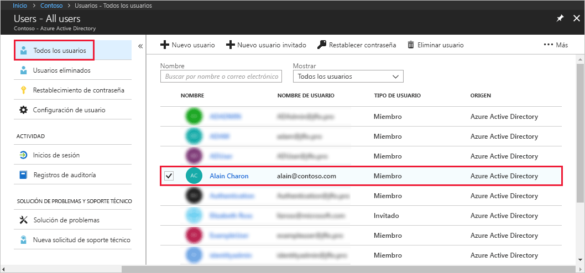

# Asignación de un usuario a roles de administrador en Azure Active Directory
En este artículo se explica cómo asignar un rol administrativo a un usuario en Azure Active Directory (Azure AD). Para obtener más información sobre cómo agregar nuevos usuarios en su organización, consulte [Incorporación de nuevos usuarios a Azure Active Directory](../add-users-azure-active-directory.md). De forma predeterminada, los usuarios agregados no tienen permisos de administrador, pero puede asignárselos en cualquier momento.

## Asignar de un rol a un usuario
1. Inicie sesión en [Azure Portal](https://portal.azure.com) con una cuenta que tenga el rol de administrador global o de administrador de rol con privilegios en el directorio.

2. Seleccione **Azure Active Directory**, seleccione **Usuarios** y, a continuación, seleccione un usuario específico de la lista.

    

3. Para el usuario seleccionado, seleccione **Rol de directorio**, seleccione **Agregar rol** y, a continuación, seleccione los roles de administrador adecuados de la lista **Roles de directorio**, como **Administrador de acceso condicional**. Para más información acerca de los roles de administrador, consulte [Asignación de roles de administrador en Azure AD](../users-groups-roles/directory-assign-admin-roles.md). 

    

1. Presione **Seleccionar** para guardar.

## Pasos siguientes
* [Guía de inicio rápido: Agregar o eliminar usuarios en Azure Active Directory](add-users-azure-active-directory.md)
* [Administrar perfiles de usuario](active-directory-users-profile-azure-portal.md)
* [Adición de usuarios invitados de otro directorio](../b2b/what-is-b2b.md) 
* [Asignar a un usuario a un rol de Azure AD](active-directory-users-assign-role-azure-portal.md)
* [Restaurar un usuario eliminado](active-directory-users-restore.md)
