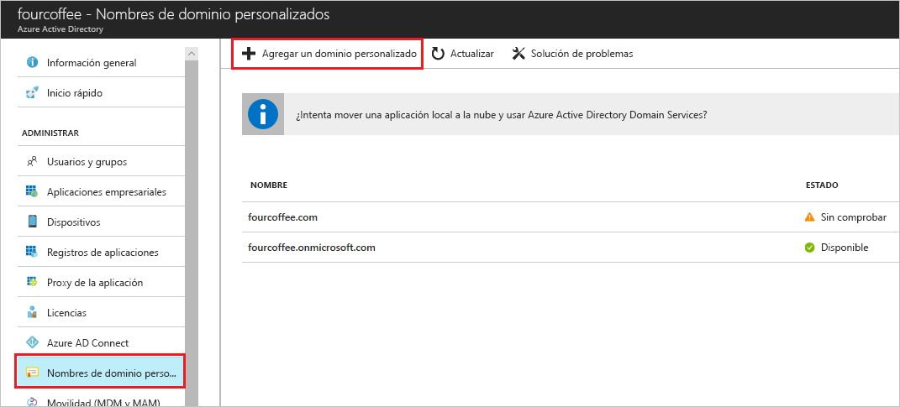

# Incorporación del nombre de dominio personalizado mediante el portal de Azure Active Directory
Cada nuevo inquilino de Azure AD incluye un nombre de dominio inicial, *nombre_de_dominio*.onmicrosoft.com. No se puede cambiar o eliminar el nombre de dominio inicial, pero puede agregar nombres de la organización a la lista. La adición de nombres de dominio personalizados le ayuda a crear nombres de usuario que resultan familiares a los usuarios, como *alain@contoso.com*.

## Antes de empezar
Para poder agregar un nombre de dominio personalizado, debe crear el nombre de dominio con un registrador de dominios. Para un registrador de dominios acreditado, consulte [ICANN: Registradores acreditados](https://www.icann.org/registrar-reports/accredited-list.html).

## Creación del directorio en Azure AD
Después de obtener el nombre de dominio, puede crear su primer directorio de Azure AD.

1. Inicie sesión en [Azure Portal](https://portal.azure.com/) para su directorio con una cuenta que tenga el rol **Propietario** de la suscripción y luego seleccione **Azure Active Directory**. Para más información sobre los roles de suscripción, vea [Roles de administrador de suscripciones clásico de RBAC de Azure y de administrador de Azure AD](../../role-based-access-control/rbac-and-directory-admin-roles.md#azure-rbac-roles).

    

    >[!TIP]
    > Si tiene previsto federar la instancia local de Windows Server AD en Azure AD, tiene que activar la casilla **Voy a configurar este dominio para el inicio de sesión único con mi Active Directory local** cuando ejecute la herramienta Azure AD Connect para sincronizar los directorios. También tiene que registrar el mismo nombre de dominio que seleccione para la federación con su directorio local en el paso **Dominio de Azure AD** del asistente. Puede comprobar cómo es ese paso del asistente [en estas instrucciones](../hybrid/how-to-connect-install-custom.md#verify-the-azure-ad-domain-selected-for-federation). Si no tiene la herramienta Azure AD Connect, [descárguela aquí](https://go.microsoft.com/fwlink/?LinkId=615771).

2. Cree el nuevo directorio siguiendo los pasos descritos en [Creación de un nuevo inquilino para la organización](active-directory-access-create-new-tenant.md#create-a-new-tenant-for-your-organization).

    >[!Important]
    >La persona que crea el inquilino es automáticamente el administrador global de ese inquilino. El administrador global puede agregar administradores adicionales al inquilino.

## Adición del nombre de dominio personalizado en Azure AD
Después de crear el directorio, puede agregar el nombre de dominio personalizado.

1. Seleccione **Nombres de dominio personalizados** y, a continuación, seleccione **Agregar dominio personalizado**.

    

2. Escriba el nuevo nombre de dominio de la organización en el cuadro de texto **Nombre de dominio personalizado** (por ejemplo, _contoso.com_) y, a continuación, seleccione **Agregar dominio**.

    El dominio no comprobado se agrega y la página de **Contoso** aparece y muestra la información de DNS.

    >[!Important]
    >Debe incluir .com, .net o cualquier otra extensión de nivel superior para un correcto funcionamiento.

    

4. Copie la información de DNS de la página **Contoso**. Por ejemplo, MS=ms64983159.

    

## Adición de la información de DNS en el registrador de dominios
Después de agregar el nombre de dominio personalizado a Azure AD, debe volver al registrador de dominios y agregar la información de DNS de Azure AD desde el archivo TXT copiado. La creación de este registro TXT en el dominio "comprueba" la propiedad del nombre de dominio.

-  Vuelva al registrador de dominios, cree un nuevo registro TXT para el dominio según la información de DNS copiada, establezca el valor de **TTL** (período de vida) en 3600 segundos (60 minutos) y, a continuación, guarde la información.

    >[!Important]
    >Puede registrar tantos nombres de dominio como desee. Sin embargo, cada dominio obtiene su propio registro TXT de Azure AD. Tenga cuidado al escribir la información del archivo TXT en el registrador de dominios. Si escribe por error información incorrecta o duplicada, deberá esperar hasta que expire el TTL (60 minutos) antes de volver a intentarlo.

## Comprobación del nombre de dominio personalizado
Después de registrar el nombre de dominio personalizado, deberá asegurarse de que es válido en Azure AD. La propagación desde el registrador de dominios a Azure AD puede ser instantánea o puede tardar unos días, dependiendo del registrador de dominios.

### Para comprobar el nombre de dominio personalizado
1. Inicie sesión en [Azure Portal](https://portal.azure.com/) con una cuenta de administrador global del directorio.

2. Seleccione **Azure Active Directory** y, a continuación, seleccione **Nombres de dominio personalizados**.

3. En la página **Fabrikam: nombres de dominio personalizados**, seleccione el nombre de dominio personalizado, **Contoso**.

    

4. En la página de **Contoso**, seleccione **Comprobar** para asegurarse de que el dominio personalizado se ha registrado correctamente y es válido para Azure AD.

    

## Problemas comunes de comprobación
- Si Azure AD no puede comprobar un nombre de dominio personalizado, pruebe las sugerencias siguientes:
    - **Espere al menos una hora y vuelva a intentarlo**. Los registros de DNS deben propagarse antes de que Azure AD pueda comprobar el dominio y este proceso puede tardar una hora o más.

    - **Asegúrese de que el registro de DNS es correcto.** Vuelva al sitio del registrador del nombre de dominio y asegúrese de que la entrada existe y que coincide con la información de la entrada DNS proporcionada por Azure AD.

    Si no puede actualizar el registro en el sitio del registrador, debe compartir la entrada con alguien que tenga los permisos adecuados para agregar la entrada y comprobar que es correcta.

- **Asegúrese de que el nombre de dominio no está en uso en otro directorio.** Solo se puede comprobar un nombre de dominio en un directorio, lo que significa que si el nombre de dominio se ha comprobado en otro directorio, no se puede comprobar también en el nuevo directorio. Para corregir este problema de duplicación, debe eliminar el nombre de dominio en el directorio antiguo. Para más información sobre la eliminación de nombres de dominio, consulte [Administración de nombres de dominio personalizados](../users-groups-roles/domains-manage.md).

- **Asegúrese de que no tiene ningún inquilino de Power BI no administrado.** Si los usuarios han activado Power BI a través del registro de autoservicio y han creado a un inquilino no administrado para la organización, debe asumir la administración como administrador interno o externo, mediante PowerShell. Para obtener más información sobre cómo asumir el control de un directorio no administrado, vea [Adquisición de un directorio no administrado como administrador en Azure Active Directory](../users-groups-roles/domains-admin-takeover.md).

## Pasos siguientes

- Agregar otro administrador global al directorio. Para más información, consulte [Asignación de roles y administradores](active-directory-users-assign-role-azure-portal.md).

- Para agregar usuarios al dominio, consulte [Cómo agregar o eliminar usuarios](add-users-azure-active-directory.md)

- Administrar la información del nombre de dominio en Azure AD. Para más información, consulte [Administración de nombres de dominio personalizados](../users-groups-roles/domains-manage.md).

- Si tiene versiones locales de Windows Server que desea usar junto con Azure Active Directory, consulte [Integración de los directorios locales con Azure Active Directory](../connect/active-directory-aadconnect.md).
