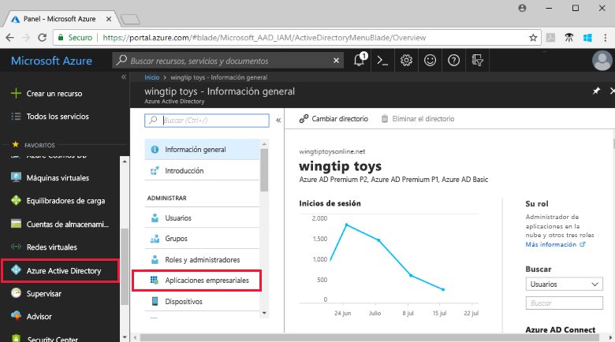
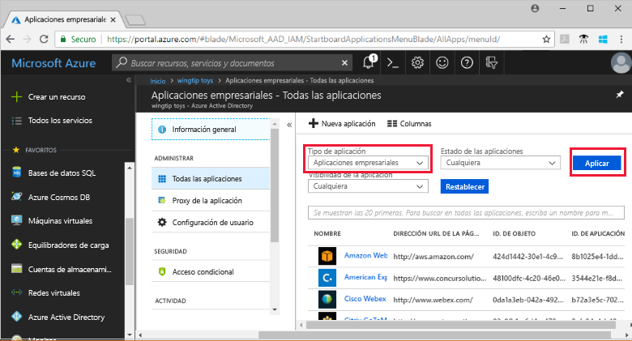
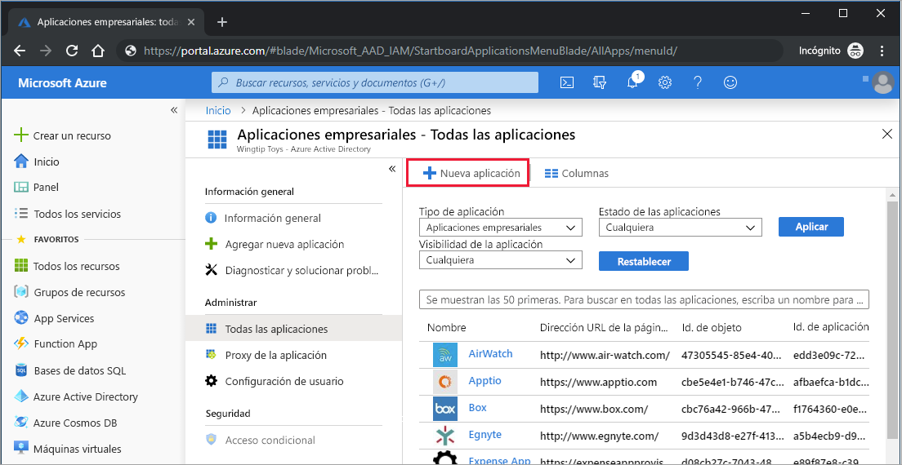
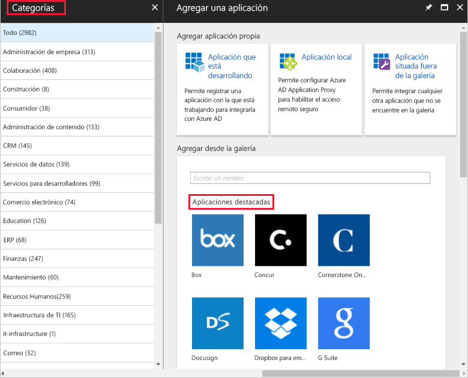
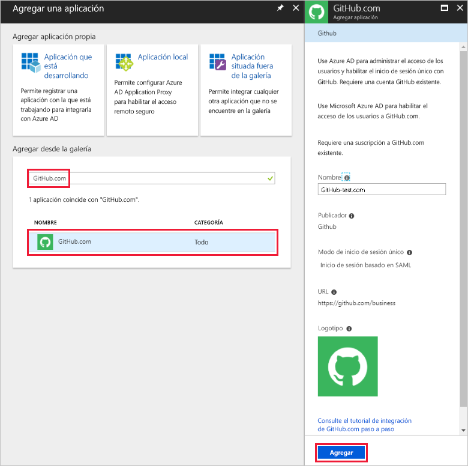
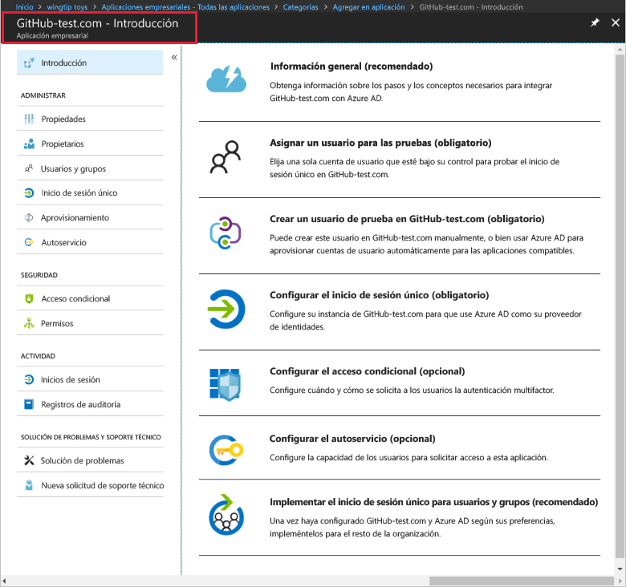
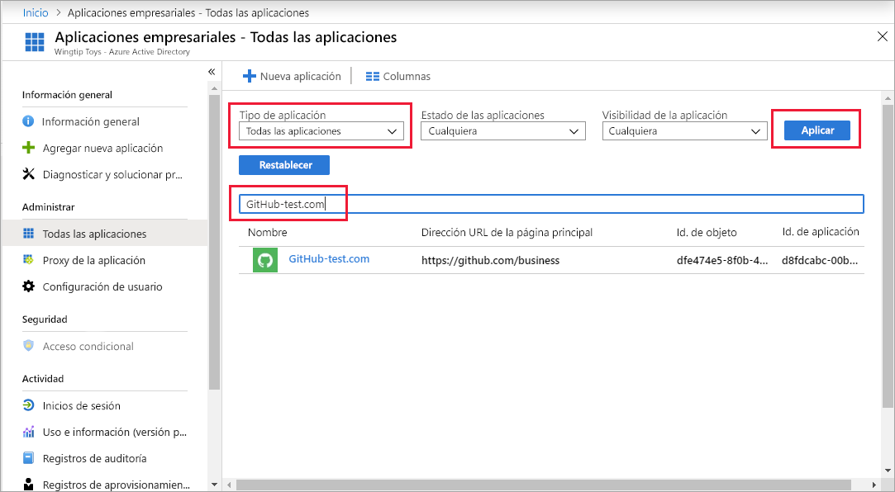
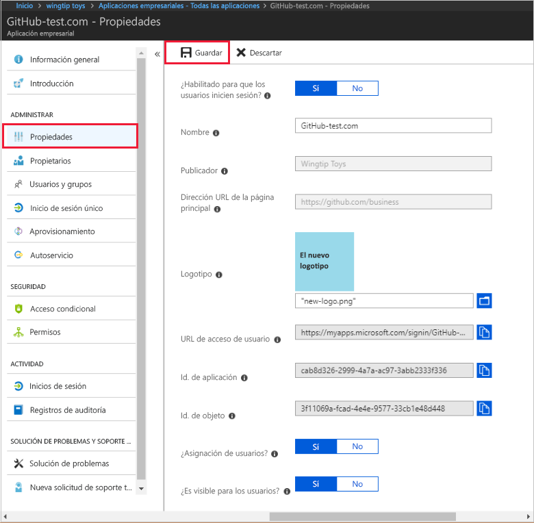
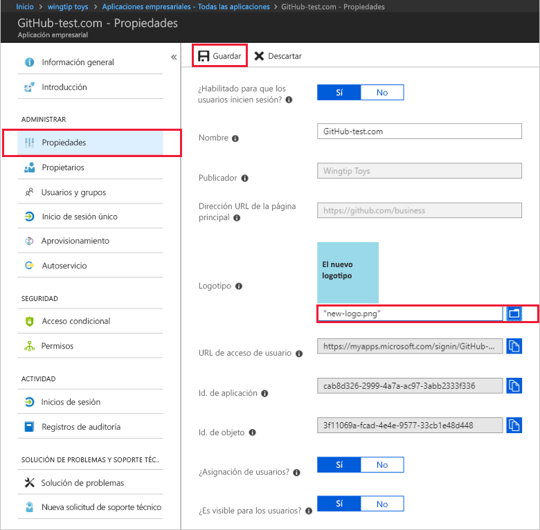

# Guía de inicio rápido: Incorporación de una aplicación a un inquilino de Azure Active Directory

Azure Active Directory (Azure AD) incluye una galería que contiene miles de aplicaciones previamente integradas. Algunas de las aplicaciones que su organización usa probablemente estén en la galería. Esta guía de inicio rápido usa Azure Portal para agregar una aplicación de la galería a su inquilino de Azure Active Directory (Azure AD). 
 
Después de agregar una aplicación a su inquilino de Azure AD, puede:

- Administrar el acceso de usuario a la aplicación con una directiva de acceso condicional.
- Configurar los usuarios para el inicio de sesión único a la aplicación con sus cuentas de Azure AD.

## Antes de empezar

Para agregar una aplicación a su inquilino, necesita:

- Una suscripción de Azure AD
- Una suscripción habilitada para el inicio de sesión único para la aplicación

Inicie sesión en [Azure Portal](https://portal.azure.com) como administrador global del inquilino de Azure AD, administrador de aplicaciones en la nube o administrador de aplicaciones.

Para probar los pasos de este tutorial, se recomienda usar un entorno que no sea de producción. Si no dispone de un entorno de Azure AD que no sea de producción, puede [obtener una versión de prueba durante un mes](https://azure.microsoft.com/pricing/free-trial/).

## Incorporación de una aplicación a un inquilino de Azure AD

Para agregar una aplicación de la galería a su inquilino de Azure AD:

1. En el panel de navegación izquierdo de [Azure Portal](https://portal.azure.com), haga clic en **Azure Active Directory**. 

2. En la hoja **Azure Active Directory**, haga clic en **Aplicaciones empresariales**. 

    

3. La hoja **Todas las aplicaciones** se abre para mostrar una muestra aleatoria de las aplicaciones en su inquilino de Azure AD. 

    

4. Haga clic en **Nueva aplicación** en la parte superior de la hoja **Todas las aplicaciones**.

    

5. Para ver una lista de aplicaciones en la galería, es más fácil usar el icono **Categorías** ya que los iconos de **Aplicaciones destacadas** son una muestra aleatoria de las aplicaciones de la galería. 

    

    Para ver más aplicaciones, puede hacer clic en **Mostrar más**. No se recomienda buscar de este modo porque hay miles de aplicaciones en la galería.

6. Para buscar una aplicación, en **Agregar desde la galería**, escriba el nombre de la aplicación que desee agregar. Seleccione la aplicación en los resultados y haga clic en **Agregar**. El ejemplo siguiente muestra el formulario **Agregar aplicación** que aparece después de buscar GitHub.com.

    

6. En el formulario específico de la aplicación, puede cambiar la información de la propiedad. Por ejemplo, puede editar el nombre de la aplicación para que coincida con las necesidades de su organización. Este ejemplo usa el nombre **GitHub-test**.

8. Cuando haya terminado de realizar cambios en las propiedades, haga clic en **Agregar**.

9. Aparece una página de introducción con las opciones para configurar la aplicación para su organización. 

    

Ha terminado de agregar la aplicación. Puede tomarse un descanso.  Las secciones siguientes muestran cómo cambiar el logotipo y modificar otras propiedades de la aplicación.

## Búsqueda de su aplicación de inquilino de Azure AD

Supongamos que tuvo que salir y ahora vuelve para continuar con la configuración de la aplicación. Lo primero que debe hacer es encontrar la aplicación.

1. En el panel de navegación izquierdo de **[Azure Portal](https://portal.azure.com)**, haga clic en **Azure Active Directory**. 

2. En la hoja Azure Active Directory, haga clic en **Aplicaciones empresariales**. 

3. Desde el menú desplegable **Tipo de aplicación**, seleccione **Todas las aplicaciones** y haga clic en **Aplicar**. Para obtener más información acerca de las opciones de presentación, consulte [Visualización de las aplicaciones de inquilino](view-applications-portal.md).

4. Ahora puede ver una lista de todas las aplicaciones en su inquilino de Azure AD.  La lista es una muestra aleatoria. Para ver más aplicaciones, haga clic en **Mostrar más** una o varias veces. 

5. Para encontrar rápidamente una aplicación en el inquilino, escriba el nombre de la aplicación en el cuadro de búsqueda y haga clic en **Aplicar**. Este ejemplo busca la aplicación de GitHub-test que agregamos anteriormente.

    

## Configuración de las propiedades de inicio de sesión de usuario

Ahora que ha encontrado la aplicación, puede abrirla y configurar sus propiedades.

Para modificar las propiedades de la aplicación

1. Haga clic en la aplicación para abrirla.
2. Haga clic en **Propiedades** para abrir la hoja de propiedades y modificarlas.

    

3. Dedique un momento para conocer las opciones de inicio de sesión. Las opciones **Habilitada para que los usuarios inicien sesión**, **Asignación de usuarios necesaria** y **Visible para el usuario** se combinan para determinar si los usuarios asignados o no asignados a la aplicación pueden iniciar sesión.  También determinan si el usuario puede ver la aplicación en el panel de acceso. 

    - **Enabled for users to sign-in** (Habilitado para que los usuarios inicien sesión) determina si los usuarios asignados a la aplicación pueden iniciar sesión.
    - **Asignación de usuarios necesaria** determina si los usuarios que no están asignados a la aplicación pueden iniciar sesión.
    - **Visible to user** (Visible para el usuario) determina si los usuarios asignados a una aplicación pueden verlo en el panel de acceso y el iniciador de Office 365. 

4. Use las tablas siguientes para ayudarle a elegir las opciones que son más adecuadas para sus necesidades. 

     - Comportamiento para los usuarios **asignados**:

       | Configuración de propiedades de la aplicación | | | Experiencia del usuario asignado | |
       |---|---|---|---|---|
       | ¿Habilitado para que los usuarios inicien sesión? | ¿Se requiere la asignación de usuarios? | ¿Es visible para los usuarios? | ¿Pueden los usuarios asignados iniciar sesión? | ¿Pueden ver los usuarios asignados la aplicación?* |
       | Sí | Sí | Sí | Sí | Sí  |
       | Sí | Sí | no  | Sí | no   |
       | Sí | no  | Sí | Sí | Sí  |
       | Sí | no  | no  | Sí | no   |
       | no  | Sí | Sí | no  | no   |
       | no  | Sí | no  | no  | no   |
       | no  | no  | Sí | no  | no   |
       | no  | no  | no  | no  | no   |

     - Comportamiento para los usuarios **no asignados**:
  
       | Configuración de propiedades de la aplicación | | | Experiencia del usuario no asignado | |
       |---|---|---|---|---|
       | ¿Habilitado para que los usuarios inicien sesión? | ¿Se requiere la asignación de usuarios? | ¿Es visible para los usuarios? | ¿Pueden iniciar sesión los usuarios no asignados? | ¿Pueden ver la aplicación los usuarios no asignados?* |
       | Sí | Sí | Sí | no  | no   |
       | Sí | Sí | no  | no  | no   |
       | Sí | no  | Sí | Sí | no   |
       | Sí | no  | no  | Sí | no   |
       | no  | Sí | Sí | no  | no   |
       | no  | Sí | no  | no  | no   |
       | no  | no  | Sí | no  | no   |
       | no  | no  | no  | no  | no   |

    ¿*Puede el usuario ver la aplicación en el panel de acceso y el iniciador de aplicaciones de Office 365?

## Uso de un logotipo personalizado

Para usar un logotipo personalizado:

1. Cree un logotipo de 215 por 215 píxeles y guárdelo en formato PNG.
2. Puesto que ya ha encontrado la aplicación, haga clic en ella.
2. En la hoja de la izquierda, haga clic en **Propiedades**.
4. Cargue el logotipo.
5. Cuando haya terminado, haga clic en **Guardar**.

    

## Pasos siguientes

En esta guía de inicio rápido, ha aprendido a agregar una aplicación de la galería a su inquilino de Azure AD. Ha aprendido a modificar las propiedades de una aplicación. 

Ahora, está preparado para configurar la aplicación para el inicio de sesión único. 

> [!div class="nextstepaction"]
> [Configuración del inicio de sesión único](configure-single-sign-on-portal.md)

