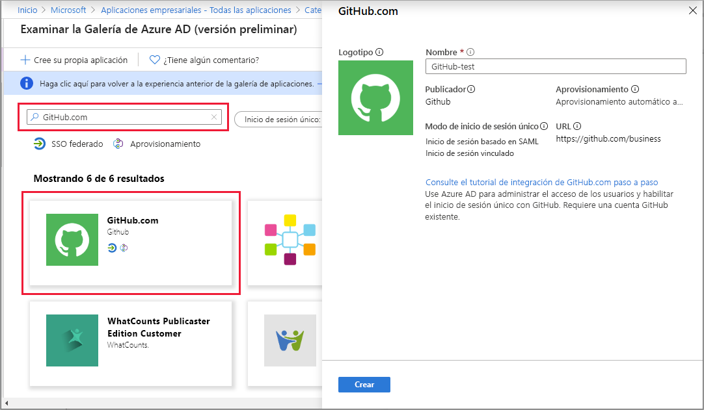

# Inicio rápido: Incorporación de una aplicación al inquilino de Azure Active Directory

Azure Active Directory (Azure AD) incluye una galería que contiene miles de aplicaciones previamente integradas. Algunas de las aplicaciones que su organización usa probablemente estén en la galería. Esta guía de inicio rápido usa Azure Portal para agregar una aplicación de la galería a su inquilino de Azure Active Directory (Azure AD).

Después de agregar una aplicación a su inquilino de Azure AD, puede:

- Administrar el acceso de usuario a la aplicación con una directiva de acceso condicional.
- Configurar los usuarios para el inicio de sesión único a la aplicación con sus cuentas de Azure AD.

## Antes de empezar

Para agregar una aplicación a su inquilino, necesita:

- Una suscripción de Azure AD
- Una suscripción habilitada para el inicio de sesión único para la aplicación

Inicie sesión en [Azure Portal](https://portal.azure.com) como administrador global del inquilino de Azure AD, administrador de aplicaciones en la nube o administrador de aplicaciones.

Para probar los pasos de este tutorial, se recomienda usar un entorno que no sea de producción. Si no dispone de un entorno de Azure AD que no sea de producción, puede [obtener una versión de prueba durante un mes](https://azure.microsoft.com/pricing/free-trial/).

## Incorporación de una aplicación a un inquilino de Azure AD

Para agregar una aplicación de la galería a su inquilino de Azure AD:

1. En [Azure Portal](https://portal.azure.com), en el panel de navegación izquierdo, seleccione **Azure Active Directory**.

2. En el panel **Azure Active Directory**, seleccione **Aplicaciones empresariales**. Se abre el panel **Todas las aplicaciones**, en el que se ve una muestra aleatoria de las aplicaciones que hay en su inquilino de Azure AD.

3. Para agregar una aplicación de la galería al inquilino, seleccione **Nueva aplicación**. 

    

 4. Cambie a la nueva experiencia de versión preliminar de la galería: En el banner situado en la parte superior de la **página para agregar una aplicación**, seleccione el vínculo que indica **Haga clic aquí para probar la nueva y mejorada experiencia de la galería de aplicaciones.** .

5. Se abre el panel **Examinar la Galería de Azure AD (versión preliminar)** , que muestra iconos para plataformas en la nube, aplicaciones locales y aplicaciones destacadas. Observe que las aplicaciones que aparecen en la sección **Aplicaciones destacadas** incluyen iconos que indican si admiten el inicio de sesión único federado (SSO) y el aprovisionamiento.

    

6. Puede buscar en la galería la aplicación que quiere agregar o escribir su nombre en el cuadro de búsqueda para localizarla. Después, seleccione la aplicación en los resultados. En el formulario, puede editar el nombre de la aplicación para que se ajuste a las necesidades de su organización. En este ejemplo, hemos cambiado el nombre por **GitHub-test**.

    

7. Seleccione **Crear**. Aparece una página de introducción con las opciones para configurar la aplicación para su organización.

Ha terminado de agregar la aplicación. Las secciones siguientes muestran cómo cambiar el logotipo y modificar otras propiedades de la aplicación.

## Búsqueda de su aplicación de inquilino de Azure AD

Supongamos que tuvo que salir y ahora vuelve para continuar con la configuración de la aplicación. Lo primero que debe hacer es encontrar la aplicación.

1. En **[Azure Portal](https://portal.azure.com)** , en el panel de navegación izquierdo, seleccione **Azure Active Directory**.
1. En el panel **Azure Active Directory**, seleccione **Aplicaciones empresariales**.
1. En el menú desplegable **Tipo de aplicación**, seleccione **Todas las aplicaciones** y, después, **Aplicar**. Para obtener más información acerca de las opciones de presentación, consulte [Visualización de las aplicaciones de inquilino](view-applications-portal.md).
1. Ahora puede ver una lista de todas las aplicaciones en su inquilino de Azure AD. La lista es una muestra aleatoria. Para ver más aplicaciones, seleccione **Mostrar más** una o varias veces.
1. Para encontrar rápidamente una aplicación en el inquilino, escriba el nombre de la misma en el cuadro de búsqueda y seleccione **Aplicar**. Este ejemplo encuentra la aplicación de prueba de GitHub que ha agregado anteriormente.

    

## Configuración de las propiedades de inicio de sesión de usuario

Ahora que ha encontrado la aplicación, puede abrirla y configurar sus propiedades.

Para editar las propiedades de la aplicación:

1. Seleccione la aplicación para abrirla.
2. Seleccione **Propiedades** para abrir el panel de propiedades para editarlas.

    

3. Dedique un momento para conocer las opciones de inicio de sesión. Las opciones determinan la forma en que los usuarios que están asignados, o no, a la aplicación pueden iniciar sesión en ella. Y las opciones también determinan si los usuarios pueden ver la aplicación en el panel de acceso.

    - La opción **¿Habilitado para que los usuarios inicien sesión?** determina si los usuarios asignados a la aplicación pueden iniciar sesión.
    - La opción **¿Asignación de usuarios?** determina si los usuarios que no están asignados a la aplicación pueden iniciar sesión.
    - La opción **¿Es visible para los usuarios?** determina si los usuarios asignados a una aplicación pueden verla en el panel de acceso y el iniciador de O365.

4. Use las siguientes tablas para ayudarle a elegir las opciones que más se ajusten a sus necesidades.

   - Comportamiento para los usuarios **asignados**:

       | Configuración de propiedades de la aplicación | | | Experiencia del usuario asignado | |
       |---|---|---|---|---|
       | ¿Habilitado para que los usuarios inicien sesión? | ¿Se requiere la asignación de usuarios? | ¿Es visible para los usuarios? | ¿Pueden los usuarios asignados iniciar sesión? | ¿Pueden ver los usuarios asignados la aplicación?* |
       | Sí | Sí | Sí | Sí | Sí  |
       | Sí | Sí | no  | Sí | no   |
       | Sí | no  | Sí | Sí | Sí  |
       | Sí | no  | no  | Sí | no   |
       | no  | Sí | Sí | no  | no   |
       | no  | Sí | no  | no  | no   |
       | no  | no  | Sí | no  | no   |
       | no  | no  | no  | no  | no   |

   - Comportamiento para los usuarios **no asignados**:

       | Configuración de propiedades de la aplicación | | | Experiencia del usuario no asignado | |
       |---|---|---|---|---|
       | ¿Está habilitado para que los usuarios inicien sesión? | ¿Se requiere la asignación de usuarios? | ¿Es visible para los usuarios? | ¿Pueden iniciar sesión los usuarios no asignados? | ¿Pueden ver la aplicación los usuarios no asignados?* |
       | Sí | Sí | Sí | no  | no   |
       | Sí | Sí | no  | no  | no   |
       | Sí | no  | Sí | Sí | no   |
       | Sí | no  | no  | Sí | no   |
       | no  | Sí | Sí | no  | no   |
       | no  | Sí | no  | no  | no   |
       | no  | no  | Sí | no  | no   |
       | no  | no  | no  | no  | no   |

     ¿*Puede el usuario ver la aplicación en el panel de acceso y el iniciador de aplicaciones de Office 365?

## Uso de un logotipo personalizado

Para usar un logotipo personalizado:

1. Cree un logotipo de 215 por 215 píxeles y guárdelo en formato PNG.
1. Puesto que ya ha encontrado la aplicación, selecciónela.
1. Seleccione **Propiedades** en el panel izquierdo.
1. Cargue el logotipo.
1. Cuando haya terminado, seleccione **Guardar**. 

    

   > [!NOTE]
   > La miniatura que se muestra en este panel de **Propiedades** no se actualiza inmediatamente. Puede cerrar y volver a abrir las propiedades para ver el icono actualizado.

## Pasos siguientes

Ahora que ha agregado la aplicación a la organización de Azure AD, [elija el método de inicio de sesión único](what-is-single-sign-on.md#choosing-a-single-sign-on-method) que quiera usar y consulte a continuación el artículo adecuado:

- [Configuración del inicio de sesión único basado en SAML](configure-single-sign-on-non-gallery-applications.md)
- [Configuración del inicio de sesión único con contraseña](configure-password-single-sign-on-non-gallery-applications.md)
- [Configuración del inicio de sesión vinculado](configure-linked-sign-on.md)
