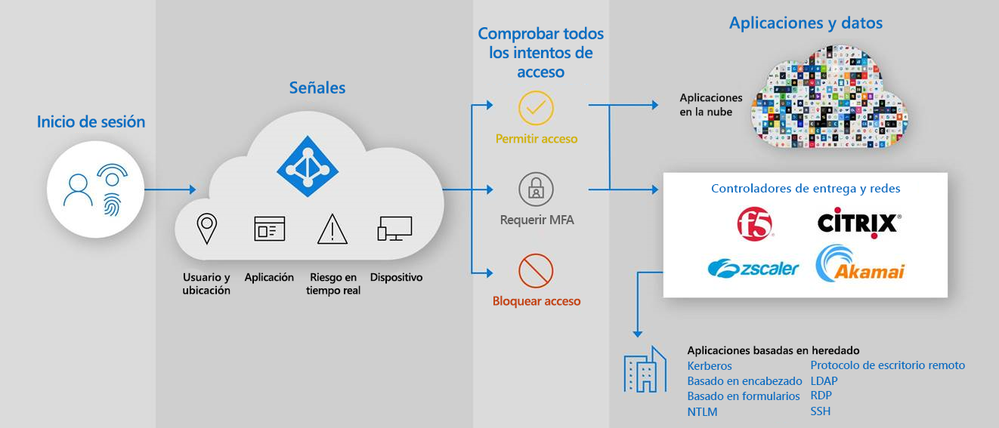

# Acceso híbrido seguro: Protección de aplicaciones heredadas con redes y controladores de entrega de aplicaciones

Ahora puede proteger sus aplicaciones de autenticación heredadas locales y en la nube conectándolos a Azure AD con la red o el controlador de entrega de aplicaciones existentes. De este modo, puede salvar la brecha y fortalecer su postura de seguridad en todas las aplicaciones con funciones Azure AD como Acceso condicional en Azure AD y Azure AD Identity Protection.

Con la red y el controlador de entrega existentes, puede proteger fácilmente las aplicaciones heredadas que siguen siendo críticas para los procesos empresariales pero que no se pudieron proteger antes de Azure AD. Es probable que ya tenga todo lo que necesita para empezar a proteger estas aplicaciones.

Los siguientes proveedores ofrecen soluciones predefinidas e instrucciones detalladas para la integración con Azure AD.

* [APM BIG-IP de F5](https://aka.ms/f5-hybridaccessguide)
* [Zscaler Private Access (ZPA)](https://aka.ms/zscaler-hybridaccessguide)
