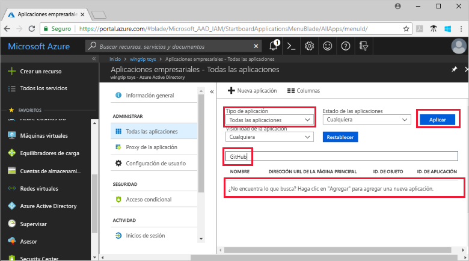
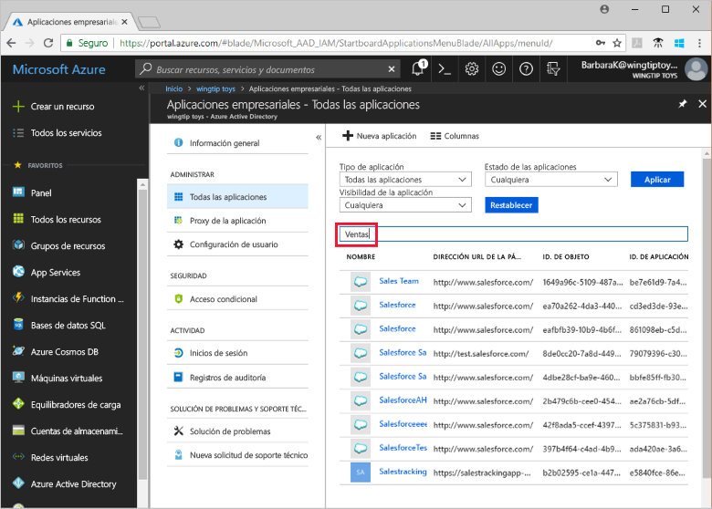

# Visualización de las aplicaciones del inquilino de Azure Active Directory

Esta guía de inicio rápido utiliza Azure Portal para visualizar las aplicaciones del inquilino de Azure Active Directory (Azure AD).

## Antes de empezar

Para ver los resultados, debe tener al menos una aplicación en su inquilino de Azure AD. Para agregar una aplicación, consulte la guía de inicio rápido [Adición de una aplicación](add-application-portal.md).

Inicie sesión en [Azure Portal](https://portal.azure.com) como administrador global del inquilino de Azure AD, administrador de aplicaciones en la nube o administrador de aplicaciones.

## Búsqueda de la lista de aplicaciones del inquilino

Las aplicaciones del inquilino de Azure AD están visibles en la sección **Aplicaciones empresariales** de Azure Portal.

Para buscar las aplicaciones del inquilino:

1. En **[Azure Portal](https://portal.azure.com)**, en el panel de navegación izquierdo, seleccione **Azure Active Directory**. 

1. En el panel **Azure Active Directory**, seleccione **Aplicaciones empresariales**. 

1. En el menú desplegable **Tipo de aplicación**, seleccione **Todas las aplicaciones** y elija **Aplicar**. Aparece una muestra aleatoria de las aplicaciones del inquilino.
   
1. Para ver más aplicaciones, seleccione **Cargar más** en la parte inferior de la lista. En función del número de aplicaciones del inquilino, puede resultar más fácil [buscar una aplicación específica](#search-for-a-tenant-application) en lugar de desplazarse por la lista.

## Selección de las opciones de visualización

Seleccione las opciones en función de lo que busque.

1. Puede ver las aplicaciones por **tipo de aplicación**, **estado de aplicación** y **visibilidad de aplicación**. 

1. En **Tipo de aplicación**, elija una de estas opciones:

    - **Aplicaciones empresariales** muestra las aplicaciones que no son de Microsoft.
    - **Aplicaciones de Microsoft** muestra las aplicaciones de Microsoft.
    - **Todas las aplicaciones** muestra las aplicaciones de Microsoft y las que no son de Microsoft.

1. En **Estado de la aplicación**, elija **Cualquiera**, **Deshabilitada** o **Habilitada**. La opción **Cualquiera** incluye tanto aplicaciones habilitadas como deshabilitadas.

1. En **Visibilidad de la aplicación**, elija **Cualquiera** u **Oculta**. La opción **Ocultas** muestra las aplicaciones que están en el inquilino, pero que los usuarios no pueden ver.

1. Después de elegir las opciones que desee, seleccione **Aplicar**.
 

## Búsqueda de una aplicación del inquilino

Para buscar una aplicación concreta:

1. En el menú **Tipo de aplicación**, seleccione **Todas las aplicaciones** y elija **Aplicar**.

1. Escriba el nombre de la aplicación que desea buscar. Si la aplicación se ha agregado al inquilino de Azure AD, aparece en los resultados de la búsqueda. En este ejemplo, se muestra que GitHub no se ha agregado a las aplicaciones del inquilino.

    

1. Pruebe a escribir las primeras letras del nombre de una aplicación. En este ejemplo se muestran todas las aplicaciones que empiezan por **Sales**.

    

## Pasos siguientes

En este inicio rápido, ha aprendido a ver las aplicaciones de su inquilino de Azure AD. Ha aprendido a filtrar la lista de aplicaciones por tipo, estado y visibilidad de la aplicación. También ha aprendido cómo buscar una aplicación determinada.

Ahora que ha encontrado la aplicación que buscaba, puede continuar con [Incorporación de más aplicaciones a un inquilino](add-application-portal.md). O bien, puede seleccionar la aplicación para ver o editar las propiedades y las opciones de configuración. Por ejemplo, podría configurar el inicio de sesión único. 

> [!div class="nextstepaction"]
> [Configuración del inicio de sesión único](configure-single-sign-on-portal.md)

